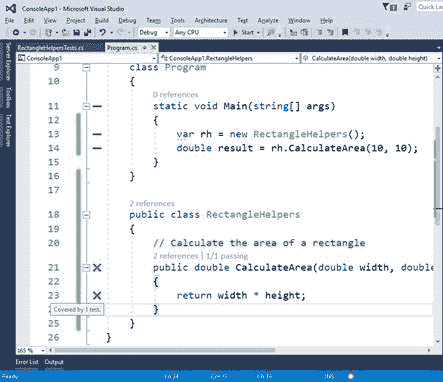

调试和测试代码是应用程序开发生命周期中的两项基本任务，Visual Studio 2017 为这两者引入了重要的改进应该不足为奇。这样的改进使调试和测试更快，但仍然有效，同时您可以将注意力集中在活动的编辑器上。本章将描述新功能，但也将介绍您已经知道的更新工具，以及在 Visual Studio 2017 中，进入新生活的工具。

当我们调试时，遍历代码行是我们最常见的操作之一。我们使用断点，然后使用“单步执行”、“单步结束”或“单步退出”等功能来理解代码块、局部变量以及更一般的应用程序执行流的行为。在 Visual Studio 2017 之前，我们不得不引入临时断点来继续从断点到代码中某个点的执行。Visual Studio 2017 向前迈进了一步，引入了一个名为**运行到点击**的新功能。为了理解这个特性是如何工作的，请考虑图 64，在图 64 中，您可以看到一个断点被命中，应用程序处于中断模式。


图 64:点击运行图标

当您将鼠标悬停在一行代码上时，该行附近会出现一个绿色字形，如图 64 中代码文件的第 43 行所示。此标志符号代表“点击运行”按钮。如果单击它，您的代码将执行到该行，而不需要临时断点。实际上，激活“点击运行”的那一行是高亮显示的，但没有执行，就像在那一行设置断点一样(见图 65)。


图 65:在没有断点的代码行中点击停止

然后可以继续使用**运行点击**按钮，执行代码到特定点，从而避免临时断点。

|  | 提示:请记住，“运行到单击”仅在中断模式下工作，这意味着它在应用程序运行时不可用。 |

Visual Studio 2015 引入了**诊断工具**窗口，显示调试时的应用事件、内存和 CPU 使用情况等诊断信息。默认情况下，当您开始调试应用程序时，会出现此工具窗口。在 Visual Studio 2017 中，诊断工具窗口已更新为名为**摘要**的视图(见图 66)。


图 66:诊断工具中的新摘要视图

此新视图包含 UWP 应用程序的应用程序事件(显示事件)、异常、智能跟踪事件、应用程序洞察(如果适用)和用户界面分析事件数量的摘要。它提供了拍摄托管堆快照以及启用或禁用 CPU 分析的快捷方式。

|  | 提示:您可以通过转到工具>选项>智能跟踪>智能跟踪事件来启用或禁用特定的智能跟踪事件。 |

|  | 注意:用户界面分析事件是通用视窗平台中检测可访问性问题的新功能。它们将在[第 8 章“面向移动开发的 Visual Studio 2017”中讨论](8.html#_Chapter_8_) |

这个新视图提供了对调试时发生的事情的快速洞察，然后您可以使用其他选项卡了解更多详细信息。

异常帮助器是在调试时发生未处理或引发的异常时出现的弹出窗口。通过异常帮助器，Visual Studio 显示了有关异常的详细信息。Visual Studio 的早期版本提供了异常助手和异常对话框工具，它们采用不同的方法来提高工作效率。在 Visual Studio 2017 中，异常帮助器有了全新的外观和改进的行为。在我们检查新的好处之前，让我们看看图 67，它显示了正在运行的更新的异常帮助器。


图 67:更新的异常帮助器

让我们总结一下新的内容:

*   无论您正在调试托管代码还是非托管代码，都会出现异常帮助器。
*   当发生未处理的异常时，整行代码都会突出显示。这提高了代码的可读性。异常错误图标将帮助您理解执行被中断的原因。
*   “异常帮助器”弹出窗口较小，没有模式，干扰性也较小。
*   一眼望去，弹出窗口只显示异常类型、错误消息以及异常是被抛出还是未被处理。
*   弹出窗口会立即显示任何内部异常，而不需要额外的对话框。
*   在**异常设置**组中，可以指定抛出异常时调试器是否必须中断执行，可以排除特定模块中断执行。
*   如果点击**打开异常设置**超链接，异常信息将显示在**快速观察**对话框内(见图 68)。这使得研究异常细节和重新计算表达式变得容易。
*   您可以点击**编辑条件**超链接，通过包含或排除特定模块来指定何时中断执行(见图 69)。这是您从异常帮助器与模式对话框交互的唯一情况。


图 68:快速观察对话框中的异常设置


图 69:编辑异常条件

凭借其新的外观和行为，异常帮助器通过提供您需要的所有信息来提高工作效率，同时让您专注于代码。

|  | 注意:此功能仅在企业版中可用，并且仅适用于 C#和 Visual Basic，它假设您已经具备单元测试的基本知识。如果您需要一些指导， [MSDN 文档](https://msdn.microsoft.com/en-us/library/dd264975.aspx)提供了开始使用所需的一切。 |

**实时单元测试**是 Visual Studio 2017 中一个令人兴奋的新功能。它允许在后台执行单元测试，并在您键入时在代码编辑器中显示它们的结果和覆盖范围。理解这个特性如何工作的最好方法是用一个例子。创建一个控制台应用程序，并考虑代码清单 4。

代码清单 4

```
  namespace ConsoleApp1
  {
      class Program
      {
          static void Main(string[] args)
          {
              var rh = new RectangleHelpers();
              double result = rh.CalculateArea(10, 10);
          }
      }

      public class RectangleHelpers
      {
          // Calculate the area of a rectangle.
          public double CalculateArea(double width, double
  height)
          {
              return width * height;
          }
      }
  }

```

`RectangleHelpers`类提供了一个非常简单的`CalculateArea`方法，在给定宽度和高度的情况下返回矩形的面积。类被实例化，方法在`Program`类的`Main`方法中被调用。现在你需要创建一些单元测试。右键单击`CalculateArea`方法，然后选择**创建单元测试**。出现**创建单元测试**对话框(见图 70)，要求您指定测试项目的基本信息。默认情况下，测试框架是 MSTestv2，提供的是创建一个新的测试项目。保留所有默认设置，点击**确定**。当然，如果您以前有在 Visual Studio 中进行单元测试的经验，您可以更改默认设置。在撰写本文时，支持的测试框架是 MSTest、xUnit 和 NUnit。


图 70:创建测试项目

现在您有了一个名为`RectangleHelperTests`的测试类和一个名为`CalculateAreaTest`的方法，它们都可以在测试项目的 RectangleHelpersTests.cs 文件中找到。它们分别用`TestClass`和`TestMethod`属性修饰，以指示 Visual Studio 它们在一个测试项目中，并且它们将被适当的测试框架和工具使用。此时，您需要实现您的单元测试。代码清单 5 显示了一个非常简单的实现，它检查预期结果和实际结果之间的一致性。

代码清单 5

```
  namespace ConsoleApp1.Tests
  {
      [TestClass()]
      public class RectangleHelpersTests
      {
          [TestMethod()]
          public void CalculateAreaTest()
          {
              var rectHelpers = new RectangleHelpers();
              double width = 3;
              double height = 2;

              Assert.AreEqual(6,
  rectHelpers.CalculateArea(width, height));
          }
      }
  }

```

现在回到程序文件。选择**测试** > **实时单元测试** > **启动**。几秒钟后，您将看到 Visual Studio 如何在后台运行单元测试，并在编辑器中实时显示结果(参见图 71)。


图 71:代码编辑器中的实时单元测试结果

Visual Studio 2017 能够在后台运行测试，而不是使用测试资源管理器运行单元测试，最重要的是，它能够根据实际代码而不是单元测试来关联覆盖率和结果。

|  | 注意:只有当单元测试引用了对象时，Visual Studio 2017 才能将实时单元测试与您的代码相关联。在我们的例子中，单元测试定义了一个 RectangleHelpers 类的实例，因此它创建了一个引用。然后，Visual Studio 2017 将计算区域测试方法与基于此引用的计算区域方法相关联。 |

您在代码编辑器中看到的图标将帮助您理解测试结果和代码覆盖率。更具体地说:

*   带有复选符号的绿色图标意味着一段代码已经被通过的单元测试覆盖。
*   水平线的蓝色图标代表没有被任何单元测试覆盖的代码。
*   红色的 **X** 图标代表未通过单元测试的代码。
*   这些带有重叠时钟图标的图标表示当前正在编辑的代码。

现在按如下方式编辑`CalculateTestArea`方法中的`Assert.AreEqual`语句，使测试失败:

`Assert.AreEqual(5, rectHelpers.CalculateArea(width, height));`

编辑时，您会注意到图标显示一个重叠的时钟。完成后，您将看到代码编辑器被更新以显示单元测试结果(在这种情况下是失败的)，如图 72 所示。



图 72:用单元测试结果更新的代码编辑器

|  | 提示:如果您将鼠标悬停在图标上，您将获得在后台调用的测试方法的详细信息(及其结果)。 |

无论您对代码做了什么更改，实时单元测试都将在后台运行，并在代码编辑器中显示结果。您可以使用**测试** > **实时单元测试**中的命令来控制实时单元测试，例如暂停、停止和重新启动。这些仅在功能激活时可见。

除了本章中描述的主要更新之外，Visual Studio 2017 还引入了各种改进，使调试体验更加出色。本节简要总结了这些内容。

大多数调试窗口(本地窗口、监视窗口、快速监视窗口、自动窗口、调用堆栈窗口)都有所改进，以提高屏幕阅读器和其他辅助功能的可读性。

Visual Studio 中的历史调试器 IntelliTrace 现在支持跟踪中的事件。NET 核心应用程序。更具体地说，您可以启用智能跟踪来跟踪 ADO.NET、MVC 和 HttpClient 事件。前往**工具** > **选项** > **智能追踪** > **智能追踪事件**设置您想要记录的事件。NET 核心。

性能分析器、中央处理器使用率、图形处理器使用率和性能向导等分析工具现在可以附加到正在运行的进程。当您启动所需的分析工具时，此选项变为可用。在处理外部代码时，中央处理器使用工具也得到了改进，以提供更详细的信息。

有了 ASP.NET，如果你用 Chrome 作为浏览器调试一个应用程序，调试器将针对运行在 Chrome 中的 JavaScript 代码运行。

调试和测试是应用程序开发生命周期中非常重要的任务，Visual Studio 2017 为这两者引入了新的好处。使用“单击运行”，在中断模式下，您不再需要临时断点来将代码运行到特定点。“诊断工具”窗口现在提供了一个带有快捷方式的“摘要”选项卡，使您可以将注意力集中在集成开发环境上，它还提供了一个更新版本的异常帮助器，以简化和集中的方式显示异常详细信息。通过实时单元测试，您可以在后台编写代码和运行单元测试，直接在代码编辑器中获得测试结果和代码覆盖率，所有这些都随着您的键入而实时进行。