# 八、面向移动开发的 VS2017

使开发人员能够为任何平台和任何设备构建应用程序是 Visual Studio 2017 的一个主要目标。这当然包括手机应用开发。随着 2016 年微软收购 Xamarin，以及对通用视窗平台和 Apache Cordova 工具的改进，微软使 Visual Studio 2017 成为构建运行在安卓、iOS 和视窗上的共享代码库应用程序的最终开发环境。本章无意成为 Visual Studio 2017 的移动开发指南，相反，它将强调微软 ide 跨平台开发的最流行工具的新功能。在适当的地方提供了每个工具的文档链接。

|  | 提示:开始使用通用视窗平台的文档可在[developer.microsoft.com/en-us/windows/apps/getstarted](https://developer.microsoft.com/en-us/windows/apps/getstarted)获得。 |

|  | 注意:构建通用窗口应用程序需要在 Visual Studio 安装程序中选择通用窗口平台开发工作负载。 |

通用视窗平台(UWP)提供了一套极其丰富的应用编程接口，用于构建运行在视窗 10 和个人电脑、平板电脑、智能手机、Xbox、全息镜头和物联网设备上的应用程序。在大多数情况下，你只需编写一次代码，你的 UWP 应用程序就会在上述所有设备上运行；在某些情况下，您需要针对特定的 SDK 进行调整。

2016 年 3 月，微软宣布了视窗 10 周年更新，这是 2016 年 7 月发布的一项重大更新，增加了操作系统的新功能和改进，并通过视窗 10 周年更新软件开发工具包为开发人员提供了一些好处。后者已经通过 UWP 开发工作负载包含在 Visual Studio 2017 中。该软件开发工具包包含用于开发 Visual Studio 2017 的集成工具和支持周年更新的模拟器。创建新项目时，您仍然可以为 UWP 应用程序选择目标版本和最低版本。比如选择**文件** > **新建** > **项目**，然后在 C#和 VB 语言的 **Windows Universal** 文件夹中选择**空白 App (Universal Windows)** 项目模板。在生成解决方案之前，Visual Studio 将要求您使用图 73 所示的对话框指定目标版本和最低版本。

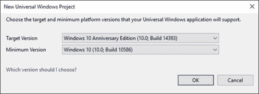

图 73:选择 UWP 应用的目标版本和最低版本

在大多数情况下，保留默认选择是最好的选择。单击**确定**时，Visual Studio 会生成一个支持指定 Windows 10 版本的解决方案。不要删除新项目—保留它可以使新项目成为未来主题的测试环境。除了对周年更新的支持，Visual Studio 2017 还包括对 UWP 的以下改进。

|  | 注:通用视窗平台也获得了第 4 章“XAML 改进”中描述的所有改进 |

您可能知道，在发布模式下编译一个通用的 Windows 应用程序涉及到。NET 原生工具链。想到。NET Native 作为一个编译器，直接生成应用程序的本机映像，而不是生成需要即时编译的中间语言(IL)。因此，启动一个通用的视窗应用程序比一个. NET 应用程序或一个视窗手机应用程序要快得多。使用 Visual Studio 2017，将。NET Native 工具链更新了 600 多个错误修复、运行时性能优化以及对整个工具的整体改进。

|  | 注意:如果您曾经编写过 UWP 应用程序，您知道在发布模式下编译比在调试模式下编译需要更多的时间，因为对于发布，Visual Studio 2017 调用。NET 原生语言。幕后。NET Native 是从您的 C#或 VB 代码生成 IL，然后将 IL 转换为 c++——最后生成本机二进制文件。这就是为什么需要这么长时间，但这也是通用应用如此高效的原因。 |

通用视窗应用依赖于微软。NETCore . universalwindowsplantform NuGet 包。为了与周年更新完全一致。NET Core 和 Visual Studio 2017，前面提到的 NuGet 包更新到了 5.2.2 版本。该版本主要解决开发人员报告的问题，并且可以使用 Visual Studio 2017 中的 NuGet 包管理器工具轻松更新现有应用程序。

Visual Studio 2017 为 XAML 引入了一些仅针对 UWP 的改进。第一个改进是通过使用工具箱中的拖放来创建用户界面元素。Visual Studio 2017 现在减少了自动生成的 XAML 标记的数量，这意味着生成的标记更加清晰易读。第二个改进针对 XAML 设计师——Visual Studio 2017 引入了一个名为**设备预览设置**的新按钮，可以在设计师的上方栏中找到。双击**主页. xaml** 文件打开 xaml 设计器(如果它还不可用)。新按钮由齿轮图标表示，允许快速更改对比度和主题设置。点击后，出现**设备预览设置**对话框(见图 74)。

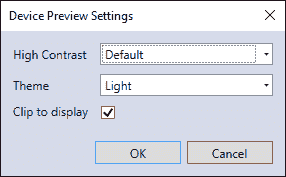

图 74:在设计时更改对比度和主题设置

您可以在许多可能的对比度设置中进行选择，也可以在“亮”和“暗”主题之间进行选择。这使得在设计时很容易看到应用程序的用户界面在不同设置下的表现。第三项改进涉及到**属性**窗口。现在，您可以使用将立即计算的基本数学方程分配属性，结果值将被分配给 XAML 的选定控件。图 75 显示了一个例子，其中`Button`控件的`Width`属性被赋予 60 + 40 的和。

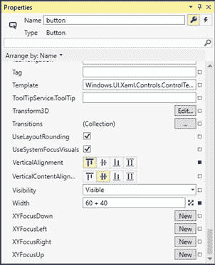

图 75:基本方程——计算并分配给用户界面元素的属性

在这种情况下，评估结果(100)将被分配给`Button.Width`属性，并将在 XAML 代码中可见。它支持求和、减法、乘法和除法。为什么这个功能有用？考虑起始值为 60 的`Button.Width`，然后假设您希望通过将宽度增加 40 来查看按钮的外观。你可以简单地写出表达式 60 + 40，而不是在头脑中计算新值。

从集成开发环境的角度来看，对 UWP 来说，最重要的更新可能是清单设计器，您可以通过双击**解决方案资源管理器**中的 **Package.appxmanifest** 文件来启用它。更具体地说，**可视化资产**标签现在有了一个新功能，称为**资产生成器**，它可以从单个源图像开始自动生成所有需要的资产。

|  | 注意:Visual Studio 2017 中的可视化资产生成器仅适用于 Visual Basic 和 C#。未来版本计划支持 C++和 JavaScript。 |

您只需提供一个图像文件，然后点击**生成**，资产生成器将创建任意比例或所有比例的图块、徽标、图标和闪屏，以适合您的应用目标的每种设备类型。图 76 显示了在 Visual Studio 2017 中如何显示**视觉资产**选项卡，并提供了一个示例图像作为源。

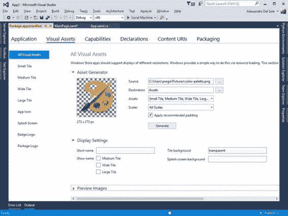

图 76:Visual Studio 2017 中的新资产生成器

当你点击**生成**时，Visual Studio 生成所有需要的资产，向下滚动窗口可以看到(见图 77)。所有生成的图像文件将在**解决方案资源管理器**中列出。默认情况下，**视觉资产**选项卡显示所有可用的视觉资产，但您也可以从左侧列表中选择特定的资产类别。

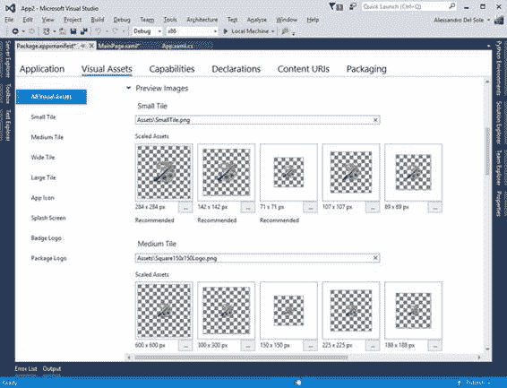

图 77:自动生成的资产

Visual Studio 2017 生成资产，确保它们符合为 Windows 10 应用程序建议的所有设计准则，例如填充和背景颜色。这项功能非常有用，将帮助您节省大量时间，因为您不再需要单独提供单个资产。

|  | 提示:徽章徽标(用于锁屏通知)和包装徽标资产必须通过在资产列表中选择相应的项目来单独生成。您仍将提供单个源图像，并单击“生成”按钮。然后，Visual Studio 将根据 Windows 10 指南生成所需的资产。例如，对于徽章徽标，生成器将根据需要自动减少颜色。 |

Visual Studio 2017 中的**诊断工具**窗口为 UWP 应用程序引入了一个名为**用户界面分析**的特殊分析工具。该工具在调试时分析应用程序的可访问性和性能问题。用户界面分析默认不启用，这意味着第一次在诊断工具窗口开始调试应用时，必须点击**选择工具**，然后选择**用户界面分析**项(见图 78)。

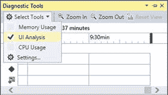

图 78:启用用户界面分析

一旦启用，用户界面分析将仅在下次您开始调试应用程序时可用，这意味着您必须首先停止执行，然后重新启动它。为了理解这个特性是如何工作的，让我们介绍几个有意的问题。在 MainPage.xaml 文件的 XAML 标记中，将代码清单 6 所示的代码插入默认的`Grid`中。

代码清单 6

```
  <ListView>
      <ListView.ItemsPanel>
           <ItemsPanelTemplate>
               <StackPanel/>
           </ItemsPanelTemplate>
      </ListView.ItemsPanel>
  </ListView>

```

这段代码有两个问题:首先，`ListView`没有被虚拟化，因为它使用的是`StackPanel`容器而不是`ItemsStackPanel`，所以`ListView`在绑定到对象集合时可能会有性能问题。第二，它的`Name`属性没有被赋值，这意味着没有机会用代码和它交互。此时，按下 **F5** 开始调试，然后盯紧**诊断工具**窗口。在**汇总**页签中，你会看到两个 UI 分析事件，如果你点击**事件**页签，你会看到每个事件的详细完整列表(见图 79)。

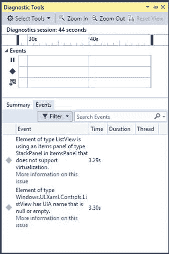

图 79:详细的用户界面分析事件列表

如您所见，用户界面分析事件列表显示了每个事件的详细信息。如果双击某个事件，您将被重定向到导致该问题的 XAML 代码行。也可以点击**关于此问题的更多信息**超链接，打开某个问题的文档，如图 80 所示。

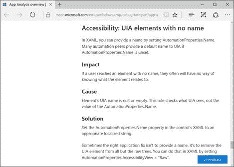

图 80:用户界面分析问题的文档

该文档还提供了一个名为[应用程序分析概述](https://msdn.microsoft.com/en-us/windows/uwp/debug-test-perf/app-analysis)的页面，其中包含用户界面分析工具可以检测到的问题的完整列表。用户界面分析工具是一个非常有用的补充，因为它允许您在将应用程序提交给窗口商店进行批准和发布之前发现大量潜在的问题。

## 跨平台开发

|  | 注意:使用 Apache Cordova 构建应用程序需要在 Visual Studio 安装程序中选择带有 JavaScript 工作负载的移动开发。此外，新功能(如科尔多瓦模拟)需要 Chrome 浏览器。 |

Apache Cordova 是一个开发平台，允许我们使用 HTML 和 JavaScript 为 Android、iOS 和 Windows 创建跨平台应用。Visual Studio 2017 和它的前身一样，包含了针对 Apache Cordova 的**工具** (TACO)，这样你就可以使用你最喜欢的强大 IDE 来编写、调试和发布应用程序。此外，VS 2017 支持[ion](https://ionicframework.com/)，这是一个与科尔多瓦一起工作的流行的前端 JavaScript 框架。针对 Visual Studio 2017，TACO 中有许多改进和变化，可以提高性能和工作效率。这些新增加的内容将使用 WeatherApp 示例应用程序进行演示，该应用程序包含在微软为 Cordova 提供的官方示例中。你可以从 [GitHub](https://github.com/Microsoft/cordova-samples) 下载这些作为. zip 存档。**天气应用**文件夹包含您可以在 Visual Studio 2017 中打开的解决方案。当然，你也可以使用任何其他科尔多瓦项目。

|  | 提示:当打开任何用以前版本的 Visual Studio 构建的 Cordova 解决方案时，VS 2017 需要执行一次性升级。它将要求您在升级过程后重新加载解决方案。 |

在 Visual Studio 2017 中，针对 Apache Cordova 的工具不再支持 Windows 8.1。现有的项目应该更新到 Windows 10。此版本在 iOS 开发端增加了对 iOS 10 和 Xcode 8 的支持。最后，科尔多瓦支持的最低版本是 6.0.0。在撰写本文时，Visual Studio 2017 附带了 Cordova 6.1.3。打开解决方案时，使用以前版本构建的现有项目将需要一次性升级。

如果您已经使用过 Cordova，您可能知道它提供了许多插件，这些插件可以被视为库，提供共享的 API 来访问设备功能，如全球定位系统、传感器、电池状态等。Visual Studio 2017 引入了一个名为 **Cordova Simulate** 的新功能，通过在 Chrome 浏览器内部模拟 Android 环境，无需安装仿真器或使用物理设备，即可模拟和控制 Android 应用上插件的行为。因此，Visual Studio 2017 现在可以调试运行在 Chrome 中的 JavaScript 代码。当您按下 F5 时，Visual Studio 2017 会启动 Chrome 的一个实例，附加调试器，并显示一个名为**科尔多瓦模拟**的新工具窗口。图 81 显示了一个基于使用地理定位插件的应用程序的例子。

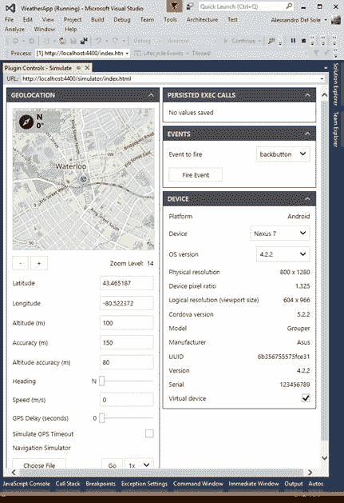

图 81:用科尔多瓦模拟控制插件

科尔多瓦模拟窗口不仅允许您控制浏览器中的安卓模拟(参见**设备**组)，还允许您通过方便的用户界面管理您的应用程序正在使用的任何插件。此外，您可以使用**事件**组中的**火灾事件**按钮来模拟特定动作。例如，您可以模拟按下硬件后退按钮。在图 81 中，您可以看到 Cordova Simulate 如何通过改变地图上的位置来控制地理定位插件，模拟导航。此工具窗口与许多其他插件一起工作，例如，您可以控制电池状态或模拟传感器，如指南针。对于每个插件，科尔多瓦模拟将显示一组特定的属性，您可以更改这些属性来模拟不同的情况。

Cordova 工具会产生非常冗长的输出消息，通常很难区分重要消息、错误和编译消息。因为后者经常会被忽略，所以 Visual Studio 2017 为现在以蓝色显示的相关消息引入了消息着色。图 82 显示了一个基于 WeatherApp 示例的构建输出的示例。

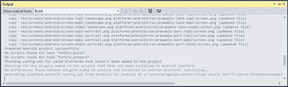

图 82:Apache Cordova 工具中的消息着色

在 Visual Studio 2017 中，选择带有 JavaScript 工作负载的 Mobile 开发并不会自动包括 Android 和 Windows 的构建工具，这两个工具现在是可选的。这有两个原因:产品安装更快，现在您可以根据开发的持续情况选择安装您实际需要的工具。虽然您仍然可以在 Visual Studio Installer 中选择构建工具作为单独的组件，但是您也可以利用名为**产品内获取**的新功能。在工具栏上**开始**按钮附近的下拉列表中，您会发现一个新的选项，标记为**安装构建工具**，指的是当前平台。图 83 展示了一个基于 Android 的例子。

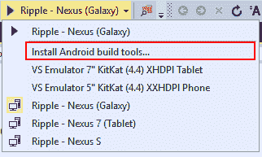

图 83:在构建时安装所需的工具

此选项允许您仅在需要时安装特定的构建工具。

|  | 提示:产品内收购并非科尔多瓦独有。事实上，集成开发环境通常可以根据您使用的语言和平台来建议软件开发工具包和工具。 |

##  跨平台开发

|  | 注意:使用 Xamarin 构建应用程序需要使用 C#和选择移动开发。NET 工作负载。请注意，Xamarin 开发不适用于 Visual Basic。 |

[Xamarin](http://www.xamarin.com) 既是一家公司的名称，也是一个非常受欢迎的开发平台，它允许通过编写和共享 C#代码来构建本机 iOS、Android 和 Windows 应用程序。微软最近收购了 Xamarin，并正在进行大量投资，以提高 Visual Studio Xamarin 工具的生产率。与其他平台一样，我在这里的目标不是描述您可以使用 Xamarin 做什么。相反，您会发现对 Visual Studio 2017 中 Xamarin 工具的新特性的全面解释。如果您需要一个开始的地方，您可以访问[官方开发人员门户网站](https://developer.xamarin.com/)，其中包括您需要的所有 Visual Studio 和 Xamarin Studio 资源。第一个重要的更新是 Visual Studio 2017 支持 Xamarin 4.3，这显著改善了 Xamarin 中的 XAML 编辑体验。形成并介绍了以下各节中详细介绍的功能。

|  | 提示:本节中描述的功能是由 Visual Studio 的 Xamarin 工具的 4.3 版本提供的，它们不是 Visual Studio 2017 独有的。这意味着，如果升级 Xamarin 工具，它们也将适用于以前的版本(如 Visual Studio 2015 更新 3 和 Visual Studio 2013 更新 2)。在撰写本文时，Xamarin 4.3 作为预览版通过 Alpha 更新程序通道提供。 |

创建 Xamarin 项目时，安卓平台所需的某些组件可能不会被检测到。如果发生这种情况，**错误列表**窗口会显示一条错误消息，描述缺少哪些组件(通常是 JavaScript 依赖项)。在 Visual Studio 2015 中，您需要下载这些组件并将它们手动提取到适当的位置。在 Visual Studio 2017 中，**错误列表**窗口提供通过双击错误消息来下载和安装缺少的组件。此时，集成开发环境将以适当的方式下载并安装所需的组件。请注意，这可能需要几分钟时间。

Xamarin 4.3 为 Visual Studio 2017 带来了更新的项目模板。选择**文件** > **新项目**即可轻松看到这个新功能。在**新建** **项目**对话框中，选择 **Visual C#** > **跨平台**。如图 84 所示，**新建项目**对话框现在只显示三个模板。

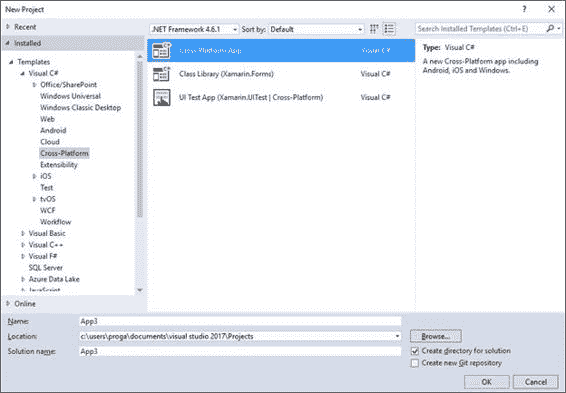

图 Xamarin 的更新项目模板

类库和用户界面测试应用程序模板取自过去的版本，而跨平台应用程序模板是一个新的补充。双击该模板，将进入**新跨平台 App** 对话框(见图 85)。

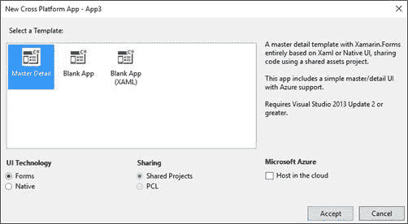

图 85:创建 Xamarin 项目的新对话框

这里有三个模板:

*   主细节，生成一个主细节用户界面与 XAML (Xamarin。表单)或本机 UI。它基于共享项目，并准备在微软 Azure 上托管。
*   空白应用程序，允许基于 Xamarin 生成空白项目。表单或本机 API。您可以在可移植类库(PCL)和共享项目之间进行选择，以便跨平台共享您的 C#代码。
*   空白应用(XAML)。这是您要用于 Xamarin 的项目模板。使用 XAML 作为用户界面的表单开发(见图 86)。您可以在 PCL 和共享项目之间进行选择，但在大多数情况下，您将使用 PCL 选项。

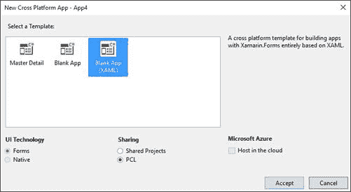

图 86:基于 Xamarin 创建项目。形式与 XAML

|  | 注:微软在。NET 标准库，它们在许多平台上共享相同的 API。Xamarin 应该为提供完全集成的支持，这不是什么秘密。NET 标准，所以请记住，PCL 支持可能会被。NET 标准。Xamarin 的这篇[博文](https://blog.xamarin.com/net-standard-library-support-for-xamarin/)提供了更多关于这个话题的信息。 |

做出选择后，点击**接受**，等待 Visual Studio 2017 生成您的解决方案。除了跨平台模板之外，Xamarin 4.3 还引入了用于原生 iOS 开发的新项目模板，您可以在 **Visual C#** 下的**新项目**对话框的 **iOS** 和 **tvOS** 节点中找到这些模板。苹果手表、苹果电视和 iOS 扩展都有新的模板。

|  | 注意:本节假设您对使用 Xamarin 开发 iOS 有些熟悉。 |

在 iOS 开发中，您向应用程序提供元数据、资产、功能和需求。在 Visual Studio 中，这些设置大多可以通过项目**属性**窗口提供，然后 IDE 会将指定的信息捆绑到合适的。plist 文件。除了**属性**窗口之外，Visual Studio 的 Xamarin 工具始终为提供内置的特定编辑器。plist 文件，允许通过方便的用户界面微调设置。Xamarin 4.3 集成了一个新的分层、统一的编辑器，可以更好地组织所有信息，并允许与所有人一起工作。把文件放在一个地方。假设你有一个 Xamarin。在 Visual Studio 2017 中打开的表单或 Xamarin.iOS 项目，双击**解决方案资源管理器**中的 **info.plist** 文件调用新编辑器。图 87 显示了它将如何出现。

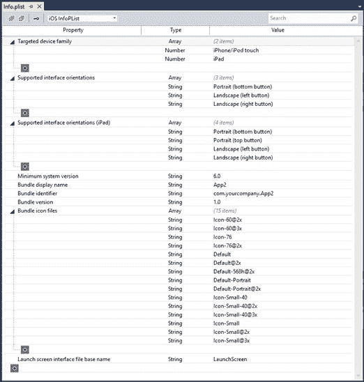

图 87:新的。Xamarin 4.3 中 iOS 的 plist 编辑器

如您所见，新编辑器提供了应用程序设置的统一视图，并允许快速进行编辑。您可以通过单击每个组底部的+图标轻松添加自定义设置。您也可以使用顶部的下拉列表来过滤列表—过滤选项有 **iOS InfoPList** (完整视图) **iOS 授权**(仅授权信息)和 **iOS 设置捆绑包**(仅与捆绑包签名相关的信息)。请注意，这个编辑器可以处理任何。plist 文件，所以如果你双击**解决方案资源管理器**中的**授权. plist** ，你将获得相同的编辑器，但是视图将被限制为授权。如果要更改视图，只需在下拉列表中更改选定的项目。

移动开发对于微软的战略至关重要，Visual Studio 2017 为任何受支持的平台引入了重要的开发体验改进。对于通用视窗平台，你有一个更快的。NET 原生编译器、更新的 NuGet 包、更好的设计时和诊断工具，以及更新的清单设计器，该设计器可以从单个图像文件自动生成资产。关于 Apache Cordova (TACO)的工具，Visual Studio 2017 允许在 Chrome 浏览器中模拟安卓环境，这对于调试使用插件的应用程序非常有用。集成开发环境还提供消息着色和产品内获取，以便您可以仅在需要时安装所需的工具。对于 Xamarin，您可以获得更新的项目模板和增强的 XAML 编辑体验，一个新的编辑器。iOS 中的 plist 文件，加上所有平台特定项目中的许多修复。