# 九、面向云和 Web 开发者的 VS2017

跨平台开发不仅仅是移动开发。微软一直在大力投资构建工具，开发人员可以利用这些工具编写运行在 Windows、Mac OS、Linux 及其最受欢迎的发行版上的应用程序。这种投资的结果是。NET Core，这是一个跨平台框架，允许您使用 C# 构建在多个系统上运行的应用程序。你写的网络应用。NET Core 需要强大的基础设施，微软 Azure 是云上的完美伴侣。说到部署。NET Core 应用到 Azure，很多开发者决定采用 Docker 容器。Visual Studio 2017 集成了对所有这些技术的支持，并再次证明是编写运行在任何平台和任何设备上的应用程序的完美环境。本章简要概述了 Visual Studio 2017 中云和 web 开发工具的新功能，您将获得到官方文档的链接，以便进一步学习。

|  | 注意:本章假设您熟悉基本的 Azure 概念和术语。事实上，您会发现提到资源组、应用程序服务计划、Azure 容器注册和其他术语。如果你不熟悉 Azure，或者有什么不清楚的地方，[官方文档](https://docs.microsoft.com/en-us/azure/)会有帮助。 |

|  | 注意:本节要求安装。NET Core 跨平台开发工作量。 |

[。NET Core](https://www.microsoft.com/net/core) 是一个开源的、跨平台的、模块化的运行时，运行在 Linux、Mac OS 和 Windows 上。和。NET Core，您可以使用现有的 C# 技能编写在多个操作系统和平台上运行的应用程序。。NET Core 附带了一个命令行界面(CLI)，并公开了一组丰富的跨操作系统共享的 API，简而言之，它允许您部署应用程序，同时只包括应用程序实际需要的库以及一个名为 Core CLR 的组件。后者可以被认为是可移植的公共语言运行库，它允许应用程序运行。讨论。NET Core 在细节上将需要一整本书，所以本章将重点介绍 Visual Studio 2017 中支持框架 1.1 版本的新工具。Visual Studio 2017 提供了一个名为**的新节点。在**新建项目**对话框中的**可视化 C#** 下的【NET Core】中，如图 88 所示。**

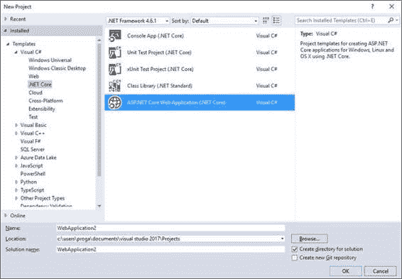

图 88:的可用项目模板。净核心

两个项目模板(单元测试项目和 xUnit 测试项目)与单元测试相关。使用控制台应用程序()。NET Core)模板，您可以编写一个控制台应用程序，它可以从 Linux、Mac OS X 和 Windows 上的命令行运行。使用 ASP.NET 核心网络应用程序(。NET Core)模板，可以创建一个基于 MVC 模式的 C# 跨平台 web 应用。类库(。NET Standard)模板允许您创建一个对所有人都可用的库。NET 运行时，包括。NET Core、Mono 和。NET 框架。

|  | 提示:该。目前版本为 1.6 的. NET 标准库规范正在快速发展，在接下来的版本中它将变得更加重要。如果你是图书馆的作者，我强烈建议你考虑。NET 标准库，而不是可移植类库。关于的详细信息和解释。NET 标准可以在[官方文档](https://docs.microsoft.com/en-us/dotnet/articles/standard/library)和这个[的博文](https://blogs.msdn.microsoft.com/dotnet/2016/09/26/introducing-net-standard/)中找到。微软的 NET 团队。 |

现在，选择**ASP.NET 核心网应用**模板，给项目命名，然后点击**确定**。此时，您将能够指定您想要在新的**ASP.NET 核心网络应用程序(。NET Core)** 对话框，如图 89 所示。

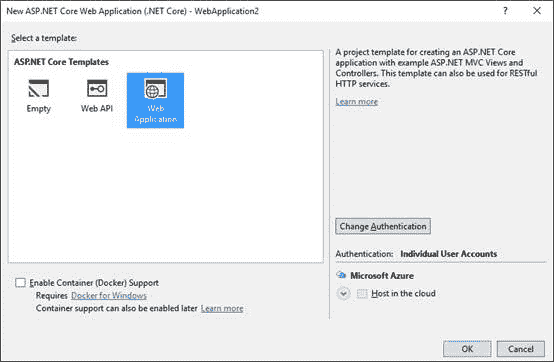

图 89:创建一个新的 ASP.NET 核心网络应用程序

如您所见，您可以决定创建一个空应用程序、一个跨平台的网络应用程序接口服务或一个跨平台的 MVC 网络应用程序。选择**网络应用程序**与接下来的示例保持一致。

有了网络应用编程接口和 MVC 网络应用程序，您也有机会提供应用程序必须提供的认证。默认为无认证，点击**更改认证**，然后选择**个人用户账户**。现在，在对话框中禁用**启用容器(码头工人)支持**，最后点击**确定**。Docker 支持将在本章稍后讨论。正如您对 MVC 应用程序的期望，在**解决方案资源管理器**中，您可以看到包含 C# 控制器、模型、启动文件和管理注册和凭证所需的服务的文件夹(参见图 90)。

。NET Core 应用程序可以使用跨平台版本的实体框架(称为实体框架核心)来访问 SQL 数据库。数据\迁移子文件夹的可用性证明了这一点，它包含几个所谓的[代码第一次迁移](https://msdn.microsoft.com/en-us/library/jj591621(v=vs.113).aspx)。

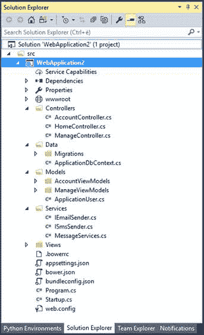

图 90:ASP.NET 核心网络应用程序的结构

|  | 注:两者之间有一个重要的突破性变化。NET Core 1.0 和 1.1。借助 1.1，微软引入了对的 MSBuild 支持。NET Core，这意味着您现在有了一个解决方案。sln 文件和一个项目。csproj 文件。在以前的版本中，没有解决方案文件，项目信息在 project.json. Visual Studio 2017 中，但是将帮助您将旧项目迁移到最新版本。 |

在幕后，Visual Studio 2017 只是调用。NET Core 命令行界面，并启动以下命令来构建一个新的 ASP.NET Core web 应用程序:

`> dotnet new -t web`

其中`-t`表示应用的类型。

然后，您可以添加您自己的数据模型、控制器和视图，就像您在完全构建的 ASP.NET MVC 应用程序中所做的那样。NET 框架。更好地了解 Visual Studio 2017 是用什么生成的。NET Core，只需按 F5。几秒钟后，您将看到 web 应用程序在浏览器中运行，如图 91 所示。

您已经知道的 Visual Studio 2017 中所有强大的调试工具都将由您支配。该应用程序有一个内置的身份验证服务，这意味着用户可以快速注册和登录来访问控制器内的安全信息。最重要的是，你所拥有的网络应用程序可以在 Mac OS X、Linux 和 Windows 上运行。

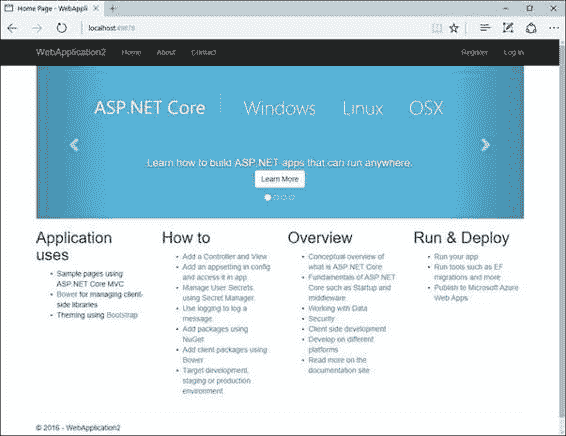

图 91:在浏览器中运行的跨平台 ASP.NET 核心网络应用程序

不要关闭该解决方案，因为它将在下一节与 Docker 一起使用。这里还有一些关于。Visual Studio 2017 中的. NET Core 1.1:

*   NuGet 包引用现在包含在项目中。csproj 文件。这使得将所有包合并到一个文件中变得更加容易。
*   网站发布工具已从 PowerShell 移动到 MSBuild。
*   。NET Core 1.1 支持标准引用，这意味着您可以将引用添加到非。NET 核心库。这使得。NET 核心项目与 Xamarin 项目进行互操作。
*   Visual Studio 2017 支持直接从集成开发环境中向 Docker 容器连续交付。

以下是进一步研究的有用资源列表:

*   。NET Core [首页](https://www.microsoft.com/net/core)。
*   教程:[ASP.NET 核心 MVC 和 Visual Studio](https://docs.microsoft.com/en-us/aspnet/core/tutorials/first-mvc-app/start-mvc) 入门。
*   实体框架核心[文档](https://docs.microsoft.com/en-us/ef/core/)。
*   。NET Core [命令行界面工具](https://docs.microsoft.com/en-us/dotnet/articles/core/tools/)。

Visual Studio 2017 还允许您将 ASP.NET 核心 web 应用程序快速打包到 Docker 容器中，您将在下一节中看到这一点。

|  | 注意:本节要求安装。NET Core 跨平台开发工作量。 |

容器可以被视为部署单元，它们允许您将应用程序、其依赖项和环境配置打包到映像中，最终部署到主机操作系统，通常是 Linux 或 Windows。容器的最大好处是，它们将应用程序隔离在共享操作系统(Linux 或 Windows)上，并且比虚拟机更轻，因为虚拟机有一个主机操作系统、一个或多个来宾操作系统，因此有一个复杂得多的基础架构。

相反，容器使用本质上相同的共享操作系统，但是它们将应用程序彼此隔离。在容器世界中， [Docker](http://www.docker.com) 是最流行的打包、部署和托管容器化应用程序的平台，并且它正在迅速成为标准。Docker 可以在云上和内部工作，它已经被许多供应商采用，包括微软和 Azure 平台。由于 Docker 日益增长的重要性和强大的功能，Visual Studio 2017 通过 Visual Studio 的 Docker 工具增加了对容器的支持，这使得开发人员可以轻松地打包和部署容器化的应用程序。本节无法完整详细地解释 Docker，但它将演示如何利用 Docker 集成工具进行开发和调试。在了解 Visual Studio 2017 如何本机支持 Docker 之前，首先需要设置您的开发环境。

|  | 提示:微软最近发布了一个名为[的免费电子书，该书使用微软工具和平台](https://blogs.msdn.microsoft.com/microsoft_press/2016/12/07/free-ebook-containerized-docker-applications-lifecycle-with-microsoft-tools-and-platform/)将 Docker 应用程序生命周期容器化。如果您不熟悉 Docker，并且想学习如何使用微软工具，这是一个非常好的起点。 |

本章将解释如何将. NET Core 应用程序打包到 Docker 容器中，以及如何将容器发布到 Microsoft Azure。在继续之前，您需要设置 Docker 和 Azure。

|  | 注意:将 Docker 容器发布到 Azure 是一个可选步骤，因此如果您对 Azure 上的 Docker 不感兴趣，可以跳过设置 Azure 工作区和标题为“在 Azure 上运行 Docker 容器”的部分。但是，如果您感兴趣，您需要一个活动的 Azure 订阅。如果您没有，您可以在[azure.microsoft.com/en-us/free](https://azure.microsoft.com/en-us/free)申请免费试用。 |

#### 安装和设置 Docker

第一个业务订单是下载安装 [Docker for Windows](https://www.docker.com/products/docker#/windows) 进行本地调试。安装完成后，您将在窗口任务栏中看到 Docker 图标。右键单击图标，然后选择**设置**。Docker 需要您指定一个为容器提供共享操作系统的驱动器，因此点击**共享驱动器**并选择 **C** 驱动器。图 92 展示了这一点。

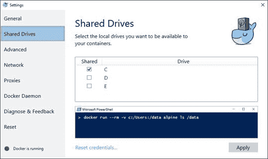

图 92:为 Docker 配置共享驱动器

准备好之后，点击**应用**并关闭对话框。

#### 设置 Azure 资源

正如您将很快看到的，Visual Studio 2017 允许您快速轻松地将容器化的应用程序发布到微软 Azure 上的 Linux 系统。为了实现这一点，集成开发环境需要您提供 Azure 订阅标识和一些云服务实例。可以参考[图 96](#Figure96) 。更具体地说，Visual Studio 需要以下信息:

*   网络应用程序名称:代表应用程序网址中的子域名称。
*   订阅:目标 Azure 订阅。
*   资源组:保存与 Azure 解决方案相关的资源的容器。这包括 SQL 服务器、网络应用程序、移动服务等等。
*   应用服务计划:托管应用程序所需的物理资源的集合。
*   容器注册:一个允许托管和管理 Docker 容器的新资源。

集成开发环境允许您选择现有资源并创建新资源。但是，如果您想从 Visual Studio 创建新资源，就有一个问题——对于新的资源组，它不允许指定 Azure 区域。目前，Azure 上的 Docker 是一个预览服务，只有美国西部地区支持在 Linux 上托管 Docker 容器。此外，将容器发布到 Azure 需要一个应用程序服务计划和一个容器注册中心，这两个注册中心都必须位于美国西部，并且与特定的资源组相关联。出于这些原因，在其他地区允许托管 Docker 容器之前，我建议您在 [Azure Portal](https://portal.azure.com/) 中设置所需的资源，而不是使用 Visual Studio。登录门户后，按以下顺序启用服务(超链接指向文档):

1.  创建一个位于美国西部的[资源组](https://docs.microsoft.com/en-us/azure/azure-resource-manager/resource-group-portal)，一旦创建，它将在资源组列表中可见。单击它可查看其详细信息。
2.  在新资源组的详细信息中，创建位于美国西部的新[应用服务计划](https://docs.microsoft.com/en-us/azure/app-service/azure-web-sites-web-hosting-plans-in-depth-overview)
3.  返回资源组详细信息，并添加位于美国西部的新的基于 Linux 的[容器注册表](https://docs.microsoft.com/en-us/azure/container-registry/container-registry-get-started-portal)。位于同一地区并与容器注册表相关联的存储帐户将自动创建。

现在，您已经拥有了将应用程序打包到 Azure 上托管的 Docker 容器中所需的一切。

|  | 注意:当您不再需要 Azure 资源时，请确保删除所有这些资源，例如，在实验和测试结束时。这样可以避免信用卡意外收费的风险。 |

在撰写本文时，Docker 工具为 Visual Studio 提供了支持。NET 核心应用程序(包括控制台应用程序)和经典 ASP.NET 应用程序。要在项目中启用 Docker 支持，您有三个选项:

*   对于新的 ASP.NET 核心网络应用程序，您可以在**新 ASP.NET 核心网络应用程序**对话框中选择**启用容器(码头工人)支持**标志，如[图 89](#Figure89) 所示。
*   选择**项目** > **码头工人解决方案支持**(或者**码头工人项目支持**如果您只需要在项目级别启用码头工人)。
*   在**解决方案浏览器**中右键单击项目名称，选择**添加** > **码头工人解决方案支持**(或**码头工人项目支持**)。

例如，您可以使用**项目** > **Docker 项目支持**轻松启用对上一节中创建的 ASP.NET 核心 web 应用程序的 Docker 支持。这将添加 Docker 配置新容器所需的几个文件(并且您并不真正需要更改):

*   这指定了图像和应用程序输出。对于 ASP.NET 核心，该映像称为 microsoft/aspnetcore，并且已经包含了必要的 NuGet 包的所有本机映像。
*   这个文件定义了要在容器中构建和运行的图像集合。
*   这个文件定义了应用程序的环境(在这种情况下是`ASPNETCORE_ENVIRONMENT`)和端口(80)，该端口被公开并映射到为开发 web 服务器(localhost)动态分配的端口。端口号由 Docker 主机决定，可以使用 Docker 脚本进行查询。
*   当构建配置设置为**调试**时，该文件包含附加设置。这是由 Visual Studio 开发工具使用的。
*   这个文件包含为发布配置优化生产映像的设置。

在标准工具栏中，您会注意到选择调试的主机是 **Docker** ，并且出现了一个新的按钮，标记为 **Docker:调试解决方案**(见图 93)。

图 93:在 Docker 容器中启动应用程序的按钮

如果您单击此新按钮，Visual Studio 2017 将首先将应用程序打包到 Docker 容器中，调用 Docker 来托管容器，然后启动应用程序，提供通常的强大调试支持。在幕后，Visual Studio 2017 调用 [Docker 命令行界面](https://docs.docker.com/engine/reference/commandline/cli/)来生成容器，以便在打包时，**输出**窗口显示来自命令行工具的消息。当您切换到发布配置并构建解决方案时，Visual Studio 和 Docker 工具会生成一个优化的映像，该映像已准备好用于生产和发布。

微软 Azure 可以在 Linux 上托管 Docker 容器，Visual Studio 2017 使得将容器发布到您的 Azure 工作区变得极其简单。为此，在**解决方案资源管理器**中右键单击项目名称，然后选择**发布**。您将被要求指定一个发布概要文件(参见图 94)。假设尚未创建发布配置文件，单击**创建**。

图 94:指定发布概要文件

您将被要求立即指定发布目标。选择 **Azure App Service Linux** (见图 95)，然后点击**确定**。

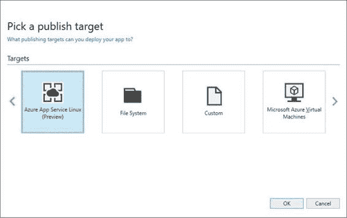

图 95:选择 Azure 上的 Linux 作为发布目标

此时，出现**创建应用服务**对话框。在这里，您必须提供 Visual Studio 2017 向 Azure 发布 Docker 容器所需的一些重要信息，例如网络应用程序名称、Azure 订阅、资源组、应用程序服务计划和容器注册表。如果 Visual Studio 检测到一个与您用于登录的 Microsoft 帐户相关联的字段，将会自动填写一些字段，包括 Azure 订阅(参见图 96)。

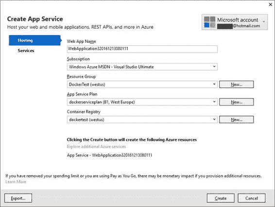

图 96:提供向 Azure 发布 Docker 容器所需的信息

选择您之前在 Azure 门户中创建的资源，然后单击**创建**。此时，Visual Studio 2017 将在 Azure 上设置所有必要的服务。当设置完成时，您将看到一个摘要，其中包括您将用来启动容器化应用程序的 URL(参见图 97)。查看总结后，只需点击**发布**。Visual Studio 2017 将把 Docker 容器和您的应用程序打包并部署到您的 Azure 订阅中。发布进度将显示在**网络发布**工具窗口中。

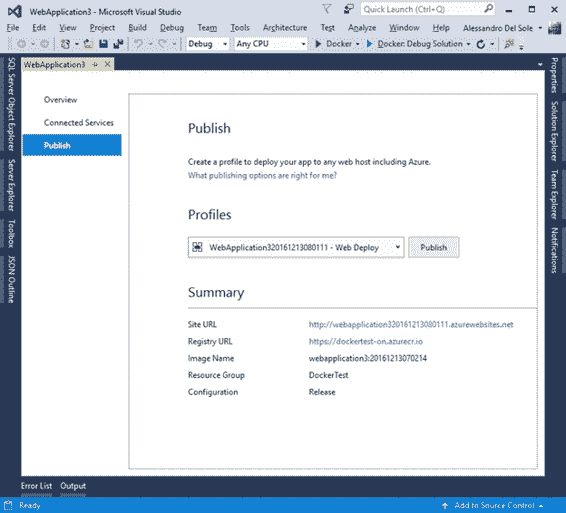

图 97:向 Docker 发布应用程序之前的 VS 摘要

发布时，Docker 将打开一个控制台窗口，您不得关闭该窗口，该窗口将自动关闭。当 Visual Studio 2017 结束发布您的 web 应用程序时，您将能够使用您在摘要中收到的网址在您最喜欢的浏览器中启动它。您将像在任何其他网站或应用程序中一样完成这项工作。

对于网络和移动应用，Visual Studio 2017 引入了一个名为**服务功能**的功能。这是一种连接到服务的新方式，它补充了旧的添加已连接服务和添加服务引用机制。在**解决方案资源管理器**中，您将在项目名称下看到服务能力。右键单击它，然后选择**添加服务功能**(您仍然可以使用之前创建的示例 ASP.NET 核心 web 应用程序)。可用服务的数量因您的配置而异，但是 Visual Studio 2017 显示了一个名为**服务功能**的新工具窗口，您可以在其中找到可用服务的列表(见图 98)。

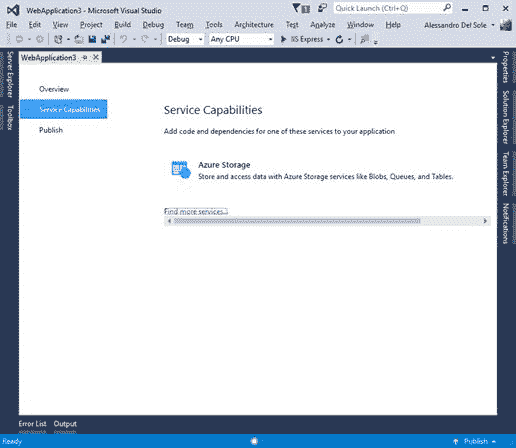

图 98:可用连接服务列表

如果您单击**查找更多服务**超链接，Visual Studio 会显示**扩展和更新**对话框，更具体地说，它会打开一个名为**连接服务**的新节点，并显示您可以从 Visual Studio Marketplace(以前的 Visual Studio Gallery)或供应商网站下载的附加连接列表(见图 99)。

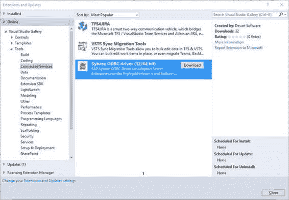

图 99:作为扩展下载的附加连接服务

您可以下载并安装一个或多个附加服务。请记住，图 99 所示的列表只是一个例子。回到**服务能力**窗口。在接下来的步骤中，我将展示连接向导如何针对 Azure 存储帐户工作。这将需要您有一个活跃的 Azure 订阅(免费试用是可以的)。如果没有(或不想设置)，可以跳到下一部分。一般来说，使用服务功能，Visual Studio 2017 简化了与服务建立连接的过程，并且它负责下载针对所选服务工作所需的 NuGet 包。如果您单击 Azure Storage，将出现一个向导，要求您指定是要连接到现有的存储帐户，还是要创建一个新的存储帐户(参见图 100)。

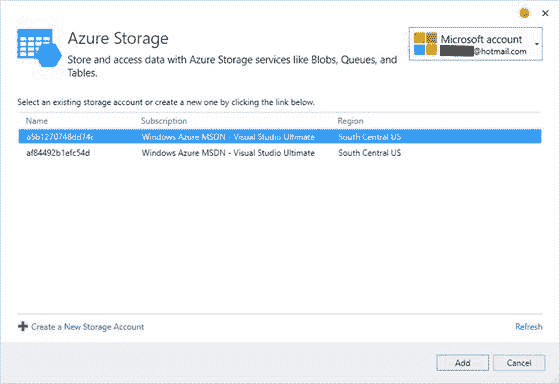

图 100:Azure 存储向导

如果点击**创建新的存储账户**，出现**创建存储账户**对话框(见图 101)。在这里，您将指定您的 Azure 订阅、存储帐户名以及所需的信息，如定价层、位置和资源组。

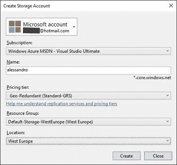

图 101:创建新的存储帐户

当您单击**创建**时，或者如果您在现有帐户的 **Azure Storage** 对话框中选择**添加**，Visual Studio 2017 将连接到 Azure，执行必要的操作，并从 C# 下载和安装应用程序与所选服务交互所需的 NuGet 包。图 102 展示了这一点。

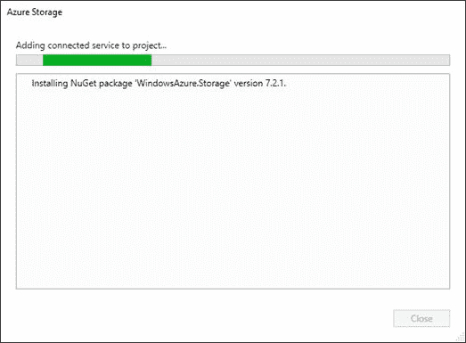

图 102:下载适当的 NuGet 包

正如预期的那样，引用的 NuGet 包在**解决方案资源管理器**中也是可见的。图 103 显示了**解决方案资源管理器**如何显示下载的 NuGet 包(在本例中为**窗口)。存储**)和一个新的文件夹，其中有您的存储帐户的名称加上 AzureStorage 后缀。该文件夹包含一个 ConnectedService.json 文件，其中保存依赖关系信息，以及一个**入门**信息文件，该文件指向所选服务的相应文档页面。

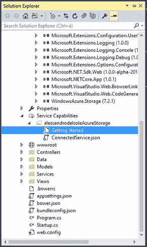

图 103:解决方案资源管理器显示 NuGet 包和一个新的支持文件夹

在这种特殊情况下，如果双击**入门**，Visual Studio 将打开一个名为[的页面，开始使用 Azure blob 存储和 Visual Studio Connected Services(ASP.NET)](https://docs.microsoft.com/en-us/azure/storage/vs-storage-aspnet-getting-started-blobs)。在这里，您可以找到 C# 中的代码示例，您可以使用这些代码示例在应用程序中与新创建的存储帐户进行交互。值得记住的是，无论您选择哪种连接的服务，Visual Studio 2017 都会负责设置连接以及下载和安装正确的 NuGet 包。

Visual Studio 2017 完全支持构建 [Node.js](http://nodejs.org) 应用程序。Node.js 是一个非常流行的开源、跨平台和事件驱动的 JavaScript 运行时，用于开发各种应用程序。Visual Studio 2017 包含项目模板，您可以使用这些模板快速构建大量 Node.js 应用程序，包括 web 应用程序、控制台应用程序和支持 Azure 的应用程序。

|  | 注意:Node.js 支持和集成只有在安装了 Node.js 开发工作负载的情况下才可用。 |

Node.js 的项目模板可以在**新建项目**对话框的 **JavaScript** 节点下找到，如图 104 所示。

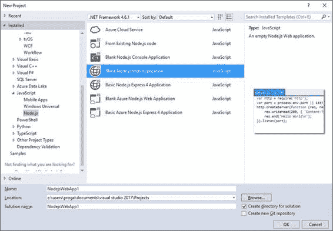

图 104:节点的项目模板

模板名称非常容易解释，当您选择一个时，**新项目**对话框提供了很好的描述。在名为【来自现有节点的 T2】的模板上做一个简短的注释:这允许你从不同扩展名的磁盘文件中导入现有代码或资产。图 105 显示了带有支持文件列表的导入向导。您可以在底部的文本框中包含其他扩展，也可以在向导的第二页中指定启动项目。最后，导入指定的文件夹。

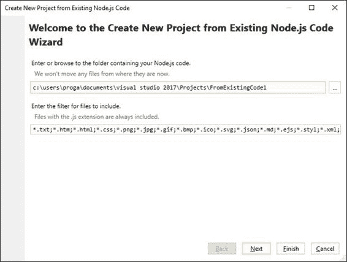

图 105:导入现有 Node.js 代码的对话框

|  | 注意:有些项目模板支持 Express 4。这是一个用于 web 应用程序的 Node.js 框架，它为 web 和移动应用程序提供了一组特性、实用程序和 API。您可以在[expressjs.com](http://expressjs.com/)了解更多关于快递 4 的信息。 |

无论您选择哪种模板，Visual Studio 2017 都会生成一个项目，其中包含以下在**解决方案资源管理器**中可见的项目:

*   包含最少启动代码的 JavaScript 文件(用于控制台应用程序的 app.js 或用于 web 应用程序的 server.js)。
*   包含应用程序信息的 package.json 文件。
*   一个空的 README.md 文件，可以使用 Markdown 标记语言编写文档。
*   节点包管理器(npm)节点，您可以右键单击该节点来管理、下载和安装 Node.js 的 npm 包。您选择的命令是**安装新的 npm 包**。

|  | 提示:npm 是 JavaScript 应用程序的包管理器。如果你是 JavaScript 开发的新手，你可以在。NET 开发。 |

图 106 显示了运行中的**安装新的 npm 包**对话框。开始在搜索框中键入软件包名称，对话框将在您键入时列出匹配的软件包。

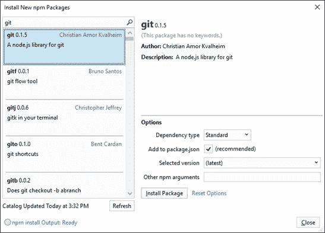

图 106:管理新产品导入包

使用任何模板，您都可以编写 JavaScript 代码，并利用 Visual Studio 中众所周知的强大集成工具，例如:

*   完全智能感知可用性。
*   诊断和分析工具。
*   单元测试。
*   基于 Git 的源代码管理。
*   与 TypeScript 集成。
*   调试工具，包括断点和调试窗口。

例如，图 107 显示了在断点被命中后，调试器在中断模式下对空白 web 应用程序的操作。

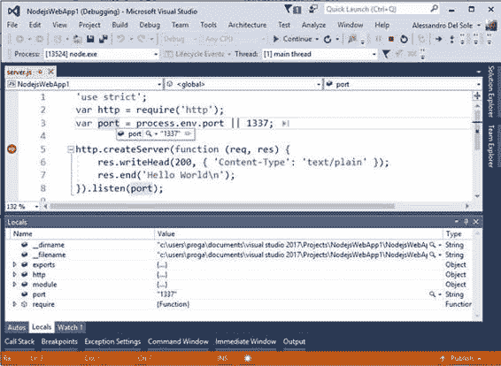

图 107:node . js 应用程序中的完全调试支持

如您所见，Node.js 获得了完整的调试支持，包括断点、数据提示和调试窗口，如**局部变量**。更多关于 Node.js 的 Visual Studio 2017 工具可以在[www.visualstudio.com/vs/node-js](https://www.visualstudio.com/vs/node-js/)找到。

Azure 是微软推出的云解决方案，随着新的和更新的服务，它正在快速发展。当您选择 Azure 开发工作负载时，Visual Studio 安装程序会为下载并安装最新的 Azure 软件开发工具包。NET，它通过集成的工具、窗口和项目模板扩展了 Visual Studio 2017，这些工具、窗口和项目模板允许开发人员在 IDE 中与大多数 Azure 服务对抗，而无需打开 [Azure 门户](https://portal.azure.com/)。**云浏览器**是 SDK 带给 Visual Studio 2017 的集成工具之一。在撰写本文时，Azure SDK 为。NET 为 Visual Studio 2015、Visual Studio 2013 更新 4 和 Visual Studio 2012 更新 2 提供了相同的功能。因为 Visual Studio 集成的 Azure 服务数量增长如此之多，并且因为 Azure 工具并不是 Visual Studio 2017 所特有的，所以本章仅总结您在. net Azure SDK 中拥有的工具。您可以稍后在[官方文档](https://docs.microsoft.com/en-us/azure/)中了解更多关于 Azure 服务和工具的信息。请注意，在 Azure SDK 和 Visual Studio 的未来版本中，服务和工具的列表可能会有所不同。

以下是新内容的总结:

*   支持 [Azure 数据湖](https://azure.microsoft.com/en-us/solutions/data-lake/)，微软新推出的大数据云服务。这是通过 Visual Studio 的 Azure 数据湖工具提供的。在 Visual Studio 2017 中，当您安装数据存储和处理工作负载时，这些选项可用。更具体地说，这些工具允许您从云资源管理器管理您的数据湖资源，并提供许多模板，例如用于 [U-SQL](https://docs.microsoft.com/en-us/azure/data-lake-analytics/data-lake-analytics-u-sql-get-started) 、 [HDInsight](https://docs.microsoft.com/en-us/azure/hdinsight/) 和 [Apache Storm](https://azure.microsoft.com/en-us/services/hdinsight/apache-storm/) 项目。
*   支持 [Azure 服务架构](https://azure.microsoft.com/en-us/services/service-fabric/)，这是一个允许您构建、调试、测试和部署基于微服务的应用程序的平台。除了 Azure SDK 之外，您还需要安装 Azure 服务结构 SDK，其中包括 Visual Studio 的集成工具。该软件开发工具包可以从[天青下载](https://azure.microsoft.com/en-us/downloads/)页面下载，并允许您从云浏览器管理服务结构帐户。
*   支持 [Azure 资源管理器](https://docs.microsoft.com/en-us/azure/azure-resource-manager/resource-group-overview)，该资源管理器随 Azure 资源组项目模板一起提供，您可以使用该模板创建、配置资源组并将其部署到 Azure。借助于 Visual Studio 工具，您现在可以借助 **JSON Outline** 工具窗口管理集成开发环境中的资源组。关于 Visual Studio 的 Azure 资源管理器工具，您可以在线学习官方的[教程](https://docs.microsoft.com/en-us/azure/azure-resource-manager/vs-azure-tools-resource-groups-deployment-projects-create-deploy)。

前面的几点再次强调了云资源管理器作为您使用 Azure 资源的集成工具的重要性。下一节将更详细地描述云资源管理器的更新。

云资源管理器是一个工具窗口，它与 Visual Studio 中的一个或多个 Azure 订阅进行交互。使用云资源管理器，您可以在不离开集成开发环境的情况下查看和管理大量资源。例如，您可以创建新的存储帐户、博客、表、队列，甚至可以通过集成 **SQL Server 对象资源管理器**工具窗口来管理 SQL 数据库。从的 Azure SDK 开始。NET v. 2.9.6，云资源管理器获得重要更新。首先，您可以通过 **Microsoft Azure** 标签下的下拉列表，按资源类型或资源组对视图进行分组。在图 108 中，您可以看到在选择了**资源组**选项的情况下视图是如何出现的，而图 109 显示了在选择了**资源类型**选项的情况下视图是如何出现的。请注意，项目的数量和类型可能因您的计算机而异，具体取决于您在订阅中启用的云服务类型。

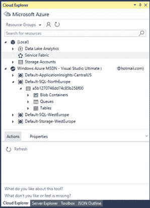

图 108:云资源管理器中的资源组视图

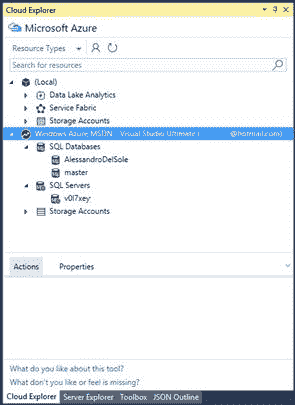

图 109:云浏览器中的资源类型视图

当您选择一个资源时，窗口底部的**操作**选项卡将显示针对该资源的可用操作列表。例如，如果您选择了一个 SQL 数据库，可用的操作将在 Azure 门户中打开该数据库，然后通过 **SQL Server 对象资源管理器**在 Visual Studio 中打开该数据库，然后刷新视图。可用操作因所选资源而异。**属性**选项卡显示所选资源的相关信息(如果可用)。如果您已经安装了数据存储和处理工作负载，并且订阅了 Azure Data Lake 服务，您将看到一个名为 **Data Lake Analytics** 的节点。这允许您轻松管理数据湖资源、创建数据库、插入表和编写脚本。图 110 提供了一个在云资源管理器中创建的数据库的示例视图，以及一个当前处于设计模式的表，其中包含特定的集成工具和编辑器。

图 110:管理 Azure 数据湖资源

同样，如果您已经安装了 Azure 服务结构 SDK，您将能够直接从云资源管理器中管理与此服务相关的资源。

Visual Studio 2017 引入了跨平台开发和云的重要工具——这是两个经常齐头并进的东西。可能最重要的补充是工具。NET Core，这是一个模块化、跨平台的开源运行时，开发人员可以使用 C# 为 Linux、Mac 和 Windows 构建控制台和网络应用程序。使用集成工具，您可以构建。NET Core 解决方案的方式与经典相同。NET 开发。另一个基本的补充是 Docker 工具，这是将应用程序部署到容器中的事实上的标准。Docker 容器可以在 Azure 中的 Linux 上托管，Visual Studio 2017 为您完成打包和部署容器的全部工作。结合其成为任何平台上任何开发人员的开发环境的目标，Visual Studio 2017 完全支持 Node.js，包括高级编辑、调试和测试功能。最后，Visual Studio 2017 支持所有最新的 Azure 服务，包括数据湖和服务结构，并且它提供了通过**云资源管理器**工具窗口从 IDE 内部与更多服务交互的选项。这避免了每次打开 Azure 门户的需要。