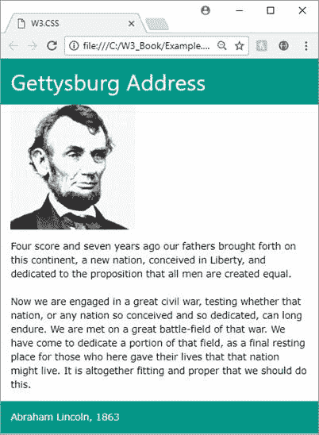

# 第一章导言

W3。CSS 是来自[w3schools.com](http://www.w3schools.com/)的一个免费的、无许可证的 CSS 框架，你可以使用它来创建响应性网站，这些网站可以跨所有常见的浏览器(Chrome、Edge、Firefox、Internet Explorer)和设备(台式机、平板电脑、移动设备)工作。它比其他框架小得多，只依赖于标准的 CSS。例如，许多常见的框架(如 Bootstrap 和 Foundation)都提供了 CSS 和 JavaScript 组件。有关未压缩内存大小的比较，请参见表 1。

表 1:大致框架尺寸

|  | `JavaScript (min)` | `CSS(min)` |
| **自举** | 37 kb | 119 kb |
| **基础** | 86 kb | 60 kb |
| **W3。CSS〔t1〕** | 不适用的 | 21 kb |

虽然每个框架都有自己的一套特性和组件，但 W3。CSS 体积小，学习简单，是决定 CSS 框架时值得考虑的竞争者。

## 仅限 CSS

从 W3 开始。CSS 是一个只包含 CSS 的框架，没有组件，其他一些框架也包含了组件。这意味着，虽然您可以使用框架来处理网站的外观和响应设计元素，但是没有 JavaScript。Bootstrap、Foundation 和其他这样的框架都是用 CSS 样式和 JavaScript 组件构建的。如果您的站点需要脚本功能，您应该使用像 jQuery 这样的库自己构建它，或者考虑一个更大的框架。

## 层

网站由三层组成，但只需要数据(或 HTML)层。用户可能会禁用所有脚本和 CSS 样式，并且数据应该仍然是可读的。CSS 样式通过向浏览器提供一组指示如何显示 HTML 元素的规则来改善网站的外观。脚本(大部分是 JavaScript)增加了交互功能，例如表搜索和排序，以及客户端大小表单验证。

表 2:网站层

| `Layer` | `Content` | `Format` |
| **数据层** | 要显示的文本/图像 | 超文本标记语言 |
| **表示层** | 覆盖浏览器默认值的样式规则 | 半铸钢ˌ钢性铸铁(Cast Semi-Steel) |
| **活动层** | 为网站提供交互性的脚本 | JavaScript、Typescript 等。 |

浏览器有默认规则指示如何显示 HTML 标签；您的自定义 CSS 或 CSS 框架(如 W3。CSS)为这些默认值提供覆盖。W3 的一切。CSS 使用标准的 CSS 样式，只是组织方式提供了一致的布局和响应设计(通过用媒体/设备查询过滤器包装一些样式)。

## W3。CSS 类

W3 中的所有类。CSS 框架以`w3-`开头，减少了样式名称冲突的可能性。您可以在单个`class`语句中组合多个类名，允许您提供基本的 CSS 类并向其添加附加功能。例如，下面的代码将创建一个`w3`容器，并将其背景颜色设置为蓝灰色。

代码清单 1

```html
   <div class="w3-container w3-blue-gray">
   </div>

```

您可以添加类`w3-round-large`来为`<div>`元素添加圆角。

## 简单的例子

下面的示例显示了一个简单的网页，它在一个容器中显示了一个图像和一些文本。您可以调整浏览器的大小，整个页面将调整到新的大小。



图 1:示例网页

### 来源页面

代码清单 1 是上述网页的源页面。请注意页面`<head>`部分的本地文件 **w3.css** 的链接引用。另一种方法是链接到框架的外部副本，我稍后会解释。

代码清单 2:示例 W3。CSS 页面

```html
  <DOCTYPE
  html>
  <html>
  <head>
   <title>W3.CSS</title>      
   <meta name="viewport" content="width=device-width,
  initial-scale=1">      
   <link rel="stylesheet" href="w3.css">  
  </head> 
  <body>
     <div class="w3-container w3-teal">
       <h1>Gettysburg Address</h1>
    </div> 
     <div class="w3-container">
    <p></p>
    </div> 
    <div class="w3-container w3-round-large">
       <p>Four score and seven years ago
  our fathers brought forth on this continent, a new nation, conceived in
  liberty, and dedicated to the proposition that all men are created equal. 
   <br/><br/>
  Now we are engaged in a great civil war, testing whether that
  nation, or any nation so conceived and so dedicated, can long endure. We are
  met on a great battle-field of that war. We have come to dedicate a portion
  of that field as a final resting place for those who here gave their lives so
  that that nation might live. It is altogether fitting and proper that we
  should do this. </p>
    </div>
     <div class="w3-container w3-teal">
       <p>Abraham Lincoln 1863</p>
    </div> 

  </body> 
  </html>

```

## 获得 W3。半铸钢ˌ钢性铸铁(Cast Semi-Steel)

可以下载 W3。CSS 通过跟随[这个链接](https://www.w3schools.com/w3css/w3css_downloads.asp)。它是完全免费的，不需要任何使用许可。

你也可以链接到 W3。通过外部链接的 CSS 库，在你的`<head>`部分使用下面的片段。

`<link rel="stylesheet" href="https://www.w3schools.com/w3css/4/w3.css">`

本书中的代码基于 W3。CSS 版本 4。版本 4 于 2017 年 3 月发布，速度明显快于版本 3。