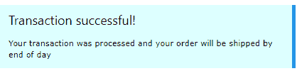

# 四、助手类

其中包含了一些类，可以附加到各种元素上，对元素的外观进行一些基本的格式化。

## CSS 回合

默认情况下，HTML 元素显示为方形框。然而，CSS 允许你设置`border- radius`属性来创建圆角的盒子。W3CSS 框架提供了几个类来轻松创建圆角。

图 14:方形盒子和圆形盒子

表 6 列出了舍入类别。边框半径的像素越大，圆角越明显。

表 6:舍入类别

| `Class name` | `Border radius size` |
| **w3 轮** | 4 像素 |
| **w3-圆形-小** | 2 像素 |
| **w3-圆形-中等** | 4 像素(与圆形相同) |
| **w3-圆形-大** | 8 像素 |
| **w3-round-xlarge** | 16 像素 |
| **w3-round-xxlarge** | 32 像素 |

### 圆类

除了圆角，框架还包括一个`w3-circle`类，根据元素大小将整个元素放在一个圆(或椭圆)中。通过使用内联样式属性调整元素宽度，可以将圆嵌套在彼此之中。

## CSS 填充

填充类可用于在单元格内容周围添加填充。有两种类型的填充类。**数字**填充类根据类名的指定添加顶部和底部填充。**尺寸**填充类使用尺寸缩写提供完整的填充(所有四边)。

### 数字填充

数字填充类包括:

*   `w3-padding-16`:添加 16 像素上下填充。
*   `w3-padding-24`:添加 24 像素上下填充。
*   `w3-padding-32`:添加 32 像素上下填充。
*   `w3-padding-48`:添加 48 像素上下填充。
*   `w3-padding-64`:添加 64 像素上下填充。

### 尺寸填充

尺寸填充类向所有四个边添加填充:顶部、底部、左侧和右侧。这些课程是:

*   `w3-padding`:上下加 8 像素，左右加 16 像素(默认)。
*   `w3-padding-small`:上下加 4 像素，左右加 8 像素。
*   `w3-padding-large`:上下加 12 像素填充，左右加 24 像素。

## CSS 边距

边距类允许您向元素添加 16 像素的边距。该类允许将边距添加到所有边或单个边:

*   `w3-margin`:为所有边添加 16 像素边距。
*   `w3-margin-top`:顶部增加 16 像素边距。
*   `w3-margin-right`:右侧增加 16 像素边距。
*   `w3-margin-bottom`:底部增加 16 像素边距。
*   `w3-margin-left`:左侧增加 16 像素边距。
*   `w3-section`:在顶部和底部添加 16 像素的边距。

如果只需要某些边上的边距，可以合并类。`w3-section`类是一个速记类，与向元素中添加类`w3-margin-top`和`w3-margin-bottom`相同。

## CSS 边框

W3CSS 框架提供了在元素周围放置边框的类。有几个可用的边框类。

### 基本边框

基本边框类允许您在整个元素或一个或多个边的周围添加边框。这些课程是:

*   `w3-border`:给元素的所有边(上、下、左、右)添加边框。
*   `w3-border-top`:在元素顶部添加边框。
*   `w3-border-right`:在元素右侧添加边框。
*   `w3-border-bottom`:在元素底部添加边框。
*   `w3-border-left`:在元素左侧添加边框。
*   `w3-border-0`:移除元素的所有边框。

### 边框颜色

您可以将`w3-border-color`类添加到边框类中(两个类都是必需的)来更改边框颜色。边框颜色有两种类型:

*   `w3-border-color`:将边框设置为指定颜色(默认为黑色)。
*   `w3-hover-border-color`:设置悬停在元素上时使用的边框颜色。

### 粗边框

较厚的边框(6 像素)可以为元素提供良好的视觉效果，如图 15 所示。

图 15:粗边框示例

以下 CSS 类(可与边框颜色组合)可用于在元素周围创建粗边框:

*   `w3-bottombar`:在元素底部添加粗边框。
*   `w3-leftbar`:在元素左侧添加粗边框。
*   `w3-rightbar`:在元素右侧添加粗边框。
*   `w3-topbar`:在元素顶部添加粗边框。

## CSS 尺寸

W3CSS 框架提供了许多类来改变元素的大小:

*   w3-tiny:非常小的字体，会让律师很开心(10 像素)。
*   w3-小:较小的字体(12 像素)。
*   w3-中:默认字体为 15 像素。
*   w3-大号:字体大小为 18 像素。
*   w3-xlarge:字体大小为 24 像素。
*   w3-xxlarge:字体大小为 36 像素。
*   w3-xxxlarge:字体大小为 48 像素。
*   w3-jumbo:字体大小为 64 像素。

这些类可以应用于任何元素，如文本、按钮、徽章和表格。

## 总结

助手类和颜色类与其他基类相结合，提供了对网页元素的大量控制。