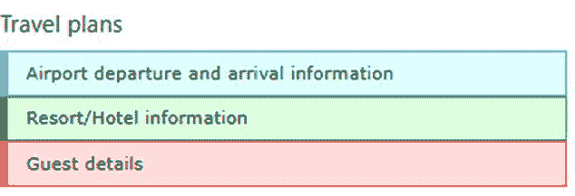
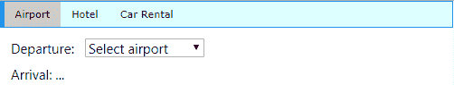
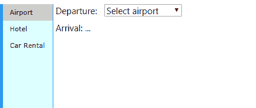
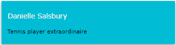
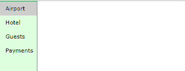
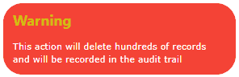

# 第五章容器

W3。CSS 框架提供了多种容器样式，可以在应用程序中使用。使用这些容器将需要一些 JavaScript 然而，它是最简单的脚本。

## CSS 排列

当您有几个文本框元素时，通常是一个标题栏和一些内容，但不希望所有内容同时公开时，可以使用手风琴。用户将点击标题栏，该部分中的文本将被显示(或隐藏)。



图 16: CSS 折叠示例

### 手风琴小节

手风琴条是样式化的按钮，如下面的代码片段所示。

代码清单 10

```html
    <button onclick="openPanel('Airport');"
     class="w3-btn w3-block w3-pale-blue w3-border-blue
       w3-border w3-leftbar w3-left-align">
     Airport departure and arrival information
    </button>

```

`openPanel()` JavaScript 函数将处理手风琴内容的打开和关闭。

### 修建路段

要创建手风琴部分，您需要为每个部分创建一个单独的`<div>`。下面的代码片段显示了一个示例内容`<div>`。

代码清单 11

```html
  <div id="Airport"
  class="w3-container w3-hide">
   <p>Airports</p>
  </div>

```

每个`<div>`将应用`w3-hide`类，因此内容不可见。JavaScript 代码将负责显示内容。

### 航行

要在手风琴之间导航，你需要使用一些简单的 JavaScript。代码将有两个任务:一是隐藏所有不活动的选项卡(基于类名)，二是使选定的选项卡可见。

代码清单 12

```html
  function openPanel(id) {
    var x = document.getElementById(id);
    if (x.className.indexOf('w3-show') == -1) {
    x.className += ' w3-show'
   } else
  {      
    x.className = x.className.replace(' w3-show','');
   }       
  }        

```

当用户点击折叠按钮时，`openPanel()`功能检查`w3-show`类是否在当前项目上。如果不存在，则添加它，内容变得可见。如果`w3-show`类已经存在，它将被移除(这将导致原`w3-hide`类生效)。

## CSS 制表符

标签的功能类似手风琴，一次只能看到一部分内容。但是，各部分之间的导航是通过一系列按钮(选项卡)完成的，通常在页面顶部。



图 17: CSS 标签示例

### 标签类

您需要在选项卡中使用两个类:

*   `w3-bar`:将拉环条横过顶部的容器。
*   `w3-bar-item`:代表标签的按钮。

### 构建选项卡

代码清单 13

```html
  <div class="w3-bar w3-pale-blue w3-leftbar w3-border-blue w3-border">
    <button onclick="openDiv('Airport');"
      class="w3-bar-item w3-button">Airport
   </button>
    <button onclick="openDiv('Hotel');"
      class="w3-bar-item w3-button">Hotel
   </button>
    <button onclick="openDiv('Rental');"
      class="w3-bar-item w3-button">Rental
   </button>
  </div>        

```

### 修建路段

要为选项卡创建部分，您需要为选项卡中的每个部分创建单独的`<div>`。下面的代码片段显示了一组示例`<div>`元素。您需要为每个选项卡部分定义一个类名——我们在示例代码中使用了`travel`。第一个`<div>`应该显示，剩下的`<div>`元素隐藏。

代码清单 14

```html
  <div id="Airport
  class="travel">
   <p>Airport details</p>
  </div>        
  <div id="Hotel
  class="travel" style="display:none;">
   <p>Hotel details</p>
  </div>        
  <div id="Rental
  class="travel" style="display:none;">
   <p>Rental details</p>
  </div>        

```

### 航行

要在选项卡之间导航，您需要使用一些简单的 JavaScript。代码将有两个目的:第一个是隐藏所有不活动的选项卡(基于类名)，第二个是使选定的选项卡可见。

代码清单 15

```html
  function openDiv(divName) {
    var x = document.getElementsByClassName('travel');
    for (var
  i =0; i < x.length;
  i++) {
    x[i].style.display
  = 'none'; 
   }   
   document.getElementById(divName).style.display = 'block';   

  }        

```

当用户点击选项卡时，调用 JavaScript 函数并传递`divName`打开。

### 垂直标签

虽然选项卡通常是水平的，但您可以通过对布局进行一些小的更改来轻松创建垂直选项卡。



图 18:垂直选项卡示例

您需要将`w3-bar`类更改为`w3-bar-block`，并添加`w3-sidebar`类。此外，您还需要设置标签菜单的宽度。

代码清单 16

```html
  <div class="w3-sidebar w3-bar-block w3-pale-blue 
      w3-border-blue w3-border" style="width:120px;">

```

您还需要将`margin-left`样式添加到各个部分，如下所示。

代码清单 17

```html
  <div id="Airport"
  class="travel" style="margin-left:125px;">

```

请确保将边距设置得足够大，以超过菜单宽度。您应该在旅行类中添加`margin-left`样式，而不是内嵌。

## CSS 卡

卡片是一个容器，周围有一个阴影，为元素提供一个纸一样的外观。框架提供了一个简单的`w3-card`类来创建一个卡片元素。`w3-card-4`类似，只是卡片周围的阴影比较大(4 像素而不是 2 像素)。默认情况下，卡片将是白色的，尽管您可以添加任何`w3-color`类来创建彩色卡片。

例如，下面的代码片段将在网页上显示图 19 所示的卡片。

代码清单 18

```html
  <div class="w3-card-4 w3-cyan w3-padding w3-margin">
   <p class="w3-text-white w3-large">Danielle Salsbury</p>
   <p>Tennis player extraordinaire</p>
  </div>        

```



图 19 : CSS 卡示例

## CSS 侧栏

一个常见的网站容器是边栏菜单，其中导航选项出现在屏幕的一侧，内容出现在另一侧更大的区域。它的结构与垂直标签非常相似，但是有额外的选项来增加它的灵活性。



图 20:基本侧栏

### 基本侧栏

要创建侧边栏，您需要使用`w3-sidebar`和`w3-bar-block`类，以及设置侧边栏的宽度。背景颜色和边框是可选的，但通常边栏应该与屏幕的其他部分区分开来。下面的代码片段显示了基本的侧边栏设置。

代码清单 19

```html
  <div class="w3-sidebar w3-bar-block w3-border">
   <a href="#" class="w3-bar-item w3-button">Airport</a>
   <a href="#" class="w3-bar-item w3-button">Hotel</a>
   ...
  </div>        

```

您还需要将内容元素的左边距设置得足够大，以至于超过侧边栏的右边界。

### 可折叠侧栏

在网站上，尤其是移动网站上，一种相当常见的技术是隐藏侧边栏菜单(为主要内容提供更多空间)，并且仅在用户单击图标时打开菜单(通常是带有三个横条的“汉堡包”图标)。用一点 JavaScript，你就可以拥有 W3。CSS 边栏提供了这种行为。

#### 创建图标

您将需要添加一个标题(或一些容器来显示菜单图标)。请务必为菜单图标提供一个`id`(在我们的示例中为`openNav`)。`#9776`是汉堡菜单图标的 HTML 实体代码。下面的代码片段显示了标题和图标示例代码。

代码清单 20

```html
  <div class="w3-container w3-pale-green">
   <h4>
   <span id="openNav" class="w3-small w3-button"
     onclick="openMenu();">&#9776;
    </span>
    My travel plans</a>
   </h4>
  </div>        

```

当用户点击图标时，调用`openMenu()` JavaScript 函数。

#### 创建侧栏

侧边栏本身是使用与基本侧边栏代码相同的代码创建的，只是做了一些更改。首先，边栏菜单需要一个`id`，因为 JavaScript 代码需要引用它。此外，它最初在屏幕上不可见。

另一个变化是一个新的菜单项，调用 JavaScript `closeMenu()`函数来隐藏点击时的边栏。

代码清单 21

```html
  <div class="w3-sidebar w3-bar-block w3-border" id="sideBAR"
     style="width:20%;display:none;">
     <button
  class="w3-bar-item w3-button" 
       onclick="closeMenu();">&times;
    </button>
    <a href="#" class="w3-bar-item
  w3-button">Airport</a>
    <a href="#" class="w3-bar-item
  w3-button">Hotel</a>
    ...
  </div>        

```

#### 打开和关闭

打开和关闭菜单的 JavaScript 函数只需切换菜单的显示样式，即可显示或隐藏菜单。下面的代码片段显示了必要的 JavaScript。

代码清单 22

```html
  function openMenu() {
     document.getElementsById('sideBAR').style.display =
  'block';
  }        
  function closeMenu() {
     document.getElementsById('sideBAR').style.display =
  'none';
  } 

```

请记住，侧边栏的元素名称区分大小写，因此请确保`id`名称与您分配给侧边栏菜单的`id`匹配。

### 向右滑动内容

虽然可折叠边栏显示正常，但有时您可能希望内容向右移动，而不是被边栏菜单覆盖。幸运的是，这是对可折叠边栏菜单所需的 JavaScript 函数的简单更改。下面的 JavaScript 代码将打开菜单并调整屏幕内容。

代码清单 23

```html
  function openandMoveMenu() {
     document.getElementsById('main').style.marginLeft =
  '21%';
     document.getElementsById('sideBAR').style.width = '20%';
     document.getElementsById('sideBAR').style.display =
  'block';
     document.getElementsById('openNav').style.display = 'none';
  }        
  function closeMenu() {
     document.getElementsById('main').style.marginLeft =
  '1%';
     document.getElementsById('sideBAR').style.display =
  'none';
     document.getElementsById('openNav').style.display = 'inline-block';
  } 

```

您需要调整边距和宽度百分比以匹配侧边栏菜单宽度，并调整屏幕主要部分内容的左边距。

## CSS 面板

`w3-panel`类与`w3-container`类非常相似，但包括 16 像素的上下边距，以使面板从背景中脱颖而出。这使得面板成为笔记和警报等内容的良好选择。

下面的代码片段演示了一个显示警告消息的面板。

代码清单 24

```html
  <div class="w3-panel w3-red w3-round-xxlarge w3-margin">
   <h3 class="w3-text-yellow"><b>Warning</b></h3>
   <p>This action will delete hundreds
  of records and will be recorded in the audit trail</p>
  </div>        

```



图 21:警告面板

## 总结

W3。CSS 框架提供了许多呈现内容和动作的方式，通过一些小的 JavaScript，您可以拥有一个易于操作的系统，为用户提供您网站上菜单和内容之间的导航。