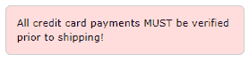
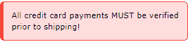
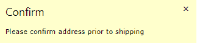

# 第六章视觉元素

W3。CSS 包括一些用于在页面上创建可视元素的类。所有这些元素都使用`w3-panel`作为它们的基类。

## CSS 笔记

笔记是显示在网站上的信息框，可以使用`w3-panel`基础和一些助手类轻松构建。例如，下面的代码片段将生成一个带边框的笔记容器。

代码清单 25

```
  <div class="w3-container">
   <div class="w3-panel w3-border w3-pale-red w3-round-large">
   <p>All credit card payments MUST be
  verified prior to shipping!</p>
   </div>
  </div>        

```



图 22 : CSS 注释示例

### 定制笔记

除了颜色和圆角，您还可以使用以下类来改善音符的外观:

*   `w3-border-color`:定义边框元素的颜色。
*   `w3-leftbar`:在容器左侧增加一个竖条。
*   `w3-rightbar`:在容器右侧增加竖条。
*   `w3-topbar`:在容器顶部增加一个横条。
*   `w3-bottombar`:在容器底部增加一个横条。

图 23 显示了添加了`w3-border-red`和`w3-leftbar`类的前一个注释。



图 23: CSS 自定义注释外观

## CSS 警报

警报通常是网站上需要用户关注的消息。通常，警报的颜色表明问题的严重性。红色警报表示有风险或消极的情况，而绿色通常是积极的，这是对某些事情起作用的确认。

警报的一般结构如下。

代码清单 26

```
  <div class="w3-display-container w3-panel w3-pale-yellow w3-margin">
   <span onclick="this.parentElement.style.display='none'"
     class="w3-button
  w3-pale-yellow w3-large 
        w3-display-topright">&times;</span>
   <h3>Confirm</h3>
   <p>Please confirm address prior to
  shipping!</p>
  </div>        

```

在这个例子中，我们使用`w3-display-container`类在左上角放置一个 X。单击 X 将消除警报。我们使用的是`&times` HTML 实体，而不是关闭按钮的字母 X。

`onclick`代码只是将警报的显示样式属性更改为`none`，导致警报从屏幕上消失。



图 24:示例警报面板

通常，以下颜色可用于警报消息:

*   红色或浅红色:错误情况，需要注意。
*   黄色或淡黄色:警告，可能需要注意。
*   绿色，淡绿色:成功！
*   蓝色、青色:仅供参考。

|  | 注意:颜色不是万能的，在不同的文化中有不同的含义。例如，红色在西方文化中通常意味着危险，而在中国，红色代表幸运。在为提醒和方框选择颜色时，请务必考虑您的受众。 |