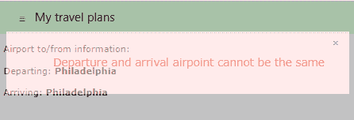

# 第七章正文

W3 中的默认字体系列。CSS 框架是 Verdana，无衬线，字体大小 15 像素。它的默认行距为 1.5，这使得大多数用户都能轻松阅读网页。字体设置在 HTML 和正文标签上，这意味着它将用于网站上的所有元素，除非特别更改。

H1 到 H6 的标题大小使用塞格用户界面的字体系列，Arial，无衬线。

|  | 注意:衬线字体(如 Times Roman 或 Georgia)在字母末尾几乎没有装饰笔画，而无衬线字体(如 Helvetica 或 Arial)则没有这些笔画。字体系列告诉浏览器尝试列表中的每种字体，如果找不到，只需选择与系列中最后一项最匹配的字体。W3。CSS 建议使用 Verdana，如果没有找到，则要求浏览器使用无衬线字体。 |

## CSS 源

通过在 W3 之后的 HTML 和正文元素中添加字体系列，您可以轻松地覆盖 Verdana 字体。例如，加载 CSS 文件。

代码清单 27

```html
  <link
  rel="stylesheet"
  href="css/w3.css"> 
  <link
  rel="stylesheet"
  href="clientStyle.css">

```

其中文件 **clientStyle.css** 包含类似如下的一行。

代码清单 28

```html
  html, body {
   font-family: "Georgia", sans-serif;
  }        

```

您可以修改 W3。CSS 文件，但我建议您将您的独特设置放入一个单独的样式表中，而不是在下载 W3 时冒着丢失它们的风险。CSS 更新。

### 打印样式

Verdana 是一种好的、灵活的字体，但是您可能想要选择不同的字体进行打印。以下代码片段显示了将打印字体更改为替代字体的媒体查询。

代码清单 29

```html
  @media print {
   html, body {
    font-family: Helvetica, sans-serif;
   } 
   h1, h2, h3, h4, h5, h6 {
    font-family: "Century Gothic",
  Helvetica, sans-serif;
   }  
  }        

```

## 网络资源

当浏览器选择字体时，它依赖于用户计算机上安装的字体。但是，CSS 允许您使用网站上可用的字体，而不是用户计算机上可用的字体。这些被称为*网页字体*。

网络字体的一个流行来源是[谷歌字体库](https://fonts.google.com/)。该网站包含数百种网页字体，您可以使用它们来改善网站的外观。

### 安装字体

要使用网页字体，您需要将其安装到您的网页中。例如，可以通过放置在网站`<head>`部分的以下代码来添加 Tangerine 谷歌字体。

代码清单 30

```html
  <link
  rel="stylesheet"

  href="https://fonts.googleapis.com/css?family=Tangerine">

```

这将为你的网站添加一种新的字体，叫做 Tangerine。Tangerine 是一种脚本字体，因此您可以创建一个类来在显示签名时使用。

代码清单 31

```html
  .SignatureLine {
   font-family: Tangerine, script, serif;
  }        

```

确保包含默认字体，以防由于任何原因无法加载请求的字体。此外，请记住，字体文件需要在页面启动时加载，这可能会减慢启动时间。

## 对齐

有三个类可以用来在容器内水平对齐文本(和其他元素)。这些类别是:

*   `w3-left-align`:向左对齐文本。
*   `w3-right-align`:向右对齐文本。
*   `w3-center`:在容器内居中文本。

## 文字特征

通过在框架中使用几个附加类，可以稍微改变一下文本的外观。这些类允许您加宽文本或设置不透明度。例如，下面的代码片段在文本中的字符之间添加了 4 个像素的间距。

`<p class="w3-wide">On sale today only!</p>`

`w3-opacity`类将元素的不透明度设置为 60%。不透明度值决定了文本的半透明程度。数字越小，元素越半透明。下图显示了如何使用不透明度类显示错误消息，但仍然让用户看到错误消息下面的屏幕。



图 25:不透明度示例

您也可以使用`w3-opacity-max`类将不透明度设置为 25%，使用`w3-opacity-min`类将级别设置为 75%。`w3-opacity-off`类将不透明度设置为 100%(即完全不透明)。

|  | 提示:通过 Ajax 加载内容时，可以使用不透明度。在`before Send`事件期间将等级设置为`w3-opacity-max`，在`complete`事件期间将等级设置为`w3-opacity-off`。这将向用户提供屏幕的一部分已经被更新的视觉指示。 |

## CSS 代码

如果要显示某种代码，如编程代码或计算机指令，可以使用`w3-code`类。

代码清单 32

```html
  <div class="w3-code" translate="no">
   function DisplayError(msg)<br/>
   {<br/>
    &nbsp;&nbsp;&nbsp;alert(msg);<br/>
   }<br/>

  </div>        

```

|  | 注意:Translate="no "是一个 HTML5 属性，表示以下内容不应翻译成其他语言。 |

代码的默认字体系列是 Consolas 和 Courier New。