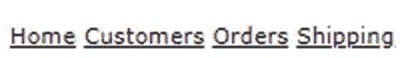
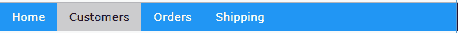
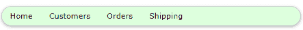
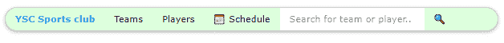
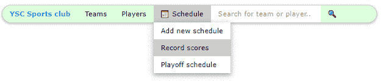
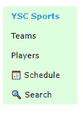

# 第八章菜单

导航是指允许用户在网站页面间移动的超链接和引用。W3。CSS 框架提供了允许你控制菜单链接外观的类。

## CSS 导航

基本的导航元素是一个锚点标签`<a>`，其`HREF`属性指示当点击该元素时要加载的内容。您也可以使用 JavaScript 和 Ajax 加载部分内容，方法是使用`onclick`事件。语法如下。

代码清单 33

```html
  <a href="#"

   onclick="CallJavaScript();return
  false;"> 
   Menu text
  </a>        

```

`HREF`的值表示点击时要执行的链接。如果调用了`onclick`事件，那么只有当`onclick`功能返回`TRUE`时，`HREF`才会被使用。单页应用程序通常保持菜单结构不变，只通过调用 JavaScript 构建内容窗口来更新内容区域。

### 基本结构

下面的代码片段显示了基本的菜单结构，还没有应用任何类。

代码清单 34

```html
  <div>
   <a href="#">Home</a> 
   <a href="#">Customers</a>
   <a href="#">Orders</a>
   <a href="#">Shipping</a>
   </div>     

```

运行这段代码会产生如图 26 所示的屏幕，只是一行超链接。



图 26:菜单项

### 水平菜单

向`<div>`标签添加可选颜色类`w3-bar`类、`w3-bar-item`类和`w3-button`类，会生成一个蓝色背景的水平菜单。

代码清单 35

```html
  <div class="w3-bar w3-blue">
   <a href="#" class="w3-bar-item w3-button">Home</a> 
   <a href="#" class="w3-bar-item w3-button">Customers</a>
   <a href="#" class="w3-bar-item w3-button">Orders</a>
   <a href="#" class="w3-bar-item w3-button">Shipping</a>
   </div>     

```

`w3-button`类将超链接显示为按钮，因此它们没有下划线。结果如图 27 所示。



图 27:水平菜单

#### 其他类

您可以添加一些助手类来调整菜单的外观。这些类别是:

*   `w3-border`:在整个条周围添加边框。
*   `w3-card`:以带阴影的“卡片”形式显示条。
*   `w3-round`:创建圆角菜单效果。
*   `w3-mobile`:使项目在较小的屏幕上垂直堆叠。
*   `w3-size`:增加菜单项的字体大小。

例如，下面的代码片段将产生淡绿色的圆形菜单栏，如图 28 所示。

代码清单 36

```html
  <div class="w3-bar w3-pale-green w3-border w3-round-xxlarge
  w3-margin">

```



图 28:圆形菜单栏

### 菜单项

`w3-bar-item`类是在栏内创建菜单项的基本类。当您将鼠标悬停在菜单项上时，背景颜色将变为灰色，以指示要单击的菜单项。

#### 更改悬停颜色

将`w3-hover-color`类添加到项目中可以将悬停颜色从灰色覆盖为另一种颜色。如果完全不想要悬停效果，也可以添加`w3-hover-none`。

代码清单 37

```html
  <!-- Change hover color to green. -->
  <a href="#"
  class="w3-bar-item w3-button
  w3-hover-green">Customers</a>

  <!-- Remove hover entirely for this item. -->
  <a href="#" class="w3-bar-item w3-button w3-hover-none">Home</a>

```

#### 右对齐项目

当`w3-right`类被添加到栏项目中时，会使该项目与栏的右侧对齐。通常，帮助链接被移到右边，以保持它与操作链接的区别。

#### 向菜单栏添加文本和按钮

由于栏是站点的主要导航，您可能需要向栏中添加文本或输入元素。下面的屏幕显示了一个导航栏，显示了当前选择的俱乐部和搜索球队或球员的能力。



图 29:足球网站导航

下面的代码演示了如何向栏项目添加文本(YSC 体育俱乐部)和搜索框及按钮。您不需要将栏项目仅限于按钮。

代码清单 38

```html
  <div class="w3-bar w3-pale-green w3-border w3-round-xxlarge
  w3-margin">
  <span class="w3-bar-item w3-text-blue"><b>YSC Sports Club</b>
  </span>
    <a href="#" class="w3-bar-item w3-button">Teams</a>
    <a href="#" class="w3-bar-item w3-button">Players</a>
    <!-- HTML entity for a calendar icon -->
    <a href="#" class="w3-bar-item w3-button">&#128197;Schedule</a>
    <input
  type="text" class="w3-bar-item w3-input"
    placeholder="Search for team or
  player.." >
    <!-- HTML entity for a search icon -->
    <a href="#" class="w3-bar-item w3-button">&#128269;</a>
   </div>

```

#### 下拉菜单项

您也可以使用`w3-dropdown-hover`和`w3-dropdown-content`类在导航中添加下拉菜单。下面的代码片段显示了一个在我们的足球导航栏中添加日程菜单选项的例子。



图 30:下拉菜单

下面是这个例子的代码。菜单选项是`w3-dropdown-hover`类中的一个包装器，实际的下拉菜单在`w3-dropdown-content`类中。

代码清单 39

```html
  <div class="w3-dropdown-hover">
   <button
  class="w3-button">&#128197;&nbsp;Schedule</button>
    <div class="w3-dropdown-content w3-bar-block w3-card-4">
     <a href="#" class="w3-bar-item w3-button">Add new schedule</a>
     <a href="#" class="w3-bar-item w3-button">Record scores</a>
     <a href="#" class="w3-bar-item w3-button">Playoff schedule</a>
    </div>       
   </div>     

```

下拉菜单中的条项目也可以有自定义颜色和悬停颜色。它们是常规的菜单栏项目，甚至可以是文本和输入文本元素。

### 导航栏位置

通常，您希望导航栏位于页面的顶部或底部。这可以通过使用`w3-top`或`w3-bottom`类用`<div>`标签包装整个菜单栏和菜单项来实现。

代码清单 40

```html
  <div class="w3-top"> 
   Menu bar items
  </div>      

```

#### 垂直导航栏

只需将`w3-bar`类替换为`w3-bar-block`类，即可将导航栏翻转到垂直方向，如下所示。

代码清单 41

```html
  <div class="w3-bar-block w3-pale-green w3-margin" style="width:27%;">

```



图 31:竖线

请注意，您可能需要设置块的宽度，因为默认值是父容器的整个宽度。

## 总结

页面之间的导航应该简单直观，W3 类使得创建视觉上吸引人的菜单结构变得简单。以下是这些课程的总结:

*   w3-bar:创建菜单栏。
*   w3-bar-block:创建垂直菜单栏。
*   w3-top:将菜单栏保留在页面顶部。
*   w3-bottom:将菜单栏保留在页面底部。
*   w3-bar-item:为菜单上的项目添加按钮、文本或输入。
*   w3-下拉-悬停:在菜单上创建一个下拉元素。
*   w3-dropdown-content:下拉菜单中的菜单栏项目。