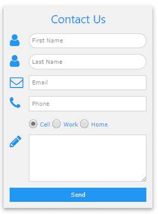
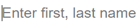
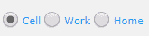
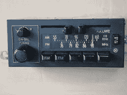
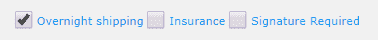
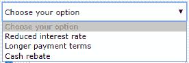

# 第十一章形式

许多网络应用程序需要从用户那里收集信息，而 HTML 提供了各种元素来将信息输入到网站中。W3。CSS 框架提供类来为这些元素创建一致的外观。

图 44 显示了一个用 W3 类格式化的示例输入表单。



图 44:示例输入表单

## 文本框

文本框用于允许用户在表单中输入自由形式的文本。基本语法如下。

代码清单 57

```
  <input type="text" class="w3-input">

```

`w3-input`类提供文本框的基本格式，提供必要的填充和边框。

|  | 注意:HTML5 除了基本的文本输入外，还引入了几种新的输入类型。支持以下类型:

*   日期:显示日期编辑器。
*   电子邮件:获取电子邮件地址。
*   数字:数字微调器。
*   范围:两个数值之间的滑块。
*   电话:获取电话号码。
*   颜色:颜色选择器。
*   日期时间-本地:输入日期/时间，不输入时区。
*   月份:选择月份和年份。
*   搜索:用于搜索的文本框。
*   时间:选择时间和上午/下午的框
*   url:期望输入看起来像 URL 的文本框。

如果浏览器不支持其中一种新类型，它将退回到文本输入。此外，许多移动设备会更改虚拟键盘以适应输入类型 |

### 文本框选项

您可以使用`w3`助手类来更改输入文本框的外观。例如，下面的代码片段在示例中生成了我们的圆角输入框。

代码清单 58

```
  <input type="text" class="w3-input
  w3-border w3-round-xxlarge" 
     name="first"
  placeholder="First Name">

```

文本输入最近的一个趋势是完全不在文本周围使用边框。您可以使用`w3-border-0`类来实现这种外观(如图 45 所示)。



图 45:无边界输入

虽然文本元素非常常见，用户也很容易理解，但是缺少对用户可以输入的内容的约束，使得代码更难处理。如果可能，使用带有约束的 HTML5 类型，并提供占位符示例，说明用户应该如何填充文本框。

## 选项按钮

选项按钮(也称为单选按钮)向用户呈现选项列表，并允许他们只选择一个。它们显示为圆形按钮，每个选项旁边都有标签。图 46 显示了示例选项按钮。



图 46:选项按钮

`w3-radio`类格式化选项按钮。下面的代码片段显示了如何创建一组按钮。

代码清单 59

```
  <input type="radio" class="w3-radio"
  name="phoneType" value="cell" checked>
  <label>Cell</label>
  <input type="radio" class="w3-radio"
  name="phoneType" value="work">
  <label>Work</label>
  <input type="radio" class="w3-radio"
  name="phoneType" value="home">
  <label>Home</label>

```

选项组内的所有元素必须具有相同的`name`属性值。这允许浏览器仅强制组中的一个项目是可选择的。

|  | 注意:选项按钮最初被称为单选按钮，因为大多数老式汽车的收音机上都有按钮，设计成当按下一个按钮时，其他按钮会自动弹出(见图 47)。许多年轻的开发人员不熟悉这个意思，因为很少有汽车仍然使用单选按钮——因此有了这个新名字，选项按钮。 |



图 47:单选按钮

## 复选框

复选框类似于选项按钮，只是用户可以选中多个。复选框的元素是正方形，以区别于选项按钮。图 48 显示了复选框在表单上的显示方式。



图 48:复选框

下面的代码创建复选框。

代码清单 60

```
  <input type="checkbox" class="w3-check" checked>
  <label>Overnight shipping</label>
  <input type="checkbox" class="w3-check" >
  <label>Insurance</label>
  <input type="checkbox" class="w3-check" >
  <label>Signature required</label>

```

`w3-check`类提供复选框的格式。

## 选择元素

如果您的选择数量相对较少，复选框和选项按钮是很好的使用元素。对于更多的选择，您应该考虑选择框。要创建盒子，您需要声明`<select>`元素包装器，然后包含`<option>`元素。下面的代码片段显示了如何设计选择列表。`w3-select`类提供格式。在下面的例子中，我们增加了一个`w3-border`类来改善盒子的外观。

代码清单 61

```
  <select
  class="w3-select w3-border" name="option">
    <option
  value= "" disabled selected>Choose your option</option>
    <option
  value= "1">Reduced interest
  rate</option>
    <option
  value= "2">Longer payment
  terms</option>
    <option
  value= "3">Cash rebate</option>
  </select>

```

图 49 显示了从这个代码片段产生的选择框。



图 49:选择框

### 添加标签

您可以使用文本或图标和图像在输入元素周围添加标签。在下面的代码片段中，我们使用`w3-row`和`w3-col`类在标签和输入元素之间分割屏幕。

代码清单 62

```
  <div class="w3-section w3-row">
    <div class="w3-col" style="width:50px;">
     <i class="w3-col fa fa-envelope-o"></i></div>
    <div class="w3-rest">
     <input
  class="w3-input w3-border" type="email"
        name="email"
  placeholder="Email address" > 
    </div>
  </div>

```

这个例子使用字体库提供了一个信封图标。您也可以使用 HTML 实体代码`&#9993;`来产生一个信封图标。

## 总结

以下类用于格式化输入元素:

*   `w3-input`:文本输入类
*   `w3-radio`:单选(选项)按钮
*   `w3-check`:复选框
*   `w3-select`:选择列表