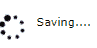

# 十二、动画

动画是一种 CSS 技术，使元素逐渐出现在网站上。明智地使用动画可以让网站看起来更友好。对大多数人来说，突然出现在我们面前的事情是惊人的，也可能是危险的。逐渐淡入的对话框可以提供一个平滑、不那么刺耳的界面。

## 制作元素动画

要激活页面上任何元素的外观，只需添加指示元素显示方式的类。动画有几个类别。

### 方向

您可以从顶部或底部，或者从两侧设置元素的动画。以下类用于方向动画:

*   `w3-animate-top`:从顶部向下滑动元素。
*   `w3-animate-bottom`:从底部向上滑动元素。
*   `w3-animate-left`:从左侧滑动元素。
*   `w3-animate-right`:从右侧滑动元素。

### 缩放

缩放动画将元素的大小从 0%逐渐增加到 100%。动画出现的时间超过十分之六秒。附加到元素的`w3-animate-zoom`类执行缩放动画。

### 不透明度

不透明度是决定元素在屏幕上显示的透明度的设置。`1`的设置是完全不透明的。较低的值会在元素上创建半透明效果。W3CSS 框架提供了两个类来激活元素的不透明度。

#### 动画不透明度

添加`w3-animate-opacity`类会产生淡入效果，元素在 1.5 秒内从完全半透明(不可见)变为不透明。您可以在模态对话框中使用这种效果来逐渐打开对话框。

#### 衰退

`w3-animate-fading`类在元素上创建淡入淡出效果，不透明度将在 1.5 秒内从 0 变为 1，然后再从 1 变为 0。

## 旋转器

`w3-spin`类使元素旋转 360 度，可用于向用户提示进程正在运行。如果你安装了 Font Awesome，有几个图标可以作为有效的微调器来指示一个进程正在运行。下面的代码片段显示了一个旋转图标。

代码清单 63

```html
  <div class="w3-section w3-row">
    <div class="w3-col" style="width:50px;">
     <i class="w3-xxlarge w3-spin fa fa-spinner"></i></div>
    <div class="w3-rest">Saving...</div>
  </div>

```

图 50 显示了屏幕(但是在网站上，旋转器会一直旋转)。



图 50:样品旋转器

|  | 提示:在 Ajax 调用期间，经常使用 Spinners 来显示正在发生的事情。但是，请确保如果出现错误，微调器将被移除。否则，用户会看到微调器仍在移动，并抱怨性能。 |

## 总结

动画可以改善网站的整体感觉，使您的弹出对话框看起来更流畅，并允许您显示处理活动。W3CSS 动画类使添加动画变得容易。

如果动画速度太快或太慢，只需调整动画所需的秒数，就可以轻松克隆基础 CSS 类并创建`w3-animate-zoom-slowly`类。如果您考虑这种方法，请确保创建一个单独的 CSS，以便在更新 W3 时不会丢失您的更改。CSS 框架。