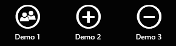
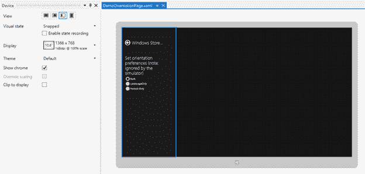
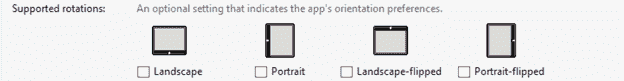

# 二、XAML、控件和页面

当 WPF 第一次发布时，它所采用的技术之一包括一种新的基于 XML 的语言，用于声明性地指定用户界面，称为可扩展应用程序标记语言(XAML，发音为“T0”zammel)。其核心是，XAML 是一种在分层对象图中声明性定义和设置属性的机制。尽管到目前为止，它的主要用途是用户界面布局——WPF、Silverlight 和 Windows Phone 7 有几种“方言”——但它也有其他用途，包括作为文档的 XML 纸张规范(XPS)的核心，以及用于设计 Windows Workflow Foundation 中使用的对象图。

对于使用创建的 Windows 商店应用程序。NET，XAML 仍然是用户界面布局和设计的主要机制。与 WPF 和 Silverlight 一样，Windows Store 应用程序中使用的 XAML 方言也有不同的特定元素。然而，了解 XAML 在前面提到的任何平台中的用户界面设计将为如何使用 XAML 构建一个 Windows Store 应用程序提供坚实的基础。

本章将首先从高层次上介绍一些基本的 XAML 概念及其在部署 Windows Store 应用程序中的应用。在这一过程中，它将引入几个新的用户界面概念和元素，这些概念和元素已经为 Windows Store 应用程序引入。最后，它将以对 Page 控件的讨论结束，该控件将包含 Windows Store 应用程序中的其他 XAML 控件，以及支持导航和布局方向的相关机制。

## 声明与 XAML 的用户界面

作为一个用户界面设计的平台，XAML 和几项相关技术相结合，能够快速开发复杂的用户体验。基于 XAML 的用户界面的主要特征之一是应用程序的用户界面布局和它的行为之间的分离，在 XAML 标记中声明的用户界面元素的布局和在中定义的用户界面元素所展示的行为。NET 代码，通过代码隐藏文件和其他机制绑定在一起。如前一章所述，用于构建 XAML 用户界面的主要工具包括 Visual Studio 和 Expression Blend。大多数 Windows 应用程序开发人员都会熟悉 Visual Studio，而 Expression Blend 更面向视觉和图形设计人员；然而，许多开发人员同时使用 Visual Studio 和 Expression Blend 来设计和构造他们的用户界面，利用了这两种 ide 的优势。虽然最初这些工具使用的布局引擎是不同的，但 Visual Studio 2012 中用于 XAML 编辑的几个视觉设计工具实际上是从 Expression Blend 中带来的。

|  | 提示:能够访问多监视器环境的经验丰富的开发人员通常在 Visual Studio 的一个监视器上打开一个项目，并且在 Expression Blend 中的相邻监视器上也打开了同一个项目，同时利用了两个 ide 的优势。事实上，在 Visual Studio 中右键单击 XAML 文件会显示一个上下文菜单，其中包含一个在 Expression Blend 中直接打开文件的命令，而 Blend 包含一个在 Visual Studio 中打开文件的上下文菜单选项。在这样做时，记住在应用程序之间移动时保存内容是很重要的，因为未保存的编辑不会自动保持同步，尽管两个 IDEs 都会检测对任何打开的文件所做的更改，并在另一个应用程序进行并保存了一些修改时提示加载新版本的文件。 |

以下标记显示了当空白`Page`元素添加到 Visual Studio 项目中时创建的基本页面:

```cs
    <Page
        x:Class="WindowsStoreAppsSuccinctly.DemoBlankPage"

        xmlns:x="http://schemas.microsoft.com/winfx/2006/xaml"
        xmlns:local="using:WindowsStoreAppsSuccinctly"
        xmlns:d="http://schemas.microsoft.com/expression/blend/2008"
        xmlns:mc="http://schemas.openxmlformats.org/markup-compatibility/2006"
        mc:Ignorable="d">

        <Grid Background="{StaticResource ApplicationPageBackgroundThemeBrush}">

        </Grid>
    </Page>

```

XAML 的这个小片段为讨论基于 XAML 的用户界面开发的几个基本概念提供了一个起点。

### 类和名称空间规范

最基本的是，XAML 示例指示 Windows 创建一个顶级`Page`控件。`x:Class`标识符表示正在创建的特定`Page`子类型应该是在`WindowsStoreAppsSuccintly`中定义的`DemoBlankPage`类的一个实例。NET 命名空间(这个类被称为“代码隐藏类”)。在设计时，从 XAML 创建了一个名为 DemoBlankPage.g.i.cs 的“半隐藏”部分类文件，其中包括用`x:Name`属性标识的任何 XAML 元素的相应字段。还创建了`InitializeComponent`方法的实现。它在类的构造函数中被调用，负责在运行时加载和解析 XAML 标记文件，创建所需对象的实例，并将前面提到的字段值设置为实际对应的用户界面元素。

|  | 注意:虽然前面对`x:Class`属性和代码隐藏类文件的描述听起来很复杂，但这通常是一个对开发人员来说相当不可见的过程。对这里发生的事情有一个高层次的了解有助于在这种连接中偶尔出现问题的情况，这通常是由于代码隐藏类被重命名或移动到一个新的命名空间而没有更新`x:Class`声明(导致编译时错误)，或者在调用`InitializeComponent`期间一些不好的标记在运行时没有被正确解析。 |

随着对`InitializeComponent`的调用，代码隐藏类将包含。NET 代码，它定义了 XAML 控件的整体行为。除了能够通过自动创建的字段访问在 XAML 用`x:Name`属性标识的任何元素之外，在标记中声明性建立的任何事件处理程序都将引用该类型中的相应方法。

在`x:Class`属性之后，标记还包括几个名称空间的声明。名称空间声明由`xmlns`标识符指定，并由 XML 用来帮助为文档中包含的内容提供范围。在 XAML 的例子中，它们提供了标记中定义的用户界面元素的来源信息，有时还消除了在不同的中定义的相似类的歧义。NET 命名空间，类似于在 C#代码中如何使用`using`关键字进行别名声明。标记示例包括根命名空间和`x`命名空间，根命名空间有`xmlns`声明，后面没有“`:alias`”术语，适用于核心 XAML 控件，而`x`命名空间标识了各种 XAML 实用程序功能。这些名称空间将出现在每个 XAML 文档中。此外，它还包括`d`和`mc`实用程序名称空间，主要用于窗口商店应用程序，以识别仅在设计时解释的项目，最常见的是提供对设计时数据的访问。该数据可用于通过模拟或实际应用数据可视化 IDEs 中的 XAML 元素。最后要提到的命名空间是`local`命名空间，它是一个自定义命名空间声明的实例。XAML 文件可以使用多个命名空间声明来为源自各种。NET 命名空间。声明一个自定义命名空间允许有问题的对象包含在 XAML 文档中，方法是用它的命名空间别名限定它。下面的标记示例显示了如何使用自定义命名空间声明来引用第三方控件——在本例中，是来自 Syncfusion 的 Essential Studio for WinRT 控件套件的`TileView`控件。

```cs
    <!-- Custom namespace declaration/alias. --> xmlns:syncfusion="using:Syncfusion.UI.Xaml.Controls.Layout"

    <!-- XAML element qualified using a custom namespace alias. --> <syncfusion:TileView>     <!-- Content omitted for brevity. --> </syncfusion:TileView>

```

|  | 注意:WPF、Silverlight 和 Windows Phone 开发人员需要注意的是，在 Windows Store 应用程序所使用的 XAML 中，用于自定义命名空间声明的语法已被更改和简化。对于 Windows 商店应用程序，语法遵循惯例`xmlns:alias="using:.NET-namespace"`，而不是旧的`xmlns:alias="clr-namespace:namespace;assembly=assembly"`语法(例如`xmlns:phone="clr-namespace:Microsoft.Phone.Controls;assembly=Microsoft.Phone"`)。这种语法上的差异是为什么在 Windows Store 应用程序和其他应用程序类型之间共享 XAML 标记而不进行修改几乎是不可能的原因之一。 |

### 资源词典和资源参考

在最初的`Page`元素声明之后，标记指定添加一个`Grid`元素。`Grid`是一个强大的控件，在基于 XAML 的用户界面中使用，提供基于行和基于列的布局，稍后将与其他几个相关控件一起详细讨论。在`Grid`声明中，其`Background`属性是使用一种称为“标记扩展”的特殊语法指定的标记扩展提供了对 XAML 的扩展，可以通过在引号中使用大括号来发现。在这种情况下，标记扩展元素引用一个`StaticResource`元素，并使用包含在基于 XAML 的用户界面中的资源系统来设置网格的背景，以使用`ApplicationPageBackgroundThemeBrush`—一个系统定义的资源来基于当前选择的桌面主题设置页面背景的标准颜色。

基于 XAML 的用户界面布局中包含的项目继承的核心基类之一是`FrameworkElement`类。从`FrameworkElement`类继承的任何元素都会公开一个返回`ResourceDictionary`引用的`Resources`属性，应用程序的根`Application`对象也是如此。资源字典中的资源条目只是一个对象实例以及指定资源名称的键。虽然最常见的是使用`x:Key`属性来指定键，但是对于隐式样式和控件模板的情况，有一个`TargetType`规范用作替代键(隐式样式和控件模板将在后面讨论)。资源可以通过 XAML 属性语法添加，也可以通过编程方式添加。以下示例显示了添加到前面显示的网格资源集合中的几种不同类型的资源。其中包括颜色定义、`Brush`和`String`定义，前者可用于使用先前定义的颜色绘制用户界面元素，后者适用于文本元素并设置其前景颜色以使用该画笔。

```cs
    <Grid Background="{StaticResource ApplicationPageBackgroundThemeBrush}">
        <Grid.Resources>
            <!-- Define a color called “ForegroundColor”. -->         <Color x:Key="ForegroundColor">#1BA1E2</Color>

            <!-- Define a brush element called “ForegroundBrush”. -->         <SolidColorBrush x:Key="ForegroundBrush"                                          Color="{StaticResource ForegroundColor}"/>

            <!-- Define an implicit style resource to be applied to TextBlock elements. -->         <Style TargetType="TextBlock">
                <Setter Property="FontSize" Value="32"/>
                <Setter Property="Foreground" Value="{StaticResource ForegroundBrush}"/>
            </Style>

            <!-- Define a String resource. -->         <x:String x:Key="Sample">Hello World</x:String>
         </Grid.Resources>
        <TextBlock Text="{StaticResource Sample}"/>
    </Grid>

```

一旦定义了资源，XAML 用来查找其值的过程是递归的，因此当从 XAML 元素中引用资源时，资源管理系统会搜索该项目的父元素，直到在元素的资源集合中找到第一个匹配项。这个遍历还将包括`Application`对象的资源，以及平台定义的资源的特殊集合。短语“第一次匹配”的使用是经过深思熟虑的——在层次结构中较高层定义的资源可以在较低层被覆盖，从而允许定制。从前面的例子中可以看出，XAML 的资源查找是通过`StaticResource`标记扩展进行的。此外，可以在任何给定的`ResourceDictionary`属性上使用索引器以编程方式检索资源；但是，这种编程查找只包括当前项。它不像`StaticResource`标记扩展那样使用相同的父遍历。

除了在描述的位置中定义的资源，XAML 还允许定义和包含独立的资源字典文件，这些文件包含已定义资源的集合。这些字典可以通过`MergedDictionary`元素与现有的`ResourceDictionary`合并。使用除空白应用程序模板之外的 Visual Studio 模板创建的 Windows Store 应用程序项目包括一个 StandardStyles.xaml 资源字典文件，该文件定义了几十个用于 Windows Store 应用程序的布局相关资源。该文件作为`Merged Dictionary`引入到**应用程序. xaml** 文件中:

```cs
    <Application.Resources>
        <ResourceDictionary>
            <ResourceDictionary.MergedDictionaries>
                <!--
                    Styles that define common aspects of the platform look and feel
                    required by Visual Studio project and item templates.
                 -->
                <ResourceDictionary Source="Common/StandardStyles.xaml"/>
            </ResourceDictionary.MergedDictionaries>
            <!-- Application-specific resources. -->
            <x:String x:Key="AppName">Windows Store apps Succinctly</x:String>
        </ResourceDictionary>
    </Application.Resources>

```

|  | 提示:表达式混合包括一个“资源”面板(通常是集成开发环境右侧的一个选项卡，与“属性”选项卡相邻)，它显示在 XAML 项目中定义的资源的可视化表示。Visual Studio 和 Blend 还包括通过图形用户界面为属性分配资源值的功能，方法是在支持资源值的属性面板中选择与值相邻的小方块，并选择本地资源查看适用的本地定义资源列表或系统资源以查看适用的平台资源。此外，通过选择“转换为新资源”菜单选项，可以将本地选择的属性“升级”到资源。 |

### 属性和事件

在 XAML 元素中，属性在 XML 中用于设置声明对象的属性。在 XML 中设置的值被简单地分配给目标属性。如果目标属性实际上不是`String`类型(例如，指定大小的数值或枚举的成员)，XAML 解析器会使用一些称为类型转换器的辅助对象，将标记中声明的文本值转换为适当的类型。对于无法转换或需要设置为更复杂的对象值的属性，XAML 提供了一种属性元素语法，允许将嵌套的 XML 元素用作属性值。这种语法可以通过将要赋值的值嵌套在一个附加的 XML 元素中来使用，其形式为`ParentType.PropertyName`。下面的代码显示了具有简单和复杂值的`Grid`元素的`Background`属性。在第一种情况下，`“Blue”`值隐式转换为`SolidColorBrush`，其`Color`值设置为`Windows.UI.Colors`枚举的`Blue`颜色成员。在第二种情况下，属性被设置为`LinearGradientBrush`，它定义了指定子值之间的渐变颜色，在该画笔中，`GradientStops`集合被设置为一组离散的`GradientStop`值:

```cs
    <!-- Grid with a simple property setter. -->
    <Grid Background="Blue"/>

    <!-- Grid with a complex property setter using property-element syntax.-->
    <Grid>
        <Grid.Background>
            <LinearGradientBrush>
                <LinearGradientBrush.GradientStops>
                    <GradientStop Offset="0" Color="Orange"/>
                    <GradientStop Offset="1" Color="Blue"/>
                </LinearGradientBrush.GradientStops>
            </LinearGradientBrush>
        </Grid.Background>
    </Grid>

```

除了设置属性值，XAML 还可用于将事件处理程序附加到标记中声明的对象。要创建这样的连接，需要在相关的代码隐藏类中定义具有正确参数结构的处理程序方法。该方法的名称被分配给标记中所需的事件名称，就像简单的属性分配一样。下面的代码设置`Button_Click_1`方法来处理`Button`控件上的`Click`事件:

```cs
    <!-- Button with a simple property setter and a listener for the Click event. -->
    <Button Content="Click Me" Click="Button_Click_1"/>
     // The related event handler in the code-behind file.
    private void Button_Click_1(object sender, RoutedEventArgs e)
    {
        // Code omitted for brevity.
    }

```

|  | 注意:在本例中，目标函数是由 Visual Studio 自动创建的，这是通过键入事件名称后跟等号并选择出现在 Visual Studio XAML 编辑器中的<new event="" handler="">上下文菜单条目来实现的。或者，双击属性面板的事件列表中的事件名称旁边的文本框也可以用来自动生成一个事件处理程序方法，该方法连接到标记中的事件。</new> |

### 依赖属性和附加属性

几乎每一个可以用来在 XAML 标记中包含用户界面元素的元素最终都继承自`DependencyObject`类。这个类是一个特殊属性框架的核心，它支持 XAML 用户界面中的一些高级布局和交互功能。使用此框架定义的属性称为依赖属性。依赖属性可以像普通属性一样被读取和设置，但是它们也带来了几个重要的特性，包括:

*   内置属性更改通知，允许这些属性参与数据绑定，这将在稍后讨论。
*   分层值解析，允许这些属性在任何给定时间在内部保存值的层次结构，并使用一组优先规则来确定返回哪一个。
*   设置默认值和更改属性使用的回调函数的能力。

声明依赖属性的第一步是创建一个静态`DependencyProperty`对象，该对象包含属性的配置信息，并向依赖属性系统注册新属性。该声明还可以为属性提供一个可选的默认值，并提供一个可选的回调函数，以便在属性的值更改时调用。一旦定义了静态`DependencyProperty`对象，就可以使用`DependencyObject` `GetValue`和`SetValue`方法声明一个使用`DependencyProperty`作为其后备存储的常规属性。下面的代码显示了一个名为`SampleDependencyProperty`的依赖属性被注册并公开为实例属性:

```cs
    // Using a DependencyProperty as the backing store for SampleDependencyProperty.
    // This enables animation, styling, binding, etc...
    public static readonly DependencyProperty SampleDependencyPropertyProperty =
        DependencyProperty.Register(
        "SampleDependencyProperty",
        typeof(Int32),
        typeof(DemoBlankPage),
        new PropertyMetadata(0, changeCallback));

    // The public property backed by a value registered in the dependency property system.
    public Int32 SampleDependencyProperty
    {
        get { return (Int32)GetValue(SampleDependencyPropertyProperty); }
        set { SetValue(SampleDependencyPropertyProperty, value); }
    }

```

|  | 注意:避免在公共属性 getter 和 setter 中包含任何附加代码是很重要的。在几种情况下。NET 绕过这个特定的属性声明，直接使用已注册的依赖属性，因此将跳过包含的任何特殊逻辑。如果需要在属性集计算中包含特殊逻辑，则应在定义和注册依赖属性时提供属性更改回调值。 |

可以定义标准依赖属性的专门化，称为附加属性。附加属性允许一个类在不同类中实际定义的属性上设置属性值，从而有效地将外部定义的属性“附加”到该类。附加属性的示例有`Grid.Row`和`Grid.Column`属性，它们可以在网格中包含的对象上设置，以指示它应该位于网格中的什么位置，如以下代码所示:

```cs
    <Grid>
        <!-- Element with the grid row and column attached properties set.-->
        <TextBlock Grid.Row="0" Grid.Column="0" Text="Hello World"/>
    </Grid>

```

请注意，在这种情况下，`TextBlock`元素有一些值被设置为它应该位于其父网格中的什么位置，但是这是在没有向`TextBlock`类型显式添加网格特定属性的情况下完成的。

除了使用`RegisterAttached`方法代替`Register`方法之外，附加属性的定义方式与依赖属性的定义方式非常相似。此外，通常包括静态方法，以便于从提供的`DependencyObject`设置和检索附加属性值。

```cs
    // Using a DependencyProperty as the backing store for MyAttachedProperty.
    // This enables animation, styling, binding, etc...
    public static readonly DependencyProperty MyAttachedPropertyProperty =
        DependencyProperty.RegisterAttached(
        "MyAttachedProperty",
        typeof(Int32),
        typeof(DemoClass),
        new PropertyMetadata(0, changeCallback));

    public static Int32 GetMyAttachedProperty(DependencyObject obj)
    {
        return (Int32)obj.GetValue(MyAttachedPropertyProperty);
    }

    public static void SetMyAttachedProperty(DependencyObject obj, Int32 value)
    {
        obj.SetValue(MyAttachedPropertyProperty, value);
    }       

```

### 动画

XAML 用户界面还具有一流的动画支持。动画随着时间的推移对依赖属性值进行更改，并在称为故事板的容器对象中进行协调。动画利用了前面提到的依赖属性分层值解析机制。当动画应用于用户界面中的元素时，它在目标依赖关系属性上设置的结束状态值仅在动画运行时应用。该属性在内部保留其原始值加上一些其他可能的值，当应用的动画停止或移除时，属性值层次结构将恢复为返回动画前的值。这种行为对于在显示视图改变时更新应用程序布局特别有价值，这将在本章后面讨论。

动画有两种基本类型:基于插值的动画和基于关键帧的动画。插值动画在动画持续时间内逐渐将变化线性应用于动画影响的值。关键帧动画在动画时间跨度内以离散的时间间隔标识值。当动画到达关键帧目标时间时，应用新值，而不使用任何中间值。插值动画包括`ColorAnimation`、`DoubleAnimation`和`PointAnimation`类型，可分别应用于颜色、双值和点值。关键帧动画类型包括`ColorAnimationUsingKeyFrames`、`DoubleAnimationsUsingKeyFrames`、`PointAnimationUsingKeyFrames`和新增的`ObjectAnimationUsingKeyFrames`。虽然前三个应用于与其对应的插值动画相同的类型，但是`ObjectAnimationUsingKeyFrames`可以用于将关键帧动画应用于还没有专门动画类的对象。

动画上设置的主要属性包括受影响的属性、动画的持续时间，以及动画时间过去时受影响的属性应该具有的目标值，或者在关键帧的情况下，当达到目标关键帧时间时受影响的属性应该具有的目标值。以下故事板将矩形缩放到其原始高度和宽度的 50%，并逐渐将其内容变成红色:

```cs
    <Storyboard x:Name="DemoStoryboard">
           <DoubleAnimation Duration="0:0:2" To="0.5"               Storyboard.TargetName="Rectangle"               Storyboard.TargetProperty=                      "(UIElement.RenderTransform).(CompositeTransform.ScaleX)"/>
           <DoubleAnimation Duration="0:0:2" To="0.5"               Storyboard.TargetName="Rectangle"               Storyboard.TargetProperty=                      "(UIElement.RenderTransform).(CompositeTransform.ScaleY)"/>
           <ColorAnimation Duration="0:0:2" To="Red"               Storyboard.TargetName="Rectangle"               Storyboard.TargetProperty=                      "(Shape.Fill).(SolidColorBrush.Color)"/>
    </Storyboard>

```

为了帮助在动画制作过程中提供更自然或有趣的过渡，提供了一组“放松功能”，这些功能可以附加到动画中以提供额外的效果。关于放松功能的更多信息以及在 Windows Store 应用程序中应用动画的其他内容可在[http://msdn . Microsoft . com/en-us/library/Windows/apps/xaml/hh 452701 . aspx](http://msdn.microsoft.com/en-us/library/windows/apps/xaml/hh452701.aspx)上找到。

|  | 注意:手动创建大多数动画所需的标记可能是乏味且容易出错的。幸运的是，Expression Blend 提供了一套强大的工具来可视化地探索、实现和管理动画和故事板。 |

一旦定义了动画，就可以通过调用`Storyboard` `Begin`方法以编程方式触发。Windows 商店应用程序中的动画是“独立的动画”它们独立于主用户界面线程运行，因此不应受到动画运行时应用程序在该线程上所做工作的负面影响。当动画结束时，它将保持其值(默认值)或停止，这取决于其`FillBehavior`属性的值。如前所述，当动画停止或移除时，被动画化的属性将恢复到受影响的依赖关系属性所维护的层次结构中的下一个值。可以通过调用`Storyboard` `Stop`方法以编程方式停止动画。最后，`Storyboard`对象还会暴露一个`Completed`事件，该事件在动画完成时引发。

下面的代码显示了响应按钮点击事件和订阅`Storyboard` `Completed`事件以编程方式启动或停止的动画:

```cs
    // Locate the storyboard as a resource on the page object.
    var storyboard = (Storyboard)this.Resources["DemoStoryboard"];

    // Subscribe to the storyboard completed event.
    storyboard.Completed += OnStoryboardCompleted;
    // Note: Code to only subscribe to the event once omitted for brevity.

    // If the storyboard is stopped, start it. Otherwise, stop it.
    if (storyboard.GetCurrentState() == ClockState.Stopped)
    {
        storyboard.Begin();
    }
    else
    {
        storyboard.Stop();
    }

```

#### 主题过渡和动画

除了创建和触发自定义动画之外，窗口商店应用程序还可以访问内置的动画库，其中包括已经在整个窗口用户界面中使用的各种预打包动画。通过主题过渡或主题动画提供对这些预构建动画的访问。

主题转换

当在 Windows Store 应用程序的控件上定义主题转换时，主题转换会自动触发以响应某些用户界面更改，包括在应用转换的元素中添加或移除项目，或者在该元素中更新子项目位置和大小。要记住的主题过渡的关键方面是，一旦在一个项目上定义，它们包含的动画就被绑定到一组特定的触发器，并且在这些触发事件发生时自动应用。

有几个元素通过提供可以定义转换的属性来处理主题转换。其中包括:

*   `UIElement` `Transitions`属性。定义的转换适用于当前控件。
*   `Panel` `ChildrenTransitions`属性。定义的过渡适用于面板的所有内容项目(子项目)。
*   `ItemsControl` `ItemContainerTransitions`属性。定义的转换适用于在“项目”控件中生成的项目。
*   `ContentControl` `ContentTransitions`属性。定义的转换适用于控件中包含的内容。
*   `Popup` `ChildTransitions`属性。定义的转换适用于弹出控件的子元素。

这些属性接受`TransitionCollection`类的一个实例，该实例本身可以包含一个或多个以下过渡项，具体取决于上下文:

*   `AddDeleteThemeTransition`:在面板中添加或删除内容时使用。
*   `ContentThemeTransition`:当内容控件的内容发生变化时应用。
*   `EdgeUIThemeTransition`:应用于从用户界面边缘动画显示项目的外观。
*   `EntranceThemeTransition`:适用控件首次出现时应用。
*   `PaneThemeTransition`:用于从用户界面边缘设置面板外观的动画。
*   `PopupThemeTransition`:当项目被添加到集合中时，它们会弹出到视图中。
*   `ReorderThemeTransition`:当物料控制订单中的物料发生变化时应用。
*   `RepositionThemeTransition`:当物品位置发生变化时应用。

在下面的 XAML 标记中，一个`StackPanel`被配置成当新的项目被添加到它的`Children`集合中时，一个动画被应用，从面板的底部移动项目。

```cs
    <!-- Animate new content being added by scrolling content from the bottom. -->
    <StackPanel x:Name="ThemeTransitionPanel">
        <StackPanel.ChildrenTransitions>
            <TransitionCollection>
                <PopupThemeTransition/>
            </TransitionCollection>
        </StackPanel.ChildrenTransitions>
    </StackPanel>

```

**主题动画**

主题动画类似于主题过渡，因为它们定义了标准动画，但它们不会将它们附加到任何特定的触发器。主题动画需要包含在`Storyboard`中，否则之前描述的自定义动画之一将是。主题动画还必须定义一个`TargetName`属性来标识它们将应用到的元素，以及可能设置动画特征的附加属性。应用程序可以调用动画，如前一个示例所示，或者通过可视状态管理器调用动画，这将在下面讨论。动画库中包含的主题动画包括:

*   `DragItemThemeAnimation`、`DragOverThemeAnimation`、`DropTargetItemThemeAnimation`:用于提供拖拽事件的动画。
*   `FadeInThemeAnimation`、`FadeOutThemeAnimation`:用于淡入淡出物品。
*   `PointerDownThemeAnimation`、`PointerUpThemeAnimation`:用于对触摸和基于鼠标的指针与元素的交互做出反应
*   `PopInThemeAnimation`、`PopOutThemeAnimation`:用于使项目在 UI 中弹出和弹出。
*   `RepositionThemeAnimation`:用于在屏幕上重新定位元素
*   `SplitOpenThemeAnimation`、`SplitCloseThemeAnimation`:用于应用分裂效果。
*   `SwipeBackThemeAnimation`:用于滑动交互后将项目滑回原位。
*   `SwipeHintThemeAnimation` `:`用于表示某个项目可以响应扫动手势。

### 视觉状态管理器

视觉状态管理器(VSM)是大多数基于 XAML 的用户界面框架可用的机制，它允许为控件定义一组命名的视觉状态。对于每个状态，可以定义当控件进入状态时影响控件各种元素外观的行为。

`VisualState`值在命名的`VisualStateGroup`元素中定义，其中`VisualStateGroup`包含一组互斥的视觉状态。在任何给定时间，控件只能处于任何组中的一种状态。虽然来自几个不同组的状态可能会同时应用于一个控件，但在不同组中定义的两个或多个状态不应修改同一属性，这一点很重要。如果他们这样做了，结果将是不可预测的，至于这些多个应用程序将如何影响控制。例如，如果 A 组中的状态 1 将控件的`Visibility`设置为`Collapsed`，而 B 组中的状态 2 将同一控件的`Visibility`设置为`Visible`，则当同时应用状态 A1 和状态 B2 时，不清楚哪个`Visibility`值应该“获胜”通过使用`VisualStateManager.VisualStateGroups`附加属性为控件定义视觉状态组。

给定`VisualState`值对用户界面元素所做的更改被指定为包含在`Storyboard`中的一组动画。下面的 XAML 举例说明了为控件定义的示例`VisualStateGroup`，该控件包括两个状态:`Normal`和`Abnormal`。当控件进入`Abnormal`状态时，一个名为`DemoButton`的控件被定位，其背景被设置为`Purple`。当控件离开`Abnormal`状态时，控件的背景被重置为其原始颜色。

```cs
    <VisualStateManager.VisualStateGroups>
        <!-- Define a state group called DemoStates. -->
        <VisualStateGroup x:Name="DemoStates">
            <!-- DemoStates has 2 states: Normal and Abnormal. -->
            <VisualState x:Name="Normal"/>
            <!-- In the Abnormal state, the DemoButton control turns purple. -->
            <VisualState x:Name="Abnormal">
                <Storyboard>
                    <ObjectAnimationUsingKeyFrames Storyboard.TargetName="DemoButton"
                                                   Storyboard.TargetProperty="Background">
                        <DiscreteObjectKeyFrame KeyTime="0" Value="Purple"/>
                    </ObjectAnimationUsingKeyFrames>
                </Storyboard>
            </VisualState>
        </VisualStateGroup>
    </VisualStateManager.VisualStateGroups>

```

作为某些应用程序逻辑的结果，通过调用`VisualStateManager`静态`GoToState`方法，控件被置于可视状态。此方法被赋予对应该应用状态的控件的引用，以及被告知要输入的状态的名称。`Boolean`值表示是否应该应用任何定义的状态转换作为调用的结果。

```cs
    // Tell the control to enter the Normal state.
    VisualStateManager.GoToState(control, "Normal", false);

    // Tell the control to enter the Abnormal state.
    VisualStateManager.GoToState(control, "Abnormal", false);

```

除了用于提供控件状态和外观之间的逻辑抽象之外，视觉状态和 VSM 在响应 Windows Store 应用程序中的设备布局和方向变化方面也发挥着重要作用。这一概念将在本章后面更详细地讨论。

### 风格

为了在整个应用程序中提供一致的外观和感觉，必须在标记中重复指定相同的属性值，这可能是一个乏味且容易出错的过程。幸运的是，基于 XAML 的用户界面可以利用样式来组织和重用格式值。基本上，样式是可以在一次调用中应用于元素的属性值的集合。这在概念上类似于在 HTML 页面布局中如何使用 CSS 条目。

样式是在元素的资源字典、应用程序的资源字典或合并字典的标记中定义的。样式中的值使用一个或多个`Setter`元素设置，其中每个`Setter`用于指定命名属性的所需值。请注意，所设置的值可以是简单的并用字符串定义的值，也可以是使用前面在`Setter.Value`元素中描述的属性元素语法表达的复杂值。

样式可以是显式的，也可以是隐式的。所有样式都需要一个`TargetType`属性来设置它们将应用到的对象类型的名称。显式样式用特定的键标识符声明，并通过设置元素的`Style`属性来定位特定的名为`Style`的资源，从而应用于元素。下面的示例显示了一组按钮，这些按钮使用了它们所在网格的资源集合中定义的样式。请注意，可以在应用样式的对象中选择性地重写单个样式属性，如下面代码中第二个按钮的背景所示:

```cs
    <Grid>
        <Grid.Resources>
            <!-- Style defined on a button to specify the background color and width. -->
            <Style x:Key="ButtonStyle" TargetType="Button">
                <Setter Property="Background" Value="Blue"/>
                <Setter Property="Width" Value="250"/>
            </Style>
        </Grid.Resources>
        <StackPanel>
            <Button Content="Style Applied As-Is"
                    Style="{StaticResource ButtonStyle}"/>
            <Button Content="Style Applied and Modified"
                    Style="{StaticResource ButtonStyle}"
                    Background="Orange"/>
        </StackPanel>
    </Grid>

```

隐式样式是通过省略`x:Key`标识符创建的，取而代之的是，它们只包括`TargetType`名称。当以这种方式定义样式时，作为定义样式的元素的后代出现的指示类型的任何元素将自动应用该特定样式。在下面的代码中，前面的示例已经被更新为包含一个隐式样式，并且一个新的按钮已经被添加到显示中，该按钮隐式地选择新的样式。请注意，显式设置了样式属性的按钮不会获取隐式样式声明中设置的值。

```cs
    <Grid>
        <Grid.Resources>
            <!-- Style defined on a button to specify the background color and width. -->
            <Style x:Key="ButtonStyle" TargetType="Button">
                <Setter Property="Background" Value="Blue"/>
                <Setter Property="Width" Value="250"/>
            </Style>
            <!-- Implicit style defined on a button to specify the foreground color. -->
            <Style TargetType="Button" BasedOn="{StaticResource ButtonStyle}">
                <Setter Property="Foreground" Value="Black"/>
            </Style>
        </Grid.Resources>
        <StackPanel>
            <Button Content="Style Applied As-Is"
                    Style="{StaticResource ButtonStyle}"/>
            <Button Content="Style Applied and Modified"
                    Style="{StaticResource ButtonStyle}"
                    Background="Orange"/>
            <Button Content="Implicitly Applied Style"/>
        </StackPanel>
    </Grid>

```

请注意，在新示例中，隐式样式包含一个`BasedOn`属性。样式定义支持继承，其中一种样式的定义可以基于另一种样式的定义。样式不能隐式继承，但是显式样式可以通过使用这个`BasedOn`属性来继承。

|  | 提示:如前所述，标准样式. xaml 资源字典包含在使用 Visual Studio 模板而不是空白应用程序模板创建的 Windows Store 应用程序项目中。StandardStyles.xaml 定义了几十种可以应用于 Windows Store 应用程序中元素的样式，以便为它们提供符合微软用户界面设计风格的标准外观和感觉。 |

基于 XAML 的用户界面控件的一个重要原则是控件“无外观”的思想无外观的概念基本上意味着控件实际上是由其功能定义的，而不是用于展示该功能的视觉元素——按钮是一个可以单击的界面元素，无论它是矩形还是圆形轮廓，当用户用手指或鼠标与它交互时都会移动。在 XAML 控件中提供外观和功能分离的机制是控件模板。控件的控件模板实际上是描述控件外观和内容的独立 XAML 标记块。

使用控制模板是一个高级主题，它的进一步讨论超出了本书的范围，但是这里提到控制模板有两个原因。首先，控制模板通常通过应用定义了更新模板的样式来管理。其次，StandardStyles 字典包括几个标准控件模板被覆盖的例子，理解为什么这样做是可取的，可以让有兴趣更仔细地了解 StandardStyles 字典中的自定义样式是如何定义的开发人员有所了解。

|  | 提示:使用控件模板是 Expression Blend 擅长的另一个领域。表达式混合提供了提取控件模板的能力，以便将其用作修订的基础，还提供了几个可视化工具，用于在控件、样式和模板的层次结构之间导航。虽然 Visual Studio 2012 中包含了一些用于处理控件模板的高级功能，这些功能过去是 Expression Blend 独有的，但是 Blend 仍然保留了更完整的功能集。 |

### 数据绑定

数据绑定是一种连接一个对象(通常是用户界面对象)的属性的技术的名称，它将自动从另一个对象获取其值，并将其值设置为另一个对象的不同属性，或者偶尔设置为同一对象的另一个属性。基于 XAML 的用户界面通常利用标记中声明的数据绑定，并将从`FrameworkElement`(目标)派生的元素的依赖属性连接到将从中检索数据的某个对象(源)的属性。用于建立和管理该连接的类型是`Binding`类。数据绑定的使用简化并消除了大量的样板事件处理和属性设置代码，这些代码通常是来回传递数据值所必需的。删除这些代码还有助于利用基于 XAML 的用户界面实现在用户界面布局和设计以及用户界面要显示的数据和业务逻辑之间提供的自然分离。

在讨论可用于配置数据绑定的机制和选项之前，需要讨论数据上下文的概念。从`FrameworkElement`类派生的任何元素都会继承一个`DataContext`属性。在 XAML 布局中，`DataContext`值是继承的-子元素继承其父元素的`DataContext`，直到指定新值，该值从该点开始沿元素树向下传播，直到被覆盖或元素树用完。为了说明这个概念，在下面的简单标记的情况下，如果页面的`DataContext`被设置为如图所示的`Person`类的实例，那么`Grid`元素的数据上下文是相同的`Person`对象，就像`Button`元素的数据上下文一样。

```cs
    <!-- The Page’s XAML markup. --> <Page
        x:Class="WindowsStoreAppsSuccinctly.DemoBlankPage"

        xmlns:x="http://schemas.microsoft.com/winfx/2006/xaml"
        xmlns:local="using:WindowsStoreAppsSuccinctly"
        xmlns:d="http://schemas.microsoft.com/expression/blend/2008"
        xmlns:mc="http://schemas.openxmlformats.org/markup-compatibility/2006"
        xmlns:sys="system."
        mc:Ignorable="d">
        <!-- The Grid inherits the Page’s data context. -->
        <Grid>
            <!-- The Button inherits the Grid’s data context. -->
            <Button/>
        </Grid>
    </Page>

    // Content from the Page’s code-behind file.
    public DemoBlankPage()
    {
        this.InitializeComponent();
        this.DataContext = new Person
        {
            LastName = "Garland",
            FirstName = "John",
            IsEditable = true
        };
    }

```

之所以提出数据上下文的概念，是因为除非另有说明，否则数据绑定声明使用元素的数据上下文作为源数据来提供信息。要为 XAML 的属性指定数据绑定值，请使用绑定标记扩展。一个简单的绑定声明将采用语法`<TextBlock Text="{Binding LastName}"/>`，其中`TextBlock`元素的`Text`属性(要在用户界面中显示的文本)显示当前数据上下文中对象的`LastName`属性的值。在这种情况下，如果`LastName`属性或者是依赖属性，或者是通过实现`INotifyPropertyChanged`接口参与属性更改通知的类中的属性，对`LastName`属性的更改将反映在`TextBlock`中。

|  | 注意:`INotifyPropertyChanged`界面应该是大多数人都熟悉的。NET 开发人员作为提供属性更改通知的机制。该接口需要实现一个项目-`PropertyChanged`事件，该事件在引发时包括被更改的属性的名称。下面是一个实现`INotifyPropertyChanged`的`Person`类的简单例子。`CallerMemberNameAttribute`值得注意的是介绍用。NET 4.5 通过消除在函数调用中显式提供属性名称的需要，简化了对实际引发事件的帮助器方法的调用。 |

```cs
    // Utility class to demonstrate data context and binding concepts.
    public class Person : INotifyPropertyChanged
    {
        private String _firstName;
        public String FirstName
        {
            get { return _firstName; }
            set
            {
                _firstName = value;
                OnPropertyChanged();
            }
        }

        private String _lastName;
        public String LastName
        {
            get { return _lastName; }
            set
            {
                _lastName = value;
                OnPropertyChanged();
            }
        }

        private Boolean _isEditable;
        public Boolean IsEditable
        {
            get { return _isEditable; }
            set
            {
                _isEditable = value;
                OnPropertyChanged();
            }
        }

        public event PropertyChangedEventHandler PropertyChanged = delegate { };
        private void OnPropertyChanged([CallerMemberName]String caller = null)
        {
            PropertyChanged(this, new PropertyChangedEventArgs(caller));
        }
    }

```

虽然本示例中指定的语法是用于数据绑定的最简单的语法，但是在绑定数据时还可以指定其他几个属性。其中包括:

*   `Mode`:指定`BindingMode`枚举的成员，其中包括`OneTime`用于仅应用一次数据的绑定，`OneWay`用于目标仅从源接收数据的绑定，以及`TwoWay`用于变化双向流动的绑定。
*   `ElementName`:用于指定当前 XAML 中的一个元素，该元素可以代替当前数据上下文作为数据源。
*   `Source`:指定一个特定的对象，通常是静态资源，用作绑定的对象。
*   `RelativeSource`:值`Self`表示目标元素是数据绑定的源，这对于将同一元素上的属性值相互绑定很有用。`TemplatedParent`值指示绑定使用应用控件模板的控件作为绑定数据源。
*   `Path`:指定绑定应该连接到的数据上下文、元素、源或相对源项中的属性名。`<TextBlock Text="{Binding LastName}"/>`的例子相当于`<TextBlock Text="{Binding Path=LastName}"/>`。`If no path value is provided,`返回数据上下文、元素、源或相对源引用的整个对象。路径可以包括额外的符号来指示嵌套属性、附加属性以及基于整数和字符串的索引器。
*   `Converter`、`ConverterParameter`和`ConverterLanguage`:用于指定绑定要使用的值转换器和相关属性。价值转换器将很快讨论。

在某些情况下，作为数据绑定源的对象所提供的值对于它们所绑定到的目标属性来说不是合适的类型。这种不匹配的一个经典示例是，绑定对象公开了一个`Boolean`属性，但目标属性是用于在基于 XAML 的用户界面中显示或隐藏用户界面元素的`Visibility`枚举(有两个值:`Hidden`和`Visible`)的成员。为了帮助处理这类不匹配，绑定系统支持使用值转换器。

值转换器是实现`IValueConverter`接口的类型。该界面指定了`Convert`和`ConvertBack`两种方法，可用于从源数据类型转换到目标类型，反之亦然。对于前面描述的`Boolean` / `Visibility`情况，基于 Visual Studio 提供的模板而不是空白应用程序模板的项目提供了`BooleanToVisibilityConverter`类的实现，定义如下:

```cs
    /// <summary>
    /// Value converter that translates true to <see cref="Visibility.Visible"/>
    /// and false to <see cref="Visibility.Collapsed"/>.
    /// </summary>
    public sealed class BooleanToVisibilityConverter : IValueConverter
    {
        public object Convert(object value, Type targetType, object parameter,
                                                                           string language)
        {
            return (value is bool && (bool)value)
                ? Visibility.Visible
                : Visibility.Collapsed;
        }

        public object ConvertBack(object value, Type targetType, object parameter,
                                                                           string language)
        {
            return value is Visibility && (Visibility)value == Visibility.Visible;
        }
    }

```

这个实现只是在`Boolean`值和`Visibility`枚举的相应成员之间进行转换。

值转换器还可以选择性地接收指定转换要考虑的语言的参数，以及可用于提供一些其他附加信息的任意参数。

转换器被指定为打算使用它们的绑定表达式中引用的资源。以下标记显示了使用值转换器在绑定到`CheckBox`的`Person`对象上的`Boolean` `IsEditable`属性和允许编辑该人的`LastName`属性的`TextBox`可见性之间进行转换:

```cs
    <StackPanel Orientation="Horizontal">
        <StackPanel.Resources>
            <common:BooleanToVisibilityConverter x:Key="BoolConverter"/>
        </StackPanel.Resources>
        <CheckBox Content="Is Editable" IsChecked="{Binding IsEditable, Mode=TwoWay}"/>
        <TextBlock Text="Last Name: " VerticalAlignment="Center" Margin="0,10,10,10"/>
        <TextBox Text="{Binding LastName, Mode=TwoWay}"
             Visibility="{Binding  IsEditable, Converter={StaticResource BoolConverter}}"/>
    </StackPanel>
    </StackPanel>

```

### 添加内容

到目前为止，XAML 的例子包括了几种不同的物品，但没有必要解释它们各自的目的和用途。本节将介绍几种不同类别的控件，这些控件可以包含在基于 XAML 的用户界面中，并对几种最常见控件的优势和用途进行高级解释。

除了开箱即用的控件之外，开发人员还可以选择创建新控件——或者通过组合现有控件并提供代码来公开它们的特定行为，或者通过从头开始以编程方式创建新控件这一复杂得多的任务。除了开发人员创建的自定义控件之外，微软还在各种可下载的软件开发工具包中为 Windows Store 应用程序提供了各种专门的控件。此外，第三方工具制造商已经为可以购买的 Windows Store 应用程序提供了许多独特且有用的控件，并且在许多情况下，这些工具包括用于评估其提供的功能的试用模式。

|  | 注:作为一个例子，本章已经提到了 Syncfusion 出售的 WinRT XAML 控制套件的 Essential Studio，该公司也恰好是这本书的出版商。关于该控制套件的更多信息可在[http://www.syncfusion.com/products/winrt](http://www.syncfusion.com/products/winrt)获得。 |

#### 布局面板

要考虑的第一组控件是那些旨在包含和布局其他控件的控件。开发人员为视窗商店应用程序设计用户界面的大部分工作发生在`Page`元素中。但是，`Page`元素只能包含一个内容元素。在极少数情况下，一个页面只需要显示一个元素，这将非常容易处理。然而，大多数时候开发人员会希望在页面上包含各种元素，对于元素应该如何相对于彼此定位以及屏幕方向和大小的变化应该如何反映在该布局中有不同的需求。为了满足这些需求，视窗商店应用程序可以利用几种不同的面板元素，包括`Grid`、`StackPanel`和`Canvas`。本节还将考虑几个特殊的面板控件，这些控件可用于向用户显示项目列表的控件中:`WrapGrid`和`VariableSizedWrapGrid`。

**网格**

`Grid`可能是使用最广泛、用途最广泛的布局面板。网格可以配置许多行和列，其他用户界面元素可以放入其中。项目在网格中的放置主要通过使用`Grid.Row`和`Grid.Column`附加属性来管理，尽管还有一些其他属性可以应用来影响布局。网格中的行高和列宽可以设置为固定的点大小，根据它们包含的内容自动调整大小，或者设置为一种称为“星形大小”的符号，这种符号允许进行一种动态的、成比例的大小调整。星形大小之所以如此命名，是因为它是通过使用星号和可选的乘数值来表示的。如果省略了显式值，则使用乘数 1 作为默认值。

星形尺寸的表现如下:

*   对于星形大小的行或列，确定网格在该方向(水平或垂直)的总可用大小。
*   给定方向上的恒星总数是通过对这些行或列的乘数求和来计算的。
*   单颗恒星的大小是用可用的大小除以恒星的数量计算出来的。
*   每列的宽度由单星大小乘以其乘数决定。

下面的 XAML 说明了这种关系。它定义了一个有两行四列的 800 点宽的网格。第一列设置为固定宽度。第二个会根据其内容的大小自动调整大小。第三和第四列分别设置为 1 星和 3 星大小。如注释中所示，第二列的大小为 75 磅，这是由于该列的目标内容中调用的大小。根据 1 星和 3 星的大小，第三和第四颗星的大小分别为 150 和 450 点。

```cs
    <Grid Width="800">
        <Grid.RowDefinitions>
            <RowDefinition Height="Auto"/>
            <RowDefinition Height="Auto"/>
        </Grid.RowDefinitions>
        <Grid.ColumnDefinitions>
            <!-- Explicitly set to 125 points wide. -->
            <ColumnDefinition Width="125"/>
            <!-- Set to 75 points wide because of contents’ size. -->
            <ColumnDefinition Width="Auto"/>
            <!-- 150 points wide = (800-(125+75))/(1+3) x 1 star. -->
            <ColumnDefinition Width="*"/>
            <!-- 450 points wide = (800-(125+75))/(1+3) x 3 stars. -->
            <ColumnDefinition Width="3*"/>
        </Grid.ColumnDefinitions>
        <Button Grid.Row="0" Grid.Column="0" Content="Column 1"/>
        <Button Grid.Row="0" Grid.Column="1" Content="Col. 2" Width="75"/>
        <Button Grid.Row="0" Grid.Column="2" Content="Column 3"/>
        <Button Grid.Row="0" Grid.Column="3" Content="Column 4"/>

        <Button Grid.Row="1" Grid.Column="1" Grid.ColumnSpan="3"
                   Content="This stretches over 3 columns"/>
    </Grid>

```

此示例还说明了如何使用附加属性`Grid.Row`和`Grid.Column`将内容添加到网格单元中。它还显示了使用`Grid.ColumnSpan`附加属性来允许内容跨越多个列。预期的`Grid.RowSpan`对应也是可用的。

关于网格控件还有两件事要说。第一种是组合放置在同一个网格单元中的项目；他们被画在一起。第二，网格需要设置背景颜色，以便响应用户交互事件，如`Tapped`事件。默认情况下，网格的背景颜色为空。如果布局逻辑是网格应该能够引发这些事件，但是不需要特定的背景颜色，背景颜色可以设置为`Transparent`，例如`<Grid Background=”Transparent” Tapped/>`。

**堆栈面板**

下一个要考虑的面板是`StackPanel`。StackPanel 顾名思义就是这样做的:它根据面板的`Orientation`属性设置的值，垂直(默认)或水平堆叠它包含的元素。StackPanel 通常与提供滚动的控件配合使用，以便呈现信息列表。下面的标记显示了一个简单的堆叠面板，它垂直堆叠两个按钮，同时还有一个堆叠面板水平堆叠三个按钮。

```cs
    <StackPanel>
        <Button Content="Vert Stack 1"/>
        <Button Content="Vert Stack 2"/>
        <StackPanel Orientation="Horizontal">
            <Button Content="Horiz Stack 1"/>
            <Button Content="Horiz Stack 2"/>
            <Button Content="Horiz Stack 3"/>
        </StackPanel>
    </StackPanel>

```

|  | 注意:有一个可用的`StackPanel`特殊化称为`VirtualizingStackPanel`。当大量物品被放置在`StackPanel`内时，该控制很有用。在正常情况下，`StackPanel`会渲染它包含的所有项目，不管它们是否在当前屏幕的边界之外。对于足够大的集合，这可能会导致性能问题，并导致用户界面似乎没有响应。`VirtualizingStackPanel`只渲染出现在屏幕上的项目，推迟剩余项目所需的计算和其他资源，直到它们以某种方式滚动到视图中。这种延迟计算将导致滚动的“平滑度”降低，因为项目一次只能在屏幕上滚动一个完整的项目。尽管如此，这样做可以提高应用程序的整体响应能力，因为它不负责跟踪没有显示给用户的渲染项目。最终，使用`VirtualizingStackPanel`是一种权衡，其适用性取决于每种情况。 |

**帆布**

到目前为止，所描述的主要面板都是基于提供灵活布局的概念，而不是基于坐标的布局。为了支持将项目放置在明确定义的坐标上的布局，可以使用`Canvas`面板。虽然`Canvas`面板最有可能引起来自 WinForms 或其前身背景的应用程序开发人员的共鸣，但控件本身并不特别适合窗口商店应用程序中预期的布局灵活性。因此，它的使用应该被限制在它的目标和最适合手头任务的情况下，这主要是基于绘图的应用程序功能和其他特殊用途。

除了提供用于在画布上布局项目的 x 坐标和 y 坐标的`Canvas.Left`和`Canvas.Top`值之外，还可以提供`Canvas.ZIndex`值，该值确定位于画布上的项目如何相对于彼此重叠。请注意，`Canvas.ZIndex`属性实际上可以应用于合成图像的其他`Panels`，例如前面讨论的`Grid`面板。

```cs
    <Canvas>
        <Button Content="Positioned at 75,20" Canvas.Left="75" Canvas.Top="20"/>
    </Canvas>

```

**专用面板**

还有两个额外的面板值得一提，尽管它们受限于只能在特定情况下使用。`WrapGrid`和`VariableSizedWrapGrid`控件提供了在环绕网格中自动定位内容的能力，而不必显式设置行和列值。这些控件提供的好处是，当用户界面由于方向或屏幕大小的改变而改变时，内容会在网格中自动重新分布以适应新的大小。这两个控件都支持指示项目应该水平还是垂直定向的能力，这决定了项目在用户界面中的放置顺序。水平方向从左到右添加内容，然后根据需要添加新行；而垂直方向从上到下添加内容，根据需要添加新列。移动到新行或新列的决定基于在`MaximumRowsOrColumns`属性中设置的值。对于水平方向，该值指示在添加新行之前有多少列条目，对于垂直方向，该值指示在添加新列之前有多少行条目。

`VariableSizedWrapGrid`通过允许元素指定一个`VariableSizedWrapGrid.RowSpan`和一个`VariableSizedWrapGrid.ColumnSpan`附加属性来增强`WrapGrid`的行为。这些属性用于确定是否应该在用户界面中为元素提供额外的空间，从而提供对允许包含用户界面元素的机制的访问，这些元素可以像 Windows 8 Start 屏幕中的宽切片一样占用额外的空间。

如前所述，这些控制的使用受到限制；它们只能用作面板，用于布局从`ItemsControl`继承的控件内部的元素。项目控制将在本章稍后讨论。

以下标记显示了用于提供布局的`WrapGrid`和`VariableSizedWrapGrid`:

```cs
    <!-- WrapGrid sample. -->
    <ItemsControl>
        <ItemsControl.ItemsPanel>
            <ItemsPanelTemplate>
                <WrapGrid ItemHeight="50" ItemWidth="200"
                          MaximumRowsOrColumns="2" Orientation="Vertical"/>
            </ItemsPanelTemplate>
        </ItemsControl.ItemsPanel>
        <Button Content="Wrap1"/>
        <Button Content="Wrap2"/>
        <Button Content="Wrap3"/>
        <Button Content="Wrap4"/>
        <Button Content="Wrap5"/>
        <Button Content="Wrap6"/>
    </ItemsControl>

    <!--VariableSizedWrapGrid sample. --> <ItemsControl>
        <ItemsControl.ItemsPanel>
            <ItemsPanelTemplate>
                <VariableSizedWrapGrid ItemHeight="50" ItemWidth="200"
                                       MaximumRowsOrColumns="2" Orientation="Vertical"/>
            </ItemsPanelTemplate>
        </ItemsControl.ItemsPanel>
        <Button Content="VarWrap1" Width="400" VariableSizedWrapGrid.ColumnSpan="2"/>
        <Button Content="VarWrap2"/>
        <Button Content="VarWrap3"/>
        <Button Content="VarWrap4"/>
        <Button Content="VarWrap5"/>
        <Button Content="VarWrap6" Height="90" VariableSizedWrapGrid.RowSpan="2"/>
    </ItemsControl>

```

#### 内容控件

下一组要讨论的控件是用于向单个内容的显示添加功能的控件(大部分)。大多数这类控件被称为内容控件，因为它们源自`ContentControl`类。

**数据模板**

如前所述，`ContentControl`用于显示一些内容。该内容可以是另一个用户界面元素，提供简单的项目嵌套，也可以是一段数据，可能是数据绑定的结果。内容控件引入了非常强大和有用的数据模板概念。数据模板是 XAML 的一部分，通常包含数据绑定，用于描述如何将一段非可视数据呈现为用户界面中的可视元素。使用`DataTemplate`类在标记中指定数据模板，并将其分配给内容控件的`ContentTemplate`属性。如果没有通过`ContentTemplate`属性提供数据模板，数据内容只是呈现为字符串。否则，数据模板用于提供要应用于呈现数据的布局。

|  | 提示:对于 Windows 商店应用程序，`ContentTemplateSelector`属性可用于指定一个`DataTemplateSelector`实例。`DataTemplateSelector`将数据模板的概念向前推进了一步，因为从`DataTemplateSelector`继承的类的实现可以提供逻辑来检查正在呈现的数据，以便动态选择要使用的数据模板，从而提供简单而强大的数据驱动用户界面。 |

下面的代码展示了几种不同的方法来显示基本的`ContentControl`中的数据。第一个控件简单地呈现文本，第二个控件在水平方向上显示复合内容`StackPanel`，第三个控件将内容绑定到当前的`DataContext`，然后应用`DataTemplate`来呈现内容。

```cs
    <StackPanel>
        <StackPanel.Resources>
            <local:Person x:Key="SamplePerson"
                          FirstName="John"
                          LastName="Garland"
                          IsEditable="True"/>
            <Style TargetType="TextBlock" BasedOn="{StaticResource BasicTextStyle}"/>
        </StackPanel.Resources>

        <!-- ContentControl that shows simple text content. -->
        <ContentControl Content="This is text content"/>

        <!-- ContentControl that includes complex/composite content. -->
        <ContentControl>
            <ContentControl.Content>
                <StackPanel Orientation="Horizontal">
                    <TextBlock Text="Composite Content"/>
                    <Button Content="Click Me"/>
                </StackPanel>
            </ContentControl.Content>
        </ContentControl>

        <!-- ContentControl that uses a DataTemplate to work with a bound Person object. -->
        <ContentControl DataContext="{StaticResource SamplePerson}" Content="{Binding}">
            <ContentControl.ContentTemplate>
                <DataTemplate>
                    <StackPanel Orientation="Horizontal">
                        <TextBlock Text="{Binding LastName}"/>
                        <CheckBox Content="Editable"
                                  IsChecked="{Binding IsEditable, Mode=TwoWay}"/>
                    </StackPanel>
                </DataTemplate>
            </ContentControl.ContentTemplate>
        </ContentControl>
    </StackPanel>

```

虽然数据模板在内容控件中通常很有用，但当与项控件一起使用时，它们的优势就显现出来了，这将在后面讨论。

**常用内容控件**

讨论了内容控件的基础之后，下一个有趣的方面是，XAML 用户界面中使用的许多自定义控件实际上都是从内容控件派生出来的。其中包括:

*   `Button`控件及其后代(`CheckBox`、`RadioButton`、`RepeatButton`、`ToggleButton`、`ToggleSwitch`):从`ContentControl`派生`Button`使得在按钮显示中包含不仅仅是文本内容(包括图像和形状)变得微不足道。
*   `Border`控件:`Border`控件是一个轻量级控件，可用于为其包含的子元素提供轮廓和背景填充。
*   `ScrollViewer`控件:`ScrollViewer`控件允许包含潜在大于可用显示区域的内容，并且它将处理呈现滚动条所需的逻辑，以便将附加内容带入视图。
*   `AppBar`控件:`AppBar`控件提供了应用程序栏的实现，该应用程序栏用作在窗口商店应用程序中显示命令的标准机制。`AppBar`将在稍后详细讨论。

下面的代码展示了在`Button`控件中包含图像和一些文本是多么简单，利用了它作为`ContentControl`的特性:

```cs
    <!-- A button showing the ability to include composite content. -->
    <Button>
        <Button.Content>
            <StackPanel Orientation="Horizontal">
                <Image Source="ms-appx:///Assets/Query.png" Height="20"/>
                <TextBlock Text="Button with Composite Content"/>
            </StackPanel>
        </Button.Content>
    </Button>

```

#### 项目控制

内容控件侧重于呈现单个内容项，而项控件用于在用户界面中显示项的集合。这些控件源自`ItemsControl`类。

使用项目控件，要显示的项目集合保持在`Items`属性中。可以将值直接添加到该集合中，也可以通过`ItemsSource`属性使用数据绑定来连接要显示的数据项集合。数据绑定的集合必须实现`IEnumerable`接口，如果希望在用户界面中显示任何更新，它们还必须实现`INotifyCollectionChanged`接口。那个。NET Framework 提供了一个有用的类来实现这两个接口:`ObservableCollection<T>`。

|  | 注意:只要被公开的属性参与到`INotifyPropertyChanged`实现中，就可以更新未实现`INotifyCollectionChanged`的绑定集合的显示。但是，这样做会刷新绑定本身，导致整个集合被重置。对于涉及滚动或选择的收藏显示，这通常会导致可见的闪烁和“失去位置”。根据具体情况，这可能会也可能不会提供可接受的用户体验。 |

下面的代码显示了两种填充`ItemsControl`的`Items`列表的方法:

```cs
    <!-- An ItemsControl with content added directly to it. -->
    <ItemsControl>
        <ItemsControl.Items>
            <x:String>First Item</x:String>
            <x:String>Second Item</x:String>
            <x:String>Third Item</x:String>
        </ItemsControl.Items>
    </ItemsControl>

    <!-- An ItemsControl data-bound to a collection. -->
    <ItemsControl ItemsSource="{Binding SimpleItems}"/>

```

**配置单项显示**

就像内容控件一样，单个项目的显示方式取决于几个因素。如果已经定义了`DisplayMemberPath`属性，则检查正在显示的对象是否具有在`DisplayMemberPath`中指定的属性(可以通过“向下点”语法使用嵌套属性)，如果找到，则该值将用作正在显示的项目，而不是整个项目。这提供了一种快速便捷的方法来将对象列表绑定到一个`ItemsControl`，但是显示这些项目中每个项目的特定属性。如果没有`DisplayMemberPath`，如果项目是一个用户界面元素，则呈现该元素。否则，项目的`ToString`方法被用于将项目渲染为文本，除非已经提供了数据模板。

通过`ItemTemplate`属性为正在显示的项目提供数据模板。当该值设置为有效的`DataTemplate`时，列表中的项目将使用`DataTemplate`中提供的 XAML 渲染，每个渲染项目的`DataContext`设置为相应的列表项目。与指定模板内容中的数据绑定相结合，这是一种非常强大的方式来呈现复杂的 UI 表示，这些表示被上下文化到列表元素中的各个项目。通过使用`ItemTemplateSelector`能够根据显示的单个数据项的类型或其他属性来选择应该显示哪个`DataTemplate`，Windows Store 应用程序可以发挥更大的功能和灵活性。

下面的代码显示了一个`ItemsControl`，使用`DisplayMemberPath`和一个数据模板显示了一组绑定的`Person`对象:

```cs
    <!-- ItemsControl with binding using DisplayMemberPath to display a single property. -->
    <ItemsControl ItemsSource="{Binding ComplexItems}" DisplayMemberPath="LastName"/>

    <TextBlock Text="Using Data Templates" Margin="0,10,0,0"/>
    <!-- ItemsControl with binding using ItemTemplate to control the display. -->
    <ItemsControl ItemsSource="{Binding ComplexItems}">
        <ItemsControl.ItemTemplate>
            <DataTemplate>
                <StackPanel Orientation="Horizontal">
                    <StackPanel.Resources>
                        <Style TargetType="TextBlock"
                               BasedOn="{StaticResource ItemTextStyle}"/>
                    </StackPanel.Resources>
                    <TextBlock Text="{Binding LastName}"/>
                    <TextBlock Text=", "/>
                    <TextBlock Text="{Binding FirstName}" FontSize="12"/>
                </StackPanel>
            </DataTemplate>
        </ItemsControl.ItemTemplate>
    </ItemsControl>

```

**改变显示面**

可以设置的一个影响`ItemsControl`中项目显示的附加属性是改变用于确定项目如何相对于彼此放置的面板。大多数项目控件中使用的正常默认面板是`StackPanel`控件，它提供了一个垂直布局，其中项目相互堆叠。用于控制项目放置的实际面板通过`ItemsPanel`属性指定。对该属性的更改可以很简单，只需将`Orientation`设置为`Horizontal`的`StackPanel`从左到右而不是从上到下进行列表堆叠。然而，正如已经讨论过的，可以指定一些额外的面板，为`ItemsControl`中的内容提供额外的布局选项。这些包括用于在显示大列表时节省系统资源的`VirtualizingStackPanel`，或者可以改变显示项目的方向和相对大小的`WrapGrid`和`VariableSizedWrapGrid`。以下代码显示了换出使用`WrapGrid`的面板。

```cs
    <!-- ItemsControl with an alternate panel to control the display. -->
    <ItemsControl ItemsSource="{Binding ComplexItems}" DisplayMemberPath="LastName">
        <ItemsControl.ItemsPanel>
            <ItemsPanelTemplate>
                <WrapGrid ItemWidth="100" MaximumRowsOrColumns="2"
                          Orientation="Horizontal"/>
            </ItemsPanelTemplate>
        </ItemsControl.ItemsPanel>
    </ItemsControl>

```

**常用项目控件**

到目前为止所讨论的`ItemsControl`确实有其合理的用途，尤其是当包装在`ScrollViewer`控件内并用于显示需要非常简单的列表显示的项目时。然而，在许多情况下，在呈现项目列表时需要一些额外的功能，例如单个和多个选择、项目突出显示等。Windows Store 应用程序可以访问继承自`ItemsControls`的几个现成控件来获得这一附加功能，同时提供`DataTemplate`、`Panel`以及`ItemsControl`提供的其他丰富功能(还有许多第三方控件也提供了出色的功能)。这些控制措施包括:

*   `ComboBox`控件:一个熟悉的控件，用于从仅在进行选择时显示的项目列表中提供选择；否则它处于关闭状态以保留 UI 空间。
*   `ListView`控件:用于提供垂直显示的项目列表的交互显示。`ListView`支持显示项目分组、单个和多个项目选择以及响应被点击的项目。它还支持为实现`ISupportIncrementalLoading`接口的数据源增量加载数据。它也是可以参与`SemanticZoom`视图的控件之一，这将在后面讨论。
*   `GridView`控件:为 Windows 商店应用引入的新控件。像`ListView`一样，`GridView`控件也提供了项目列表的交互显示，其焦点是信息的水平显示。`GridView`支持项目分组，单项和多项选择，以及对被点击项目的响应。它还支持为实现`ISupportIncrementalLoading`接口的数据源增量加载数据。像`ListView`控件一样，它可以参与`SemanticZoom`视图。`GridView`控制将在后面详细讨论。
*   `FlipView`控件:`FlipView`控件也是为 Windows Store 应用引入的新控件。这是一个基本的`ItemsControl`用于一次显示一组项目的场景，允许滑动或按下控件边缘的小按钮在列表中的项目之间移动。虽然它非常适合图像库，但对于其他需要详细查看列表中一个项目而不需要查看其余项目信息的情况也非常有用。书籍或月历视图中的页面是`FlipView`控件的理想选择。

下面的代码显示了一个绑定到一组`Person`对象的`ComboBox`控件，以及一个使用数据绑定来显示在`ComboBox`中选择的项目的姓氏的`TextBlock`:

```cs
    <!-- ComboBox populated from a set of Person objects, displaying the last name. -->
    <ComboBox x:Name="ComboBoxDemo" ItemsSource="{Binding ComplexItems}"
              DisplayMemberPath="LastName"/>

    <!-- Bind to display the item selected in the ComboBox. -->
    <StackPanel Orientation="Horizontal">
        <TextBlock Text="Selected Person:"/>
        <TextBlock DataContext="{Binding SelectedItem, ElementName=ComboBoxDemo}"
                   Text="{Binding LastName}"/>
    </StackPanel>

```

#### 使用 GridView 控件

`GridView`是可用于视窗商店应用程序的更重要的项目控制之一。事实上，它是 Windows Store 应用程序开发的基石，三个现成的、以 Visual Studio 应用程序为中心的项目模板中有两个是基本上围绕与`GridView`控件交互而构建的入门应用程序——确切地说是网格应用程序和拆分应用程序项目模板。如前所述，`GridView`是一个专注于展示水平滚动的项目集合的`ItemsControl`。`GridView`支持一些高级的集合呈现功能，包括呈现分组数据的能力。它也是可以使用语义缩放的内置控件之一，这将在下一节中讨论。

`GridView`实际上是一个从`ItemsControl`派生的类的实例，这个类叫做`Selector`类。`Selector`类添加与项目选择相关的属性和事件，如`SelectedIndex`属性、`SelectedItem`属性和`SelectionChanged`事件。`GridView`用`SelectionMode`属性扩充这些选择成员，该属性可用于指示控件当前是否支持项目选择，如果支持，选择模式是支持单个选择、多个选择还是扩展模式选择。扩展选择允许按住 Ctrl 键时选择多个单独的项目，按住 Shift 键时选择多个连续的项目。它还提供了`SelectedItems`属性来支持上述多选模式。

|  | 注意:`GridView`控件还支持一个`IsItemClickEnabled`属性，该属性确定单击或轻敲单个项目是否会引发控件的`ItemClick`事件。`IsItemClickEnabled`房产和`SelectionMode`价值之间存在微妙的相互作用。当`IsItemClickEnabled`为真时，点击或左键点击某个项目会引发`ItemClick`事件。如果应用了单个、多个或扩展的`SelectionMode`，在项目上向下滑动或右键单击将切换项目的选择状态。当`IsItemClickEnabled`为假并且`SelectionMode`被设置为这些值之一时，点击或左键点击和滑动或右键点击都会切换项目的选择状态。 |

**网格视图基础知识**

下面的代码显示了非常基本的`GridView`控制的 XAML 设置。它使用数据绑定将控件的`Items`集合绑定到当前`DataContext`中的`AllItems`值。它还将`ItemTemplate`属性设置为资源集合中定义的`DataTemplate`，并为`SelectionChanged`和`ItemClick`事件建立事件处理程序，这两个事件是由于`SelectionMode`设置为`Multiple`、`IsItemClickEnabled`属性设置为`true`而启用的:

```cs
    <GridView x:Name="DemoGridView"
              ItemsSource="{Binding AllItems}"
              ItemTemplate="{StaticResource Standard250x250ItemTemplate}"
              SelectionMode="Multiple"
              IsItemClickEnabled="True”
              SelectionChanged="HandleGridViewSelectionChanged"
              ItemClick="HandleGridViewItemClick">
    </GridView>

```

`ItemClick`事件处理程序可以通过事件中发送的参数来检索点击了哪个项目:

```cs
    private async void HandleGridViewItemClick(object sender, ItemClickEventArgs e)
    {
        // Determine the data item that was clicked.
        var clickedItem = (SampleDataItem)e.ClickedItem;

        // Show a message indicating the clicked item.
        var message = String.Format("Item {0} was clicked", clickedItem.Title);
        var clickMessage = new MessageDialog(message, "GridView Demo");
        await clickMessage.ShowAsync();
    }

```

同样，`SelectionChanged`事件处理程序接收关于哪些项目已被选择和取消选择的信息。也可以通过直接询问`GridView`控件的`SelectedItems`属性来获取所选项目的列表:

```cs
    private void HandleGridViewSelectionChanged(object sender, SelectionChangedEventArgs e)
    {
        // From the arguments, determine the items newly selected or deselected.
        var newlySelectedItems = e.AddedItems;
        var deselectedItems = e.RemovedItems;

        // Get the comprehensive list of selected items.
        var allSelectedItems = DemoGridView.SelectedItems;
    }

```

|  | 提示:上一个示例中的控件是使用标准 250x250ItemTemplate 数据模板设计的。该模板包含在本章前面讨论的 StandardStyles.xaml 资源字典中。此模板用于使用 Visual Studio 项目模板创建的默认 GridView 页面以及“添加新项目”对话框中的“项目”和“组编辑项目”页面。它既可以作为基线模板，也可以作为开始创建用于 Windows Store 应用程序的 GridView 数据模板的参考。 |

**与小组合作**

使用`GridView`的一大优势是它支持呈现分组数据。要分组展示数据，`GridView`可以与`CollectionViewSource`类一起工作。`CollectionViewSource`类在数据集合上增加了一层功能，提供了关于组项目及其子集合之间关系的信息。

`CollectionViewSource`通常在`GridView`或它将用于的其他控件可访问的资源集合中声明。为了提供分组功能，`CollectionViewSource`项目的`Source`被直接设置或数据绑定到要显示的组的集合，`IsSourceGroup`属性被设置为`true`，其`ItemsPath`用于标识每个组项目内的属性，该属性公开了该特定组内的项目集合。

```cs
    <!-- Define a CollectionViewSource bound to the GroupedItems collection. -->
    <!-- The ItemsPath property defines where items are located within each group. -->
    <CollectionViewSource
        x:Name="GroupedItemsViewSource"
        Source="{Binding GroupedItems}"
        IsSourceGrouped="true"
        ItemsPath="Items"/>

```

一旦配置了`CollectionViewSource`，它就可以绑定到一个`GridView`控件的`ItemsSource`属性。`GridView`控件提供了一个`GroupStyle`属性，用于设置呈现分组数据的视觉元素。`GroupStyle`类包括一个`HeaderTemplate`属性，该属性接受一个`DataTemplate`来定义每个组项目的标题将如何出现。`Panel`属性定义了用于布局组中各个项目的面板，而`HidesIfEmpty`属性用于指示是否应该在显示中显示或省略空组。以下代码将`HeaderTemplate`定义为`Button`，显示其组的标题和装饰性的人字形字符。按钮的点击事件被配置为调用名为`HandleGroupedHeader`的处理程序方法。还定义了用于组的面板，每个面板由 80 个像素分隔。

```cs
    <GroupStyle.HeaderTemplate>
        <DataTemplate>
            <Grid Margin="1,0,0,6">
                <Button Click="HandleGroupedHeaderClick"
                        Style="{StaticResource TextPrimaryButtonStyle}" >
                    <StackPanel Orientation="Horizontal">
                        <TextBlock Text="{Binding Title}" Margin="3,-7,10,10"                                 Style="{StaticResource GroupHeaderTextStyle}" />
                        <TextBlock Text="{StaticResource ChevronGlyph}"                                 FontFamily="Segoe UI Symbol" Margin="0,-7,0,10"                                Style="{StaticResource GroupHeaderTextStyle}"/>
                    </StackPanel>
                </Button>
            </Grid>
        </DataTemplate>
    </GroupStyle.HeaderTemplate>

    <GroupStyle.Panel>
        <ItemsPanelTemplate>
            <VariableSizedWrapGrid Orientation="Vertical" Margin="0,0,80,0"/>
        </ItemsPanelTemplate>
    </GroupStyle.Panel>

```

|  | 注:`GridView`控件与相应的`ListView`控件共享其大部分编程接口。如上所述，`GridView`控件主要用于显示水平滚动数据，`ListView`控件用于显示垂直滚动数据。由于其固有的相似性，本节中针对`GridView`控制提出的大部分概念可以直接翻译并应用于`ListView`控制。 |

#### 实现语义缩放

语义缩放的概念包括在用户放大或缩小时显示不同的界面元素集合，通常根据缩放方向呈现为更高或更低的抽象级别。当应用于分组数据的显示时，支持语义缩放的用户体验通常显示呈现单个数据项的主放大视图，可能通过某种分组或其他分类来分割。当用户选择缩小视图时，界面只显示包含这些单独项目的组。这种体验主要有助于呈现大量数据的场景，并且需要一种机制来帮助导航到该数据集内的关键位置。

Windows 8 内置的一些体验提供了语义缩放实现，包括:

*   **人物应用**:在放大的视图中，它显示了一个按字母分组的联系人列表。在其缩小视图中，它显示了一组与字母表中的字母相对应的图块，可用于快速导航到可用联系人的相应部分。
*   **商店应用程序**:在其放大视图中，它显示链接到关于单个应用程序或按应用程序类别分组的应用程序组织集合的信息的切片集合。在其缩小视图中，它将焦点转移到显示应用程序类别。
*   **Windows 8 开始屏幕**:在放大视图中，显示用户的应用平铺和应用平铺组。在它的缩小视图中，它将单个切片抽象化，并专注于显示切片已聚集到的组，允许快速导航到这些组中的一个。

通过使用`SemanticZoom`控件，Windows 商店应用程序可以包含语义缩放体验。该控件同时显示`ZoomedInView`和`ZoomedOutView`属性。分配给这些属性的值必须实现`ISemanticZoomInformation`界面—实现该界面的两个控件是`GridView`和`ListView`控件。为`ZoomedInView`提供的控制将是主要的用户界面显示。

下面的代码显示了一个由两个`GridView`控件填充的`SemanticZoom`控件。`ZoomedInView`显示的内容与之前讨论`GridView`时显示的内容相同。`ZoomedOut`视图绑定到相同的`CollectionViewSource`实例，但是使用`CollectionViewSource`暴露的`CollectionGroups`属性的路径来仅显示组级项目。使用前面讨论的熟悉的 250 × 250 模板，每个组显示在 250 × 250 的网格中。

```cs
    <SemanticZoom x:Name="SemanticZoomView">
        <SemanticZoom.ZoomedInView>
            <!-- The zoomed-in / primary view. -->
            <GridView
                x:Name="itemGridView"
                ScrollViewer.IsHorizontalScrollChainingEnabled="False"
                ItemsSource="{Binding Source={StaticResource GroupedItemsViewSource}}"
                ItemTemplate="{StaticResource Standard250x250ItemTemplate}"
                <GridView.GroupStyle>
                    <GroupStyle>                     <!-- Content omitted for brevity. -->
                    </GroupStyle>
                </GridView.GroupStyle>
            </GridView>
        </SemanticZoom.ZoomedInView>
        <SemanticZoom.ZoomedOutView>
            <!-- The zoomed-out view -->
            <GridView x:Name="ZoomedOutList"
                      ScrollViewer.IsHorizontalScrollChainingEnabled="False"
                      ItemsSource="{Binding Source={StaticResource GroupedItemsViewSource},                                         Path=CollectionGroups}">
                <GridView.ItemsPanel>
                    <ItemsPanelTemplate>
                        <WrapGrid ItemWidth="250" ItemHeight="250"                                MaximumRowsOrColumns="2"                               VerticalChildrenAlignment="Center" />
                    </ItemsPanelTemplate>
                </GridView.ItemsPanel>
                <GridView.ItemTemplate>
                    <DataTemplate>
                        <ContentControl DataContext="{Binding Group}"                        ContentTemplate="{StaticResource Standard250x250ItemTemplate}"/>
                    </DataTemplate>
                </GridView.ItemTemplate>
            </GridView>
        </SemanticZoom.ZoomedOutView>
    </SemanticZoom>

```

#### 应用程序栏

Windows Store 应用程序利用应用程序栏(应用程序栏)来显示应用程序和导航命令。应用程序栏将出现在页面底部、页面顶部或两者。默认情况下，应用程序栏是隐藏的，可以通过用户交互显示，方法是从屏幕底部向上或从屏幕顶部向下滑动，如果使用鼠标，请右键单击，如果使用键盘，请按下 Windows 徽标键+Z。它也可以通过编程方式调用，这最常用于在选择列表项时显示上下文命令。

应用程序栏的一般使用指南指出，下方的应用程序栏应显示应用程序命令，而上方的应用程序栏应显示与应用程序导航相关的命令。此外，应注意确保应用程序栏中的命令不会复制 charms 栏中可用的功能，例如与设置、搜索和共享相关的功能(这些项目将在后面的章节中讨论)。微软已经发布了一套指南，说明如何在 Windows 商店应用程序中正确使用应用程序栏。这些指南可以在[http://msdn . Microsoft . com/en-us/library/windows/apps/xaml/hh 781231 . aspx](http://msdn.microsoft.com/en-us/library/windows/apps/xaml/hh781231.aspx)上找到

在 XAML 的 Windows 商店应用程序中，`AppBar`控件用于在应用程序栏中显示内容。`AppBar`控件实际上是一个内容控件，这意味着它可以容纳一个子控件，因此前面提到的布局面板之一必须容纳在`AppBar`控件中，以便在应用程序栏上放置多个命令的控件。`Page`类包含接受`AppBar`控制的`BottomAppBar`和`TopAppBar`属性。

应用程序栏命令按钮通常遵循非常特定的视觉样式，尤其是当它们包含在底部应用程序栏中时。前面提到的 StandardStyles.xaml 资源字典包括`AppBarButtonStyle`的定义，它可以应用于`Button`控件，以共享这种共同的外观和感觉。使用`AppBarButtonStyle`时，需要提供一个字形(显示在圆形按钮轮廓内的图标)和一个出现在圆圈字形下方的标签。Segoe 用户界面符号字体非常适合提供可在应用`AppBarButtonStyle`的按钮中使用的符号。内容是使用所需字形的 Unicode 字符代码指定的，可以从包含在 Windows 中的字符映射应用程序中获得。标签通过设置`AutomationProperties.Name`属性提供。以下代码将生成如图 8 所示的应用程序栏按钮:

```cs
    <!-- Sample custom app bar buttons.-->
    <Button Style="{StaticResource AppBarButtonStyle}"
            Content="&#xE125;"
            AutomationProperties.Name="Demo 1"/>
    <Button Style="{StaticResource AppBarButtonStyle}"
            Content="&#xE109;"
            AutomationProperties.Name="Demo 2"/>
    <Button Style="{StaticResource AppBarButtonStyle}"
            Content="&#xE108;"
            AutomationProperties.Name="Demo 3"/>

```



图 8:相应的应用程序栏按钮

StandardStyles.xaml 字典还包含几个用于通用应用程序栏按钮的预定义样式。但是，默认情况下，这些样式都被注释掉，以避免不必要的样式不必要地消耗应用程序资源。为了使用这些样式，可以直接在 StandardStyles 资源字典中选择性地取消注释它们，或者可以将所需的样式复制到应用程序中其他位置的适当资源字典中。

```cs
    <!-- Sample predefined app bar button styles. -->
    <Button Style="{StaticResource AddAppBarButtonStyle}"/>
    <Button Style="{StaticResource RemoveAppBarButtonStyle}"/>

```

应用程序栏指南中包含的另一个重要项目涉及当应用程序栏包含与当前页面上的可选项目相关的命令时应该如何表现，例如包含在配置为支持选择的`ListView`或`GridView`中的项目。在这些情况下，当选择一个或多个项目时，应用程序栏应自动显示，当取消选择所有项目时，应用程序栏应折叠。这可以使用`AppBar`控件的`IsSticky`和`IsOpen`属性来完成。以下代码可以包含在这些控件之一的`SelectionChanged`事件处理程序中，并查看是否选择了任何项目。如果是，它会将应用程序栏设置为“粘性模式”，并打开应用程序栏。否则，它会清除粘性模式并折叠应用程序栏。

```cs
    // If any items are selected, force the app bar to be "sticky"
    // and display it. Otherwise, clear the sticky behavior and
    // collapse the bar.
    if (AppBarListView.SelectedItems.Any())
    {
        this.BottomAppBar.IsSticky = true;
        this.BottomAppBar.IsOpen = true;
    }
    else
    {
        this.BottomAppBar.IsOpen = false;
        this.BottomAppBar.IsSticky = false;
    }

```

如果需要额外的信息来执行从应用程序栏中选择的命令，显示一个额外的用户界面元素来允许用户输入该信息可能是有意义的。在视窗商店应用程序中，这通常是通过使用`Popup`控件来完成的。此外，正如本章后面关于视图状态的讨论所述，在 Windows Store 应用程序中应注意确保应用程序栏能够容纳正在呈现的命令数量，不仅在应用程序的横向视图中，而且在纵向视图和快照视图中也是如此。在某些情况下，将几个相关的应用程序栏命令组合成一个父命令可能是有意义的，当选择该命令时，会显示一个列出替代命令的`PopupMenu`控件。`Popup`和`PopupMenu`控制将在后续章节中探讨。

#### 视图框控件

`Viewbox`控件是一个能够容纳单个元素的容器控件，但在技术上它不是一个内容控件，因此被排除在该特定讨论之外。`Viewbox`控件的目的是自动调整其包含内容的大小。`Viewbox`控件有四个调整大小模式选项，通过控件的`Stretch`属性，用`Stretch`枚举的成员设置:

*   `None`:内容不调整大小
*   `Fill`:调整内容大小以填充`Viewbox`控件，而不保留其原始纵横比。
*   `Uniform`:调整内容大小以填充`Viewbox`控件，同时保留原始纵横比。这是默认设置。
*   `UniformToFill`:内容被调整大小以填充`Viewbox`控件，同时保持纵横比，尽管在这种情况下，内容被剪裁以确保内容填充整个`Viewbox`表面。

通过`StretchDirection`属性，内容在`Viewbox`中调整大小的方向也可以限制为`UpOnly`、`DownOnly`或`Both`方向。`Both`为默认设置。

```cs
    <!-- Viewbox resizing shape and text content. -->
    <Viewbox Height="200" Stretch="Uniform" StretchDirection="Both">
        <StackPanel>
            <Rectangle Fill="Orange" Width="20" Height="20"/>
            <TextBlock Text="Viewbox"/>
            <Ellipse Fill="Blue" Width="30" Height="20"/>
        </StackPanel>
    </Viewbox>

```

#### 文本控件

在 Windows 商店应用程序中，有几个控件可用于显示和收集文本。严格用于显示文本的控件包括`TextBlock`、`RichTextBlock`和`RichTextBlockOverflow`控件。基于文本的输入可以通过`TextBox`、`RichEditBox`和`PasswordBox`控件提供。

`TextBlock`控件是一个坚定的 XAML 控件，是用于在 Windows Store XAML 应用程序中显示只读文本的主要控件。可以使用`Run`元素将`TextBlock`中的内容分割成多个部分，这些部分可以通过`LineBreak`元素进一步分离。

`RichTextBlock`控件除了提供`TextBlock`控件以外，还提供了其他文本格式选项，包括内嵌用户界面元素的能力，以及一个允许指定溢出容器的模型，当文本溢出`RichTextBlock`的边界时将使用该容器。`RichTextBlock`中的内容包含在`Paragraph`元素中。在这些元素中，可以包含一个`InlineUIContainer`，它允许 XAML 标记元素与显示的文本一起流动。最后，`RichTextBlock`的`OverflowContentTarget`属性允许绑定`RichTextBlockOverflowControl`的名称。此控件将用于显示溢出原始容器边界的任何文本。`RichTextBlockOverflowControl`还包括一个`OverflowContentTarget`属性，允许溢出容器被链接到任何需要的深度。

以下代码显示了用于显示各种文本组合的`TextBlock`和`RichTextBlock`控件。

```cs
    <!-- TextBlock with mixed text displays provided by Run elements. -->
    <TextBlock>
        <Run Foreground="Green">
            This text is green...
        </Run>
        <Run Foreground="Yellow">
            and this is yellow...
        </Run>
        <LineBreak/>
        <Run>
            And this is a new line.
        </Run>
    </TextBlock>

    <!-- RichTextBlock with overflow and an inline image. -->
    <RichTextBlock OverflowContentTarget="{Binding ElementName=FirstOverflowContainer}"
                   Width="60" Height="40" HorizontalAlignment="Left">
        <Paragraph>
            <Bold>
                <Span Foreground="Green">This text is green and bold...</Span>
            </Bold>
            and this text is neither.
        </Paragraph>
        <Paragraph>
            This text is a new paragraph
            <InlineUIContainer>
                <Image Source="ms-appx:///Assets/query.png" Height="20"/>
            </InlineUIContainer>
            with an inline image.
        </Paragraph>
    </RichTextBlock>

    <!--Since the block above is thin/short, text will overflow between “and” and “this”.-->
    <RichTextBlockOverflow x:Name="FirstOverflowContainer"/>

```

`TextBox`控件用于输入和编辑无格式文本。它可以设为只读，也可以设置为显示为单行或多行控件。`RichEditBox`同样允许文本输入，并支持格式化文本、超链接和图像。`TextBox`和`RichEditBox`可选地允许启用拼写检查(包括自动更正)和文本预测(自动完成)。它们都允许指定`InputScope`值。`InputScopes`提供“提示”，指导用户点击文本编辑控件时出现的屏幕键盘应该显示哪些布局。这些提示在`InputScopeNameValue`枚举中定义。常用值包括:

*   `Url`:键盘包含了对输入 URL 数据有用的附加符号。例如一个 **/** 按钮和一个**。空格键附近增加了**按钮，回车上写着“开始”。
*   `EmailSmtpAdddress`:键盘包括用于输入网址数据的附加符号，如 **@** 符号和**。com** 按钮。
*   `Number`:键盘默认显示为数字模式。
*   `TelephoneNumber`:与数字相同。
*   `Search`:回车键改为“搜索”。

|  | 注意:`InputScopes`仅在屏幕键盘显示时使用。它们旨在为 Windows 提供指导，将屏幕键盘的初始显示设置为一种模式，以帮助用户完成当前编辑控件想要做的任何事情。`InputScopes`既不意味着也不作为验证机制；它们不限制键盘输入字段。 |

下面的代码示例演示了如何使用`ComboBox`来显示几个公共输入范围，并绑定选择来配置`TextBox`来显示该范围。

```cs
    <!-- Allow selection of some common InputScope values. -->
    <ComboBox x:Name="InputScopeCombo" Margin="0,0,0,10">
        <x:String>Default</x:String>
        <x:String>Url</x:String>
        <x:String>EmailSmtpAddress</x:String>
        <x:String>Number</x:String>
        <x:String>TelephoneNumber</x:String>
        <x:String>Search</x:String>
    </ComboBox>
    <!-- Apply the selected InputScope value via binding. -->
    <TextBox InputScope="{Binding SelectedItem, ElementName=InputScopeCombo}"/>

```

最后要讨论的文本控件是`PasswordBox`控件。顾名思义，该控件通常用于输入密码信息。控件允许输入文本，但控件本身显示一个掩码字符，而不是实际键入的值。`IsPasswordRevealButtonEnabled`属性表示控件中是否包含一个按钮，允许用户切换他们输入的文本的可见性。用户输入的值可通过控件的`Password`属性获得。

```cs
    <PasswordBox x:Name="PasswordBoxDemo" IsPasswordRevealButtonEnabled="True"/>
    <StackPanel Orientation="Horizontal">
        <TextBlock Text="Password: "/>
        <TextBlock Text="{Binding Password, ElementName=PasswordBoxDemo}"/>
    </StackPanel>

```

#### 图像控制

`Image`控件用于在 Windows Store 应用程序中显示位图内容。它提供了一个`Source`属性，指定控件中要显示的内容。`Source`是通过`ImageSource`类的实例设置的，但是在 XAML，用`String`指定`Source`属性，URI 将隐式创建一个`BitmapImage`对象，该对象从`ImageSource`继承而来，并带有相应的 URI。

除了为`BitmapImage` `UriSource`指定基于 HTTP 的 URIs 之外，Windows Store 应用程序还支持几种特殊的 URL 方案，可用于指定包含在应用程序包中或存储在应用程序本地设置文件夹中的内容。这些选项将在下一章中更详细地讨论，更多信息可在[http://msdn . Microsoft . com/en-us/library/windows/apps/xaml/Hh 965322 . aspx](http://msdn.microsoft.com/en-us/library/windows/apps/xaml/Hh965322.aspx)上在线找到。由于从`UriSource`获得的内容是异步加载的，无效的 URIs 不会导致异常，而是导致`BitmapImage`引发`ImageFailed`事件，该事件通过`Image`控件暴露的同一事件进行响应。

有几个选项可以选择如何缩放位图内容，以适合显示它的`Image`控件的尺寸，这由`Image`控件的`Stretch`属性的值决定。`None`值表示源图像没有调整大小。`Fill`调整源图像的大小以填充`Image`控件，而不保留纵横比。`Uniform`尽可能地填充控件，保持原始图像的纵横比。最后，`UniformToFill`还保留了源图像的纵横比，但将确保整个`Image`控件被填充，并在必要时裁剪源图像。此外，视窗商店应用程序可以指定`NineGrid`渲染值，用于指定如何拉伸图像的不同部分，而不是允许整个图像成比例地拉伸。

下面的标记有几个不同的选项，用于指定要包含在`Image`控件中的内容布局。第一个选项将一个网址传递给一个基于网络的图像(请注意，该应用程序需要声明`Internet Client`功能才能访问基于网络的图像)。第二个选项显示了`Image`控件，该控件被配置为加载包含在 Windows Store 应用程序项目中的内容。第三个从应用程序的应用程序数据存储中加载图像(应用程序数据和存储将在下一章中讨论)。最后一个选项明确指定`ImageSource`为`BitmapImage`实例。这允许指定`BitmapImage` `DecodePixelHeight`，这限制了加载到内存中的图像的大小，而不是将整个图像加载到内存中并调整显示大小(`DecodePixelWidth`也是一个选项，指定一个而不是另一个允许动态计算省略的值)。

```cs
    <!-- Reference a web-based image source. -->
    <Image Source=
        "http://www.syncfusion.com/Content/en-US/Downloaimg/ebooks/ebookbanner.png"/>
    <!-- Reference an image that was packaged with the project as content. -->
    <Image Source="ms-appx:///Assets/Logo.png"/>
    <!-- Reference an image in the current application data folder. -->
    <Image Source="ms-appdata:///Image.png"/> <!-- Specify decoding information for the image to reduce memory impact. -->
    <Image Height="75">
        <Image.Source>
            <BitmapImage UriSource="ms-appx:///Assets/Logo.png" DecodePixelHeight="75"/>
        </Image.Source>
    </Image>

```

|  | 注意:也可以用使用`WriteableBitmap`类的实例作为`ImageSource.`动态构建的图像填充图像控件。`WriteableBitmap`允许通过其`PixelBuffer`属性访问图像的底层像素，允许位图被写入和更新。 |

#### 网络视图控件

`WebView`控件允许在窗口商店应用程序中嵌入网络浏览器窗口。所使用的浏览器技术由 IE10 浏览器提供，尽管 HTML 5 规范中的某些功能在这些窗口中不受支持。可以指示`WebView`使用`Navigate`方法导航到 URI，或者可以给`NavigateToString`方法一串要处理的 HTML。

```cs
    <!-- Gather a URL to display in a WebView control. -->
    <Grid>
        <Grid.ColumnDefinitions>
            <ColumnDefinition Width="*"/>
            <ColumnDefinition Width="Auto"/>
        </Grid.ColumnDefinitions>
        <TextBox Grid.Column="0" x:Name="BrowserURL"/>
        <Button Grid.Column="1" Content="Go" Click="HandleBrowseToURLClick"/>
    </Grid>
    <WebView x:Name="WebViewDemo" Height="200"/>

    // Code-behind event handler.
    private void HandleBrowseToURLClick(object sender, RoutedEventArgs e)
    {
        // Code to validate the supplied URL omitted for brevity.
        var targetUrl = new Uri(BrowserURL.Text);
        WebViewDemo.Navigate(targetUrl);
    }

```

#### 进度控制

`ProgressRing`控件用于向用户传达操作正在进行，类似于之前 Windows UI 开发环境中使用的`ProgressBar`。对于持续时间不确定的操作，使用`ProgressRing`代替`ProgressBar`控件将提供与其他 Windows 商店应用程序一致的外观和感觉。

```cs
    <Grid>
        <Grid.ColumnDefinitions>
            <ColumnDefinition Width="Auto"/>
            <ColumnDefinition Width="*"/>
        </Grid.ColumnDefinitions>
        <!-- Use a ToggleSwitch to turn a ProgressRing on and off. -->
        <ToggleSwitch Grid.Column="0" x:Name="ProgressRingSwitch"
                      Header="Progress Ring Sample"/>
        <ProgressRing Grid.Column="1" Visibility="Visible" Width="70" Height="70"
                      IsActive="{Binding IsOn, ElementName=ProgressRingSwitch}" />
    </Grid>

```

#### 使用弹出窗口

Windows Store 应用程序中用户界面设计的一个特点是不使用模态对话框来进行简单的数据收集或命令呈现。模态对话框在应用程序的工作流程中呈现出明显的中断，并且通常倾向于与流畅的用户界面形成对比。

为了支持这些活动的轻量级用户界面，当专用整个用户界面页面会过多时，Windows Store 应用程序可以使用`Popup`和`PopupMenu`类。这两个类都具有以淡入淡出模式显示的功能，这意味着如果用户在控件边界外点击或单击，控件将自动关闭。

**弹出控件**

`Popup`控件可以在窗口商店应用程序中作为“弹出”显示来托管自定义用户界面元素。`Popup`控件可以在其`Child`属性中容纳单个元素，该属性通常被实现为自定义的`UserControl`，附加的用户界面元素被放入其中。然后可以使用`IsOpen`属性以编程方式打开或关闭`Popup`控件实例，也可以通过将控件的`IsLightDismissEnabled`属性设置为`true`来设置为自动关闭。此外，控制器可以在相应的时间引发`Opened`和`Closed`事件。

|  | 注意:`Popup`控件内容一般不应该依赖`Closed`事件来设置应用属性。相反，更改应该在输入时自动提交。如果正在输入的内容是用作特定动作输入的数据，则可以在`Popup`控件上包含一个按钮，用控件中收集的数据触发该动作，当该动作被触发时，关闭该控件。 |

下面的代码显示了一个`Popup`控件，它被创建来承载`DemoPopupContentControl`类的一个实例。为了获得最佳的用户体验，弹出控件应该靠近调用它的操作发生的位置。它包括为`Opened`和`Closed`事件设置处理程序，将控件添加到页面的`LayoutRoot`容器中(参见代码示例后面的提示)，最后显示`Popup`。

```cs
    // Create the popup.
    var popup = new Popup()
    {
        Child = new DemoPopupContentControl(),
        HorizontalOffset = ctrlLeft,  // Distance to left side of app window.
        VerticalOffset = ctrlTop,  // Distance to top of app window.
        IsLightDismissEnabled = true,
    };

    // Event handlers for Opened and Closed events.
    popup.Opened += HandlePopupOpened;
    popup.Closed += HandlePopupClosed;

    // Add the popup to the page's layout root to accommodate the on-screen keyboard.
    LayoutRoot.Children.Add(popup);

    // Display the popup.
    popup.IsOpen = true;

```

|  | 提示:如果正在显示的`Popup`控件包含任何文本输入控件，通常最好在弹出窗口显示之前将`Popup`控件添加到当前页面的视觉树中。当控件是页面中可视元素的父级时，如果通过文本编辑控件中的触摸操作调用它，它将自动在页面上上移以适应屏幕键盘的外观。将`Popup`控件添加到页面的视觉树中可以通过在页面的 XAML 声明中包含`Popup`定义，或者通过以编程方式将`Popup`元素作为子元素添加到页面中包含的一个面板控件(如根布局面板)中来实现。 |

**人口控制**

`PopupMenu`类提供了一种快速显示最多六个命令列表的方法，用户可以从中进行选择。可以在命令之间插入间隔，但它们包含在六项帽中。`PopupMenu`控件中的命令项添加了`UICommand`类实例，这些实例可以配置有显示标签、调用命令时要执行的命令，以及可用于识别命令的对象，或者，由于它是`Object`，它可能携带要在执行命令时使用的数据有效载荷。

`PopupMenu`控制通过`ShowAsync`或`ShowForSelectionAsync`显示。`ShowAsync`接受一个`Point`参数，该参数为`PopupMenu`显示的下基线提供一个位置。或者，`ShowForSelectionAsync`功能采用一个`Rect`和一个可选的`Placement`参数，该参数决定了弹出窗口应该对准`Rect`的哪一侧(默认为`Above`)。

通过选择一个命令或单击控件表面之外，取消`PopupMenu`。除了执行所选命令的回调函数(或者如果没有提供回调函数，则作为替代)，当控制解除时，`ShowAsync`和`ShowForSelectionAsync`函数返回所选命令。如果通过 light-discover 解除控件，调用将返回空值。`PopupMenu`的构造和使用如下代码所示:

```cs
    // PopupMenu - up to 6 items - can be UICommands or UICommandSeparator()
    var popupMenu = new PopupMenu();
    popupMenu.Commands.Add(new UICommand("Show a Command");

    // Show a separator.
    popupMenu.Commands.Add(new UICommand("Then Show a Separator"));
    popupMenu.Commands.Add(new UICommandSeparator());

    // Show an option that invokes a Message Box.
    popupMenu.Commands.Add(new UICommand("Show a Message Box", async command =>
        {
            var dialog = new MessageDialog("Message Box Contents", "Message Box Title");
            await dialog.ShowAsync();
        }));

    // In addition to the selected command's callback (if it has one), the Show
    // command will either return the selected item or null if dismissed without a command.
    var result = await popupMenu.ShowForSelectionAsync(GetRect(sender), Placement.Default);

```

#### 消息对话框

如果不提及古老的消息框控件，对用户界面元素的任何讨论都是不完整的。消息框是一个模态对话框，用于向用户传达紧急信息、显示错误信息或询问用户必须回答的关键问题，以便继续应用程序的工作流。因为强调不妨碍用户与 Windows Store 应用程序交互的能力，所以消息框应该谨慎使用；除了刚才提到的特定情况之外，与消息框的模态特性相比，具有轻描淡写功能的弹出内容更受欢迎。

在 Windows 商店应用程序中，`MessageDialog`控件用于显示消息框。

```cs
    // Show a message box.
    var dialog = new MessageDialog("Message Box Contents", "Message Box Title");
    await dialog.ShowAsync();

```

## 使用页面

本章首先展示了一个简单的`Page`控件示例，作为在 Windows Store 应用程序中托管 UI 内容的基础。本节将讨论与视窗商店应用程序中应支持的各种布局模式相关的概念，以及为视窗商店应用程序提供的在页面之间导航的机制。

### 布局和视图状态

如第一章所述，Windows Store 应用程序可以以几种不同的查看模式呈现。据说，一个以横向方式占据整个屏幕的应用程序正在全屏横向模式下运行。当显示屏旋转时，应用程序将转到全屏纵向模式运行。当硬件处于横向时，还能够在屏幕上同时显示两个 Windows Store 应用程序，其中一个应用程序占据固定为 320 像素宽的缩小显示屏。这种缩小显示模式被称为捕捉模式。当一个应用程序在快照模式下运行时，另一个在它旁边运行并使用剩余显示区域的应用程序(主应用程序)被称为在填充模式下运行。

|  | 注意:快照模式仅适用于水平分辨率至少为 1，366 像素的显示器。较小的显示分辨率(如古老的 1024 × 768 分辨率)将不允许应用程序定位在快照模式。还要注意，当系统处于纵向时，不支持捕捉模式。当应用程序以抓拍和填充模式显示时，将方向切换到纵向模式会导致填充的应用程序过渡到全屏纵向，而抓拍的应用程序会暂停(暂停将在后面的章节中介绍)。当系统旋转回横向时，视图将返回显示填充和捕捉的应用程序对。 |

虽然这些不同的显示模式为终端用户提供了更多的功能，能够调整他们的设备以满足他们的需求，并且能够将一个应用程序与另一个应用程序一起方便地访问，但这种增加的体验确实意味着开发人员需要考虑这些额外的显示模式。这可以通过结合`LayoutAwarePage`类和可视化状态管理器提供的工具来实现，这在本章前面已经讨论过。

#### 布局高级类

本章前面的部分已经提到了一些附加内容，当使用项目模板而不是空白应用程序模板构建 Windows Store 应用程序时，会包含这些内容。当将除“空白页面”以外的任何页面类型添加到现有的 Visual Studio 项目中时，也可以选择提供此内容。无论用于获取内容的机制如何，内容本身都会被放入项目中的**公共**文件夹中。该文件夹中包含的项目有`LayoutAwarePage`。

顾名思义，`LayoutAwarePage`类包括对布局更改的内置支持。除了空白页之外，从 Visual Studio **添加新项目**对话框添加的任何默认页面都是从`LayoutAwarePage`派生的，并被固有地设置为支持对布局更改事件做出反应。`LayoutAwarePage`通过收听当前应用程序窗口上的`SizeChanged`事件来提供这种支持。当这些事件发生时，它通过检索`ApplicationView.Value`属性来确定应用程序的当前`ViewState`，该属性返回`ApplicationViewState`枚举的一个成员，该成员的每个值映射到肖像、风景等之一。，查看前面讨论的模式。然后用对应的状态调用当前页面的`VisualStateManager.GoToState`，触发与视图状态对应的`VisualState`动画故事板，允许应用 UI 根据当前视图状态进行定制。

虽然这个过程听起来有点复杂，但都是在`LayoutAwarePage`的内部进行管理的。页面对布局变化做出反应的唯一必要工作是为页面提供适当的`VisualState`定义，这些定义对应于需要自定义布局的状态。

#### 为可视状态提供自定义标记

当一个`LayoutAwarePage`被创建时，它的 XAML 标记将在根网格元素中包含一个`VisualStateManager.VisualGroups`元素，该元素包含一个名为`ApplicationViewStates`的`VisualStateGroup`元素和四个可用`VisualStates`的`VisualState`条目。在最简单的情况下(例如，基本页面类型)，这些状态将只具有为`FullScreenPortrait`和`Snapped`视图定义的故事板，这解决了页面的**后退**按钮及其标题的定位变化。

这些`VisualState`声明可以扩展，以提供支持 Windows 商店应用程序的不同视图模式所需的额外用户界面更改。例如，在页面上同时包含`GridView`和`ListView`控件并使用这些状态来切换这些控件的`Visibility`属性值以响应切换到捕捉模式是非常典型的(也是默认的分组项目页面类型的一部分)，其中垂直的`ListView`以捕捉模式显示，而`GridView`用于其他模式。

以下标记显示了该过程的运行情况，其中指示当前状态的`TextBlock`控件基于当前的`ViewState`被启用或禁用。请注意，`TextBlock`控件的`Visibility`最初设置为`Collapsed`，相应的`ViewStates`为该值提供覆盖，仅当页面处于该特定状态时才应用。当`ViewState`改变时，覆盖被释放，`Visibility`属性返回到其先前的固有值。这是因为本章前面讨论的依赖属性提供了分层值解析。

```cs
    <StackPanel>
        <StackPanel.Resources>
            <Style TargetType="TextBlock" BasedOn="{StaticResource SubheaderTextStyle}">
                <Setter Property="Visibility" Value="Collapsed"/>
            </Style>
        </StackPanel.Resources>

        <TextBlock x:Name="FullScrLandscapeTxt" Text="Enabled in Fullscreen Landscape"/>
        <TextBlock x:Name="FilledTxt" Text="Enabled in Filled"/>
        <TextBlock x:Name="FullScrPortraitTxt" Text="Enabled in Fullscreen Portrait"/>
        <TextBlock x:Name="SnappedTxt" Text="Enabled in Snapped"/>
    </StackPanel>

    <!-- Visual states reflect the application's view state. -->
    <VisualStateGroup x:Name="ApplicationViewStates">
        <VisualState x:Name="FullScreenLandscape">
            <Storyboard>
                <ObjectAnimationUsingKeyFrames Storyboard.TargetName="FullScrLandscapeTxt"
                                               Storyboard.TargetProperty="Visibility">
                    <DiscreteObjectKeyFrame KeyTime="0" Value="Visible"/>
                </ObjectAnimationUsingKeyFrames>
            </Storyboard>
        </VisualState>
        <VisualState x:Name="Filled">
            <Storyboard>
                <ObjectAnimationUsingKeyFrames Storyboard.TargetName="FilledTxt"
                                               Storyboard.TargetProperty="Visibility">
                    <DiscreteObjectKeyFrame KeyTime="0" Value="Visible"/>
                </ObjectAnimationUsingKeyFrames>
            </Storyboard>
        </VisualState>
        <VisualState x:Name="FullScreenPortrait">
            <Storyboard>
                <ObjectAnimationUsingKeyFrames Storyboard.TargetName="FullScrPortraitTxt"
                                               Storyboard.TargetProperty="Visibility">
                    <DiscreteObjectKeyFrame KeyTime="0" Value="Visible"/>
                </ObjectAnimationUsingKeyFrames>
            </Storyboard>
        </VisualState>
        <VisualState x:Name="Snapped">
            <Storyboard>
                <ObjectAnimationUsingKeyFrames Storyboard.TargetName="SnappedTxt"
                                               Storyboard.TargetProperty="Visibility">
                    <DiscreteObjectKeyFrame KeyTime="0" Value="Visible"/>
                </ObjectAnimationUsingKeyFrames>
            </Storyboard>
        </VisualState>
    </VisualStateGroup>

```

#### 在 Visual Studio 中预览特定于方向的布局

通过`ViewState`值定义的特定于方向的布局可以在设计时在 Visual Studio 中预览。这可以通过**设备**面板来完成，该面板通常显示为与设计师的**工具箱**面板相邻的选项卡。**设备**面板包括一个**视图**选项，当选择该选项时，将切换设计图面以显示指示的视图状态。选中后，**启用状态记录**复选框还会将设计图面中所做的更改应用到当前视图状态。下图显示了显示捕捉视图状态的设计器:



图 9:显示捕捉视图状态的 Visual Studio 设计器

#### 抑制方向变化

可以在 Windows 商店应用程序中抑制方向更改。当显示的数据与特定布局紧密相关时，这非常有用，例如专门为纵向方向构建的游戏或符合特定文档布局的数据报告演示。虽然许多可用的硬件设备支持屏幕方向锁定控制，但 Windows Store 应用程序也能够指示它们支持哪些方向。

有两种机制可以在 Windows Store 应用程序中设置支持的方向。首先，可以通过应用程序清单文件为整个应用程序设置首选项。**应用程序界面**选项卡提供了**支持的旋转**设置，允许在横向、纵向、横向翻转和纵向翻转方向之间进行选择。如果没有选择任何值，则假定支持所有值。这些选项如下图所示:



图 10:在应用程序清单中指示支持的循环

除了在应用程序范围内进行选择之外，还可以通过编程方式设置支持的旋转，允许为给定页面设置支持的旋转。这是通过将`DisplayProperties.AutoRotationPreferences`属性设置为`DisplayOrientations`枚举的所需组合来实现的。下面的代码显示了设备的旋转首选项被设置为仅支持标准和反向横向。获取原始值，以便在稍后的某个时间点(可能是离开页面时)可以重新应用原始设置。

```cs
    // Store the initial rotation preferences.
    var originalRotationPreferences = DisplayProperties.AutoRotationPreferences;
    // Set the display to only support being rotated in the landscape orientation.
    DisplayProperties.AutoRotationPreferences =
        DisplayOrientations.Landscape | DisplayOrientations.LandscapeFlipped;

    // Some time later, reset the rotation preferences to their original values.
    DisplayProperties.AutoRotationPreferences = originalRotatinPreferences;

```

|  | 注意:虽然可以在应用程序中指示横向或纵向视图的首选项，但不能阻止在快照模式下显示应用程序。同样重要的是要意识到模拟器忽略了方向偏好的事实。 |

#### 其他注意事项

除了在应用程序视图更改时处理屏幕控件所需的任何重新定位和/或重新调整之外，还应该考虑应用程序的应用程序栏。在纵向和快照显示模式下，应用程序栏可以显示命令的水平空间要小得多。

StandardStyles.xaml 中提供的`AppBarButtonStyle`确实包括视觉状态，以帮助提供更好地符合`FullScreenPortrait`和`Snapped`视图状态。但是，默认情况下，应用栏按钮不会连接到`ViewState`更改。`LayoutAwarePage`提供了一个注册和注销机制，允许这些按钮(和任何其他相关控件)被通知并对查看状态变化做出反应。

要在这些通知中使用类似应用程序栏按钮的控件，控件的`Loaded`和`Unloaded`事件应该简单地配置为调用页面的`StartLayoutUpdates`和`StopLayoutUpdates`事件处理程序。在应用程序栏的情况下，这将减小按钮的大小，并在全屏纵向或快照模式下移除标签，从而提供更多空间来包含命令。

```cs
    <!-- Register the app bar button with StartLayoutUpdates and StopLayoutUpdates. -->
    <Button Style="{StaticResource AddAppBarButtonStyle}"
            Loaded="StartLayoutUpdates"
            Unloaded="StopLayoutUpdates"/>

```

|  | 注意:根据涉及的命令数量，仅调整应用程序栏按钮的大小可能不足以适应切换到快照模式时的所有命令。解决这种情况的常用技术包括有选择地减少在快照模式下显示的命令数量，或者将应用程序栏的内容分成两行。正确的方法将根据所需的特定应用功能而有所不同。 |

### 页面导航

在视窗商店应用程序中，页面托管在`Frame`控件的一个实例中。`Frame`控件协调页面之间的导航，包括记录和管理导航历史。当一个窗口商店应用程序被创建时，首先发生的事情之一是一个`Frame`被创建并设置为当前窗口内容。这通常发生在应用程序的`Application`类中定义的`OnLaunched`方法中。

#### 调用导航

通过调用`Frame`控件的`Navigate`方法并提供要导航到的页面类型以及要传递给目标页面实例的可选参数来触发导航。此外，页面可以移动到导航堆栈中的前一页，方法是首先通过`Frame`控件的`CanGoBack`属性检查是否有可用条目，然后通过`GoBack`方法执行导航。当`Page`实例作为`Navigate`调用的结果被创建时，页面的`Frame`属性被设置为包含`Frame`，使得从`Page`内启动导航变得容易访问。下面的代码显示了在窗口商店应用程序页面中调用导航的典型方式。

```cs
    // Navigate to an instance of the DemoNavigationPage without a navigation parameter.
    Frame.Navigate(typeof(DemoNavigationPage));

    // Navigate to an instance of the DemoNavigationPage with a navigation parameter.
    Frame.Navigate(typeof(DemoNavigationPage), "Navigation parameter");

    // Navigate back, if possible.
    if (Frame.CanGoBack)
    {
        Frame.GoBack();
    }

```

|  | 注意:基于`LayoutAwarePage`的页面包括一个连接到框架`CanNavigateBack`和`GoBack`成员的`BackButton`实现，消除了处理这些样板代码的大部分需求。此外，`LayoutAwarePage`提供了一种`GoHome`方法，该方法将导航回框架导航历史中的第一个元素。 |

#### 处理导航

当请求导航时，`Frame`对象协调一系列事件和方法调用，这些事件和方法调用允许关于导航活动的信息。该序列包括:

*   `Frame`引发`Navigating`事件。此事件指示正在进行的导航类型(例如，`New`、`Forward`、`Back`、`Refresh`)以及正在导航到的页面类型。它还公开了一个`Cancel`属性，允许事件的订阅者在此时取消导航请求。
*   如果设置了`Cancel`属性的`Navigating`事件没有任何订阅者，则被导航离开的页面会收到对其`OnNavigatingFrom`方法覆盖的调用，调用的参数与提供给`Navigating`处理程序的参数相同。这为当前页面提供了取消导航请求的便利机会，而无需显式订阅事件。
*   在`OnNavigatingFrom`覆盖之后，如有必要，将构建目标页面的一个实例(参见该列表后面的段落)。
*   接下来，`Frame`对象引发`Navigated`事件。此事件的参数包括一个`Content`参数，该参数引用被导航到的页面的实例以及导航参数的引用(如果提供的话)。
*   像`Navigating` / `OnNavigatingFrom`串联一样，被导航离开的页面也可以覆盖接收`Navigated`事件参数的`OnNavigatedFrom`方法覆盖。
*   整个过程以调用目标页面的`OnNavigatedTo`事件结束。

默认情况下，窗口商店应用程序中的导航总是试图创建被导航页面的新实例。但是，Windows Store 应用程序中的页面可以选择参与导航缓存。当页面加入导航缓存时，通过基于框架的导航对该类型页面的请求将首先检查缓存中是否有匹配的页面。如果找到一个，就返回；否则，将创建一个新的页面实例并将其放入缓存中，供后续请求使用。

页面可以在两种模式下参与导航缓存。首先，它可以将其`NavigationCacheMode`属性设置为`Required`，这意味着每个调用都将使用缓存。第二个选项是将页面的`NavigationCacheMode`属性设置为`Enabled`。在这种模式下，导航缓存使用`Frame`控件的`CacheSize`属性。如果框架缓存的页面多于`CacheSize`指定的页面，它会从缓存中删除最早的页面，并将`NavigationCacheMode`设置为`Enabled`，以便为新页面腾出空间。将`NavigationCacheMode`设置为`Required`的缓存页面不计入`Frame`控件的缓存大小限制。

## 重述

本章概述了与开发基于 XAML 的 Windows 商店应用程序用户界面相关的几个基本概念。作为此次报道的一部分，我们回顾了用户界面的构建模块——控件，包括为 Windows Store 应用程序引入的一些新控件，以及一些可以使用旧控件的新方法。为了提供与如何托管这些控件以及用户如何在用户界面显示之间切换相关的上下文，还讨论了相关的`Page`和`Frame`元素。虽然本章研究了相当多的元素，但 XAML 用户界面设计的前景已经有了巨大的发展，希望这一章已经解决了与构建大多数 Windows Store 应用程序相关的需求。

下一章将介绍 Windows Store 应用程序的生命周期，它与 Windows Store 应用程序实际运行的时间和方式有关。讨论将包括几种可用于保存和恢复应用程序状态信息以及其他类型的应用程序数据的工具和技术。