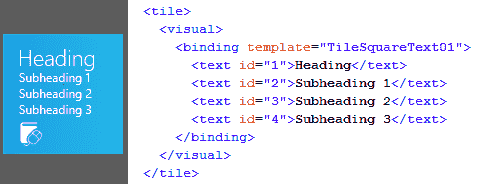
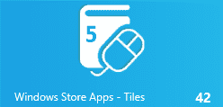
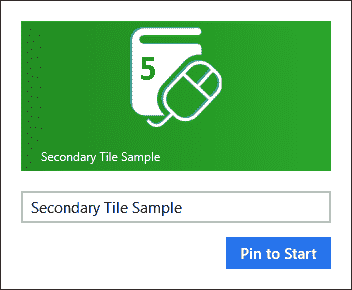
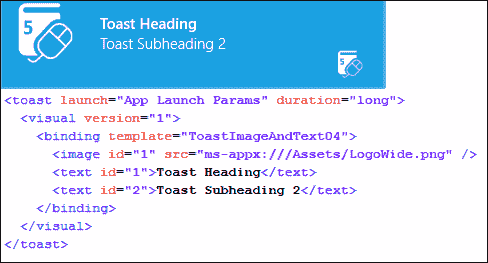
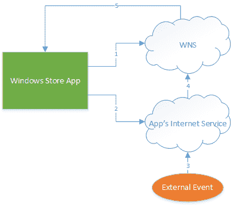
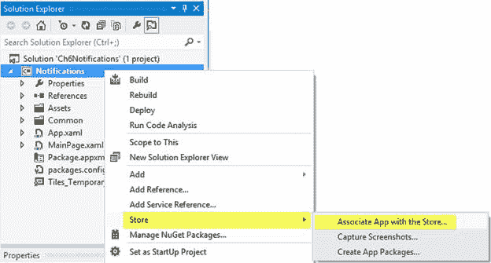

# 五、瓷砖、吐司和通知

前面几章已经讨论了几种不同的激活 Windows 商店应用程序的方法。这些激活是作为对用户与窗口交互的响应而发生的，并且是应用程序参与不同的窗口契约和扩展的结果——请记住，从其“开始”小块启动应用程序实际上是“启动”契约的实现。然而，Windows Store 应用程序有提供信息的方法，即使应用程序本身没有被激活，它们也看起来很活跃:平铺和吐司。

对于 Windows Store 应用程序，出现在“开始”屏幕上的图块不仅仅是超大的桌面图标。这些切片是“实时切片”——它们的显示可以用文本、图像、图标和动画来更新，以响应来自系统内部和外部来源的通知。应用程序可以有主切片和辅助切片，后者可用于提供附加信息，如果应用程序用于启动应用程序，这些信息将被传递给应用程序。

吐司会为使用其他应用程序的用户提供了一种交流信息的方式。吐司词以弹出通知的形式出现在应用程序的右上角，就像实时切片可以包含文本和图像一样。如果用户选择使用吐司来启动应用程序，吐司消息还包括可以传递给应用程序的信息。

本章将展示如何使用实时切片为原本不活跃的 Windows Store 应用程序添加功能。然后，将探索吐司词，包括配置它们如何出现，控制它们何时出现，以及当它们用于启动应用程序时对发生的事情做出反应。本章最后将讨论推送通知，它允许从应用程序和设备本身外部的服务触发更新。

## 活瓦

最初安装的每个 Windows Store 应用程序在 Windows Start 屏幕上都有一个小块，可用于启动应用程序。默认情况下，每个应用程序都包括一个方形图块，也可以包括一个更大的“宽”图块，由应用程序的用户决定他们希望在“开始”屏幕上包括哪个尺寸的图块。应用程序切片的初始默认内容在应用程序清单文件中设置，包括以下选项:

*   瓷砖的标准尺寸标志图像。
*   瓷砖的宽尺寸标志图像。
*   当显示标准、宽、两者或两者都不显示时，是否应显示标题文本。
*   如果显示文本和其他内容，前景是亮还是暗。
*   图块的背景颜色。

|  | 注意:如果一个应用程序包含一个宽平铺，当安装该应用程序时，宽平铺将是最初显示的平铺。然后，用户可以选择调整其大小以显示为较小的图块，或者甚至选择从“开始”屏幕中完全移除图块。当应用程序从“开始”屏幕中移除时，用户仍然可以从“开始”屏幕的搜索结果中启动该应用程序，除非他们卸载该应用程序。 |

除了最初为图块设置的内容之外，应用程序还会以多种方式影响图块的外观。这包括直接或定期更新显示在图块中的文本和图像内容，更新图块上的数字或字形“徽章”内容，甚至创建二级图块，为用户提供从其窗口开始屏幕直接访问特定应用程序功能的机会。

### 更新实时切片内容

通过对实时切片内容的更新，可以使应用程序看起来生动有趣，即使应用程序本身实际上并未运行。可以立即、按照预定的重复计划或在设定的时间更新切片。它们甚至可以设置为在多达五个瓷砖设计的循环队列中循环。标准和宽切片内容都可以通过这些方式进行更新。

通过使用指定要显示的文本和图像组合的 XML 来定义切片的内容。该 XML 基于一组由 Windows 提供的预定义模板。有 46 种预定义的模板类型-10 个正方形和 36 个宽-可用于平铺布局。其中一些布局被认为是“peek”布局；它们的内容包括填充图块的图像，并且用包括一些文本和可能的附加图像的替换内容来滚动。有四个正方形和 14 宽的布局，支持 peek。



图 21:更新的切片和相应的 XML 模板

除了文本和图像信息，图块还可以包括“品牌”设置。磁贴的品牌表明磁贴左下角(从左到右语言中的左下角)的内容是否会显示应用程序的小徽标、应用程序的标题或没有任何内容。默认为小徽标。

#### 即时切片更新

指定切片更新的第一步是定义用于定义切片内容的 XML。每个模板的 XML 可以在图块模板目录中找到，该目录可在[http://msdn . Microsoft . com/en-us/library/windows/apps/Hh 761491 . aspx](http://msdn.microsoft.com/en-us/library/windows/apps/Hh761491.aspx)上找到。这个 XML 可以手工编译，也可以使用`TileUpdateManager`类的`GetTemplateContent`静态方法为每个模板提供基本的 XML，然后用要显示的值填充。一旦定义了 XML，就在应用程序的`TileUpdater`实例上调用`Update`方法，该实例是从`TileUpdateManager`类中检索的，具有包含 XML 的`TileNotification`对象，以及可选的切片到期时间。请注意，如果应用程序包括宽切片，通知应该包括方形和宽切片的填充模板，因此有必要合并 XML。以下代码显示了以这种方式对包含宽切片和方形切片的应用程序执行的即时切片更新，其中切片设置为从首次显示的两小时后过期(过期后，它将恢复为应用程序的原始切片):

```cs
    // Ensure updates are enabled.
    var updater = TileUpdateManager.CreateTileUpdaterForApplication();
    if (updater.Setting == NotificationSetting.Enabled)
    {
        // Get the default XML for the desired tile template.
        var tileSquareXml =
                   TileUpdateManager.GetTemplateContent(TileTemplateType.TileSquareText01);

        // Locate the elements to be modified.
        var textSquareElements = tileSquareXml.GetElementsByTagName("text").ToList();

        // More detailed searching of XML for specific attributes omitted for brevity...
        textSquareElements[0].InnerText = "Heading";
        textSquareElements[1].InnerText = "Subheading 1";
        textSquareElements[2].InnerText = "Subheading 2";
        textSquareElements[3].InnerText = "Subheading 3";

        // Get the default XML for the desired tile template.
        var tileWideXml =
                     TileUpdateManager.GetTemplateContent(TileTemplateType.TileWideText01);

        // Locate the elements to be modified.
        var textWideElements = tileWideXml.GetElementsByTagName("text").ToList();
        textWideElements[0].InnerText = "Wide Heading";
        textWideElements[1].InnerText = "Wide Subheading 1";
        textWideElements[2].InnerText = "Wide Subheading 2";
        textWideElements[3].InnerText = "Wide Subheading 3";

        // Inject the wide binding node contents into the visual element of the Square XML.
        var wideBindingNode = tileWideXml.GetElementsByTagName("binding").First();
        var squareVisualNode = tileSquareXml.GetElementsByTagName("visual").First();
        var importNode = tileSquareXml.ImportNode(wideBindingNode, true);
        squareVisualNode.AppendChild(importNode);

        var notification = new TileNotification(tileSquareXml);
        notification.ExpirationTime = DateTimeOffset.Now.AddHours(2);
        updater.Update(notification);
    }

```

请注意，此代码首先执行检查以确保更新已启用。用户可以通过在开始屏幕中选择单幅图块并从应用程序栏中选择**关闭实时单幅图块**来逐个单幅图块禁用单幅图块更新。如果实时切片的更新被禁用，可以通过选择**打开**来重新启用。

|  | 注意:定位一个 XML 模板、在 MSDN 文档中查找相应的 XML 以及基于该模式编写代码的过程非常耗时，并且容易出错。微软发布的应用程序切片和徽章示例包括通知张力项目，该项目可用于构建可重用的 WinMD 组件。样本可在[http://code . msdn . Microsoft . com/window saps/app-tiles-and-徽章-sample-5fc49148](http://code.msdn.microsoft.com/windowsapps/app-tiles-and-badges-sample-5fc49148) 上获取，如何在 Visual Studio 项目中使用它的说明可在[http://msdn . Microsoft . com/en-us/library/windows/apps/Hh 969156 . aspx](http://msdn.microsoft.com/en-us/library/windows/apps/Hh969156.aspx)上找到。该组件提供了一个强类型的对象模型来填充切片、徽章和吐司模板，因此还提供了智能感知和编译时支持来帮助防止错误。本章中剩余的讨论和示例将使用该组件作为其模板定义。 |

```cs
    // Ensure updates are enabled.
    var updater = TileUpdateManager.CreateTileUpdaterForApplication();
    if (updater.Setting == NotificationSetting.Enabled)
    {
        // Prepare the square tile.
        var tileSquareUpdate =
           NotificationsExtensions.TileContent.TileContentFactory.CreateTileSquareText01();
        tileSquareUpdate.TextHeading.Text = "Heading";
        tileSquareUpdate.TextBody1.Text = "Subheading 1";
        tileSquareUpdate.TextBody2.Text = "Subheading 2";
        tileSquareUpdate.TextBody3.Text = "Subheading 3";

        // Prepare the wide tile.
        var tileWideUpdate =
             NotificationsExtensions.TileContent.TileContentFactory.CreateTileWideText01();
        tileWideUpdate.TextHeading.Text = "Wide Heading";
        tileWideUpdate.TextBody1.Text = "Wide Subheading 1";
        tileWideUpdate.TextBody2.Text = "Wide Subheading 2";
        tileWideUpdate.TextBody3.Text = "Wide Subheading 3";

        // Inject the square tile contents into the wide tile.
        tileWideUpdate.SquareContent = tileSquareUpdate;

        // Send the notification.
        var notification = tileWideUpdate.CreateNotification();
        notification.ExpirationTime = DateTimeOffset.Now.AddHours(2);
        updater.Update(notification);
    }

```

前面的代码显示了使用`NotificationExtensions`助手类执行的相同的即时切片更新。

#### 排队的切片更新

除了设置单个切片更新之外，还可以排队最多五个切片，Windows 将自动循环通过。这就是所谓的排队，只需要启用排队。除了具有相同`Tag`值的图块将相互替换之外，Windows 将循环显示最近的五次图块更新。下面的代码显示了通过调用`EnableNotificationQueue`建立的三个图块集和启用的队列:

```cs
    // Build up a list of tiles to be queued.
    // Build the first tiles.
    var tileSquareUpdate = TileContentFactory.CreateTileSquareText01();
    tileSquareUpdate.TextHeading.Text = "Queue 1";
    tileSquareUpdate.TextBody1.Text = "Subheading Q1-1";
    tileSquareUpdate.TextBody2.Text = "Subheading Q1-2";
    tileSquareUpdate.TextBody3.Text = "Subheading Q1-3";

    var tileWideUpdate = TileContentFactory.CreateTileWideText01();
    tileWideUpdate.TextHeading.Text = "Wide Queue 1";
    tileWideUpdate.TextBody1.Text = "Wide Subheading Q1-1";
    tileWideUpdate.TextBody2.Text = "Wide Subheading Q1-2";
    tileWideUpdate.TextBody3.Text = "Wide Subheading Q1-3";
    tileWideUpdate.SquareContent = tileSquareUpdate;

    updater.Update(tileWideUpdate.CreateNotification());

    // Build the second tiles.
    var tileSquareUpdate2 = TileContentFactory.CreateTileSquarePeekImageAndText01();
    // Tile property values omitted for brevity...
    var tileWideUpdate2 = TileContentFactory.CreateTileWidePeekImage02();
    // Tile property values omitted for brevity...
    updater.Update(tileWideUpdate2.CreateNotification());

    // Build the third tiles.
    var tileSquareUpdate3 = TileContentFactory.CreateTileSquareImage();
    // Tile property values omitted for brevity...
    var tileWideUpdate3 = TileContentFactory.CreateTileWideImageAndText01();
    // Tile property values omitted for brevity...
    updater.Update(tileWideUpdate3.CreateNotification());

    // Enable queuing.
    updater.EnableNotificationQueue(true);

```

#### 计划更新

前面几节讨论了对应用程序切片进行即时更改。另一种选择是在稍后的预定时间更新图块。在这种情况下，tile XML 和交付时间用于创建`ScheduledTileNotification`，而不是在应用程序的`TileUpdater`实例上调用`Update`，而是将`ScheduledTileNotification`传递给对`AddToSchedule`的调用，如以下代码所示:

```cs
    // Set up the tile that is to appear at a later time.
    var tileSquareUpdate = TileContentFactory.CreateTileSquareText01();
    // Tile property values omitted for brevity...

    var tileWideUpdate = TileContentFactory.CreateTileWideText01();
    // Tile property values omitted for brevity...
    tileWideUpdate.SquareContent = tileSquareUpdate;

    // Set the time when the update needs to occur as 1 hour from now.
    var deliveryTime = DateTimeOffset.Now.AddHours(1);

    // Schedule the update.
    var scheduledTileNotification =
                      new ScheduledTileNotification(tileWideUpdate.GetXml(), deliveryTime);
    updater.AddToSchedule(scheduledTileNotification);

```

通过从`TileUpdater`实例中检索计划通知并调用`RemoveFromSchedule`，可以清除将来的更新。为了帮助实现这一点，可以为`ScheduledTileNotification`实例指定一个标识值，随后可以在待更新列表中对其进行检查。

```cs
    // Get the list of scheduled notifications.
    var scheduledUpdates = updater.GetScheduledTileNotifications();

    // Try to find scheduled notifications with a matching Id.
    foreach(var scheduledUpdate in scheduledUpdates.Where(x => x.Id == "SomeId"))
    {
        updater.RemoveFromSchedule(scheduledUpdate);
    }

```

|  | 注意:默认情况下，计划更新设置为三天后到期，以帮助防止向用户显示过时内容。到期值可以更改，或者设置为 null 以永不到期。如果启用了排队，则计划更新会添加到队列的末尾，如果这会导致五个以上的切片，则第一个项目会从队列中删除。如前所述，如果现有图块更新条目包含`Tag`属性，则具有相同`Tag`值的替换更新将覆盖现有图块条目。 |

#### 定期更新

也可以将切片设置为在固定的重复时间段更新。对于这种类型的更新，不是为切片提供 XML，而是指定一个到 HTTP 或 HTTPS 端点的 URI，Windows 将在指定的时间间隔轮询该 XML 以用于切片的内容。可用的轮询间隔包括 30 分钟、1 小时、6 小时、12 小时和每天。可以在应用程序的`TileUpdater`实例上使用`StartPeriodicUpdate`方法设置定期更新。也可以指定轮询开始的具体时间，否则第一个请求将立即发生。一个图块只能有一个定期更新间隔，但是可以提供多个 URIs(最多五个),这些将在轮询间隔调用，通过使用`StartPeriodicUpdateBatch`方法排队提供多个图块进行显示。通过在从指定端点返回的值中设置`X-WNS-Tag` HTTP 响应头，服务器可以为成批切片提供`Tag`值。

```cs
    // Set up for polling every 30 minutes.
    updater.StartPeriodicUpdate(pollingUri, PeriodicUpdateRecurrence.HalfHour);

    // Delay the initial request by 1 minute.
    var offsetTime = DateTimeOffset.Now.AddMinutes(1);
    updater.StartPeriodicUpdate(pollingUri, offsetTime, PeriodicUpdateRecurrence.HalfHour);

    // Provide a list of URIs to call.
    var batchUris = new []{pollingUri1, pollingUri2, pollingUri3};
    // Note that Notification Queuing must be enabled.
    updater.EnableNotificationQueue(true);

    updater.StartPeriodicUpdateBatch(batchUris, PeriodicUpdateRecurrence.HalfHour);

```

可以通过在应用程序的`TileUpdater`实例上调用`StopPeriodicUpdate`方法来停止定期更新。

```cs
    updater.StopPeriodicUpdate();

```

|  | 注意:与计划更新一样，定期更新最初配置为每三天过期一次。到期值在从指定端点返回的值中的`X-WNS-Expires` HTTP 响应头中设置。 |

#### 清除切片内容

要讨论的最后一个图块更新是清除任何已发生的图块更新并将图块重置为应用程序清单文件中指定的默认图块布局的能力。这可以简单地通过在应用程序的`TileUpdater`实例上调用`Clear`方法来实现。

```cs
    updater.Clear();

```

### 徽章

除了包含文本和图像内容之外，实时切片还在切片品牌对面的角落(从左到右语言的右下角)存放一小部分状态信息。该信息被称为徽章，可以是一个数字(1–99)或一组提供的字形之一。通过徽章传递的信息通常包括需要用户注意的待处理项目的数量，例如未读的电子邮件，或者一些状态信息，例如问题警报或不可用的网络目的地。



图 22:显示数字徽章的实时切片

与实时切片内容一样，徽章内容是通过特定的 XML 内容定义的。如前所述，数字徽章可以有 1 到 99 之间的数字，可以设置 12 个可用的徽章值，包括`none`。可用的徽章值在[http://msdn . Microsoft . com/en-us/library/windows/apps/hh 761458 . aspx](http://msdn.microsoft.com/en-us/library/windows/apps/hh761458.aspx)提供的徽章图像目录中定义。为了更新应用程序图块的标记值，从`BadgeUpdateManager`类中获取应用程序的`BadgeUpdater`实例，并将所需的标记 XML 传递给由`BadgeUpdater`实例提供的`Update`方法。

```cs
    var updater = BadgeUpdateManager.CreateBadgeUpdaterForApplication();

    // Prepare a numeric notification and pass the updated badge number to the updater.
    var content = new BadgeNumericNotificationContent(42); var notification = content.CreateNotification();
    updater.Update(notification);
     // Prepare a glyph notification and pass the updated glyph to the updater. var content = new BadgeGlyphNotificationContent(GlyphValue.Away); var notification = content.CreateNotification();
    updater.Update(notification);

```

|  | 注意:与切片内容一样，NotificationsExtensions 库简化了指定标记值的过程，而不需要直接使用 XML DOM。 |

虽然不能为标记设置计划更新，但可以以与定期切片更新几乎相同的方式配置定期更新，除了没有批处理的规定，因为也没有排队标记的概念。否则，调用应用程序的`BadgeUpdater`实例的语法与`TileUpdater`相同。

同样，磁贴的徽章内容独立于磁贴内容，因此它独立于磁贴内容被清除，尽管在`BadgeUpdater`实例上使用的`Clear`调用与在`TileUpdater`上使用的相同。

### 二级瓷砖

应用程序可以选择创建额外的实时切片(称为辅助切片)，这些切片可用于启动应用程序，并带有向用户呈现特定信息集的参数。例如，天气应用程序可以创建一个特定的图块，当用于启动该应用程序时，会将用户带到他们感兴趣的特定城市的天气显示。同样，Internet Explorer 的锁定功能会创建辅助切片，指示浏览器导航到特定网站。

#### 使用辅助图块

添加辅助切片的过程称为锁定，必须以编程方式启动。它会向用户显示一个系统定义的对话框，供他们批准添加切片。用户可以在任何时候直接从“开始”屏幕中删除辅助切片，应用程序也可以通过编程方式删除辅助切片，尽管用户会看到一个对话框来确认删除。可以使用以下参数创建辅助切片:

*   一个`Id`值，用于识别次级图块。
*   直接显示在图块上的短名称。
*   要与工具提示图块一起显示在“所有程序”列表和“控制面板”应用程序中的显示名称。
*   当应用程序通过此图块激活时提供给它的参数。
*   一个选项值，用于指示名称应该显示在方形还是宽瓷砖上，以及如果应用程序由用户安装在不同的计算机上(由他或她的微软标识标识)，辅助瓷砖是否将通过云共享。
*   URIs 对将要放置在瓷砖上的图像(如果不需要宽瓷砖，可以省略宽瓷砖标志。)

除了构造函数属性之外，还可以给第二个切片赋予自己的背景颜色。

要锁定新的辅助图块，应创建新的`SecondaryTile`实例，设置其属性，并调用新图块的`RequestCreateAsync`值。

```cs
    var secondaryTile = new SecondaryTile(
        "TileId",
        "Secondary Tile Sample",
        "Secondary Tile Sample Display Name",
        "Secondary Tile Activation Args",
        TileOptions.ShowNameOnLogo | TileOptions.ShowNameOnWideLogo,
        new Uri("ms-appx:///Assets/Logo.png"),
        new Uri("ms-appx:///Assets/LogoWide.png"))
        {
            BackgroundColor = Colors.ForestGreen
        };
    await secondaryTile.RequestCreateAsync();

```



图 23:添加辅助图块时显示的用户对话框

辅助切片可以用与主切片相同的方式进行更新。不是通过调用各自的`TileUpdateManager` `CreateTileUpdaterForApplication`和`BadgeUpdateManager` `CreateBadgeUpdaterForApplication`方法来获取`TileUpdater`或`BadgeUpdater`引用，而是用`Id`调用`CreateTileUpdaterForSecondaryTile`和`CreateBadgeUpdaterForSecondaryTile`方法来更新次级图块。

以编程方式移除二级图块包括通过其`Id`定位图块或创建具有相同`Id`的新`SecondaryTile`实例，然后调用图块的`RequestDeleteAsync`方法。

```cs
    var matchingTile = new SecondaryTile(SecondaryTileId);
    await matchingTile.RequestDeleteAsync();

```

#### 响应二级切片激活

当用户从“开始”屏幕中选择第二个图块时，应用程序将按照[第 3 章](3.html#_Application_Activation)中概述的相同启动顺序运行。应用程序通过启动契约激活，这将导致在应用程序对象中调用`OnLaunched`方法覆盖。通过其中一个辅助图块启动的应用程序可以通过启动参数“`TileId`参数中的值与通过主图块启动的应用程序区分开来，该参数将与创建辅助图块时设置的值相匹配。此外，该方法的参数将包含`Arguments`属性的值。由应用程序实现来决定`TileId`值和`Argument`参数的内容应该如何影响应用程序的启动，例如通过呈现加载了某些数据的应用程序的初始页面，或者可能在不同的页面启动应用程序。

```cs
    protected override void OnLaunched(LaunchActivatedEventArgs args)
    {
         // Initialization content omitted for brevity...
         // Handle special launch for the secondary tile.
         if (args.TileId == "TileId")
         {
              if (!rootFrame.Navigate(typeof(SecondaryTilePage), args.Arguments))
              {
                   throw new Exception("Failed to create secondary tile page");
              }      }
    }

```

## 吐司通知

吐司通知是小消息弹出窗口，可以被触发出现在窗口开始屏幕的右上角(从左到右语言为右上角)，覆盖任何正在运行的应用程序。它们让负责吐司通知的应用程序有机会提醒用户某个事件，而不管当前运行的是什么应用程序，并且是一个 Windows Store 应用程序中断另一个应用程序的唯一可用机制。用户可以通过以下三种方式之一对敬酒通知做出反应:

*   他们可以忽略通知，一段时间后通知将消失。
*   他们可以通过将通知拖离屏幕或点击其提供的 **X** 图标来明确关闭通知。
*   他们可以通过点击或点击通知窗口的主体来使用通知启动相应的应用程序。

为了能够显示吐司通知，应用程序必须在清单文件中指出它是`Toast Capable`。

|  | 注意:虽然大多数可以启动应用程序的外部活动都需要在清单的声明部分输入一个条目，但是 toast 通知是在应用程序 UI 部分启用的。 |

除了应用本身支持吐司通知之外，用户还可以通过**设置**面板中的**通知**图标在一段时间内(一小时、三小时或八小时)禁用全系统通知。这对于像演示这样的情况非常有用，在这种情况下，意外的通知可能会令人讨厌、尴尬或有其他问题。用户还可以选择禁用全系统通知，或者在**电脑设置**应用的**通知**部分禁用特定应用的通知。

### 发出吐司通知

吐司通知中出现的内容是用 XML 定义的，其方式非常类似于为实时切片定义内容的方式。有八个可用模板—四个纯文本模板和四个图像和文本组合模板。这些模板在[http://msdn . Microsoft . com/en-us/library/windows/apps/hh 761494 . aspx](http://msdn.microsoft.com/en-us/library/windows/apps/hh761494.aspx)提供的 toast 模板目录中定义。为了显示吐司通知，从`ToastNotificationManager`类中获得一个`ToastNotifier`实例，并且所需的吐司 XML 被包装在一个`ToastNotification`实例中，并被传递给由`ToastNotifier`实例提供的`Show`方法。



图 24:吐司通知及其对应的 XML

#### 显示即时通知

下面的代码显示了显示吐司通知的过程:

```cs
    // Ensure updates are enabled.
    var notifier = ToastNotificationManager.CreateToastNotifier();
    if (notifier.Setting == NotificationSetting.Enabled)
    {
        // Build the content of the toast notification.
        var content = ToastContentFactory.CreateToastImageAndText04();
        content.TextHeading.Text = "Toast Heading";
        content.TextBody1.Text = "Toast Subheading 1";
        content.TextBody1.Text = "Toast Subheading 2";
        content.Image.Src = "ms-appx:///Assets/LogoWide.png";

        // Specify parameters to be passed to the app on launch.
        content.Launch = "App Launch Params";

        // Show the notification.
        var notification = content.CreateNotification();
        notifier.Show(notification);
    }

```

|  | 注意:对于显示 Windows Store 应用程序图像的 toast 通知，图像源必须是使用 http、https、ms-appx 或 ms-appdata 方案的 URI，如果使用 ms-appdata，它必须引用本地应用程序数据存储中的位置(ms-appdata:///local/)。 |

敬酒通知可以配置为短时间(7 秒)或长时间(25 秒)显示。短时间内显示的吐司通知包括系统的默认声音警报，或者可以设置为使用系统提供的几种可选简短警报声音之一。长时间显示的通知可以选择使用这些声音中的任何一种，也可以选择播放系统提供的几个循环声音中的一个，这些声音将在吐司显示期间播放。在这两种情况下，都有一个选项可以省略播放任何声音。下面的代码显示了一个配置为长时间循环播放的吐司通知:

```cs
    // Build the content of the toast notification.
    var content = ToastContentFactory.CreateToastImageAndText04();
    // Toast contents properties omitted for brevity...

    // Specify long duration and a looping sound.
    content.Duration = ToastDuration.Long;
    content.Audio.Content = ToastAudioContent.LoopingCall2;
    content.Audio.Loop = true;

    // Show the notification.
    var notification = content.CreateNotification();
    notifier.Show(notification);

```

#### 计划吐司通知

实际上，像到目前为止显示的那样，触发立即显示的 toast 通知不会直接从应用程序代码中使用。在大多数情况下，应用程序会中断自己，在这种情况下，消息对话框可能是引起用户注意的更合适的方式。相反，这些即时通知通常将从后台任务中使用，这将在下一章中更详细地讨论。

除了立即调用 toast 通知之外，另一种方法是将通知安排在预先安排的时间出现，这可能是为了提醒用户返回应用程序执行某些任务。重要的通知可以被安排在预定的“暂停”时间间隔内重复，因此如果用户在没有调用应用程序的情况下取消了吐司，吐司将在一段时间后再次出现。设置暂停间隔时，还必须设置最大暂停次数。以下代码显示了如何配置计划通知:

```cs
    // Build the content of the toast notification.
    var content = ToastContentFactory.CreateToastImageAndText04();
    // Toast contents properties omitted for brevity...

    // Set the time at which the toast should be triggered.
    var deliveryTime = DateTimeOffset.Now.AddMinutes(1);

    // Configure a one-time scheduled toast.
    var scheduledNotification = new ScheduledToastNotification(
                                        content.GetXml(),
                                        deliveryTime);

    // Configure a repeating scheduled toast.
    var snoozeInterval = TimeSpan.FromMinutes(5);   // Must be between 60 secs and 60 mins.
    var maximumSnoozeCount = (UInt32)5; // Can be 1-5 times.
    var scheduledNotification = new ScheduledToastNotification(
                                        content.GetXml(),
                                        deliveryTime,
                                        snoozeInterval,
                                        maximumSnoozeCount);

    notifier.AddToSchedule(scheduledNotification);

```

可以通过从`ToastNotifier`实例中检索预定通知并调用`RemoveFromSchedule`来清除预定更新。为了帮助实现这一点，可以为`ScheduledToastNotification`实例指定一个`Id`值，该值随后可以在待更新列表中进行检查。

```cs
    // Retrieve the scheduled notifications.
    var notifier = ToastNotificationManager.CreateToastNotifier();
    var notifications = notifier.GetScheduledToastNotifications();

    // Alternatively, find the notifications that have a specific Id.
    //var notification = new ScheduledToastNotification(content.GetXml(), deliveryTime)
                                             {Id = "ScheduledId "};
    //var notifications = notifier.GetScheduledToastNotifications()
                                            .FirstOrDefault(x => x.Id == "ScheduledId");

    // Remove the indicated notifications.
    foreach (var notification in notifications)
    {
        notifier.RemoveFromSchedule(notification);
    }

```

### 响应吐司通知激活

当用户选择通过点击或点击吐司通知的正文来激活应用程序时，应用程序将经历其启动序列，包括运行应用程序的`OnLaunched`方法。就像从辅助图块启动应用程序一样，无论应用程序是否已经在运行，都会发生这种顺序。如果在 toast 通知上设置了启动参数，它们将包含在方法参数的`Arguments`参数中。应用程序实现决定如何使用这些参数来指导用户界面。

除了激活和启动执行之外，正在运行的应用程序还可以根据即时通知订阅激活和解除事件。这两个事件都返回触发事件的通知的一个实例，而被拒绝的事件在其参数中包含一个参数，该参数指示通知是如何被拒绝的。订阅这些事件的代码如下:

```cs
    // Build the content of the toast notification.
    var content = ToastContentFactory.CreateToastImageAndText04();
    // Toast contents properties omitted for brevity...

    // Create the notification instance.
    var notification = content.CreateNotification();

    // Subscribe to the activation event.
    notification.Activated += (activatedNotification, args) =>
    {
        // Handle the activated event.
    };

    // Subscribe to the dismissal event.
    notification.Dismissed += (dismissedNotification, args) =>
    {
        // Handle the dismissed event.
    };

    // Show the notification.
    notifier.Show(notification);

```

|  | 注意:这些事件在计划通知中不可用，因此当前无法启动应用程序，立即查询未完成的计划通知列表，并为它们设置应用程序内事件处理程序。 |

## 推送通知

到目前为止，本章主要关注由应用程序本身启动的实时切片更新和吐司通知，无论是立即启动还是通过使用一些可用的计划选项。除了这些方法之外，Windows Store 应用程序还可以利用一种称为推送通知的机制，允许在机器外部发生的事件通过 Windows 管理的服务显示切片更新或吐司。这些推送通知扩展了应用程序与用户进行额外交互的能力，无论应用程序是否正在运行。

|  | 注意:如前所述，后台任务还可以提供一些选项，以便在应用程序本身不运行时更新切片和吐司更新。在某些情况下，推送通知比在后台任务中使用轮询有一些优势，因为该操作是由服务器启动的，而不是轮询的，并且执行时间限制与推送通知无关。尽管如此，后台任务确实为扩展应用程序的功能提供了一些有趣的选项。背景任务将在下一章中进一步讨论。 |

推送通知由 Windows 管理的本地服务和微软提供的基于云的服务(称为 Windows 通知服务(WNS))组合而成。下图说明了使用推送通知的顺序:



图 25:推送通知生命周期

此图说明了以下步骤:

1.  窗口商店应用程序请求并获得一个推送通知通道。
2.  Windows Store 应用程序将此频道提供给将发送通知的互联网服务，该服务将频道信息与任何其他相关信息一起存储，供以后使用。
3.  发生了一些事件，导致互联网服务决定向其订户发送推送通知是合适的。
4.  互联网服务使用一些标准来识别哪些订户应该接收通知，收集这些订户的频道列表，并通过调用每个频道 URIs，以 XML 有效负载的形式将通知发送给窗口通知服务。
5.  如果通道仍然有效，Windows 通知服务会将通知路由到适当的设备，通知有效负载和设备设置将决定通知的显示方式。

为了提供一些上下文，如果一个体育应用程序为用户提供接收与他们最喜欢的球队相关的新闻推送通知的能力，该应用程序将首先获得一个频道。然后，该应用程序将把 URI 频道和一些描述用户最喜欢的球队的信息上传到与该体育应用程序相关的体育互联网服务，该服务将在内部存储这些信息。然后，体育服务会以某种方式接收比分和新闻更新。当每个值得通知的更新到达时，体育服务将首先构建适当的通知 XML。然后，它会查询自己存储的通知信息，以确定最受欢迎的团队匹配传入新闻的频道。然后，体育服务将通过使用这些频道中的每一个向 WNS 发布通知 XML，而 WNS 将依次向相应的设备提供通知，潜在地显示表示游戏分数变化的吐司消息或图块更新。

|  | 注意:推送通知和 Windows Store 应用程序的相关服务提供的功能与微软 Windows Phone 提供的推送通知功能非常相似。虽然两者之间有一些小的差异，但对其中一个的理解将有助于形成对另一个的理解。 |

有四种推送通知可以发送到窗口商店应用程序。磁贴、徽章和吐司通知与迄今为止讨论过的应用程序启动的通知相同。除此之外，推送通知还包括一个原始通知选项。原始通知只包含可以发送到 Windows Store 应用程序的自定义文本内容，由应用程序决定如何最好地处理文本。为了与原始通知交互，要么应用程序必须运行，要么必须配置一个后台任务来代表应用程序处理通知。背景任务将在下一章讨论。

现在，推送通知的背景已经呈现，将讨论所涉及的每个步骤的具体细节。

### 为推送通知配置应用程序

为了让 Windows Store 应用程序参与推送通知，它必须首先在 Windows Store 中注册。与此注册过程相关的信息将在此呈现，而关于向 Windows Store 注册应用程序的更完整讨论将包含在后续关于应用程序部署的章节中。

将应用程序与 Windows 商店相关联的最简单方法是从 Visual Studio 中项目的**商店**上下文菜单命令中选择**将应用程序与商店相关联**菜单选项:



图 26:从 Visual Studio 中将应用程序与 Windows 商店相关联

这将启动**将您的应用程序与视窗商店关联**向导。向导将提示您输入 Windows Store 凭据(稍后讨论)，然后列出已在 Windows Store 中使用这些凭据注册的应用程序。选择应用程序后，向导的最后一页将列出完成向导后对应用程序所做的更改。这些变化通常包括:

*   将包名更新为商店确定的唯一名称。
*   将包的数字签名文件更新为包含存储确定的发布者标识值的新文件。

一旦该应用的清单被配置为与在窗口商店中的应用注册相关联，该应用就可以请求通知渠道。通知通道包括与机器上用户的应用程序安装唯一相关联的 URI。该通道通过调用`PushNotificationChannelManager`类的`CreatePushNotificationChannelForApplicationAsync`方法返回。通知通道 URI 的格式为`https://xxx.notify.windows.com/?token=<token>`，其中`xxx`值由 WNS 服务确定，令牌也由 WNS 服务提供。

通知通道包括通道 URI 及其过期时间的属性。需要注意的是，所提供的渠道确实会在一段时间(目前为 30 天)后过期，因此应用程序必须定期更新发布推送通知的互联网服务。为此，最好在每次调用应用程序时请求一个新通道，并缓存通道 URI 值，以查看调用应用程序时返回的值是否已经发送到互联网服务。后一步骤通过仅在检测到变化时进行更新调用，有助于减少对互联网服务的不必要调用。下面的代码显示了使用`ApplicationData` `LocalSettings`存储的这个过程的实现:

```cs
    // Request the channel.
    var channel = await      PushNotificationChannelManager.CreatePushNotificationChannelForApplicationAsync();
    //var secondaryTileChannel = await PushNotificationChannelManager
    //                      .CreatePushNotificationChannelForSecondaryTileAsync("Tile Id");

    // Retrieve the previous published channel Uri (if any) from settings.
    var oldChannelUri = String.Empty;
    var localSettings = ApplicationData.Current.LocalSettings;
    if (localSettings.Values.ContainsKey("previousChannelUri"))
    {
        var oldChannelUriValue = localSettings.Values["previousChannelUri"];
        oldChannelUri = oldChannelUriValue == null 
            ? String.Empty
            : oldChannelUriValue.ToString();
    }

    // Send an updated channel Uri to the service, if necessary.
    if (!oldChannelUri.Equals(channel.Uri, StringComparison.CurrentCultureIgnoreCase))
    {
        // The Channel has changed from the previous value (if any). Publish to service.
        PublishChannelToService(channel.Uri);

        // Cache the sent Uri value.
        localSettings.Values["previousChannelUri"] = channel.Uri;
    }

```

|  | 注意:通知通道实际上与特定的应用程序块相关联。通过调用`CreatePushNotificationChannelForSecondaryTileAsync`而不是`CreatePushNotificationChannelForApplicationAsync`，可以获得二级图块的通知通道。通过这样的通道，可以发送针对特定图块的图块或徽章更新通知。 |

一旦 Windows Store 应用程序获得了 URI 通知通道，并与互联网服务共享了该通道，或许还有其他相关数据可以帮助该服务决定何时向特定通道发送通知，该服务就可以开始发送推送通知了。

### 发送推送通知

当互联网服务向用户发送通知时，该服务将使用 Windows Store 应用程序提供的通知通道 URI 向 Windows 通知服务发出 HTTP POST 请求。开机自检请求的内容包括一些身份验证信息，以及描述吐司、切片、徽章或原始通知的 XML 有效负载。

Windows 通知服务要求发出推送通知的调用包含一个访问令牌，该令牌必须通过向 WNS 进行身份验证来获得。此身份验证要求调用方提供应用程序的包安全标识符(包 SID)和客户端机密值，这些值可从应用程序的 Windows Store 条目中获得。通过选择**仪表盘**中的应用，导航至**应用名称** > **高级功能**页面，然后点击**推送通知和实时连接服务信息**链接，即可获得这些值。请注意，一个访问令牌可以用于多个通知呼叫；没有必要为每个被调用的 URI 通道获取一个新的令牌，尽管令牌确实会过期，因此可能有必要定期刷新它们。

一旦访问令牌可用，发送通知的过程包括准备 XML 有效负载，这与到目前为止讨论的通知的客户端 XML 相同，然后简单地发出请求。通知发出后，应检查响应代码，以便可以删除或标记过期或无效的通知通道 URIs，以确保不再调用它们。重复尝试向不良端点发出通知的服务可能会受到限制，以防止其发出通知。此外，应该在发送通知之前进行检查，以确保 URI 实际上是一个通知 URI，而不是通过向互联网服务提供备用 URI 来恶意拦截去往用户的数据。所有有效的通知渠道 URIs 将使用域 notify.windows.com。

|  | 注:由于与 WNS 的信息交换是使用互联网标准协议完成的，因此不必在. NET. For 中实现触发通知的互联网服务。NET 实现中，微软 DPE 团队已经发布了一个类似于前面讨论的 notificationsestreams 库的助手库，它提供了一个强类型的对象模型，用于构建和发送切片、徽章、吐司和原始通知(还提供了 IntelliSense 和编译时支持)。该库以 NuGet 包的形式提供，可在[http://www.nuget.org/packages/WnsRecipe](http://www.nuget.org/packages/WnsRecipe)获得(关于包含 NuGet 包的更多信息，请参考[http://docs.nuget.org/docs/start-here/overview](http://docs.nuget.org/docs/start-here/overview))。本章中剩下的讨论和示例将利用这个组件来准备和发送推送通知。有关手动生成和发布通知的信息，请参考位于[的 MSDN 文档。](http://msdn.microsoft.com/library/windows/apps/xaml/Hh868244.aspx) |

下面的示例显示了从. NET 服务(可能是 WCF 服务)向符合某些特定条件的端点发送通知的典型序列。请注意，一次只能发送一个磁贴、吐司、徽章或原始通知。在这个示例中创建多个通知只是为了说明可以使用的各种工厂类。

```cs
    // Set up the token provider to provide the access token for notification requests.
    var tokenProvider = new WnsAccessTokenProvider(CliendSID, ClientSecret);

    var matchingSubscriptions = Storage.GetMatchingEndpoints(dataOfInterest);
    foreach(var matchingSubscription in matchingSubscriptions)
    {
        // Note: Toast, tile, badge and raw notification configurations are being shown     // with the same ‘notification’ variable for illustration purposes only.

        // Toast
        var notification = ToastContentFactory.CreateToastText01();
        // Detailed configuration of Toast contents omitted for brevity...

        // Tile
        var notification = TileContentFactory.CreateTileWideText01();
        // Detailed configuration of Tile contents omitted for brevity...

        // Badge
        var notification = BadgeContentFactory.CreateBadgeNumeric();
        // Detailed configuration of Badge contents omitted for brevity...

        // Raw
        var notification = RawContentFactory.CreateRaw();
        notification.Content = "Some raw content";

        // To prevent data hijacking, ensure that the host contains "notify.windows.com".
        var uri = new Uri(matchingSubscription.SubscriptionUri);
        if (!uri.Host.ToLowerInvariant().Contains("notify.windows.com"))
        {
            // Bad URI - Possible data hijack attempt. Remove the subscription.
            Storage.RemoveBadSubscription(matchingSubscription);
            continue;
        }

        // Send the notification and examine the results.
        var result = notification.Send(uri, tokenProvider);
        switch (result.StatusCode)
        {
            case HttpStatusCode.Gone:
                // The Channel URI has expired. Don't send to it anymore.
                Storage.RemoveBadSubscription(matchingSubscription);
                break;
            case HttpStatusCode.NotFound:
                // The Channel URI is not a valid URI. Don't send to it anymore.
                Storage.RemoveBadSubscription(matchingSubscription);
                break;
            case HttpStatusCode.NotAcceptable:
                // The channel throttle limit has been exceeded.             // Stop sending notifications for a while.
                break;
            //case HttpStatusCode.Unauthorized:          
            //    // The access token has expired. Renew it.
            // Note: Not needed - handled internally by helper library.
            //    tokenProvider = new WnsAccessTokenProvider(CliendSID, ClientSecret);
            //    break;
        }
        // TODO - Based on StatusCode, etc. log issues for troubleshooting & support
    }

```

如果在发送吐司词时用户处于脱机状态，则通知会被丢弃。服务将缓存最近的切片和标记通知，到达客户端的切片通知数量取决于是否启用了排队。默认情况下，不缓存原始通知。

|  | 注意:微软最近宣布了 Windows Azure 移动服务(WAMS)。该服务目前以预览形式提供，承诺为移动开发人员提供机会，为他们的应用程序快速提供经济高效的后端支持服务，其特点是“没有麻烦，没有部署，没有恐惧。”截至本文撰写之时，WAMS 包括对基于云的数据访问、用户身份验证以及构建和向 Windows Store 应用程序发送推送通知的内置支持。关于 WAMS 的更多信息，包括包括配置推送通知的教程，可以在[http://www.windowsazure.com/en-us/develop/mobile/](http://www.windowsazure.com/en-us/develop/mobile/)找到。 |

### 与来自应用的推送通知交互

推送通知通道提供了一个事件，可用于在该通道上发生通知时通知应用程序。此事件可用于两种一般情况。首先，它为应用程序提供了一种收到原始通知的通知方式，以便应用程序适当地处理该通知。其次，该应用程序有机会取消 Windows 对通知的默认处理(例如，如果新数据将自动显示在运行应用程序的用户界面中，则禁止显示旨在提醒注意应用程序的新数据到达的吐司通知。)

下面的代码显示了在应用程序启动期间获取频道时，该事件与频道一起使用:

```cs
    // Subscribe to the notification being received while the app is running.
    channel.PushNotificationReceived += (o, e) =>
    {
        if (e.NotificationType == PushNotificationType.Raw && e.RawNotification != null)
        {
            // TODO - Process the supplied raw notification contents
            DoSomethingWithRawNotificationContent(e.RawNotification.Content);
        }
        else
        {
            // Illustrates cancelling Windows' default handling of the notification.
            e.Cancel = true;
        }
    };

```

## 重述

本章研究了如何使用平铺和吐司来增加 Windows Store 应用程序与用户交互的方式，即使应用程序本身并未积极运行。这包括处理主要和次要实时切片的机制，显示吐司通知以在一个应用程序中工作时提醒用户注意另一个应用程序，以及使用推送通知允许在用户机器之外发生的操作来处理这些切片和吐司。

下一章将介绍当主应用程序本身没有通过后台传输和后台任务机制激活时，允许窗口商店应用程序在后台执行任务的公开工具。