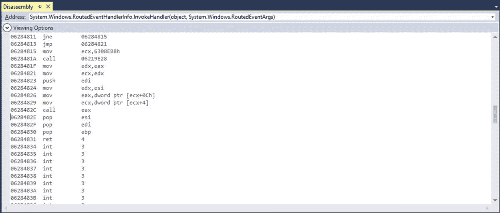
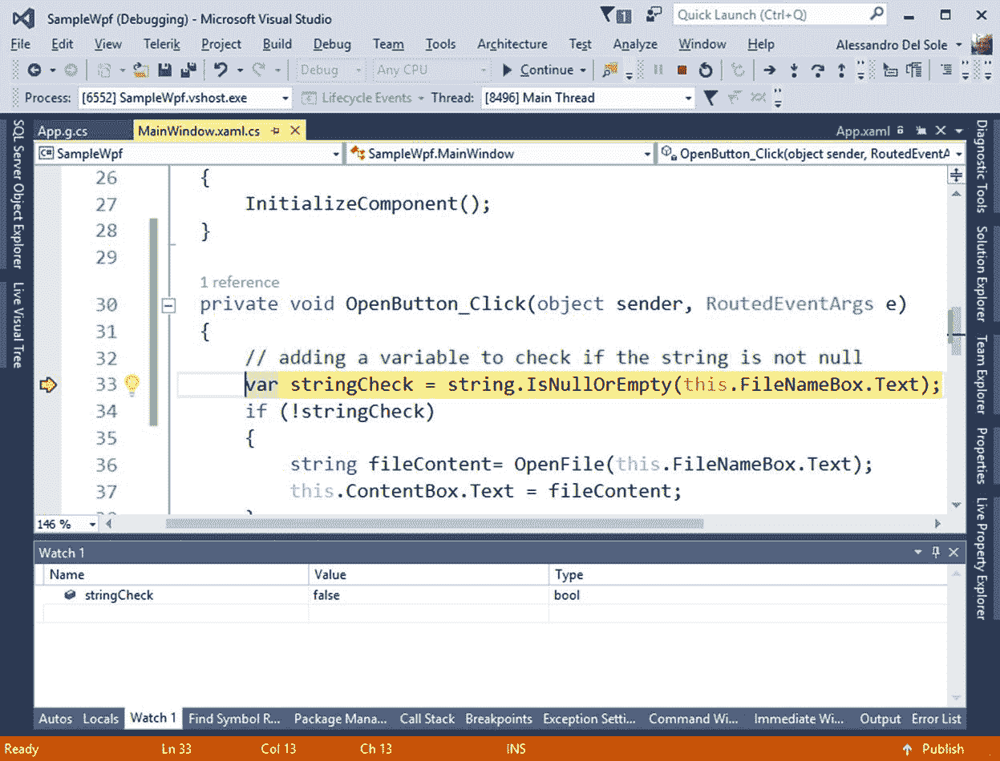

# 第 3 章使用调试窗口

WPF 应用程序由许多构件组成，包括用户界面、视图模型和数据，仅举几例。对于每一个，您可能都有方法、变量、表达式，甚至多线程代码。因此，在适当的环境之外调试 WPF 应用程序可能会很困难。幸运的是，Visual Studio 为您提供了许多集成的工具窗口，它们简化了调试并覆盖了大量场景。本章将提供关于 WPF 应用程序最常用的调试窗口的指导，并提供关于编写更好的代码的信息。

## 使用局部变量窗口调查局部变量

“局部变量”窗口是一个有用的调试窗口，因为它允许您显示活动的局部变量及其值。如果局部变量表示一个复合类型，如类，您还可以看到该类型的属性和字段值。为了看到它的运行，考虑第 1 章中创建的示例应用程序，并在下面一行`OpenButton_Click`事件处理程序中放置一个断点:

`this.ContentBox.Text = fileContent;`

运行应用程序，浏览一个文件名，然后点击**打开**。当断点被命中并且 Visual Studio 进入中断模式时，选择**局部变量**窗口，该窗口应默认启用。如果没有，请选择调试、窗口、局部变量。如图 14 所示，“局部变量”窗口显示了活动局部变量的列表。对于每个变量，它显示值和类型。


图 14:使用局部变量窗口调查局部变量

如果变量类型是原始类型，如字符串，则“值”列会立即显示变量的值，如类型为`string`的`fileContent`局部变量。如果变量类型是复合类型，例如类型为`System.Windows.RoutedEventArgs`的`e`变量，您可以展开该变量并查看其成员。对于每个成员，您将能够看到类型和当前值；同样，如果成员是复合类型，您可以展开该成员—例如，展开`e`变量将导致“局部变量”窗口显示`System.Windows.RoutedEventArgs`类型公开的所有属性和字段(带值)。当您需要检查变量是否存储了预期(或意外)值时，“局部变量”窗口可以成为真正的救星。

## 使用自动窗口调查当前变量

您也可以使用“自动”窗口调查变量，该窗口以三种形式显示变量:由当前语句使用、由前三个语句使用以及由后三个语句使用。您也可以通过简单的双击来更改变量值。在图 15 中，您可以看到如果变量与当前断点相关，它是如何以红色显示的。


图 15:使用自动窗口调查变量

## 分析方法调用:调用堆栈窗口

“调用堆栈”窗口显示方法调用如何在堆栈中运行，这对于理解方法调用层次结构很有用。

|  | 提示:如果启用了“仅我的代码”，调用堆栈窗口将显示有限的信息集。为了更好地理解调用堆栈，请禁用“仅我的代码”。在阅读了调用堆栈之后，您可以决定重新启用它。 |

当您调试代码时，调用堆栈会变为活动状态，例如，当您按 F11 键时。图 16 显示了正在运行的窗口。


图 16:用调用栈调查方法调用

调用堆栈显示:

*   正在执行的方法名列表和编写每种方法的编程语言。
*   的呼叫列表。NET 系统方法。
*   其他线程的方法调用。

如果给定方法的源代码不可用，您仍然可以通过右键单击方法名称，然后选择**转到反汇编**来查看汇编代码。图 17 显示了一个例子。



图 17:分解方法调用

请注意反汇编窗口不仅显示反汇编的方法调用，还显示每个指令在内存中的地址。您还可以通过右键单击列标题并从上下文菜单中选择可用选项(例如(但不限于)参数值和十六进制显示)来自定义调用堆栈的外观。当您遇到显然不是由当前代码段引起的问题，并且需要对整个方法调用堆栈进行进一步调查时，调用堆栈特别有用。

## 评估表达式:观察和快速观察窗口

您可以通过使用“监视”和“快速监视”窗口监视对象或表达式来跟踪变量。区别在于 Watch 可以监控多个变量，而 Quick Watch 每次只能监控一个变量。有四个监视窗口可用，这意味着您可以监视大量变量。为了理解它们是如何工作的，让我们稍微修改一下示例应用程序中的`OpenButton_Click`事件处理程序，如代码清单 3 所示。

代码清单 3

```
  private void
  OpenButton_Click(object sender,  RoutedEventArgs e)
  {

   // Adding a variable to
  check if the string is not null.

  bool stringCheck = 

  string.IsNullOrEmpty(this .FileNameBox.Text);

  if (!stringCheck)

  {

  string fileContent= OpenFile(this .FileNameBox.Text);

   this .ContentBox.Text =
  fileContent;
       }
   }

```

我们的目标是监控`stringCheck`变量的行为，这是在中断模式下进行的。接下来，按 F11 启动应用程序，而不是按 F5。然后我们找到 stringCheck 变量，右击，选择**添加手表**。此时，Watch 1 窗口将显示该变量，并显示一条消息，表示它在当前上下文中不存在，这是意料之中的，因为调试器尚未进入事件处理程序。

|  | 提示:一般来说，选择添加手表将打开四个 VS 产品中的第一个手表窗口。 |

如果您进入代码并进入`OpenButton_Click`处理程序，Watch 窗口将显示分配给变量的表达式的当前求值结果，即 False，如图 18 所示。



图 18:使用观察窗口监控表达式

当您继续单步执行代码时，您将看到“观察”窗口将如何显示分配给`stringCheck`变量的表达式的计算结果，该变量可能是也可能不是`true`。“快速观察”窗口的工作原理类似，但它只适用于单个变量，并通过模式对话框提供。

### 调试 lambda 表达式

Visual Studio 2015 引入了一项重要功能，允许在“监视”窗口中调试 lambda 表达式和 LINQ 查询。为了理解如何利用这个新工具，让我们对示例项目进行一些修改。首先，我们将向用户界面添加一个新按钮，如下所示:

`<Button Width="100" Height="30" Content="Feeling lucky"`

`x:Name="FeelingLuckyButton" Click="FeelingLuckyButton_Click"/>`

这个新按钮的目的是启动一个打开第一个。txt 文档，然后添加代码清单 4 所示的事件处理程序和方法。

代码清单 4

```

  private  IEnumerable <string> 

  EnumerateTextFiles(string directoryName)

  {

   // Using a lambda for
  demonstration purposes only.

   // You might want to
  use a search pattern instead.

  var list =  Directory.EnumerateFiles(directoryName);

  var filteredList = list.Where(f => 

  f.ToLower().Contains(".txt"));

  return filteredList;

  }

  private void
  FeelingLuckyButton_Click(object sender, 

   RoutedEventArgs e)

  {

  this.FileNameBox.Text = 

  OpenFile(EnumerateTextFiles("C:\\temp" ).FirstOrDefault());
          }

```

`EnumerateTextFiles`方法是使用 lambda 表达式过滤指定文件夹中的文件列表。在您的实际代码中，您可能更喜欢为`Directory.EnumerateFiles`方法指定搜索模式参数，但是为了演示如何使用新的调试特性，使用 lambda 是必要的。此时，在`EnumerateTextFiles`方法上放置一个断点，然后开始调试。当调试器进入该方法时，右键单击`filteredList`变量，然后选择**添加手表**。当您在此变量上按 F11 时，观察窗口将计算表达式，包括展开显示 lambda 结果的结果视图元素。图 19 展示了这一点。


图 19:调试 Lambda 表达式

这样，您可以调查表达式结果，看看它是否如预期的那样工作。

## 调试线程:线程窗口

. NET 应用程序通常可以运行多个线程。有时，运行多个线程是为了适应系统管理应用程序的方式，或者是因为我们通过编程创建了新的线程，用于将任务委托给不同的执行单元。Visual Studio 提供了线程窗口(Ctrl+Alt+H)，在该窗口中可以看到正在运行的线程列表(参见图 20)。


图 20:查看运行线程列表

对于每个线程，您可以看到名称、标识、类别和位置。通过类别，您可以看到主线程如何对应于应用程序中的用户界面线程。这在“位置”列中进行了演示，在该列中，您不仅可以找到模块的名称，还可以找到当前正在执行的方法。对于以编程方式创建的线程，它们将在窗口中列出，您将能够获得关于它们的信息。“线程”窗口最有趣的功能是，你也可以选择一个线程，然后点击**搜索调用栈**。此操作将打开“调用堆栈”窗口，从而显示指定线程中的方法调用。

## 异步调试:任务窗口

Visual Studio 提供了“任务”窗口，这是一种调查任务的便捷方式，当您使用异步/等待模式编写异步方法时，运行时会创建这些任务。为了理解这是如何工作的，让我们向示例应用程序添加一个新的异步方法，该方法基于异步/等待模式打开一个文本文件。这如代码清单 5 所示。

代码清单 5

```

  private async   Task<string > OpenFileAsync(string
  fileName)

  {

  string result = null ;

  using (var
  fs = new  FileStream (fileName,  FileMode.Open))

  {

  using (var
  reader = new  StreamReader (fs))

  {

  result = await reader.ReadToEndAsync();

  }

  }

  return result;
           }

```

为了使用这种方法，您需要用`async`修饰符标记`OpenButton_Click`事件处理程序，并且您需要如下改变`fileContent`变量的赋值:

`string fileContent = await OpenFileAsync(this.FileNameBox.Text);`

如果您在`OpenFileAsync`方法上放置一个断点，并在中断模式下启用任务窗口(Ctrl+Shift+D，K)，您将看到任务的状态、执行时间和位置(见图 21)。


图 21:监控异步任务

|  | 注意:“任务”窗口也可以与基于任务并行库(TPL)的并行编程一起使用，以研究并行任务的执行。 |

## 章节总结

WPF 应用程序越复杂，就越需要复杂的调试工具。Visual Studio 提供了对应用程序执行复杂调试所需的一切。事实上，集成开发环境提供了许多调试窗口，您可以使用它们来检查变量(局部变量和自动窗口)、评估表达式(观察窗口)、调查方法调用(调用堆栈窗口)以及分析线程和任务(线程和任务窗口)。所有这些窗口都是非模态的，它们停靠在集成开发环境中工作，因此，您可以始终关注您的代码，这意味着您可以更有效率。