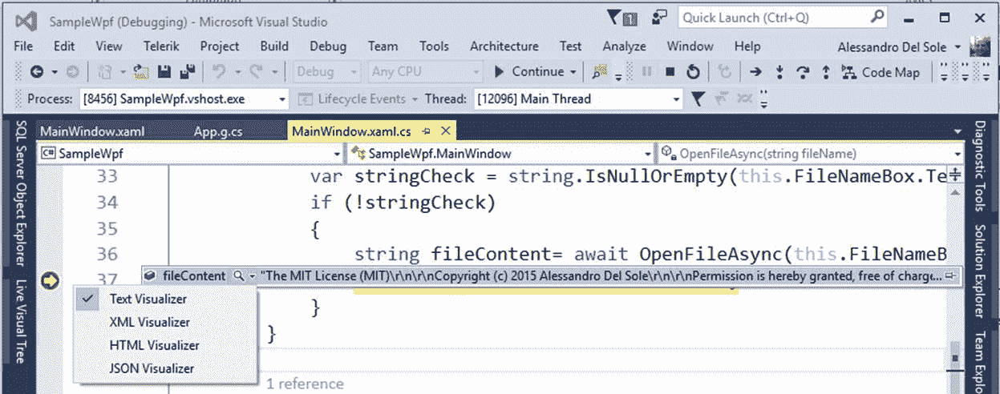
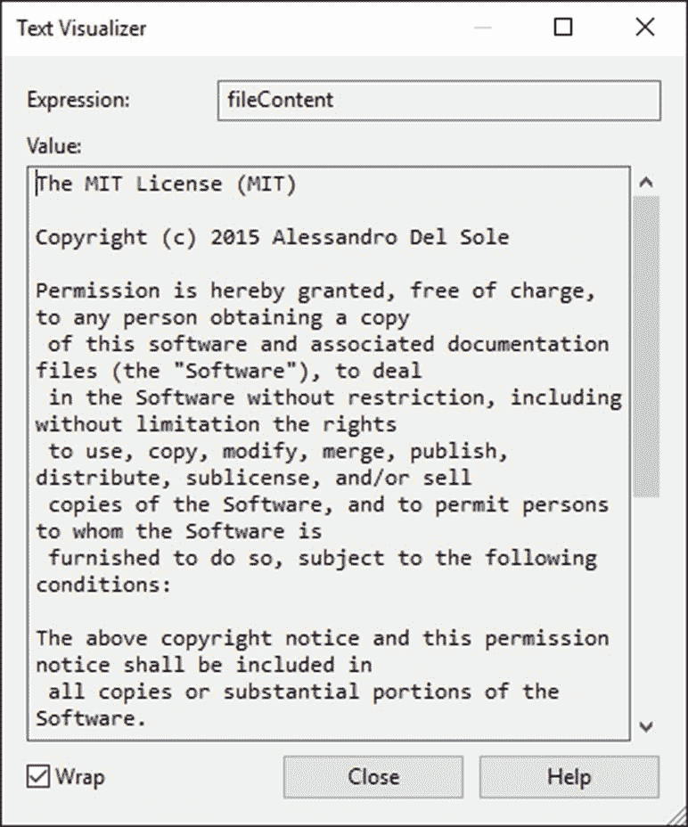
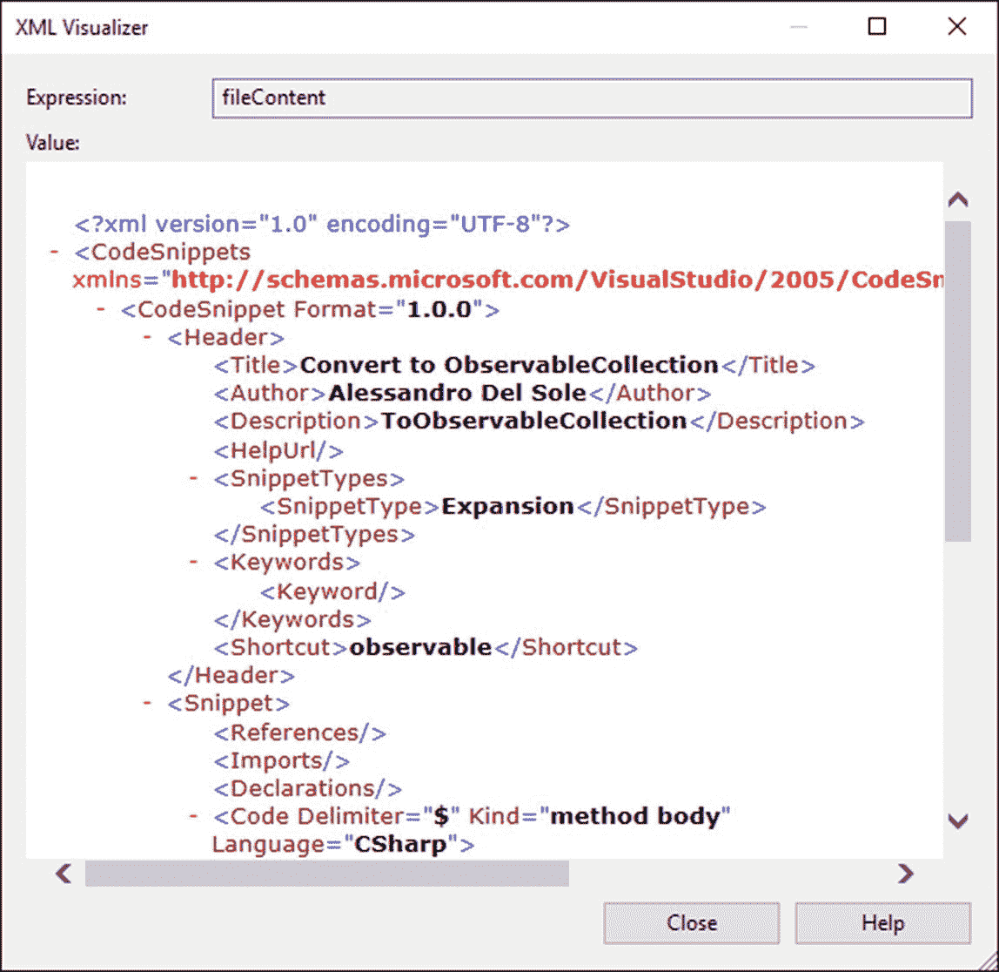
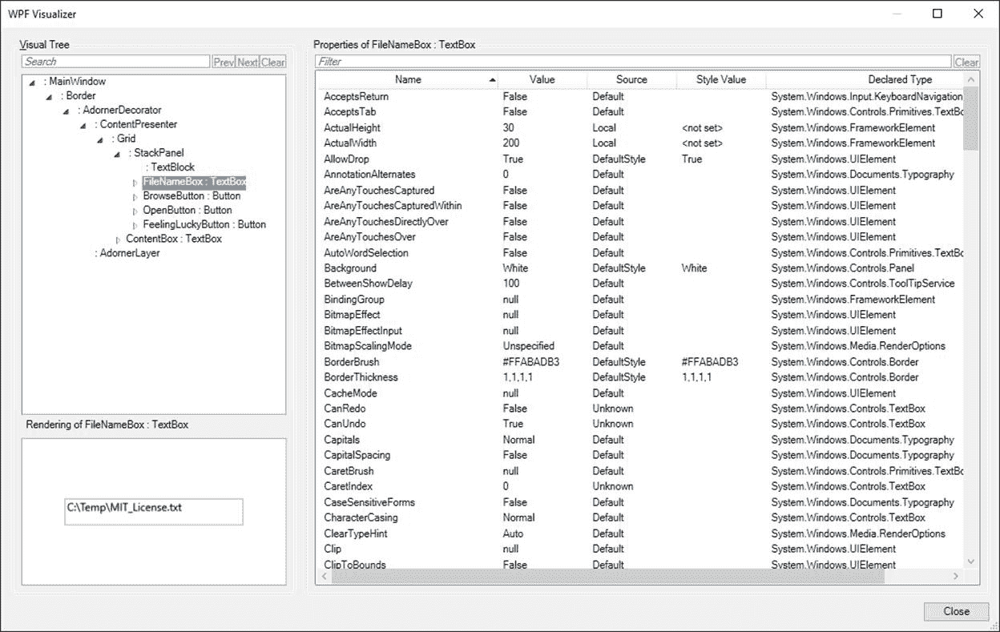
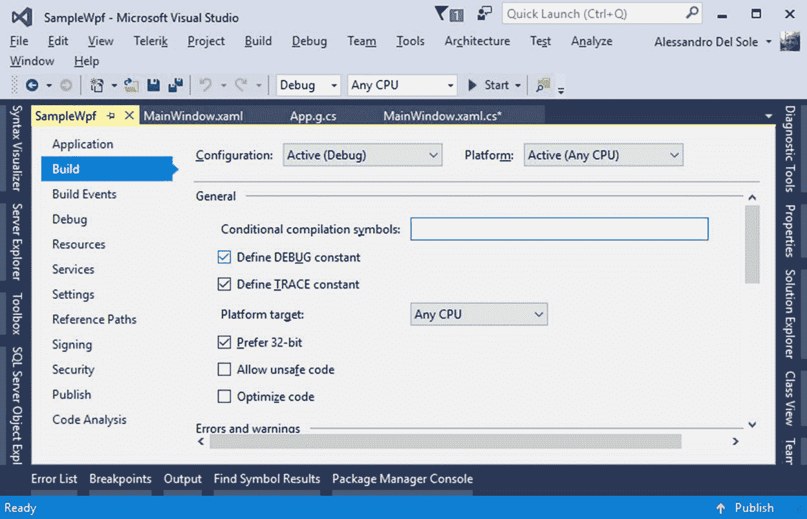

# 第 4 章调试器可视化工具和跟踪侦听器

调试不仅意味着搜索和修复错误，还意味着收集诊断信息，帮助开发人员了解应用程序在其生命周期中特定点的行为。这在 WPF 应用程序中更为重要，因为它们可以处理大量资源，如图形、媒体和数据。本章将解释如何使用调试器可视化工具和跟踪侦听器收集信息。

## 引入调试器可视化工具

在某些情况下，您可能拥有以特定格式存储数据的对象、控件或变量。例如，您可能有一个表示 XML 或 JSON 数据的字符串。调试时，您可能需要一种方法来用适当的视图调查这类信息。Visual Studio 通过调试器可视化工具实现了这一点。为了更好地理解，在示例应用程序中，在下面一行放置一个断点，它位于`OpenButton_Click`事件处理程序中:

`this.ContentBox.Text = fileContent;`

当断点命中时，如果您将鼠标悬停在`fileContent`变量上，您将看到一个显示变量值的数据提示。数据提示还提供了一个小放大镜图标，您可以单击它来选择一个可用的可视化工具(参见图 22)。



图 22:选择调试器可视化工具

根据信息的格式，您可以选择最合适的可视化工具。在这种情况下，字符串包含纯文本，这意味着选择文本可视化工具是正确的选择。图 23 显示了运行中的文本可视化工具。



图 23:文本可视化工具允许查看纯文本

现在假设您的变量包含 XML 数据。您可以选择 XML 可视化工具来获取文件的结构化视图，而不是纯文本。图 24 显示了一个例子。



图 24: XML 可视化工具允许查看结构化的 XML 内容

与 XML 可视化工具一样，JSON 和 HTML 可视化工具可以帮助您研究格式化的内容。调试器可视化工具非常有用，尤其是当您需要查看长而复杂的信息，而数据提示又不够时。

### WPF 树可视化工具

WPF 有一个特殊的调试器可视化工具，叫做 WPF 树可视化工具，它允许你在运行时检查控件的属性值。

|  | 注意:讨论该可视化工具是为了与 WPF 平台保持一致，但是您可能更喜欢第 5 章 XAML 调试中描述的实时属性资源管理器和实时可视化树窗口。 |

该可视化工具的目标是提供当前窗口或用户控件的可视化树的分层视图。在中断模式下，您可以通过将鼠标悬停在代码编辑器中的控件名称上，然后单击数据提示上显示的放大镜图标来启用它。图 25 显示了示例应用程序中基于`FileNameBox`控件的示例。



图 25:显示控件属性值的 WPF 树可视化工具

如图 25 所示，WPF 树可视化工具的左侧显示了用户界面的可视化树，以及运行时如何呈现所选控件的预览。在右侧，该工具显示了所选控件的属性及其值的完整列表。您也可以使用窗口顶部的文本框过滤属性列表。WPF 树可视化工具不允许您在运行时更改属性值，但是在第 5 章中，您将发现如何使用更灵活的工具来实现这一点。

## 与调试器的交互:调试和跟踪类

在某些情况下，您不需要(或者不希望)在中断模式下遍历代码来了解应用程序在执行过程中发生了什么，但是您仍然需要检索一些信息，例如变量的值。Visual Studio 和。NET Framework 提供了`Debug`和`Trace`类，它们都来自`System.Diagnostics`命名空间，允许在托管代码中与调试器交互，还允许您在输出窗口中显示信息。这些类本质上是相同的，这意味着您可以互换使用它们，并且两者都是静态的，只公开静态成员。它们在代码的某个点评估条件，然后在输出窗口中显示内容。例如，如果在上一章描述的`OpenFileAsync`方法的末尾放置以下一行，您将在输出窗口中看到结果字符串的内容:

`System.Diagnostics.Debug.WriteLine(result);`

表 2 显示了`Debug`和`Trace`类公开的方法列表。

表 2:调试和跟踪类公开的方法

| `Assert` | 评估条件，如果条件为假，则显示消息。 |
| `Fail` | 显示错误消息。 |
| `Indent` | 写入“输出”窗口时增加文本缩进。 |
| `Print` | 打印支持格式化的指定邮件。 |
| `Unindent` | 写入输出窗口时减少缩进。 |
| `Write` | 写入没有行结束符的指定消息。 |
| `WriteIf` | 如果指定条件为真，则写入不带行结束符的指定消息。 |
| `WriteLine` | 用行结束符写入指定的消息。 |
| `WriteLineIf` | 如果指定的条件为真，则用行结束符写入指定的消息。 |

实际上，`Debug`和`Trace`不仅允许将诊断信息写入输出窗口，还允许将调试器的输出重定向到所谓的跟踪侦听器，这将在下一节中描述。在这种情况下，两个类都提供了`Close`和`Flush`方法，可以立即清空调试器的缓冲区，并将数据写入底层侦听器。

### 控制跟踪信息

默认情况下，当您使用调试配置构建项目时，`Debug`和`Trace`类的输出都包含在构建输出中。发生这种情况是因为调试配置定义了两个常数，`DEBUG`和`TRACE`，这两个常数会影响必须包含的输出。为了改变这个行为，你需要打开项目的属性窗口，选择**构建**标签，并改变**定义调试常数**和**定义跟踪常数**选项的选择。图 26 显示了这些选项的位置。



图 26:控制是否应该定义调试和跟踪常数

释放配置自动包括`TRACE`常量定义。

## 使用跟踪侦听器导出调试器信息

默认情况下，`Debug`和`Trace`类允许我们向输出窗口发送信息。实际上，输出窗口是所谓的**跟踪监听器**之一，一种可以监听调试器并以各种形式收集信息的特殊对象。这意味着您不限于向“输出”窗口发送信息。事实上，您可以以文本文件、XML 文件等形式收集调试器信息。这两个类都公开了一个可以包含一个或多个内置侦听器的`Listeners`属性。例如，代码清单 6 中显示的代码将调试器输出重定向到一个文本文件，而不是输出窗口。这是通过实例化一个名为`TextWriterTraceListener`的监听器来实现的。

代码清单 6

```
   Trace.Listeners.Clear();  // Remove any listener.
   //
  Redirect the output to a text file.
   Trace.Listeners.Add(

  new  TextWriterTraceListener ("Diagnostics.txt"));
   //
  Ensure the output file is closed when 
   //
  the debugger shuts down.
   Trace.AutoFlush = true ;

   //
  Write the message only if the specified condition is true.
   Trace.WriteLineIf(!string .IsNullOrEmpty(result),  "Valid file" );

```

请注意，侦听器不会覆盖现有文件，而是附加信息。如果您每次都想要一个新文件，您必须首先删除以前的文件。表 3 显示了。NET 框架。

表 3:中的内置跟踪侦听器。NET 框架

| `DefaultTraceListener` | 将调试器输出发送到“输出”窗口。 |
| `ConsoleTraceListener` | 将调试器输出发送到控制台窗口。 |
| `DelimitedListTraceListener` | 将调试器输出发送到一个文本文件，该文件包含由符号分隔的信息。 |
| `EventLogTraceListener` | 将调试器输出发送到 Windows 操作系统事件日志(需要管理员权限)。 |
| `EventSchemaTraceListener` | 将调试器输出发送到一个 XML 文件，该文件将在基于提供的参数形成的 XML 架构上生成。 |
| `TextWriterTraceListener` | 将调试器输出发送到文本文件。 |
| `XmlWriterTraceListener` | 将调试器输出发送到一个 XML 文件。 |

每个侦听器都以类似的方式使用，像往常一样，智能感知将帮助您将正确的参数传递给构造函数。

### 在配置级别使用跟踪侦听器

您不限于在 C#或 Visual Basic 代码中使用跟踪侦听器。事实上，您可以将侦听器添加到配置文件(App.config)中，这将使系统管理员能够轻松收集诊断信息。向配置文件添加侦听器必须在名为`system.diagnostics`的节点内完成。例如，代码清单 7 展示了如何实现一个跟踪侦听器，该侦听器将调试器输出重定向到一个文本文件。

代码清单 7

```
  <?xml version= "1.0" encoding="utf-8 " ?>
  <configuration>
      <startup> 

  <supportedRuntime version="v4.0 " 

  sku= ".NETFramework,Version=v4.6.1 "
  />

  </startup>

  <system.diagnostics>

  <trace autoflush="true">

  <listeners>

  <add name="DiagnosticTextWriter"

  type="System.Diagnostics.TextWriterTraceListener"

  initializeData="Diagnostics.txt"/>

  <!--  If you
  want to disable the DefaultTraceListener-->

  <remove name="Default"/>

  </listeners>

  </trace>

   </ system.diagnostics >
   </ configuration >

```

您将能够以类似的方式使用其他跟踪侦听器。如果您在代码中而不是在配置文件中这样做，您将对这些对象有更多的控制。有关配置文件中跟踪和调试设置的更多信息，可在 [MSDN 文档](https://msdn.microsoft.com/en-us/library/76dt1k3h(v=vs.110).aspx)中找到。

## 章节总结

Visual Studio 为研究对象和值提供了其他有用的工具。使用调试器可视化工具，您可以选择可视化以特定格式提供的对象和成员，如文本、XML 或 JSON。使用 WPF，WPF 树可视化工具允许您在运行时检查窗口或用户控件的可视化树，并检查其属性值。如果在中断模式下不需要中断执行并检查对象的值，也可以利用`Debug`和`Trace`类将表达式或对象值的求值发送到“输出”窗口。有时，您不想将信息发送到“输出”窗口，因此可以使用跟踪侦听器，并将调试器输出重定向到文本文件、XML 文件或窗口的事件日志。