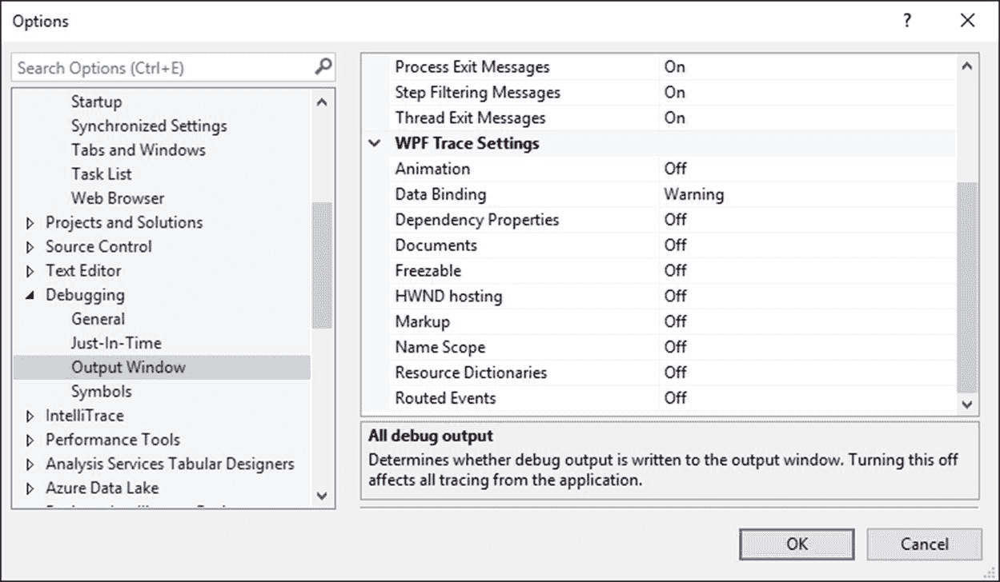
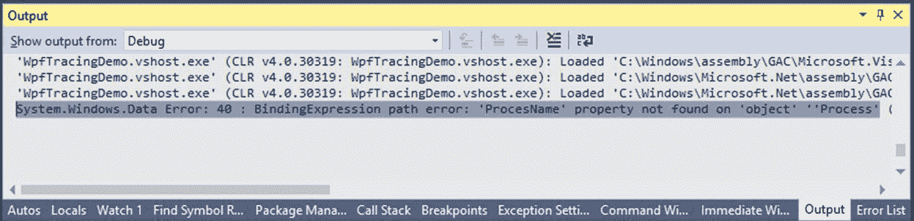
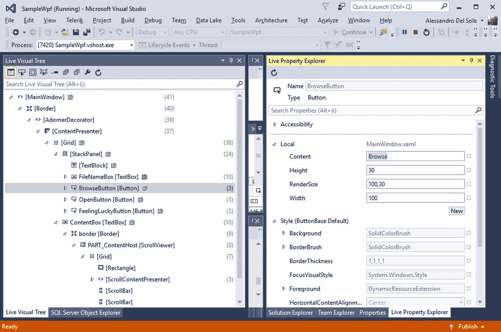
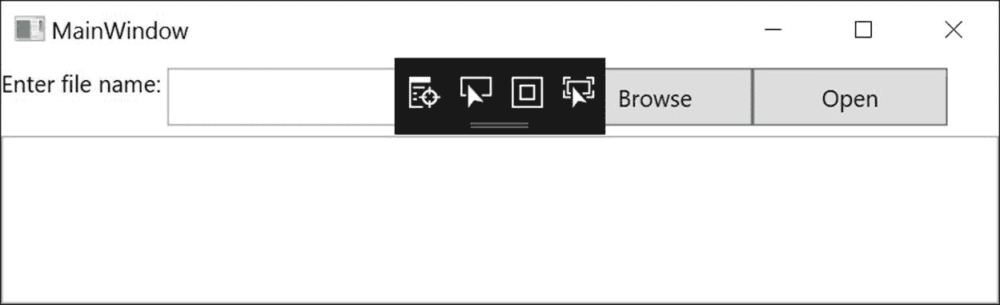
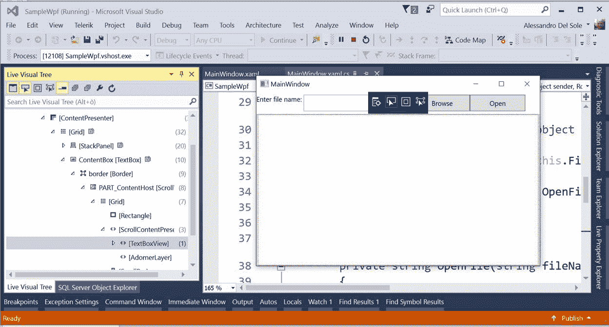
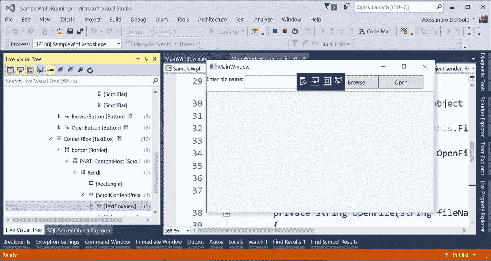

# 第五章 XAML 调试

毫无疑问，WPF 开发平台最重要的部分是用户界面。借助 WPF，您可以使用现代用户界面创建强大、美观和动态的应用程序。在设计、开发和测试应用程序的用户界面时，您可能需要在运行时检查控件、样式和模板的行为，或者您可能需要发现细微的错误，尤其是在数据绑定方面。在 Visual Studio 2015 之前，每次需要对 XAML 进行编辑时，都必须中断应用程序的执行。除非使用外部工具，否则在运行时调查可视化树是不可能的。因为在运行时调查 XAML 和可视化树非常重要，所以微软改进了 Visual Studio 2015 中的调试体验，提供了一些工具，可以更容易地理解用户界面是否按预期运行，也更容易在应用程序运行时进行更改。

|  | 注意:本章至少需要 Visual Studio 2015 更新 2。截至本文撰写之时，微软已经发布了更新 3，您可以在[https://go.microsoft.com/fwlink/?LinkId=691129](https://go.microsoft.com/fwlink/?LinkId=691129)下载。 |

## WPF 痕迹

WPF 痕迹是一个非常有用但经常被遗忘的工具。在调试时，WPF 跟踪会根据不同的详细程度向“输出”窗口发送诊断信息。例如，如果您的 XAML 有无效的数据绑定，这些将在输出窗口中报告，这使得调查(和解决)问题变得更加容易。WPF 跟踪不仅限于 XAML 和数据绑定；它实际上包括一些与 XAML 相关的跟踪场景，但它提供了更多。通过选择**工具**、**选项**、**调试**、**输出窗口**，然后滚动到 WPF 轨迹设置部分，可以启用 WPF 轨迹，如图 27 所示。



图 27:显示 WPF 跟踪设置

默认情况下，除了默认级别为“警告”的数据绑定之外，所有方案都禁用跟踪。这意味着，如果数据绑定工作不正常，输出窗口中将显示警告消息。为了理解跟踪是如何工作的，让我们考虑一个无效的数据绑定，这可能是使用该工具最常见的情况。例如，假设您有代码清单 8 中所示的`ListBox`控件，该控件用于显示机器上的活动进程列表。

代码清单 8

```cs

  <ListBox Name="FileListBox" ItemsSource="{Binding}">

  <ListBox.ItemTemplate>

  <DataTemplate>

   <!-- Binding target
  name is intentionally wrong -->

  <TextBlock Text="{Binding
  ProcesName}"/>

  </DataTemplate>

         </ ListBox.ItemTemplate >
            </ ListBox >

```

如您所见，绑定目标名称是错误的(这是出于演示目的)；其实应该是`ProcessName`，而不是`ProcesName`。列表框的数据源可以分配如下:

`FileListBox.ItemsSource = System.Diagnostics.Process.GetProcesses().AsEnumerable();`

当您运行这段代码时，输出窗口将显示一条警告消息(见图 28)，解释存在数据绑定错误，因为在名为`Process`的绑定对象上找不到名为`ProcesName`的属性。



图 28:显示 WPF 跟踪设置

|  | 提示:水平滚动输出窗口，查看完整的诊断信息。 |

WPF 跟踪告诉您，在绑定对象(在本例中为`Process`)上找不到提供的绑定源(属性名)。这将帮助您立即检测并修复问题。通过将跟踪级别从**警告**更改为**详细**，您可以获得更详细的信息。

|  | 注意:您可能认为将跟踪级别设置为“错误”会中断应用程序的执行。实际上，将跟踪级别设置为“错误”只会改变诊断信息的显示方式，不会中断执行。 |

虽然 WPF 跟踪可以在许多场景中使用，但毫无疑问，它对于无效的数据绑定和动画绑定特别有用。

## UI 调试工具

Visual Studio 2015 通过引入许多工具，极大地改善了 WPF(以及通用视窗平台)的调试体验，这些工具使用户界面在运行时的行为易于调查和更改。本节介绍 Visual Studio 2015、实时可视化树和实时属性资源管理器以及应用程序内菜单中引入的新工具窗口，这些工具窗口在 Visual Studio 2015 Update 2 及更高版本中提供。

### 实时可视化树和实时属性资源管理器

|  | 注意:为了全面讨论用户界面调试工具，请确保转到工具、选项、调试，然后选择一个名为“在实时可视化树中预览选定元素”的选项 |

Visual Studio 2015 为 WPF 调试体验引入了两个新的工具窗口:实时可视化树和实时属性资源管理器。实时可视化树显示用户界面的完整可视化树；当您在可视化树视图中选择一个元素时，Live Property Explorer 会显示所选项目的属性值的完整列表，并允许在运行时更改属性值(如果支持)，以便您可以立即看到用户界面是如何更改的。当您开始调试 WPF 应用程序时，两个窗口都应该自动可见。如果没有，您可以从调试窗口中获取它们。图 29 显示了我们之前创建的 SampleWpf 应用程序上的实时可视化树和实时属性资源管理器。



图 29:实时可视化树和实时属性浏览器

如您所见，在可视化树中选择一个项目将导致实时属性资源管理器在应用程序生命周期的确切时刻显示属性及其值。请注意，有些属性值可以在运行时更改，以便您可以立即看到用户界面如何反映这些更改。例如，图 29 显示了如何用新字符串更改按钮的`Content`属性的值，并且在运行时您将立即在用户界面中看到新值。当您在实时可视化树中选择一个元素时，在 XAML 编辑器中会选择相应的代码行(您也可以通过右键单击该元素，然后选择查看源代码来实现这一点)。在 Visual Studio 2015 更新 2 之前，与实时可视化树和实时属性资源管理器交互需要您将焦点从活动窗口移动到 Visual Studio。正如我们将在下一节中看到的，这种情况已经得到了改善。

### XAML 应用内菜单

Visual Studio 2015 更新 2 引入了应用程序内菜单，这是一个工具，可以更容易地在运行时检查您的 XAML 的行为。该工具由一个窗格组成，该窗格在调试时显示在窗口上，并提供了一些按钮，稍后将对此进行讨论。图 30 显示了应用程序内菜单。

|  | 提示:在基于 XAML 的平台(如 WPF 和通用视窗平台)中，默认情况下会启用应用内菜单。如果要禁用它，请转到工具、选项、调试，然后取消选择“在应用程序中显示运行时工具”选项。 |



图 30:应用内菜单展开

应用程序中的菜单当然可以最小化，这有助于我们避免覆盖用户界面的部分，但现在让它保持打开。菜单有四个按钮(在接下来的段落中从左到右描述)。

#### 转到实时视觉树

顾名思义，该按钮只是打开实时可视化树工具窗口。我建议您停靠实时可视化树窗口，这样您将立即看到下一个按钮的结果。

#### 启用选择

此按钮允许您在用户界面上选择控件。当您选择一个控件时，它会被红色边框包围，并且“实时可视化树”窗口会自动在可视化树中显示所选控件。图 31 显示了一个例子。



图 31:在应用程序内菜单中启用选择

#### 显示布局装饰

此按钮允许您突出显示控件的表面。如果与“启用选择”结合使用，控件将被突出显示并选中。这对于理解控件的分隔符很有用。图 32 显示了一个基于两个按钮组合的例子。



图 32:显示布局装饰

#### 轨迹聚焦元素

“轨迹聚焦”元素与“启用选择”类似，它允许选择一个控件并反映实时视觉树中的选择，但它只允许选择可以接收焦点的控件(例如，`TextBox`控件)。

### XAML 编辑并继续

Visual Studio 的新版本包括一个名为 **XAML 编辑并继续**的新功能。此功能允许在调试时编辑 XAML 中的一些属性值，更改会立即反映在应用程序的用户界面中。例如，您可能希望看到在运行时更改样式或控件模板如何影响用户界面。

## 章节总结

对于 WPF 来说，调试不仅意味着调查代码中的错误和检查错误。这也意味着检查用户界面的设计和行为是否符合预期，这包括在调试时分析控件和 XAML。Visual Studio 2015 和 2017 具有特定的工具，使这项任务成为一种舒适的体验。使用 WPF 跟踪工具，您可以很容易地检测到您的 XAML 代码中的错误，尤其是对于数据绑定。“实时可视树”和“实时属性资源管理器”工具窗口表示可视树，并在支持的情况下更改用户界面元素的属性值。通过新的应用程序内菜单，可以更轻松地与两个窗口进行交互，该菜单提供的按钮可以轻松地将控件映射到 XAML 代码和可视化树元素。