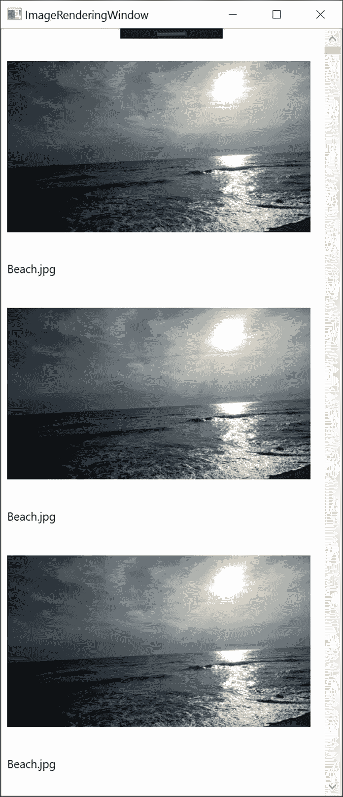
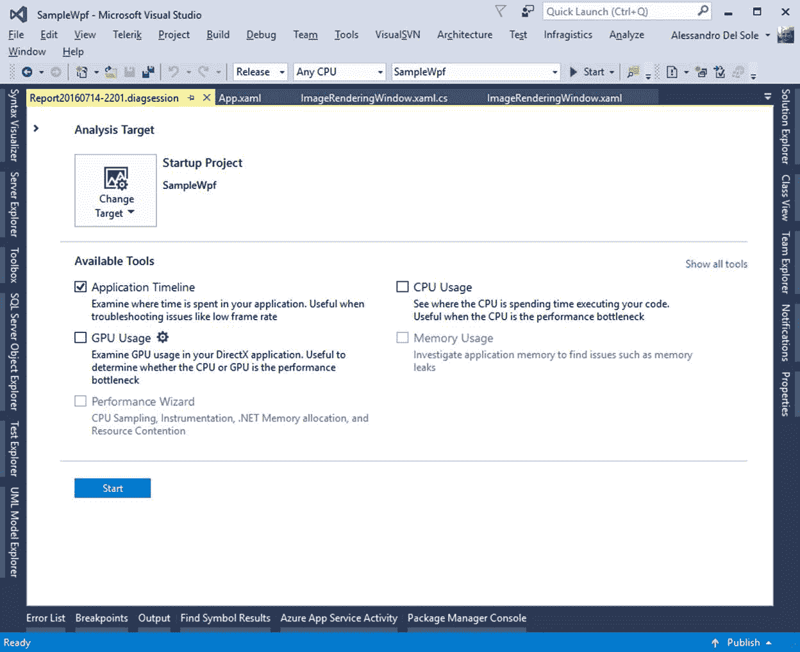
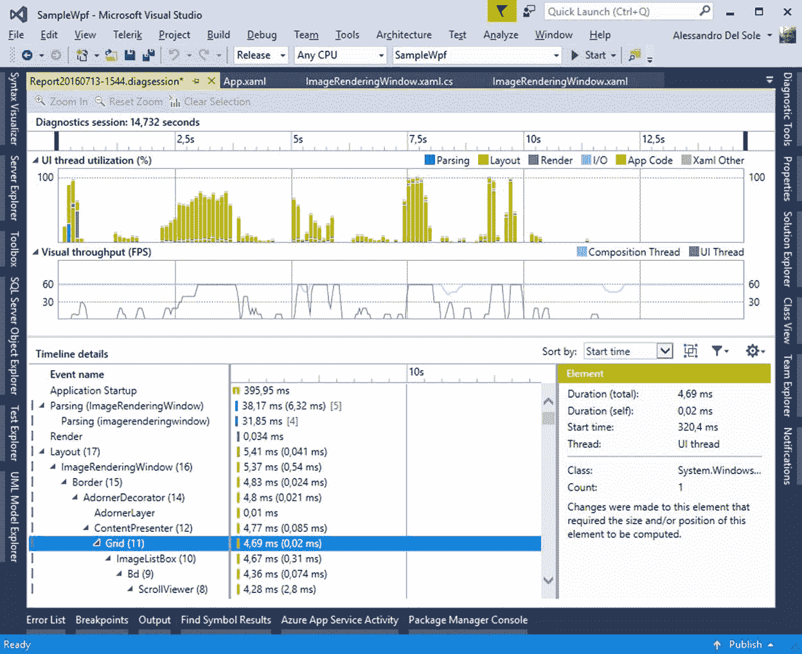
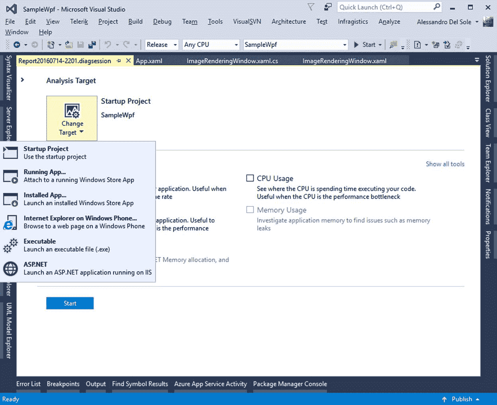
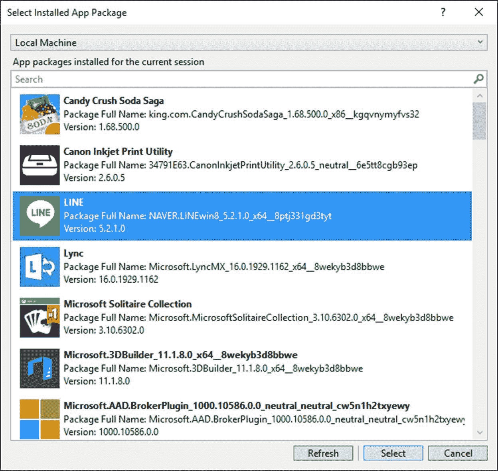

# 六、用户界面性能分析

WPF 支持多媒体、动画和文档。它还提供了一个非常强大的数据绑定引擎，内置了针对长数据列表的虚拟化。如果您的应用程序使用数百个用户界面元素，包括动画、多媒体和数据绑定控件，您必须意识到可能的性能问题。用户界面可能会变慢，感知到的性能可能会变得乏味。幸运的是，Visual Studio 有一个名为“应用程序时间线”的有趣工具，它允许您分析用户界面性能，从而更容易改善用户体验。

## 准备一个例子

我们之前的示例应用程序非常简单，它的用户界面不会有明显的性能问题。因此，准备一个做更密集工作的窗口是个好主意。首先，在解决方案资源管理器中，右键单击项目名称并选择**添加**、**窗口**。出现“添加新项目”对话框时，输入 ImageRenderingWindow.xaml 作为名称。该窗口的目标是在一个`ListBox`中显示 1000 幅图像，以分析 WPF 渲染引擎是如何工作的。您只需要这个控件和一个显示图像及其文件名的简单数据模板。代码清单 9 显示了新窗口的完整 XAML。

代码清单 9

```cs
  <Window x:Class="SampleWpf.ImageRenderingWindow"

   xmlns:x="http://schemas.microsoft.com/winfx/2006/xaml"

   xmlns:d="http://schemas.microsoft.com/expression/blend/2008"

   xmlns:mc="http://schemas.openxmlformats.org/markup-

  compatibility/2006"

   xmlns:local="clr-namespace:SampleWpf"

   mc:Ignorable="d"

   Title="ImageRenderingWindow" Height="300" Width="300">

  <Grid>

     <ListBox Name="ImageListBox" ItemsSource="{Binding}">

  <ListBox.ItemTemplate>

  <DataTemplate>

  <StackPanel Orientation="Vertical">

  <Image Width="320" Height="240" 

             Source="{Binding ImagePath}"/>

  <TextBlock Text="{Binding
  ImageName}" />

  </StackPanel>

  </DataTemplate>

  </ListBox.ItemTemplate>

  </ListBox>  

  </Grid>
  </Window>

```

`ListBox`的数据模板需要一个具有两个属性的类——一个用于图像路径，一个用于图像文件名。该类被称为`ImageFile`，在代码清单 10 中与一个名为`ImageFileCollection`的集合一起定义。

代码清单 10

```cs

  public class   ImageFile

  {

  public  Uri  ImagePath { get; set ; }

  public string  ImageName { get; set ; }

  }

  public class   ImageFileCollection:  ObservableCollection <ImageFile>

  {

  public ImageFileCollection()

  {          

  for (int
  i=0; i <= 1000; i++)

  {

   // Replace with a file
  you have on your pc.

  this.Add(new
   ImageFile { ImageName="Beach.jpg",

  ImagePath = new  Uri ("Beach.jpg", UriKind .Relative) });

  }

  }

  }

```

仅出于演示目的，`ImageFileCollection`类填充了 1000 个相同图像的实例，以减少开销。现在，通过编辑 App.xaml 文件中`Application`节点的`StartupUri`属性，使新窗口成为应用程序的启动对象，如下所示:

`StartupUri="ImageRenderingWindow.xaml"`

接下来，编辑新的`Window`的构造函数，如代码清单 11 所示，以便分配一个新的`ImageFileCollection`作为数据源。

代码清单 11

```cs

  public ImageRenderingWindow()

  {

  InitializeComponent();

  this.DataContext = new   ImageFileCollection();

   }

```

准备就绪后，启动应用程序。它应该如图 33 所示。



图 33:显示 1000 个图像实例的示例应用程序

接下来，让我们研究如何使用集成的 Visual Studio 工具分析用户界面性能。

## 应用时间线工具

Visual Studio 2015 为 WPF 带来了一个名为 XAML 用户界面响应工具的诊断工具。它最初是为 Windows 商店应用程序开发的，并在 Visual Studio 2013 中引入；当然，它在 2017 版中仍然可用。现在，这个工具被称为应用程序时间线(或更简单地说，时间线)，您可以在您的 WPF 应用程序中利用它。时间线工具分析应用程序的行为，以帮助您检测它在哪里花费时间。虽然这个工具可以检测诸如(但不限于)启动、磁盘输入/输出和呈现用户界面(包括线程利用率)等事件，但它的重点是更详细地研究用户界面行为。为了了解它是如何工作的，按 ALT+F2(或**调试**、**性能分析器**)显示所谓的诊断中心，其中包含一系列性能分析工具，然后选择**应用时间线**(见图 34)。

|  | 提示:如果它看起来被禁用，请确保您首先取消选择任何其他诊断工具。 |



图 34:选择应用程序时间线

因为时间轴是一个专门的探查器，为了获得准确的结果，您应该首先将项目的输出配置从调试更改为发布。准备就绪后，单击**启动**，这样应用程序将从附加的概要文件实例开始。当应用程序启动并且所有图像都已加载时，使用用户界面播放一点，例如，调整窗口大小或滚动图像列表。当您的应用程序在不同情况下工作了一段时间后，单击 Visual Studio 中的**停止收集**超链接。几秒钟后，您将获得一个非常详细的可视化报告(参见图 35 中的示例)。



图 35:由应用程序时间线生成的报告

该报告由四个主要区域组成:诊断会话、用户界面线程利用率、视觉吞吐量(FPS)和时间线详细信息。让我们更彻底地讨论一下。

### 诊断会话

诊断会话报告显示有关诊断会话持续时间的信息。您可以使用黑色标记来分析应用程序生命周期中的特定时间间隔。当您选择特定的时间间隔时，其他区域将自动显示该时间间隔的诊断信息。

### UI 线程利用率

用户界面线程利用率部分给出了运行时管理的不同任务利用用户界面线程的百分比。您可以了解 XAML 解析器消耗了多少资源(蓝色)，渲染用户界面消耗了多少资源(深橙色)，执行应用程序代码消耗了多少资源(浅绿色)，磁盘 I/O 消耗了多少资源(浅蓝色)，以及与 XAML 相关的其他任务消耗了多少资源(非解析)。结合诊断会话报告，这对于了解在应用程序生命周期的指定时间间隔内，代码的哪些部分对整体性能有最大的负面影响非常有用。例如，在图 35 中，您将看到在应用程序启动后的 7.5 秒钟渲染布局有一个重要的影响，这是渲染 1000 个图像的时间点。

### 视觉吞吐量(FPS)

本节显示了在应用程序生命周期中每秒渲染多少帧(FPS)。对于计时，您可以将诊断会话作为参考。这个工具非常简单——它可以在用户界面线程和合成线程中显示框架。如果将鼠标指针放在图形上，您将看到一个工具提示，显示给定时间两个线程的每秒帧数。

|  | 注意:如果你不熟悉合成线程，它是用户界面线程的伴随线程，因为它做了一些本应由用户界面线程完成的工作。合成线程通常负责组合图形纹理，并将它们发送到图形处理器进行渲染。这都是由运行时管理的；通过调用合成线程，运行时可以使应用程序保持更高的响应速度，而您(开发人员)不需要手动做任何额外的工作。 |

### 时间线详细信息

在报告的底部，您会发现时间轴详细信息，它提供了有关应用程序生命周期中的事件以及此类事件中涉及的 UI 元素的更多信息。更具体地说，您可以看到事件和用户界面元素的列表。对于每一个，您可以看到以毫秒为单位的时间。例如，如果您考虑图 35，您可以看到应用程序启动事件需要 395.95 毫秒。有些事件(如布局)被分成多个部分，这是很典型的，因为呈现布局需要两个异步运行的不同线程(用户界面和合成)。这意味着每个节点都可以扩展以获取更多信息。当您展开布局节点时，您还会看到该特定事件中涉及的用户界面元素的可视化树。

这些用户界面元素可以展开以显示嵌套的控件和类型。单击事件或对象时，您还会在报告的右侧看到详细信息，包括对象实例的数量、包含的。NET 类型，以及呈现用户界面元素所需的时间。例如，如果您再次考虑图 35，您将在报告的右侧看到一个`Grid`的描述，该描述当前在 UI 元素列表中被选中；这样的描述还显示了渲染这个`Grid`所花费的时间(以毫秒为单位)，负责绘制元素的线程(本例中是 UI 线程)，以及计数，这是一个实例。可以选择发现创建了多少个对象实例，这将有助于您了解哪些用户界面元素可能会对整体用户界面性能产生负面影响。

### 更改分析目标

诊断中心中列出的分析工具可以针对许多可能的目标运行。如果您查看图 34，您将看到一个名为“更改目标”的按钮。单击此按钮，您将看到可能的分析目标列表，例如正在运行或已安装的 Windows Store 应用程序、现有的。exe 文件，甚至是一个运行在 IIS 上的 ASP.NET 应用程序(见图 36)。



图 36:可能的分析目标

应用程序时间表只能针对前三个目标运行:启动项目、运行应用程序和安装的应用程序。“运行应用”和“已安装应用”都是指 Windows 商店应用，而不是 WPF 应用。更准确地说，请注意，如果您选择已安装的应用程序，系统会提示您机器上已安装的 Windows Store 应用程序列表(包括通用 Windows 应用程序)，如图 37 所示。



图 37:选择一个已安装的 Windows 商店应用程序作为分析目标

只需选择一个应用程序，点击**选择**，然后使用应用程序时间线开始诊断会话。

## 章节总结

性能是任何专业应用程序最重要的方面之一。你可以构建一个漂亮的应用程序，但是如果它运行缓慢或没有响应，客户和用户会非常不满意。对于用户界面本身支持媒体、文档和 XAML 数据绑定的 WPF 应用程序来说，这一点更加重要。为了帮助您分析应用程序中用户界面的性能，Visual Studio 2015 附带了一个名为“应用程序时间线”的工具，该工具分析启动和磁盘输入/输出等事件，但侧重于呈现应用程序用户界面所需的时间，这将使您能够了解在应用程序生命周期的特定点上哪些元素正在消耗哪些资源。通过分析时间轴生成的报告，您将能够理解用户界面的哪些部分需要重新构建，以改善客户体验。