# 七、应用性能分析

我们已经看到了应用程序时间线工具如何提供一种方便的方法来分析应用程序在其生命周期中的用户界面行为。这一点尤其重要，尤其是对感知性能而言，但应用程序不仅仅是用户界面。您可能有一个简单的用户界面，其中的代码可以处理数百个对象，但这可能会导致内存泄漏，或者您的应用程序可能会执行 CPU 密集型工作。在这种情况下，分析内存分配和 CPU 利用率既有用又重要。本章提供了有关 Visual Studio 中内置分析工具的指导，这些工具将帮助您解决与内存分配和 CPU 利用率相关的问题。

## 调查内存分配

理解应用程序如何使用内存是构建高性能应用程序最重要的步骤之一。Visual Studio 提供了一个名为“内存使用情况”的分析工具，您可以在诊断中心找到该工具，并且可以通过按 Alt+F2(或**调试**、**性能分析器**来查看该工具。图 38 显示了如何启用该工具。

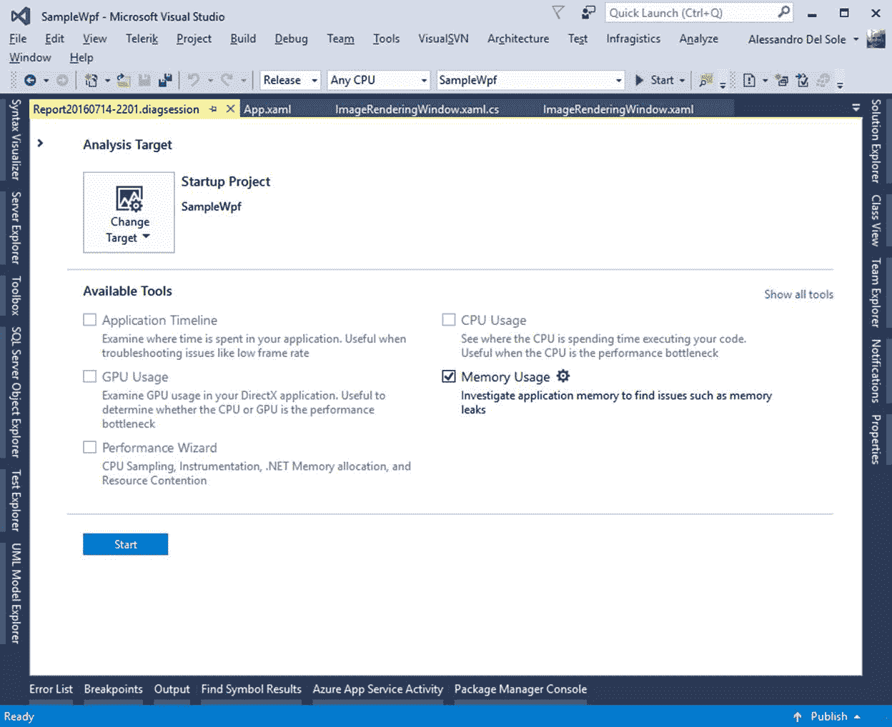

图 38:选择内存使用作为分析工具

确保选择了释放配置，然后单击**开始**开始诊断会话。几秒钟后，您将看到 Visual Studio 显示了活动图，并立即开始报告整个应用程序生命周期中的内存使用情况(见图 39)。

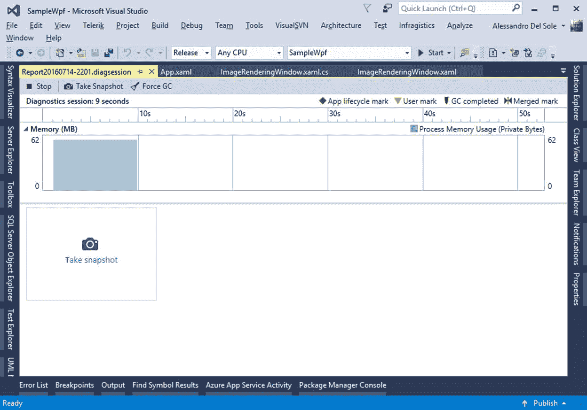

图 39:内存使用报告内存使用

这种报告对于确定内存使用是增加还是减少非常有用，但是该工具的最大好处是它能够在特定时间点拍摄内存快照。您可以通过点击**拍摄快照**来实现这一点。每个快照都包含关于对象实例和托管堆大小的信息，通过将该快照与以前的快照进行比较，我们可以看到使用的内存量是增加了还是减少了。图 40 显示了捕获两个快照的结果。

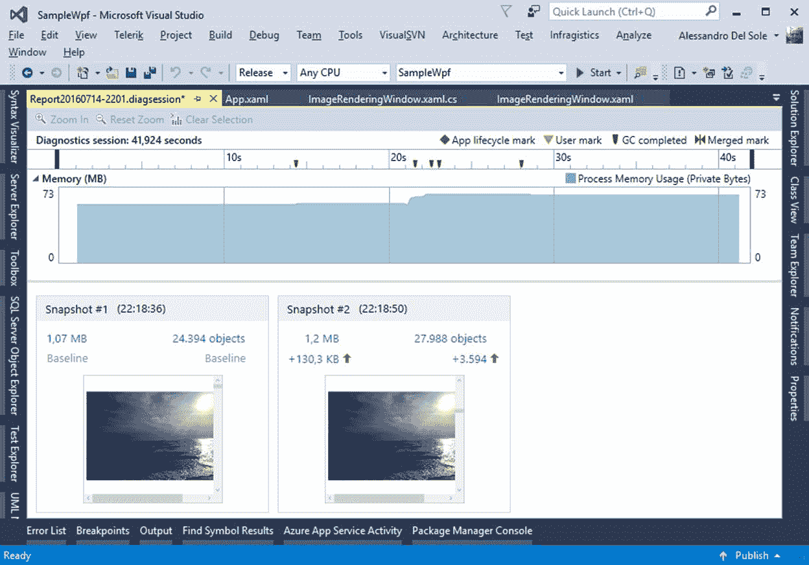

图 40:再次报告内存使用情况

以下是一些重要的注意事项:

*   诊断会话区域报告会话持续时间和信息，如应用程序事件和对垃圾收集器的调用。图 40 显示了由红色三角形标记指示的垃圾收集是如何执行五次的。如果你用鼠标悬停在一个标记上，你会得到一个工具提示，解释垃圾收集的原因。工具提示是不言自明的，可以更容易地理解每次垃圾收集的原因。过多的垃圾收集可能是内存使用不良的症状。
*   每个快照在左侧显示托管堆的大小，在右侧显示分配的对象数量。在多个快照的情况下，它们还显示托管堆的大小和对象实例数量之间的差异。
*   您可以单击托管堆大小和对象列表来获取详细信息，并且可以直观地比较快照。

让我们详细讨论最后这一点。

### 调查托管堆大小

通过单击托管堆大小，您可以获得拍摄快照时堆大小的表示，如图 41 所示。该视图关注对象的分配顺序，而不是它们的计数。

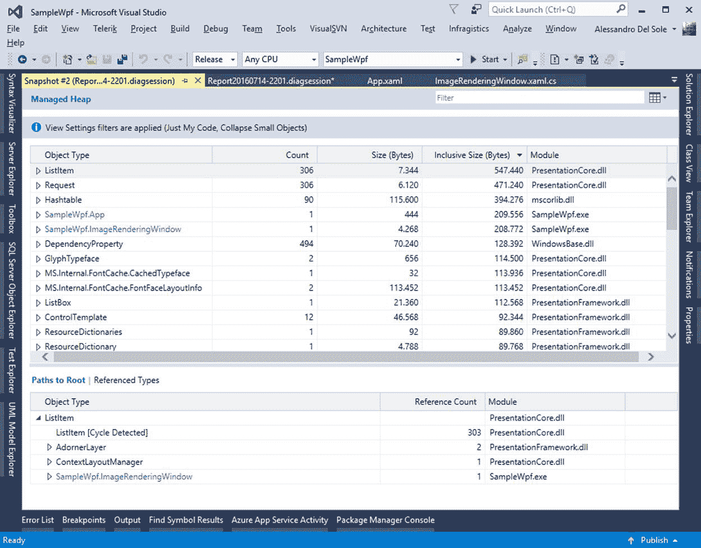

图 41:快照时托管堆中的对象

除此之外，您可以看到`ListItem`类型有 306 个对象。因为应用程序正在一个`ListBox`控件中加载大量图像，这当然是一个预期的行为，所以我们不会担心。但是，如果您有大量意外的实例化对象，这个视图就会变得很有用——通过了解类型，可以更容易地理解代码是否在创建不必要的对象实例。每个对象都可以扩展，以获得关于单个实例的更多信息。请注意，报告提供了两个名为“大小”和“包含大小”的列。“大小”列显示对象的实际大小，而“包含大小”汇总对象大小和子对象的大小。在视图的底部，有一个名为“根路径”的辅助网格。顾名思义，它显示选定对象的父项和引用计数。“引用的类型”选项卡向您显示选定对象引用的类型列表。

### 分析对象计数

如果您返回报告并单击快照中的对象列表，您将获得一个更关注对象计数的视图(参见图 42)。

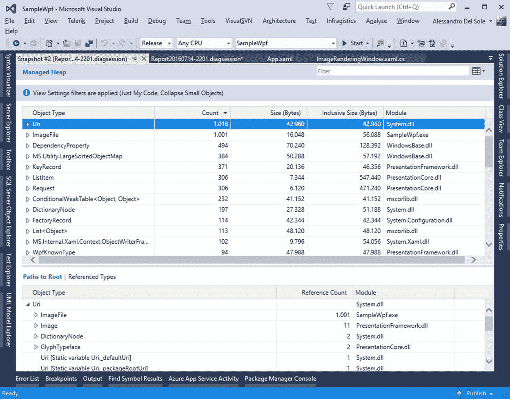

图 42:快照时的对象计数

此视图让您可以立即了解快照时分配的对象数量，但上一节中所做的考虑同样适用于对象计数视图。在这种特定情况下，您可以看到实例化对象的数量与应用程序加载的大量图像一致，因此这并不奇怪。但是，如果您看到一个类型被意外地实例化了太多次，您就有机会研究您的代码，以便了解它在哪里以及为什么要创建这么多实例。

### 比较快照

查看单个快照的详细信息对于了解内存在应用程序生命周期的特定点是如何使用的当然很有用，但是对于了解两个快照之间是否有更多或更少的对象实例可能更有用。内存使用工具提供了一个非常容易比较两个快照的选项。为此，右键单击一个快照，选择**与**比较，然后从出现的列表中选择一个快照。图 43 显示了我为示例应用程序拍摄的两个快照之间的比较结果。

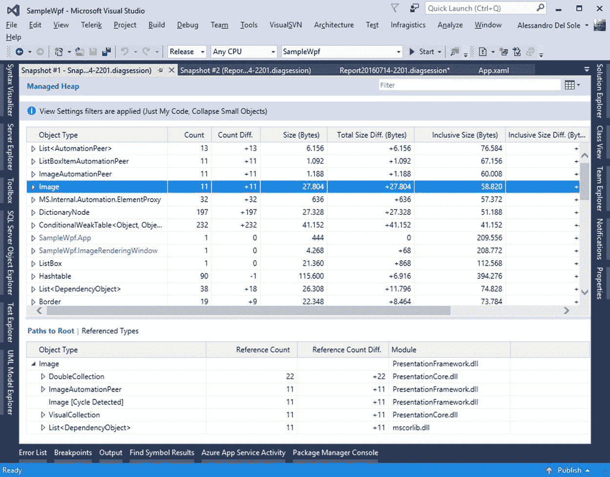

图 43:比较快照

“计数”列显示选定快照中对象的实例数，而“计数差异”。显示了与其他快照的计数差异。同样，大小和总大小不同。显示对象所有实例的当前总大小以及与前一个快照的差异。最后，包容大小和包容大小不同。显示对象实例和子对象的当前总大小，并显示与以前快照的差异。这可能是使用内存使用情况得到的最重要的报告，因为它允许您确定在应用程序生命周期的不同时间间隔内，对象是否有正常或意外的行为。

|  | 注意:任何诊断工具生成的报告都可以保存，以便以后分析和比较。Visual Studio 将报表存储到。诊断会话文件，稍后可以在集成开发环境中重新打开。这不仅限于内存使用工具，本章中描述的所有诊断工具也是如此。 |

## 分析 CPU 利用率

在某些情况下，您可能想要检测 CPU 在哪里花时间执行您的代码。诊断中心中可用的工具之一是中央处理器使用率。正如您在图 44 中看到的，这个工具使得在密集工作的情况下分析 CPU 使用更容易。

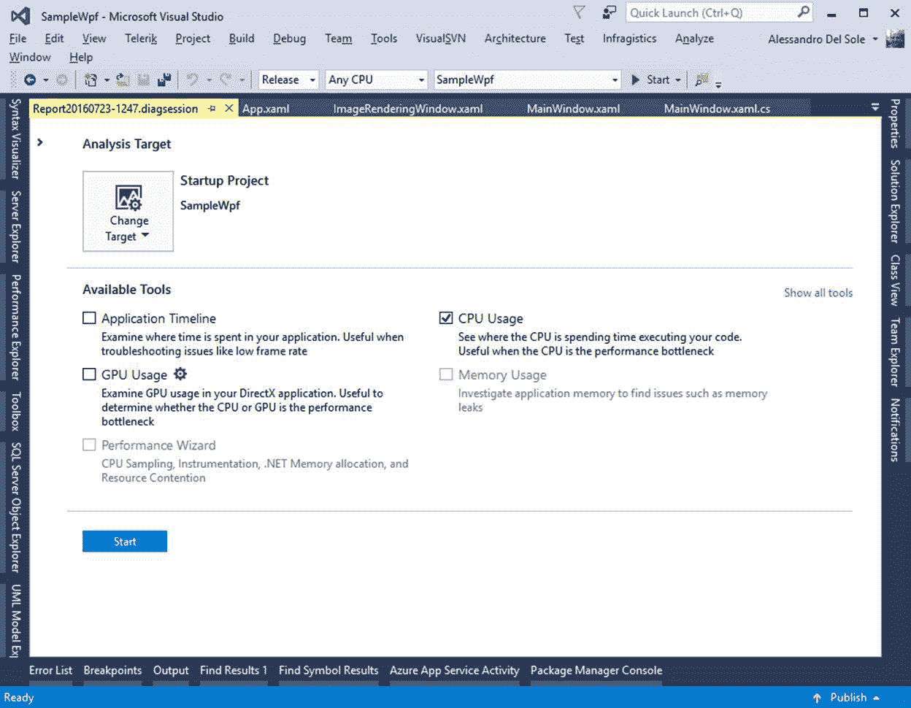

图 44:启用中央处理器使用诊断工具

在继续之前，让我们向模拟密集 CPU 工作的示例应用程序添加一些代码。添加如代码清单 12 所示的方法，并确保在将`ImageFileCollection`赋值给窗口的`DataContext`属性后调用这样的方法。`System.Threading.Thread.SpinWait`方法使正在运行的线程等待指定的毫秒数，这在一个 10，000 次迭代的循环中重复，目的是导致 CPU 开销。

代码清单 12

```cs

  private void
  SimulateIntensiveWork()

  {

  var watch = new   Stopwatch();

  watch.Start();

  for (int
  i=0; i < 10000; i++)

  {

   //Simulates intensive
  processing.

  System.Threading. Thread.SpinWait(800000);

      }
               watch.Stop();
           }

```

准备好之后，点击诊断中枢中的**启动**。您将看到 Visual Studio 如何开始在实时图表中报告 CPU 使用情况。等待 30-40 秒，然后停止诊断会话。完成后，Visual Studio 会给出一个详细的报告，如图 45 所示。

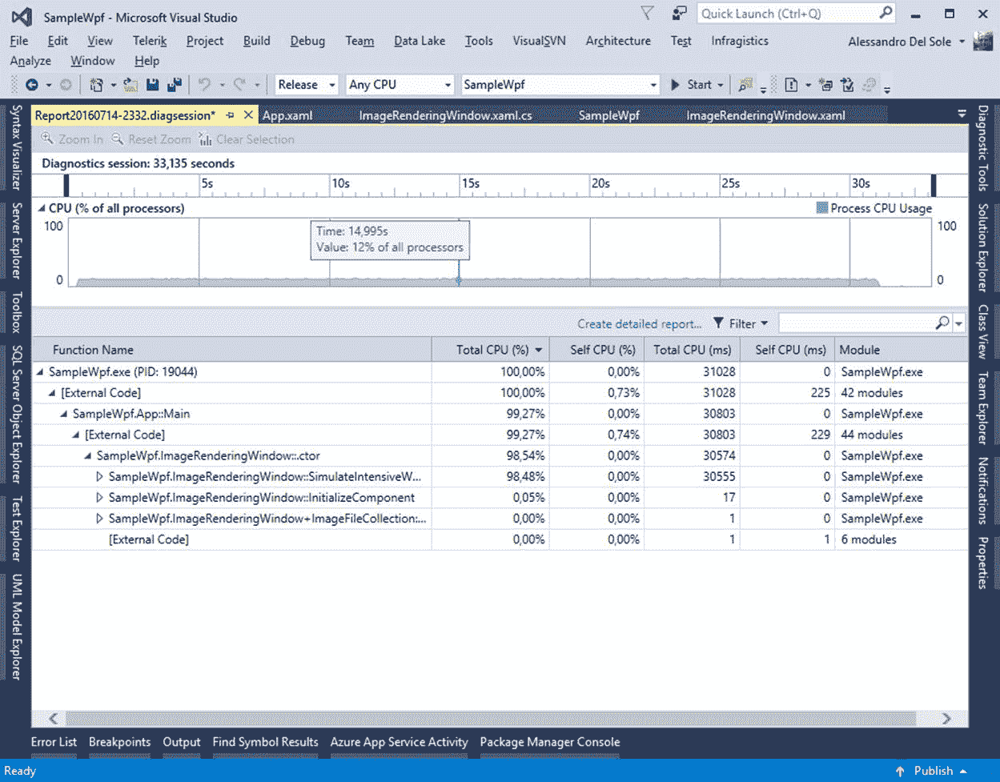

图 45:调查中央处理器使用情况

在顶部，报告显示了诊断会话的持续时间和应用程序生命周期中的 CPU 利用率。在底部，您可以看到方法调用的列表，包括构造函数和外部代码，以及它们导致的 CPU 使用情况。在这种特殊情况下，`SimulateIntensiveWork`方法导致了 CPU 更密集的工作。该报告显示五列:

*   总 CPU (%)，显示由所选函数及其调用的函数导致的使用百分比。
*   自身 CPU (%)，显示由所选函数导致的使用百分比，不包括它调用的函数。
*   总 CPU(毫秒)，显示由于所选函数及其调用的函数而导致 CPU 繁忙的时间(毫秒)。
*   自我中央处理器(毫秒)，显示中央处理器因所选功能而忙碌的时间(毫秒)，不包括它调用的功能。
*   模块，显示包含所选功能的组件名称或引用的外部模块数量。

可以很容易地想象，一个函数导致 CPU 越忙，就越应该在代码中分析它，看看它是否正在执行预期的、大量的工作，或者是否出现了瓶颈。

## 分析 GPU 性能

图形处理单元(GPU)是您机器上的视频卡，可以渲染您在屏幕上看到的任何内容，从文本和窗口到视频和图像。对于密集使用图形处理器的应用程序，尤其是媒体和游戏应用程序，您可以利用名为“图形处理器使用”的诊断工具，该工具可在诊断中心获得(见图 46)。

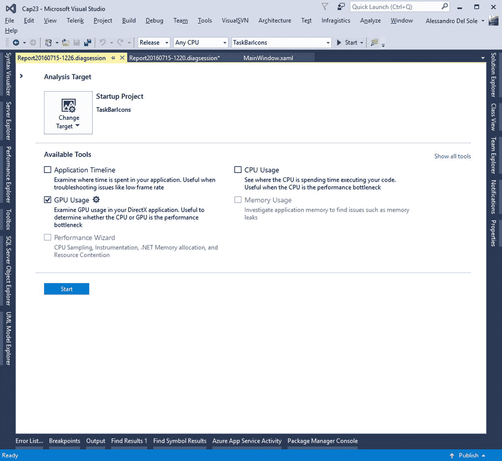

图 46:启用图形处理器使用

该工具的主要目的是分析大量使用 DirectX 图形库的应用程序。尽管 WPF 在幕后调用了 DirectX，但除非你编写三维图形和动画，否则你从 GPU 使用中获得的信息是有限的。但是，您绝对可以获得任何 WPF 应用程序中 GPU 利用率的信息，这些应用程序可以处理视频、动画，更一般地说，还可以处理媒体内容。

|  | 提示:这本书的目标是涵盖常见的 WPF 场景，而不是特定的开发环境，如游戏或三维图形。如果你想看一个更具体的 WPF 图形处理器使用的例子，你可以查看[演练:在 MSDN 的 WPF](https://msdn.microsoft.com/en-us/library/cc656785(v=vs.110).aspx) 托管 Direct3D9 内容。 |

当您单击**开始**时，Visual Studio 开始收集实时图表中立即报告的关于 GPU 利用率的信息。图 47 显示了播放视频时基于 WPF 应用程序的示例报告。

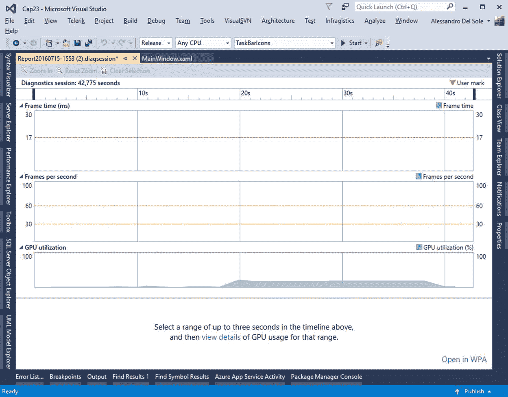

图 47:实际的图形处理器利用率

诊断会话区域仍然报告应用程序生命周期的持续时间。利用 DirectX，您可以看到以毫秒为单位的帧时间和给定时间的每秒帧速率。在这种情况下，您只能在 GPU 利用率区域获得信息。利用率是由于视频播放。在分析 GPU 利用率的详细信息之前，您需要选择一个小的时间间隔，最多三秒，然后单击**查看详细信息**超链接。此时，您将看到 GPU 利用率的详细报告，如图 48 所示。如果您的代码直接使用 DirectX，您将获得每个标记的详细信息。在这种情况下，您可以看到 GPU 在选定的时间帧内一直忙于解码视频，并且可以看到工作中涉及的线程。您可以将鼠标悬停在每个标记上以查看其他详细信息(如果可用)。在底部，有一个事件列表；在这种情况下，所有事件统称为 GPU 工作，但在直接调用 DirectX 库的情况下会更详细。

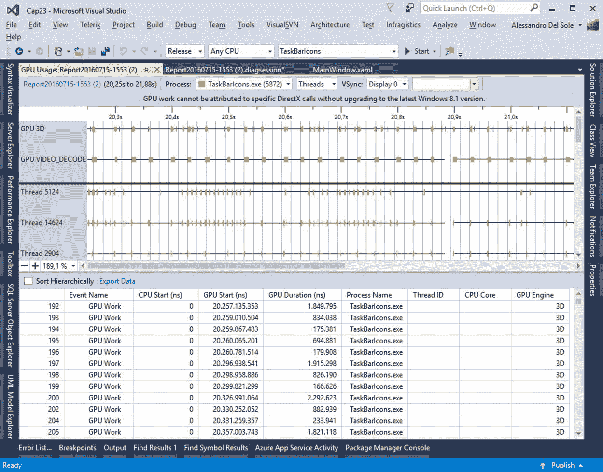

图 48:报告图形处理器的工作

## 关于性能向导的提示

Visual Studio 2015 从其前身继承了一种称为性能向导的分析工具。该工具已经用现代用户界面进行了更新，但它执行的分析会话本质上类似于内存使用和 CPU 利用率，此外还有几个诊断工具，我将很快描述。在幕后，性能向导依赖于名为 VsPerf.exe 的 Visual Studio 探查器。这是一个命令行工具，可以在没有安装 Visual Studio 的机器上运行，例如服务器。性能向导在诊断中心启用，如图 49 所示。

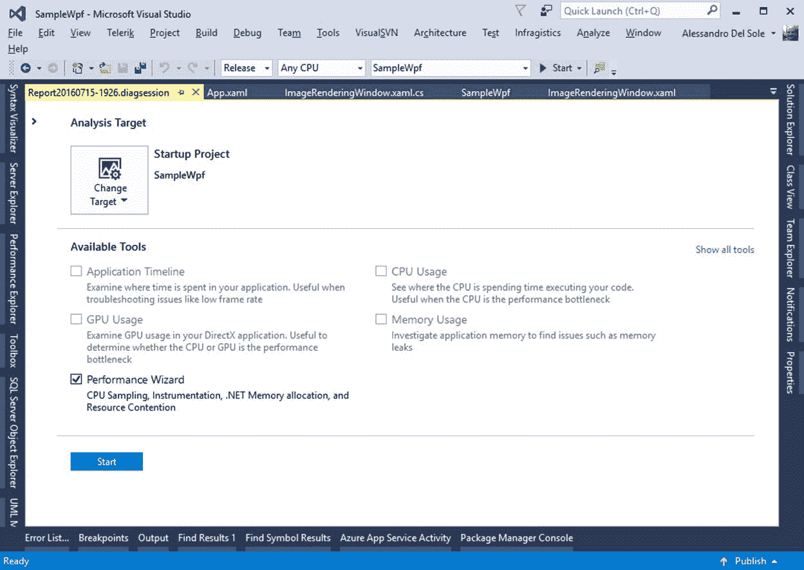

图 49:启用性能向导

性能向导提供以下诊断工具:

*   **CPU 采样**，可以分析 CPU 使用情况。
*   **仪表**，测量功能调用计数和计时。
*   **。NET 内存分配**，跟踪托管内存分配。
*   **资源争用数据**，用于检测等待其他线程的线程。

我就不讨论 **CPU 采样**和**了。NET 内存分配【这里的 T3】；您已经看到了如何使用内存使用和 CPU 使用，这是针对 Windows Store 应用程序的更新工具，而性能向导没有。当您单击开始时，Visual Studio 通过要求您选择分析方法来启动性能向导(参见图 50)。**

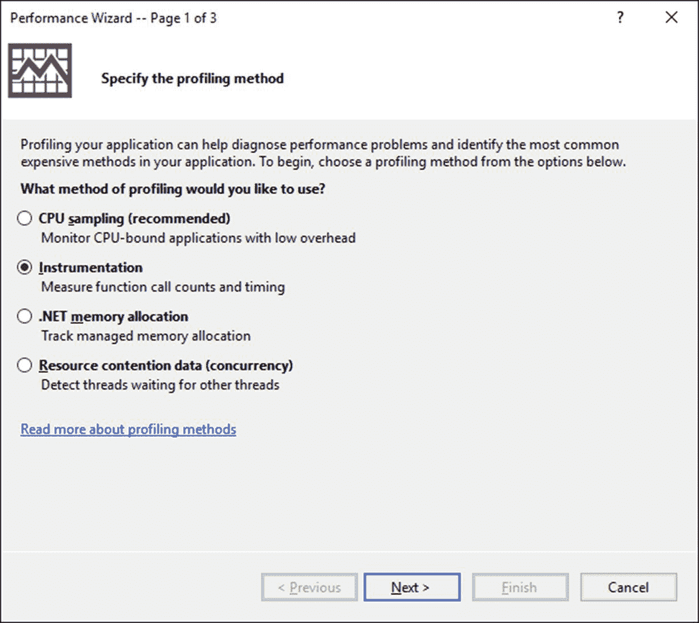

图 50:指定分析方法

选择**仪器**，这对于检查执行最独立工作的功能很有用。单击**下一步**时，系统会要求您指定分析目标。您可以在当前项目中保持默认选择不变，但也可以指定不同的。exe 文件，一个 ASP.NET 应用程序，甚至一个. dll 库。完成向导并开始分析。当应用程序运行时，Visual Studio 收集关于函数调用的信息。您可以简单地通过关闭应用程序来结束诊断会话，并且您将获得一份完成最独立工作的函数的详细报告，如图 51 所示。

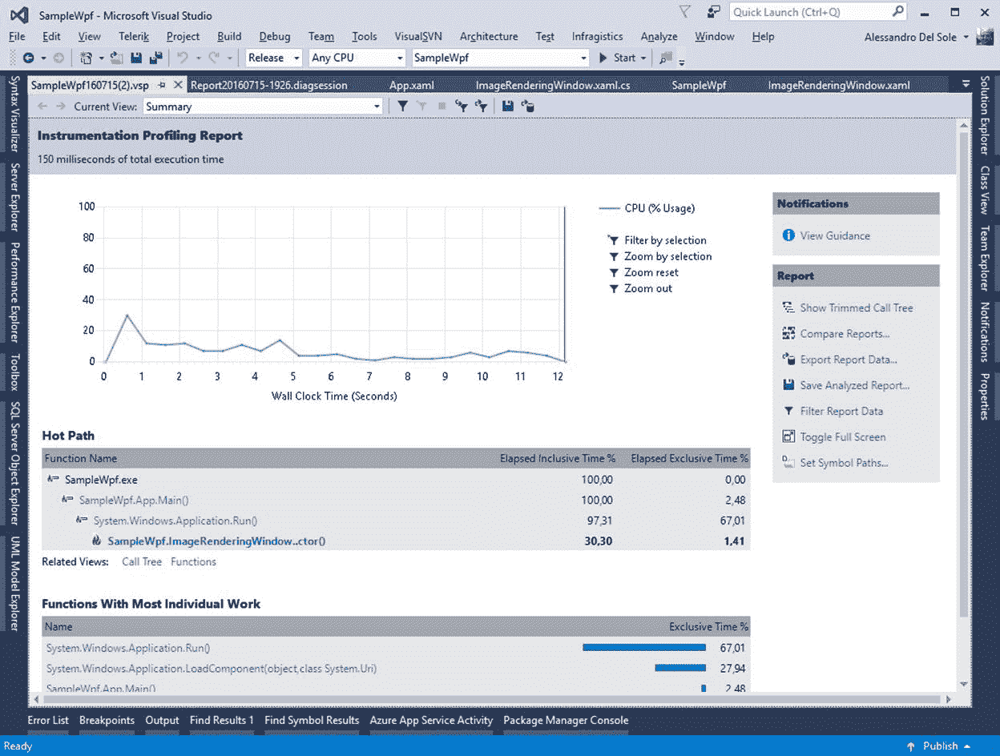

图 51:完成最多个人工作的函数

**资源争用数据**工具显示了关于线程并发性的信息——线程正在等待其他线程——具有竞争最激烈的资源和竞争最激烈的线程，如图 52 所示。

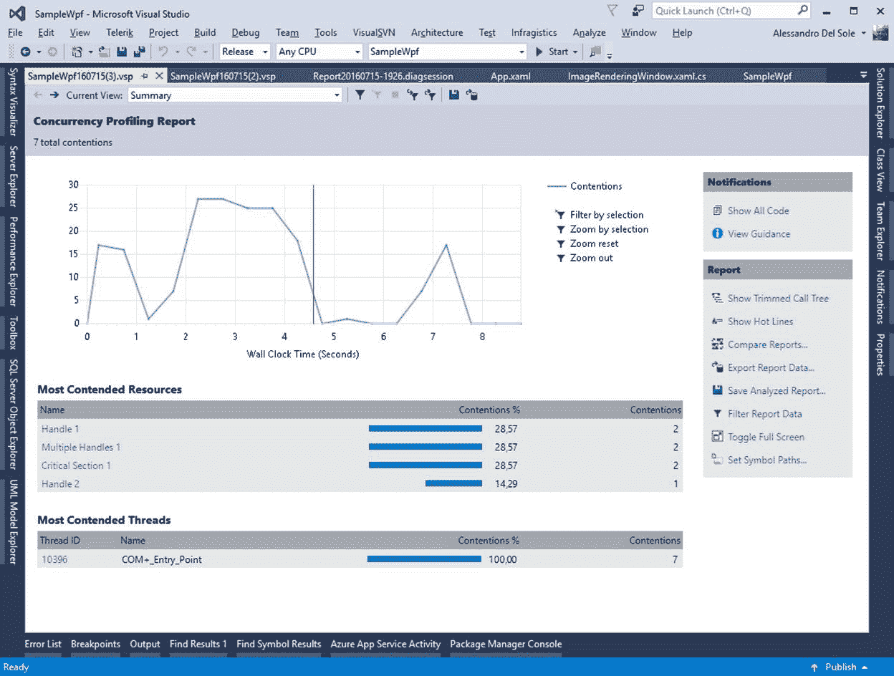

图 52:理解线程并发和竞争资源

当然，这个工具对于创建多线程来完成某些工作的应用程序特别有用。

### 性能资源管理器窗口

每次使用性能向导启动性能分析会话时，Visual Studio 都会将报告收集并组织到性能资源管理器工具窗口提供的方便视图中，该视图应该是自动可见的，您也可以通过选择调试、性能分析器、性能资源管理器、显示性能资源管理器来启用它(参见图 53 中的示例)。

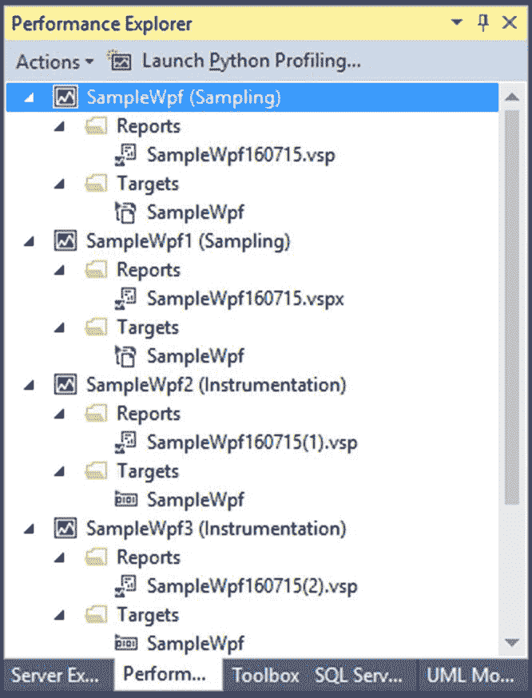

图 53:性能浏览器工具窗口

如您所见，性能资源管理器根据分析会话的目标和配置文件提供了一个分类视图。您可以简单地双击一个报告文件来打开相应的查看器。您也可以通过右键单击报告名称，然后选择比较性能报告来比较报告。

## 章节总结

分析 WPF 应用程序的性能是一项重要的任务，Visual Studio 通过提供许多诊断工具再次展示了它的强大功能。使用内存使用工具，您可以调查应用程序如何使用内存，并且更容易发现内存泄漏。使用中央处理器使用工具，您可以检查您的应用程序是否正在执行意外的中央处理器密集型工作。使用图形处理器使用工具，您可以分析应用程序如何消耗图形处理器资源。使用性能向导，您可以使用专门的工具来研究函数调用和线程并发性。