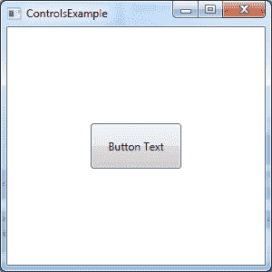

# 二、WPF 内部

## 什么是 XAML？

WPF 的核心是一种新的 XML 风格的声明式标记语言，称为可扩展应用程序标记语言，或 XAML(发音为“Zammel”)。XAML 的本质允许用户界面完全独立于后面代码中的逻辑。因此，当开发人员在 Visual Studio 中完成业务逻辑时，允许图形设计人员在设计工具(如 Expression Blend)中工作是非常容易的。XAML 是一种博大精深的语言。这种设计和开发的分离是微软创建 XAML 和 WPF 的驱动原因之一。

XAML 允许实例化。NET 对象。您可以导入名称空间来指定标记可用的元素。例如，您可以在 C#中创建一个类来建模客户，并将客户类声明为应用程序级资源。然后，您可以在应用程序的任何地方通过 XAML 访问该资源。

在一个经典的 WinForms 应用程序中，您将在 Visual Studio 中设计您的用户界面，并且 IDE 将在表示代码布局的部分类中发出 C#或 VB.NET。每个控件，无论是按钮、文本框还是其他，都会有相应的代码行。

在 WPF 和 XAML，您可以使用自己选择的 IDE 来创建 XAML 标记。这种标记不会被翻译成代码。它被序列化为一组标签，这些标签被动态加载以生成应用程序的用户界面。

元素代表对象，属性代表对象的属性值。

这里有一个例子:

```cs
    1 <Window x:Class="Chapter01.ControlsExample"
    2        
    3        xmlns:x="http://schemas.microsoft.com/winfx/2006/xaml"
    4        Title="ControlsExample" Height="300" Width="300">
    5    <Grid>
    6  
    7    </Grid>
    8 </Window>

```

## 元素作为对象，属性作为属性

第一行是窗口对象的定义。就像任何其他基于 XML 的语言一样，元素可以嵌套在其他元素中。 **x:Class** 属性指定窗口的类的名称。这是我们将从后面的代码中以编程方式访问窗口的类。第二行指定了 **xmlns** 属性，它代表一个 URI 命名空间。URI 看起来像一个网络资源，虽然它不是。

http://schemas.microsoft.com/winfx/2006/xaml/presentation 命名空间 URI 定义了所有标准的 WPF 控件。 **xmlns** 相当于 C#中使用语句的**。微软之所以选择这种命名方案，是因为通过在微软域中使用 URI，任何其他开发人员都不可能在定义名称空间时使用相同的 URIs。大约有 12 个不同的标准 WPF 程序集名称空间，它们都以**系统开始。Windows** 。通过指定 URI，代码将搜索每个名称空间，并自动解析窗口元素映射到**系统。Windows.Window** 类。它会发现网格驻留在**系统中。控制**程序集命名空间。**

因为第 2 行导入了所有 WPF 元素所在的名称空间，所以我们没有添加后缀。第 3 行表示另一个默认的 WPF 命名空间，它包含许多指示如何解释您的 XAML 文档的实用程序类。我们将 **x** 后缀应用于这个名称空间。然后为了访问这个名称空间的元素，我们将在元素前面加上 **x:** 。例如 **< x:MyElement >** 。

以下对 xmlns 属性的解释转载自微软开发者网络关于 WPF 的文档中提供的 XAML 概述(WPF)页面，网址为:aspx 。

**xmlns** 属性特别指明了默认的 XAML 命名空间。在默认的 XAML 命名空间中，可以在没有前缀的情况下指定标记中的对象元素。对于大多数 WPF 应用程序场景，以及 SDK 的 WPF 部分中给出的几乎所有示例，默认的 XAML 命名空间映射到 WPF 命名空间 http://schemas.microsoft.com/winfx/2006/xaml/presentation.。**xmlns:x**属性指示额外的 XAML 命名空间，它映射到 XAML 语言命名空间 http://schemas.microsoft.com/winfx/2006/xaml.

使用 **xmlns** 来定义命名空间的使用和映射范围符合 XML 1.0 规范。XAML 命名空间与 XML 命名空间的不同之处仅在于，XAML 命名空间还暗示了当涉及到类型解析和解析 XAML 时，命名空间的元素是如何由类型支持的。

请注意， **xmlns** 属性仅在每个 XAML 文件的根元素上是严格必要的。 **xmlns** 定义将应用于根元素的所有后代元素(该行为也与 **xmlns** 的 XML 1.0 规范一致)。根下的其他元素也允许使用 **xmlns** 属性，该属性适用于定义元素的任何后代元素。然而，频繁定义或重新定义 XAML 命名空间会导致难以阅读的 XAML 标记风格。

其 XAML 处理器的 WPF 实现包括了解 WPF 核心组件的基础设施。众所周知，WPF 核心程序集包含支持到默认 XAML 命名空间的 WPF 映射的类型。这可以通过作为项目构建文件以及 WPF 构建和项目系统一部分的配置来实现。因此，将默认的 XAML 命名空间声明为默认的 **xmlns** 是引用来自 WPF 程序集的 XAML 元素所必需的。

在 XAML，组成用户界面的对象被表示为元素。在前面的例子中，我们有一个包含网格控件的根窗口元素。网格控件是一个对象，表示为一个元素。请注意，网格也是一个子元素，因为它包含在打开和关闭**窗口**元素标签中。还要注意，在某些情况下，这种父/子关系可以用来表示对象的属性和值。也许一个例子会有助于这个概念。

```cs
    1 <Window x:Class="Chapter01.ControlsExample"
    2       
    3       xmlns:x="http://schemas.microsoft.com/winfx/2006/xaml"
    4       Title="ControlsExample" Height="300" Width="300">
    5    <Grid>
    6       <Button Width="100" Height="50" Name="btnTestButton">  
    7           Button Text
    8       </Button>
    9   </Grid>
    10 </Window>

```



图 3:渲染窗口、网格和按钮元素

当我们查看元素时，您会注意到我们有一个窗口、一个网格和一个按钮。网格是窗口的子元素，按钮是网格的子元素。该按钮在开始和结束标记之间有一个文本值。这会自动将**按钮**对象的**内容**属性设置为**按钮文本**。这是一个很好的例子，说明元素的子元素如何像元素属性一样表示对象或属性值。

正如我在上一节所述，属性代表对象属性。也许最重要的元素属性之一是**名称**属性。**名称**属性提供从后面代码中的代码访问对象。如果您的元素没有设置**名称**属性，您将无法在后面的窗口代码中使用 C#或 VB.NET 代码来操作对象。

由于 XAML 标记的性质，所有属性值都被指定为字符串。有许多属性必须将属性值的字符串表示形式转换为更复杂的数据类型。一个完美的例子是**背景**属性。**背景**属性将采用一组预定义颜色的字符串名称，并在编译时将其转换为颜色的正确 **SolidBrush** 对象。这是通过一个名为**系统的类实现的。组件型号.类型转换器**。