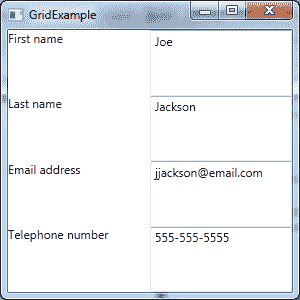
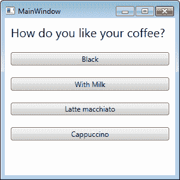
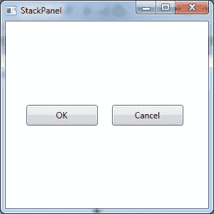
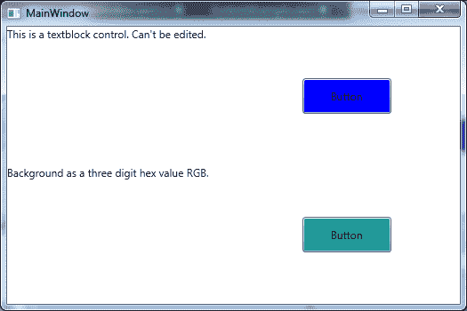

# 三、WPF 控件概览

对中可用的默认控件有扎实的理解。NET 和 WPF 可以节省大量的开发时间。事实上，对基础知识有很强的理解几乎是必需的。大多数 WPF 控制都是为了扩展而设计的。这就是 WPF 的美。您可以使用最低级别的控件来调整构成其外观的元素。请记住，控件实际上是任何二维 WPF 应用程序的基础。它们的范围从基本的标签和按钮到复杂的树视图和网格。WPF 允许几乎无止境的定制和控件嵌套。你会很快注意到某些属性，如背景、字体大小等。，由大多数 WPF 控件共享。

以下两个列表转载自乔希·菲舍尔于 2008 年 11 月 21 日在代码项目网站上发表的文章《WPF 控件-可视化快速入门》。原文可在[code project . com/Articles/31137/WPF-控制-A-Visual-快速启动](http://www.codeproject.com/Articles/31137/WPF-Controls-A-Visual-Quick-Start)上获得。

默认的 WPF 控制类型有:

*   纽扣
*   文本
*   形状
*   容器
*   媒体
*   工具栏
*   卷轴
*   面板和列表
*   多方面的

小跟班

*   **按钮**:表示可以点击的区域。
*   **切换按钮**:点击后保持选中状态的按钮。
*   **复选框**:表示由复选框表示的正、负或不确定状态。
*   **单选按钮**:允许在一系列选项之间进行独占选择。

布局控件

控件的布局对于应用程序的可用性至关重要。在某些情况下，基于固定像素坐标排列控件可能有效。但是，它会带来问题，尤其是当您需要支持不同的屏幕分辨率或不同的字体大小和调整窗口大小时。WPF 提供了一套丰富的内置布局面板，帮助您避免布局问题。

格子

本节的部分内容转载自 wpftutorial.net/GridLayout.html的 Christian Mosers 网格面板教程。

**网格**是一个布局面板，它以行和列的表格结构排列其子控件。通常，它的功能类似于 HTML 表。一个单元格可以包含多个控件，这些控件可以跨多个单元格，甚至可以相互重叠。控件的对齐由**网格控件**的**水平对齐**和**垂直对齐**属性定义。

默认情况下，网格有一行和一列。要创建任何其他行和列，您必须将**行定义**项添加到**行定义**集合中，并将**列定义**项添加到**列定义**集合中。

下图显示了一个四行两列的网格。



图 4:网格布局面板

这是 XAML 标记:

```cs
    <Window x:Class="WPF.GridExample"

            xmlns:x="http://schemas.microsoft.com/winfx/2006/xaml"
            Title="GridExample" Height="300" Width="300">
        <Grid>
            <Grid.ColumnDefinitions>
                <ColumnDefinition />
                <ColumnDefinition />
            </Grid.ColumnDefinitions>
            <Grid.RowDefinitions>
                <RowDefinition  />
                <RowDefinition  />
                <RowDefinition />
                <RowDefinition  />       
            </Grid.RowDefinitions>

            <TextBlock Grid.Column="0" Grid.Row="0" Text="First name" />
            <TextBox Grid.Column="1" Grid.Row="0" Text="Joe" />

            <TextBlock Grid.Column="0" Grid.Row="1" Text="Last name" />
            <TextBox Grid.Column="1" Grid.Row="1" Text="Jackson" />

            <TextBlock Grid.Column="0" Grid.Row="2" Text="Email address" />
            <TextBox Grid.Column="1" Grid.Row="2" Text="jjackson@email.com" />

            <TextBlock Grid.Column="0" Grid.Row="3" Text="Telephone number" />
            <TextBox Grid.Column="1" Grid.Row="3" Text="555-555-5555" />
        </Grid>
    </Window>

```

下表显示了调整网格列和行大小的方法:

表 1:调整网格列和行大小的方法

| 固定的；不变的 | 逻辑单元的固定大小(1/96 英寸)。 |
| 汽车 | 占用包含的控件所需的空间。 |
| 星号(*) | 占用尽可能多的空间(填充所有自动和固定大小的列后)，按比例分配给所有星形大小的列。所以 3*/5*的意思和 30*/50*一样。请记住，如果网格大小是根据其内容计算的，星形大小就不起作用。 |

StackPanel

本节的部分内容转载自克里斯蒂安·莫泽在[wpftutorial.net/StackPanel.html](http://www.wpftutorial.net/StackPanel.html)的 WPF·斯塔克 Panel 教程。

在 WPF，StackPanel 是一个简单而有用的布局面板。根据“方向”属性的值，它将子元素堆叠在彼此下方或旁边。“方向”属性的可能值是“垂直”和“水平”。StackPanel 在创建控件列表时特别有用。所有 WPF 项目控件，如组合框、列表框或菜单，都使用堆栈面板作为内部布局面板。

例如:

```cs
    <Window x:Class="WPFExamples.StackPanelExample"

            xmlns:x="http://schemas.microsoft.com/winfx/2006/xaml" Title="StackPanel" Height="300" Width="300">
        <StackPanel>
            <TextBlock Margin="10" FontSize="20">How do you like your coffee?</TextBlock>
            <Button Margin="10">Black</Button>
            <Button Margin="10">With milk</Button>
            <Button Margin="10">Latte macchiato</Button>
            <Button Margin="10">Cappuccino</Button>
        </StackPanel>
    </Window>

```



图 5:堆栈面板布局面板

正如您在上图中看到的，当使用 StackPanel 作为容器时，文本和按钮是堆叠在一起的。“方向”属性的默认值为**垂直**。

我发现 StackPanel 在对话框底部排列确认按钮非常有效。

例如，看看下面的例子:



图 6:水平方向的堆栈面板

```cs
    <Window x:Class="WPFExamples.StackPanelExample"

            xmlns:x="http://schemas.microsoft.com/winfx/2006/xaml"
            Title="StackPanel" Height="300" Width="300">
        <StackPanel Orientation="Horizontal" Height="49" Width="247">
            <Button Width="100" Margin="10">OK</Button>
            <Button Width="100" Margin="10">Cancel</Button>
        </StackPanel>
    </Window>

```

码头面板

本节的部分内容转载自克里斯蒂安·莫泽在[wpftutorial.net/DockPanel.html](http://www.wpftutorial.net/DockPanel.html)的 WPF 船坞面板教程。

停靠面板定义了一个区域，您可以在其中相对于彼此水平或垂直排列子元素。dock 面板是一个布局面板，可以轻松地将元素停靠在面板的左侧、右侧、顶部、底部甚至中央。元素的停靠侧由附加属性 DockPanel.Dock 定义。要将元素停靠到面板的中心，该元素必须是面板的最后一个子元素，并且**lastdchildfill**属性必须设置为 **true** 。

例如:

```cs
    <DockPanel LastChildFill="True">
        <Button Content="Dock=Top" DockPanel.Dock="Top"/>
        <Button Content="Dock=Bottom" DockPanel.Dock="Bottom"/>
        <Button Content="Dock=Left"/>
        <Button Content="Dock=Right" DockPanel.Dock="Right"/>
        <Button Content="LastChildFill=True"/>
    </DockPanel>

```

雷帕金

本节的部分内容转载自克里斯蒂安·莫泽在[wpftutorial.net/WrapPanel.html](http://www.wpftutorial.net/WrapPanel.html)的 WPF 包装面板教程。

WrapPanel 类似于 DockPanel 但是，它不会将所有子元素堆叠到一行中。如果容器的宽度没有剩余空间，它会将它们换行。方向可以设置为水平或垂直。“包装面板”还可以用于排列选项卡控件的选项卡、工具栏中的菜单项或类似窗口资源管理器的列表中的项目。

```cs
    <WrapPanel Orientation="Horizontal">
        <Button Content="Button" />
        <Button Content="Button" />
        <Button Content="Button" />
        <Button Content="Button" />
        <Button Content="Button" />
    </WrapPanel>

```

帆布

这一部分的一些内容和后面的内容转载自克里斯蒂安·莫泽在[wpftutorial.net/Canvas.html](http://www.wpftutorial.net/Canvas.html)的 WPF 画布面板教程。

画布是 WPF 最基本的布局面板；它允许您使用精确的坐标定位其子元素。画布容器可以用作绘制形状和动画的表面。

通常，画布用于将二维图形元素组合在一起。画布对于其他用户界面元素来说并不是一个很好的容器，因为当它的父容器被调整大小时，它不会执行任何调整大小的优化。基于位置的布局在调整场景大小时存在问题。观察下面的例子，其中我放置了一个矩形、一个椭圆和一个路径元素。

```cs
    <Canvas>
        <Rectangle Canvas.Left="40" Canvas.Top="31" Width="63" Height="41" Fill="Blue"  />
        <Ellipse Canvas.Left="130" Canvas.Top="79" Width="58" Height="58" Fill="Blue"  />
        <Path Canvas.Left="61" Canvas.Top="28" Width="133" Height="98" Fill="Blue"
              Stretch="Fill" Data="M61,125 L193,28"/>
    </Canvas>

```

重写元素 z 顺序的示例

通常，画布元素内元素的 z 顺序由 XAML 的顺序指定，但是您可以通过显式定义画布来覆盖自然的 z 顺序。元素的 ZIndex 属性。请看下面的例子。

```cs
    <Canvas>
        <Ellipse Fill="Green" Width="60" Height="60" Canvas.Left="30" Canvas.Top="20"   
                 Canvas.ZIndex="1"/>
        <Ellipse Fill="Blue"  Width="60" Height="60" Canvas.Left="60" Canvas.Top="40"/>
    </Canvas>

```

布局最佳实践

本列表中的部分内容转载自克里斯蒂安·莫泽在[wpftutorial.net/LayoutProperties.html](http://wpftutorial.net/LayoutProperties.html)的《WPF 布局入门教程》。

*   避免固定位置；相反，使用**对齐**属性结合**边距**来定位面板中的元素。
*   避免固定尺寸。尽可能将元素的**宽度**和**高度**设置为**自动**。
*   不要使用“画布”面板来指定常用控件的布局；而是用它来排列矢量图形。
*   使用堆栈面板在对话框上布局对话框确认按钮。
*   使用网格布局复杂的用户界面和数据输入表单。

文本块

文本块控件表示无法编辑的文本块。您可以像使用标签控件一样使用文本块。文本块也用在控件模板中来显示文本。

文本框

文本框控件存在的时间和视窗操作系统一样长。它是用于捕获用户文本输入的主控件。WPF 用一个被称为数据绑定的概念将数据输入向前推进了一步。文本框支持与从键盘输入数据相关的事件和属性。

动画过渡视图示例

WPF 提供了一个非常丰富的动画相关的应用编程接口。动画可能是一个复杂的话题，虽然它对丰富用户界面很有帮助，但它不会改变业务线应用程序的创建方式。因此，我计划提供一个示例应用程序来激发你的兴趣，这样你就可以自己研究这个主题，而不是覆盖 WPF 动画的每个方面。这里有一篇文章让你入门:MSDN 动画概述，[http://msdn.microsoft.com/en-us/library/ms752312.aspx](http://msdn.microsoft.com/en-us/library/ms752312.aspx)。

在本节中，我将向您展示如何构建一个“过渡视图”切换机制，该机制使用 WPF 动画为您的应用程序添加一些天赋。这种效果是通过将您的用户界面视图实现为 WPF 用户控件来实现的，这些控件继承自一个类，我称之为 **TransitionControl** 。当您在**用户控件**之间切换时，**过渡控件**将提供显示动画效果的方法。下面是代码:

TransitionControl.xaml

```cs
  <UserControl x:Class="ScreenSlideTransitionExample.TransitionControl"

   xmlns:x="http://schemas.microsoft.com/winfx/2006/xaml"

   xmlns:mc="http://schemas.openxmlformats.org/markup-compatibility/2006" 

   xmlns:d="http://schemas.microsoft.com/expression/blend/2008" 

   mc:Ignorable="d" 

   d:DesignHeight="300" d:DesignWidth="300" 

   >

  </UserControl>

```

TransitionControl.xaml.cs

```cs
  using System;
  using
  System.Windows.Controls;

  namespace
  ScreenSlideTransitionExample
  {
      /// <summary>
      /// Interaction logic
  for ScreenOne.xaml
      /// </summary>
      public partial class TransitionControl : UserControl
      {
          public MainWindow ParentWindow { get; set; }
          public TransitionControl CurrentScreen { get; set; }

          public TransitionControl(MainWindow parent)

  {

  this.ParentWindow =
  parent;

  }

          public void ChangeScreen(TransitionControl screen)

  {

  if (screen == null)

  throw new ArgumentNullException("Unable to
  navigate to next screen. A null reference section occurred");

  this.CurrentScreen =
  screen;

  this.ParentWindow.ChangeContent(screen);

  }
      }
  }

```

MainWindow.xaml 文件

```cs
  <Window x:Class="ScreenSlideTransitionExample.MainWindow"

   xmlns:x="http://schemas.microsoft.com/winfx/2006/xaml"

   Title="MainWindow" Height="350" Width="525">
      <Canvas x:Name="TransitionContainer" />
  </Window>

```

MainWindow.xaml.cs 文件

```cs
  using System;
  using System.Windows;
  using System.Windows.Controls;
  using System.Windows.Media.Animation;

  namespace ScreenSlideTransitionExample
  {
      /// <summary>
      /// Interaction logic for
  MainWindow.xaml
      /// </summary>
      public partial class MainWindow
  : Window
      {
          readonly Duration
  _animationDuration = new Duration(TimeSpan.FromSeconds(1.0));

          public MainWindow()
          {

  InitializeComponent();
              ChangeContent( new ScreenOne( new TransitionControl(
  this ) ) );
          }

          DoubleAnimation CreateDoubleAnimation(double from, double
  to, EventHandler completedEventHandler)
          {
              DoubleAnimation doubleAnimation = new DoubleAnimation(from,
  to, _animationDuration);

              if (completedEventHandler != null)
              {

  doubleAnimation.Completed += completedEventHandler;
              }

              return doubleAnimation;
          }

          void SlideAnimation(UIElement
  newContent, UIElement oldContent, EventHandler completedEventHandler)
          {

              double leftStart = Canvas.GetLeft(oldContent);
              Canvas.SetLeft(newContent, leftStart - Width);

  TransitionContainer.Children.Add(newContent);

              if (double.IsNaN(leftStart))
              {
                  leftStart =
  0;
              }

              DoubleAnimation outAnimation =
  CreateDoubleAnimation(leftStart, leftStart + Width, null);
              DoubleAnimation inAnimation =
  CreateDoubleAnimation(leftStart - Width, leftStart, completedEventHandler);

  oldContent.BeginAnimation(Canvas.LeftProperty,
  outAnimation);

  newContent.BeginAnimation(Canvas.LeftProperty,
  inAnimation);
          }

          public void
  ChangeContent(UIElement newContent)
          {
              if (TransitionContainer.Children.Count == 0)
              {

  TransitionContainer.Children.Add(newContent);
                  return;
              }

              if (TransitionContainer.Children.Count == 1)
              {

  TransitionContainer.IsHitTestVisible = false;
                  UIElement oldContent =
  TransitionContainer.Children[0];

                  EventHandler onAnimationCompletedHandler = delegate(object
  sender, EventArgs e)
                  {
                      TransitionContainer.IsHitTestVisible
  = true;

  TransitionContainer.Children.Remove(oldContent);
                      if (oldContent is IDisposable)
                      {

  (oldContent as IDisposable).Dispose();
                      }

  oldContent = null;
                  };

  SlideAnimation(newContent, oldContent, onAnimationCompletedHandler);
              }
          }
      }
  }

```

ScreenOne.xaml

```cs
  <UserControl x:Class="ScreenSlideTransitionExample.ScreenOne"

   xmlns:x="http://schemas.microsoft.com/winfx/2006/xaml"

   xmlns:mc="http://schemas.openxmlformats.org/markup-compatibility/2006" 

   xmlns:d="http://schemas.microsoft.com/expression/blend/2008" 

   mc:Ignorable="d" 

   d:DesignHeight="300" d:DesignWidth="300" Height="350" Width="525"

   Background="BlanchedAlmond">
      <Grid>

  <Grid.RowDefinitions>

  <RowDefinition />

  <RowDefinition />

  <RowDefinition />

  </Grid.RowDefinitions>

  <TextBlock Text="Screen
  one" FontFamily="Verdana"  FontSize="30" Grid.Row="0" />

  <Button Name="btnChangeContent" Grid.Row="2" Content="Change
  content"  Click="btnChangeContent_Click" Margin="267,59,140,12" />
      </Grid>
  </UserControl>

```

ScreenOne.xaml.cs

```cs
  using System.Windows;
  using
  System.Windows.Controls;

  namespace
  ScreenSlideTransitionExample
  {
      /// <summary>
      /// Interaction logic
  for ScreenOne.xaml
      /// </summary>
      public partial class ScreenOne : UserControl
      {

  private TransitionControl
  _transitionControl;

  public ScreenOne(TransitionControl transitionControl)

  {

  InitializeComponent();

  _transitionControl = transitionControl;

  }

  private void
  btnChangeContent_Click(object sender, RoutedEventArgs e)

  {

  _transitionControl.ParentWindow.ChangeContent( 

  new ScreenTwo( new TransitionControl(
  _transitionControl.ParentWindow ) ) );

  }
      }
  }

```

ScreenTwo.xaml

```cs
  <UserControl x:Class="ScreenSlideTransitionExample.ScreenTwo"

   xmlns:x="http://schemas.microsoft.com/winfx/2006/xaml"

   xmlns:mc="http://schemas.openxmlformats.org/markup-compatibility/2006"

   xmlns:d="http://schemas.microsoft.com/expression/blend/2008"

               mc:Ignorable="d" 

  d:DesignHeight="300" d:DesignWidth="300" Height="350" Width="525">

  <Grid>
          <Grid.RowDefinitions>
              <RowDefinition />

  <RowDefinition />
          </Grid.RowDefinitions>
          <TextBlock Text="Screen two" FontFamily="Verdana"  FontSize="30" Grid.Row="0" />
          <Button Name="btnChangeContent" Content="Change content" Margin="241,68,159,72" Click="btnChangeContent_Click"
  />

  </Grid>
  </UserControl>

```

ScreenTwo.xaml.cs

```cs
  using System.Windows;
  using
  System.Windows.Controls;

  namespace
  ScreenSlideTransitionExample
  {
      /// <summary>
      /// Interaction logic
  for ScreenTwo.xaml
      /// </summary>
      public partial class ScreenTwo : UserControl
      {

  private TransitionControl _transCtrl;

  public ScreenTwo(TransitionControl transitionControl)

  {

  InitializeComponent();

  _transCtrl = transitionControl;

  }

  private void
  btnChangeContent_Click(object sender, RoutedEventArgs e)

  {

  var transCtrl = new TransitionControl(_transCtrl.ParentWindow);

  var screenOne = new ScreenOne(transCtrl);

  _transCtrl.ParentWindow.ChangeContent(screenOne);

  }
      }
  }

```

**系统。component model . type converter**类提供了将 XAML 字符串属性值转换为相应对象值类型的统一方式。**类型转换器**类的 MSDN 文档可以在[找到。](http://msdn.microsoft.com/en-us/library/system.componentmodel.typeconverter.aspx)

这里有一个例子:

```cs
    1 <Window x:Class="Chapter._02.MainWindow"
    2       
    3       xmlns:x="http://schemas.microsoft.com/winfx/2006/xaml"
    4       Title="MainWindow" Height="350" Width="525">
    5   <Grid>
    6       <Grid.RowDefinitions>
    7           <RowDefinition />
    8           <RowDefinition />
    9       </Grid.RowDefinitions>
    10      <Grid.ColumnDefinitions>
    11          <ColumnDefinition />
    12          <ColumnDefinition />
    13      </Grid.ColumnDefinitions>
    14      <TextBlock x:Name="txtDisplay" Text="This is a textblock control. Can't be                         15       edited." Grid.Column="0" Grid.Row="0" />
    16      <Button x:Name="btnDisplayButton" Grid.Column="1" Grid.Row="0" Background="Blue"          
    17       Content="Button" Width="100" Height="40" />
    18      <TextBlock x:Name="txtHexRGBColor" Text="Background as a three digit hex value
    19       RGB." Grid.Column="0" Grid.Row="1" />
    20      <Button x:Name="btnHexRGBColor" Grid.Column="1" Grid.Row="1" Background="#299"     
    21       Content="Button"  Width="100" Height="40" />
    22  </Grid>
    23 </Window>

```

|  | 注意:观察按钮和文本块上的网格属性。这就是我们在用户界面中定位控件的方式。 |



图 7:使用类型转换器

如您所见，我们有一个窗口，在一个网格中包含两个文本块和两个按钮对象。网格定义了两列两行。我们已经在每个按钮控件上指定了**背景**属性。在第一个按钮中，我们简单地指定了我们想要用作背景的颜色的字符串名称。对于第二个按钮，我们将 RGB 值指定为三位十六进制值。**制度。Drawing.ColorConverter** 类负责提供该功能。

|  | 提示:您可以通过实现 IValueConverter 并从 TypeConverter 基类继承来创建自己的类型转换器类。 |

在 XAML 被添加到之前，**类型转换器**类就已经存在了。NET 框架。XAML 之前的**类型转换器**类的目的是为 WinForms 应用程序中的属性对话框提供字符串转换。随着您对 WPF 和 XAML 越来越精通，您可能会发现需要实现自己的 **TypeConverter** 类。为此，您需要创建一个从**类型转换器**基类派生的类。

出于 XAML 值转换的目的，有四个相关成员必须被覆盖。

表 2:类型转换器方法

| 方法 | 方法描述 |
| CanConvertTo() | 一个支持方法，返回一个布尔值，该值指示该值是否可以转换为指定的类型。 |
| CanConvertFrom() | 一种支持方法，返回一个布尔值，该值指示该值是否可以从指定类型转换。 |
| convertto 指令() | 将给定值对象转换为指定类型。 |
| ConvertFrom() | 将给定值转换为此转换器的类型。 |

您必须将**类型转换器属性**应用于实现**类型转换器**的类。下面是属性[ **类型转换器(类型为(MyCustomConverter))** ]的使用示例。

Person.cs

```cs
    using System;
    using System.Collections.Generic;
    using System.ComponentModel;
    using System.Linq;
    using System.Text;
    using System.Threading.Tasks;
    using TypeConverterExample.TypeConverters;

    namespace TypeConverterExample
    {
        /// <summary>
        /// Represents a person's information.
        /// </summary>
        [TypeConverter(typeof(PersonInfoTypeConverter))]
        public class Person
        {
            /// <summary>
            /// Represents the person's name.
            /// </summary>
            public string Name { get; set; }
            /// <summary>
            /// Represents the person's age.
            /// </summary>
            public int Age { get; set; }
            /// <summary>
            /// Represents the person's birth date.
            /// </summary>
            public DateTime BirthDate { get; set; }

            /// <summary>
            /// The default constructor.
            /// </summary>
            public Person(){}

            /// <summary>
            /// An overloaded constructor to allow for easy creation of a person and their properties.
            /// </summary>
            /// <param name="name">The person's name.</param>
            /// <param name="age">The person's age.</param>
            /// <param name="birthDate">The person's birth date.</param>
            public Person(string name, int age, DateTime birthDate)
            {
                if (string.IsNullOrEmpty(name))
                    throw new ArgumentNullException("name");

                if (age <= 0)
                    throw new ArgumentException("age must be greater than 0");

                this.Name = name;
                this.Age = age;
                this.BirthDate = birthDate;
            }

            /// <summary>
            /// This method will take the details.
            /// </summary>
            /// <param name="xamlPropertyValue">Represents the string value of the XAML property.</param>
            /// <returns>A person object to the caller.</returns>
            public static Person Parse(string xamlPropertyValue)
            {
                if (string.IsNullOrEmpty(xamlPropertyValue))
                    return new Person();

                string[] propertyValues = xamlPropertyValue.Split(',');

                if (propertyValues.Length != 3)
                    throw new FormatException("Please specify the Name, Age, and Birthdate of the person.");

                Person returnValue = new Person();
                returnValue.Name = propertyValues[0];

                try
                {
                    int personAge = int.Parse(propertyValues[1]);
                    returnValue.Age = personAge;
                }
                catch (Exception ex)
                {
                    throw new Exception(string.Format("Unable to parse the person's age. The value = {0}. The error message = {1}",
                        propertyValues[1], ex.ToString()));
                }

                try
                {
                    DateTime personBirthDate = DateTime.Parse(propertyValues[2]);
                    returnValue.BirthDate = personBirthDate;
                }
                catch (Exception ex)
                {
                    throw new Exception(string.Format("Unable to parse the person's birth date. The value = {0}. The error message = {1}",
                        propertyValues[2], ex.ToString()));
                }

                return returnValue;
            }

            public override string ToString()
            {
                return string.Format("{0}, {1}, {2}",
                    this.Name, this.Age.ToString(), this.BirthDate.ToString());
            }
        }
    }

```

PersonInfoTypeConverter.cs

```cs
    using System;
    using System.Collections.Generic;
    using System.Linq;
    using System.Text;
    using System.Threading.Tasks;
    using System.ComponentModel;
    namespace TypeConverterExample.TypeConverters
    {
        /// <summary>
        /// Represents an ITypeConverter implementation that will take the PersonInfoControl's XAML string values.
        /// and convert them into a PersonInfo object.
        /// </summary>
        public class PersonInfoTypeConverter : TypeConverter
        {
            /// <summary>
            /// Determines if the source type can be converted.
            /// </summary>
            /// <param name="context">The type description context.</param>
            /// <param name="sourceType">The type to convert to Person.</param>
            /// <returns>True if the sourceType can be converted.</returns>
            public override bool CanConvertFrom(ITypeDescriptorContext context, Type sourceType)
            {
                //Since we are dealing with a XAML property, the value must be of type string.
                if (sourceType == typeof (string))
                    return true;

                //Otherwise, try the base implementation.
                return base.CanConvertFrom(context, sourceType);
            }

            /// <summary>
            /// Determines whether the destination type can be converted.
            /// </summary>
            public override bool CanConvertTo(ITypeDescriptorContext context, Type destinationType)
            {
                return base.CanConvertTo(context, destinationType);
            }

            /// <summary>
            /// Converts from the Person value to the XAML string representation.
            /// </summary>
            /// <param name="context">Type description context.</param>
            /// <param name="culture">The string culture for localization purposes.</param>
            /// <param name="value">The value to convert.</param>
            /// <returns>A person object with the properties specified in the value string.</returns>
            public override object ConvertFrom(ITypeDescriptorContext context,
                System.Globalization.CultureInfo culture, object value)
            {

                if (value == null)
                    throw new ArgumentNullException("value");

                try
                {
                    Person convertedPerson = Person.Parse((string)value);
                    return convertedPerson;
                }
                catch (Exception ex)
                {
                    //Log the exception and try the base implementation.
                    return base.ConvertTo(context, culture, value, destinationType);
                }

            }

            /// <summary>
            /// Converts a person object to the XAML representation.
            /// </summary>
            /// <param name="context">The type description context.</param>
            /// <param name="culture">The string culture for localization.</param>
            /// <param name="value">The XAML string representing the person.</param>
            /// <param name="destinationType">The type to convert to (Person).</param>
            /// <returns></returns>
            public override object ConvertTo(ITypeDescriptorContext context, System.Globalization.CultureInfo culture, object value, Type destinationType)
            {
                if (value == null)
                    throw new ArgumentNullException("value");

                if (value is Person)
                {
                    var personObject = (Person) value;
                    var xamlAttributeValue = personObject.ToString();

                    return xamlAttributeValue;
                }
                return base.ConvertFrom(context, culture, value);

            }
        }
    }

```

**对象**:所有的基类。NET 类。

**DispatcherObject** :这是任何对象的基类，只能在为其创建对象的线程上访问。大多数 WPF 类都是从 DisaptcherObject 派生的，所以那些派生的类自然不是线程安全的。

**DependencyObject** :这是任何能够支持 DependencyProperties 的对象的基类。

**DependencyProperties** :基类提供了 GetValue 和 SetValue 方法，DependencyProperties 必须使用这些方法才能工作。

**可冻结**:所有可以“冻结”为只读状态的对象的基类。一旦冻结，就不能解冻。

**可视化**:所有具有可视化表示的对象的基类。

**UIElement** :所有可视化对象的基类，支持路由事件、命令绑定、布局和焦点支持。

**ContentElement** :一个类似于 UIElement 的基类，但是针对的是本身没有渲染行为的内容片段。相反，ContentElements 托管在一个可视化派生类中，以呈现在屏幕上。

**FrameworkElement** :基类，为基于 Windows 的控件(如工具提示和上下文菜单)添加了对样式、数据绑定、资源和一些常见机制的支持。

**FrameworkContentElement** :内容的 FrameworkElement 的模拟。

**控件**:按钮、列表框、状态栏等常见控件的基类。控件向其 FrameworkElement 基类添加了许多属性，如前景、背景和字体大小。控件还支持模板，使您能够完全替换它们的可视化树。

无论您是在设计一个自定义类型转换器类，还是在编写一个用于数据绑定的 **ViewModel** 来实现 MVVM 模式(我们将在本书后面详细讨论这个模式)，您都必须告诉 XAML 您的类的存在。您可以通过创建资源字典来实现这一点。您可以在应用程序、窗口和用户控件级别创建资源字典。XAML 字典包含称为资源的元素。这实际上允许您导入自己的 C#对象，以便在 XAML 数据绑定中使用。使用这种方法，可以编写一个应用程序，而无需在代码后面编写一行代码。