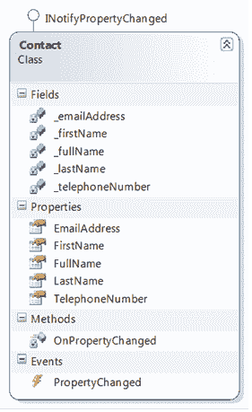
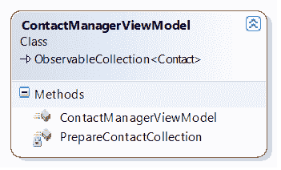
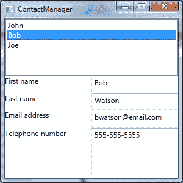

# 第五章 WPF 和 MVVM

当你开始了解 WPF 和 XAML 时，你会听说 MVVM 或者模型-视图-视图模型设计模式。MVVM 是约翰·戈斯曼发明的用户界面设计模式，它基于马丁·福勒的演示者模型模式。

模型-视图-视图模型模式允许开发人员将用户界面与简化用户界面所需的逻辑以及业务逻辑和数据完全分开。用户界面、业务逻辑和数据的分离允许一个好的、干净的、可测试的软件。WPF 数据绑定非常强大，因为它允许您将用户界面与业务逻辑分开。MVVM 模式为如何以新的方式使用 WPF 数据绑定来实现完全解耦的应用程序设计提供了很好的例子。

我们将从**模型**开始。模型代表您希望与之交互的数据。这可能是来自数据库的信息、业务对象的属性，甚至是一个 XML 文件。任何软件包都会处理数据，如果您的用户界面与您的特定数据模型分离是最好的，因为您的数据可能会改变。一般在 WPF，你的模型会实现 **INotifyPropertyChanged** 界面。此界面提供了便于更改通知的成员。这意味着您的用户界面需要知道您的模型何时改变，而不必与您的模型紧密耦合。这是双向的。您的模型需要知道用户何时通过用户界面控件更改了模型中的数据。我们将通过示例更详细地介绍 **INotifyPropertyChanged** 界面，但是要知道它的成员提供了便于变更通知的事件。

接下来我们有**视图模型**。视图模型是一个位于 XAML 视图和数据模型之间的类。这一抽象层非常关键，因为如果您的视图模型是以松散耦合的方式设计的，那么您的模型和视图是可以改变的。视图模型通常实现为一个类，该类的属性指向模型的属性。您通常会使用 WPF 数据绑定来绑定到视图模型。视图模型不关心视图或模型的细节。这使得单元测试变得非常容易。

在模式的顶部，我们有**视图**，它们是 WPF 窗口或用户控件。视图构成了应用程序的视觉部分。当你开始研究 WPF 的时候，你会遇到一些 MVVM 纯粹主义者，他们认为在你的视图后面应该没有任何代码。虽然这确实提供了最灵活的设计，但也是最难完成的设计之一。这将要求您消除某些常见的设计选择，如控制事件处理程序等。

我将展示一个无代码隐藏方法的例子。然而，这并不是实现 MVVM 模式所必需的。理解 MVVM 背后的观点是，你希望你的模型和你的视图解耦，并且只通过**视图模型**进行通信。这种解耦架构的目的是允许您在不破坏现有代码的情况下轻松更改视图或模型。您还希望能够对所有代码进行完整的单元测试，而不用担心使用困难的工具，因为您已经创建了一个与业务逻辑紧密耦合的 XAML 视图。

这里有一个简短的 MVVM 例子来说明这是如何协同工作的。假设您有一个联系人管理器应用程序。这个应用程序的目的是跟上你的许多联系人。当然，您需要保存联系人的姓名、电话号码、电子邮件地址和家庭地址。这将代表您的模型。查看以下**联系**类图。



图 12:联系人类图

我们将从实现一个我们想要用于数据绑定的类开始。自然，您可能会实现一个联系类。这个类将有一个联系人的名字、姓氏、电话号码和电子邮件地址的属性。

Contact.cs

```
    using System;
    using System.Collections.Generic;
    using System.Linq;
    using System.Text;
    using System.ComponentModel;

    namespace ContactMvvm
    {
        public class Contact : INotifyPropertyChanged
        {
            #region "private fields"

            private string _firstName;
            private string _fullName;
            private string _lastName;
            private string _telephoneNumber;
            private string _emailAddress;
            #endregion

            #region "Public Properties"
            public string FirstName
            {
                get { return _firstName; }
                set
                {
                    _firstName = value;
                    OnPropertyChanged("FirstName");
                }
            }

            public string EmailAddress
            {
                get { return _emailAddress; }
                set
                {
                    _emailAddress = value;
                    OnPropertyChanged("EmailAddress");
                }
            }

            public string LastName
            {
                get { return _lastName; }
                set
                {
                    _lastName = value;
                    OnPropertyChanged("LastName");
                }
            }

            public string TelephoneNumber
            {
                get { return _telephoneNumber; }
                set
                {
                    _telephoneNumber = value;
                    OnPropertyChanged("TelephoneNumber");
                }
            }
            #endregion

            #region "INotifyPropertyChanged members"

            public event PropertyChangedEventHandler PropertyChanged;

            //This routine is called each time a property value has been set. This will
            //cause an event to notify WPF via data-binding that a change has occurred.
            private void OnPropertyChanged(string propertyName)
            {
                var handler = PropertyChanged;

                if (handler != null)
                {
                    handler(this, new PropertyChangedEventArgs(propertyName));
                }
            }
            #endregion      
        }
    }

```

不要被 **INotifyPropertyChanged** 的实现所淹没。这将在另一章中讨论。

请注意，这是一个普通的 CLR 对象，带有名称空间、类名和属性。这是 MVVM 的模型；它代表我们的数据。

接下来，我们将创建一个**视图模型**类，该类将从我们的模型中获取数据，并通过 WPF 数据绑定将数据呈现给视图。**视图模型**类继承自一个名为**的可观察集合< >** 的类。**ObservableCollection<>**是一个泛型类，接受我们的模型作为泛型类型。这个类基本上把我们的**视图模型**变成了一个带有内置变更通知的**联系人**对象的集合，以方便 WPF 数据绑定机制。

当我们使用 **ObservableCollection** 时，WPF 数据绑定知道什么时候添加或删除项目。我创建了一个私有例程 **PrepareContactCollection** ，它创建了我们的 **Contact** 类的三个实例，并将它们添加到 **ViewModel 的**内部集合中。我们将把**列表视图**的**项源**属性绑定到**视图模型**以及把主网格的**数据上下文**属性绑定到**视图模型**。通过设置顶层网格的**数据上下文**，我们将使子控件继承**数据上下文**进行数据绑定。**列表视图**的**项目来源**属性将使用我们的**联系人观察集合**中存在的每个项目填充**列表视图**。下面是一个类图和代码:



图 13:一个可观察集合的类图

联系人管理器视图模型. cs

```
    using System;
    using System.Collections.Generic;
    using System.Linq;
    using System.Text;
    using System.Collections.ObjectModel;

    namespace ContactMvvm
    {
        public class ContactManagerViewModel : ObservableCollection<Contact>
        {
            #region "constructor"
            public ContactManagerViewModel()
            {
                PrepareContactCollection();
            }

            #endregion

            #region "private routines"
            private void PrepareContactCollection()
            {
                //Create new contacts and add them to the ViewModel's
                //ObservableCollection.
                var ContactOne = new Contact
                {
                    FirstName = "John",
                    LastName = "Doe",
                    EmailAddress = "jdoe@email.com",
                    TelephoneNumber = "555-555-5555"

                };
                Add(ContactOne);

                var ContactTwo = new Contact
                {
                    FirstName = "Bob",
                    LastName = "Watson",
                    EmailAddress = "bwatson@email.com",
                    TelephoneNumber = "555-555-5555"

                };
                Add(ContactTwo);

                var ContactThree = new Contact
                {
                    FirstName = "Joe",
                    LastName = "Johnson",
                    EmailAddress = "jjohnson@email.com",
                    TelephoneNumber = "555-555-5555"

                };

                Add(ContactThree);
            }
            #endregion
        }
    }

```

|  | 提示:请注意，通过从 ObservableCollection <contact>继承，我们获得了 Add()方法。这允许我们用联系模型的实例填充视图模型。</contact> |

现在我们想编写一个 XAML 用户界面，并将我们的**视图模型**绑定到控件。我们要做的第一件事是导入对象的名称空间，这样我们就可以在 XAML 访问该对象。我们将通过在**窗口**元素中指定 **xmlns:视图模型**来实现。**视图模型**是一个任意值，可以是您希望与新导入的名称空间相关联的任何值。

接下来，我们将创建一个资源字典，并添加一个静态资源来表示这个**视图模型**的一个实例。这允许我们绑定到我们的**视图模型**而无需编写任何 C#代码！这是 XAML 加价。

ContactManager.xaml

```
    <Window x:Class="ExceptionValidation.ContactManager"

            xmlns:x="http://schemas.microsoft.com/winfx/2006/xaml"
            Title="ContactManager" Height="300" Width="300"
            xmlns:viewModel="clr-namespace:ContactMvvm">
        <Window.Resources>
            <viewModel:ContactManagerViewModel x:Key="contactViewModel" />
        </Window.Resources>
        <Grid DataContext="{StaticResource ResourceKey=contactViewModel}">
            <Grid.ColumnDefinitions>
                <ColumnDefinition />
                <ColumnDefinition />
            </Grid.ColumnDefinitions>
            <Grid.RowDefinitions>
                <RowDefinition Height="93*" />
                <RowDefinition Height="29*" />
                <RowDefinition Height="27*" />
                <RowDefinition Height="30*" />
                <RowDefinition Height="81*" />
            </Grid.RowDefinitions>
            <ListView Grid.ColumnSpan="2" BorderThickness="2" x:Name="lstContacts"   IsSynchronizedWithCurrentItem="True" ItemsSource="{StaticResource ResourceKey=contactViewModel}" DisplayMemberPath="FirstName" Margin="0,0,0,28" Grid.RowSpan="2" />

            <TextBlock Grid.Column="0" Grid.Row="1" Text="First name" />
            <TextBox Grid.Column="1" Grid.Row="1" Text="{Binding Path=FirstName}" />

            <TextBlock Grid.Column="0" Grid.Row="2" Text="Last name" />
            <TextBox Grid.Column="1" Grid.Row="2" Text="{Binding Path=LastName}" />

            <TextBlock Grid.Column="0" Grid.Row="3" Text="Email address" />
            <TextBox Grid.Column="1" Grid.Row="3" Text="{Binding Path=EmailAddress}" />

            <TextBlock Grid.Column="0" Grid.Row="4" Text="Telephone number" />
            <TextBox Grid.Column="1" Grid.Row="4" Text="{Binding Path=TelephoneNumber}" />
        </Grid>
    </Window>

```

请注意，我们将网格的**数据上下文**属性绑定到我们在字典中创建的**视图模型**静态资源。**数据上下文**为您的 WPF 控件提供了绑定上下文。当我们在网格上设置**数据上下文**时，该值将通过属性继承向下传播到子元素——这就是为什么所有**文本框绑定**值都可以设置为模型的属性。这是因为**数据上下文**设置为我们的**视图模型**，这是一个**可观察集合<联系人>** 。因此，当我们设置绑定路径时，WPF 知道我们正在处理一个**接触**对象，并且这些值被映射到正确的属性。如果我们的**视图模型**类中有属性，这也是可行的。我们也可以遵循这些价值观。

下图显示了程序的输出:



图 14:已完成的联系人管理器

如您所见，我们已经使用自定义 **Contact** 对象中的数据创建了一个数据绑定的 WPF 窗口。您可以更新文本框中的值，这些值将在**列表视图**中更改。您可以点击**列表视图**，数值将根据您的选择进行更新。用户界面是 100%数据绑定的，我们没有在后面的代码中编写任何事件处理程序！我们能够在 100%的 XAML 做到这一点。还要注意，资源字典不限于 CLR 对象。您可以存储 XAML 画笔、第三方控件、样式、类型转换器或任何其他类型的对象，以便在您的 XAML 标记中使用。