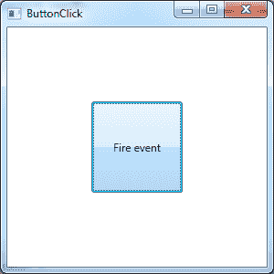

在应用程序快速开发的早期，大多数 Windows 应用程序都是基于事件模型构建的。您可以创建控件，并在代码隐藏中连接事件处理程序来处理控件的事件。这仍然是处理 Windows 用户界面控件逻辑的一种流行方式。然而，随着 WPF 和 XAML 的出现，数据绑定机制为旧的事件驱动系统提供了替代方案。当涉及到按钮点击时尤其如此。我说的这个伟大的编程魔术是什么？它可以通过定义用户界面处理的命令驱动方法来总结。

按钮控件以及其他 WPF 控件都有一个名为**命令**的属性。此属性允许开发人员指定 **ICommand** 接口实现的实例来完成指定的任务，而无需向窗口后面的代码添加任何代码。在**系统中可以找到 **ICommand** 界面。输入**名称空间，它提供了一个松耦合命令的通用实现。考虑下面的代码，它演示了按钮点击处理程序的典型事件驱动实现:

```cs
    <Window x:Class="WPFExample.ButtonClick"        
            xmlns:x="http://schemas.microsoft.com/winfx/2006/xaml"
            Title="ButtonClick" Height="300" Width="300">
        <Grid>
            <Button x:Name="btnFireEvent" Content="Fire event"
                    Width="100" Height="100" Click="btnFireEvent_Click" />
        </Grid>
    </Window>

```

```cs
    using System;
    using System.Collections.Generic;
    using System.Linq;
    using System.Text;
    using System.Windows;
    using System.Windows.Controls;
    using System.Windows.Data;
    using System.Windows.Documents;
    using System.Windows.Input;
    using System.Windows.Media;
    using System.Windows.Media.Imaging;
    using System.Windows.Shapes;

    namespace WPFExample
    {
        /// <summary>
        /// Interaction logic for ButtonClick.xaml.
        /// </summary>
        public partial class ButtonClick : Window
        {
            public ButtonClick()
            {
                InitializeComponent();
            }

            private void btnFireEvent_Click(object sender, RoutedEventArgs e)
            {
                MessageBox.Show("Hello Event Handler!");
            }
        }
    }

```



图 15:事件驱动按钮

这个例子应该没有什么新意。我们基本上有一个定义了按钮的 XAML 窗口。按钮的 XAML 包含一个 **Click** 属性，该属性指向一个可以在后面的 C#代码中找到的事件处理程序方法。当用户单击按钮时，将调用该方法并出现消息框。这个实现的根本问题是，由于事件处理程序声明，XAML 与后面的代码紧密耦合。这种耦合使得场景很难进行单元测试。如您所见，这将打破我们从实现 MVVM 设计模式中获得的许多好处。

**ICommand** 接口可以帮助我们实现一个类来充当通用命令。正如您在前面的示例中看到的，我们可以很容易地使用 WPF 数据绑定来引用 **ICommand** 实现，这将消除对紧密耦合的代码隐藏事件处理程序的需求。 **ICommand** 界面有以下成员:

表 3: ICommand 成员

| 成员 | 方法描述 |
| CanExecute() | 一种支持方法，返回一个布尔值，指示命令是否处于可执行状态。WPF 数据绑定机制将检查此方法的返回值，并根据该值启用或禁用关联的控件。 |
| 执行() | 一种方法，包含应执行以完成与命令关联的任务的代码。 |
| CanExecuteChanged() | 当发生影响命令是否应该执行的更改时触发的事件。 |

这里有一个例子。请注意，该示例是在考虑 MVVM 模式的情况下实现的。

我们将从同一个 XAML 开始，做一些改变。首先，我们创建一个引用我们的**视图模型**实例的资源。我们的**视图模型**有一个名为**的**命令**属性和一个名为**的方法**显示消息框(字符串消息)。然后，我们将主数据上下文设置为我们的**视图模型**。这允许我们将**按钮点击命令**属性绑定到**按钮**元素的**命令**属性。我们还将**命令参数**属性设置为 **{Binding}** ，等于我们的**视图模型**。**

您会注意到**命令**类的**执行**方法采用了类型对象的参数。通过下面设置的数据绑定，我们已经将**命令**绑定到了**视图模型**上的 **ICommand** 属性，并且我们将把**视图模型**作为对象传递给 **ICommand** 实现上的 **Execute** 方法。下面的代码将更好地说明这个想法:

```cs
    <Window x:Class="WPFExample.ButtonClick"

            xmlns:x="http://schemas.microsoft.com/winfx/2006/xaml"
            Title="ButtonClick" Height="300" Width="300"
            xmlns:viewModel="clr-namespace:WPFCommand">

        <Window.Resources>
            <viewModel:CommandViewModel x:Key="commandViewModel" />
        </Window.Resources>
        <Grid DataContext="{StaticResource ResourceKey=commandViewModel}">
            <Button x:Name="btnFireEvent" Content="Fire event"
                    Width="100" Height="100" Command="{Binding Path=ButtonClickCommand}" CommandParameter="{Binding}" />
        </Grid>
    </Window>

```

CommandViewModel.cs

```cs
    using System;
    using System.Collections.Generic;
    using System.Linq;
    using System.Text;
    using System.Windows.Input;
    using System.Windows;

    namespace WPFCommand
    {
        public class CommandViewModel
        {
            public ICommand ButtonClickCommand
            {
                get
                {
                    return new ButtonClickCommand();
                }
            }

            public void ShowMessagebox(string message)
            {
                MessageBox.Show(message);
            }
        }
    }

```

ButtonClickCommand.cs 的缩写形式

```cs
    using System;
    using System.Collections.Generic;
    using System.Linq;
    using System.Text;
    using System.Windows.Input;

    namespace WPFCommand
    {
        public class ButtonClickCommand : ICommand
        {
            public bool CanExecute(object parameter)
            {
                return true;
            }

            public event EventHandler CanExecuteChanged;

            public void Execute(object parameter)
            {
                var viewModel = (CommandViewModel)parameter;

                viewModel.ShowMessagebox("Hello decoupled command!");
            }
        }
    }

```

如您所见，通过使用 XAML 的命令绑定行为，我们能够通过一个通用命令类在我们的**视图模型**上执行一个方法，并且后面没有一行代码。结果是一个完全可测试的解决方案，对 MVVM 非常有用！

本节的部分内容转载自 ASP 免费版的 WPF 命令页面，可在[www.aspfree.com/c/a/braindump/commands-in-wpf/](https://www.aspfree.com/c/a/braindump/commands-in-wpf/)获得。

有五个不同的类提供代表 WPF 内置命令的静态属性。

**应用程序命令**类包含以下命令的属性:关闭、复制、剪切、删除、查找、帮助、新建、打开、粘贴、打印、打印预览、属性、重做、替换、保存、另存为、选择全部、停止、撤消等等。

**组件命令**类包含向下移动、向左移动、向右移动、向上移动、向下滚动、向左滚动、向右滚动、向上滚动等属性。

**MediaCommands** 类包含以下命令属性的属性:通道向下、通道向上、减小音量、快进、增加音量、静音音量、下一个轨道、暂停、播放、前一个轨道、录制、倒带、选择、停止等等。

**导航命令**类包含以下命令属性:后退浏览、前进浏览、主页浏览、停止浏览、收藏夹、第一页、首页、上一页、下一页、上一页、刷新、搜索、缩放等。

**EditingCommands** 类包含以下命令属性:对齐输入、对齐调整、对齐对齐、对齐向右、校正拼写错误、减小字体大小、减小缩进、输入换行符、输入换行符、输入换行符、输入换行符、增加换行符、增加换行符、向下换行符、向下换行符、向下换行符、向下换行符、向左换行符、向左换行符、向右换行符等等。

我发现创建一些基类和接口是有帮助的，这样可以使使用 MVVM 设计模式变得更容易，同时改进整个应用程序的设计。我将在下一节提供一个用于我的**视图模型**和**命令**的示例基类。

您的**视图模型**实现 **INotifyPropertyChanged** 接口是非常常见的做法。这将促进与 WPF 数据绑定相关的变更通知。

典型的实现包括从每个属性设置器调用一个方法，该方法通过字符串将属性名称传递给引发 **PropertyChanged** 事件的另一个方法。这可能会很混乱，因为依靠魔法弦从来都不是一个好主意。为了解决这个问题，我实现了一个使用 lambda 表达式而不是属性名字符串值的例程。这允许传递强类型属性名，而不是魔法字符串。

最后，还有 **IDataErrorInfo** 界面，它将验证您用验证属性标记的属性。如果属性值与验证属性不匹配，将通过更改通知通知您的视图，以便可以更新视图以显示错误。

ViewModelBase.cs

```cs
    using System;
    using System.Collections.Generic;
    using System.Linq;
    using System.Text;
    using System.Linq.Expressions;
    using System.ComponentModel;

    namespace Mvvm.Infrastructure
    {
        public abstract class ViewModelBase : INotifyPropertyChanged, IDataErrorInfo
        {
            #region Fields

            /// <summary>
            /// A dictionary of property names, property values. The property name is the
            /// key to find the property value.
            /// </summary>
            private readonly Dictionary<string, object> _values = new Dictionary<string, object>();

            #endregion

            #region Protected

            /// <summary>
            /// Sets the value of a property.
            /// </summary>
            /// <typeparam name="T">The type of the property value.</typeparam>
            /// <param name="propertySelector">Expression tree contains the property definition.</param>
            /// <param name="value">The property value.</param>
            protected void SetValue<T>(Expression<Func<T>> propertySelector, T value)
            {
                string propertyName = GetPropertyName(propertySelector);

                SetValue<T>(propertyName, value);
            }

            /// <summary>
            /// Sets the value of a property.
            /// </summary>
            /// <typeparam name="T">The type of the property value.</typeparam>
            /// <param name="propertyName">The name of the property.</param>
            /// <param name="value">The property value.</param>
            protected void SetValue<T>(string propertyName, T value)
            {
                if (string.IsNullOrEmpty(propertyName))
                {
                    throw new ArgumentException("Invalid property name", propertyName);
                }

                _values[propertyName] = value;
                NotifyPropertyChanged(propertyName);
            }

            /// <summary>
            /// Gets the value of a property.
            /// </summary>
            /// <typeparam name="T">The type of the property value.</typeparam>
            /// <param name="propertySelector">Expression tree contains the property
            ///definition.</param>
            /// <returns>The value of the property or default value if one doesn't
            ///exist.</returns>
            protected T GetValue<T>(Expression<Func<T>> propertySelector)
            {
                string propertyName = GetPropertyName(propertySelector);

                return GetValue<T>(propertyName);
            }

            /// <summary>
            /// Gets the value of a property.
            /// </summary>
            /// <typeparam name="T">The type of the property value.</typeparam>
            /// <param name="propertyName">The name of the property.</param>
            /// <returns>The value of the property or default value.</returns>
            protected T GetValue<T>(string propertyName)
            {
                if (string.IsNullOrEmpty(propertyName))
                {
                    throw new ArgumentException("Invalid property name", propertyName);
                }

                object value;
                if (!_values.TryGetValue(propertyName, out value))
                {
                    value = default(T);
                    _values.Add(propertyName, value);
                }

                return (T)value;
            }

            /// <summary>
            /// Validates current instance properties using data annotations.
            /// </summary>
            /// <param name="propertyName">This instance property to validate.</param>
            /// <returns>Relevant error string on validation failure or <see cref="System.String.Empty"/> on validation success.</returns>
            protected virtual string OnValidate(string propertyName)
            {
                if (string.IsNullOrEmpty(propertyName))
                {
                    throw new ArgumentException("Invalid property name", propertyName);
                }

                string error = string.Empty;
                var value = GetValue(propertyName);
                var results = new List<ValidationResult>(1);
                var result = Validator.TryValidateProperty(
                    value,
                    new ValidationContext(this, null, null)
                    {
                        MemberName = propertyName
                    },
                    results);

                if (!result)
                {
                    var validationResult = results.First();
                    error = validationResult.ErrorMessage;
                }

                return error;
            }

            #endregion

            #region Change Notification

            /// <summary>
            /// Raised when a property on this object has a new value.
            /// </summary>
            public event PropertyChangedEventHandler PropertyChanged;

            /// <summary>
            /// Raises this object's PropertyChanged event.
            /// </summary>
            /// <param name="propertyName">The property that has a new value.</param>
            protected void NotifyPropertyChanged(string propertyName)
            {
                this.VerifyPropertyName(propertyName);

                PropertyChangedEventHandler handler = this.PropertyChanged;
                if (handler != null)
                {
                    var e = new PropertyChangedEventArgs(propertyName);
                    handler(this, e);
                }
            }

            /// <summary>
            /// Raises the object's PropertyChanged event.
            /// </summary>
            /// <typeparam name="T">The type of property that has changed.</typeparam>
            /// <param name="propertySelector">Expression tree contains the property
            ///definition.</param>
            protected void NotifyPropertyChanged<T>(Expression<Func<T>> propertySelector)
            {
                var propertyChanged = PropertyChanged;
                if (propertyChanged != null)
                {
                    string propertyName = GetPropertyName(propertySelector);
                    propertyChanged(this, new PropertyChangedEventArgs(propertyName));
                }
            }
            #endregion // INotifyPropertyChanged Members.

            #region Data Validation
            string IDataErrorInfo.Error
            {
                get
                {
                    throw new NotSupportedException("IDataErrorInfo.Error is not supported, use IDataErrorInfo.this[propertyName] instead.");
                }
            }
            string IDataErrorInfo.this[string propertyName]
            {
                get
                {
                    return OnValidate(propertyName);
                }
            }
            #endregion

            #region "Private members"
            private string GetPropertyName(LambdaExpression expression)
            {
                var memberExpression = expression.Body as MemberExpression;
                if (memberExpression == null)
                {
                    throw new InvalidOperationException();
                }
                return memberExpression.Member.Name;
            }

            private object GetValue(string propertyName)
            {
                object value;
                if (!_values.TryGetValue(propertyName, out value))
                {
                    var propertyDescriptor = TypeDescriptor.GetProperties(GetType()).Find(propertyName, false);
                    if (propertyDescriptor == null)
                    {
                        throw new ArgumentException("Invalid property name", propertyName);
                    }
                    value = propertyDescriptor.GetValue(this);
                    _values.Add(propertyName, value);
                }
                return value;
            }
            #endregion
        }
    }

```

下面是一个实现这个基类的**视图模型**的例子。

个人视图模型. cs

```cs
    using System;
    using System.Collections.Generic;
    using System.Linq;
    using System.Text;
    using System.ComponentModel.DataAnnotations;

    namespace Mvvm.Infrastructure
    {
        /// <summary>
        /// Represents person data.
        /// </summary>
        public class PersonViewModel : ViewModelBase
        {
            /// <summary>
            /// Gets or sets the person's first name.
            /// </summary>
            /// <remarks>
            /// Empty string and null are not allowed.
            /// Allow minimum of 2 and up to 40 uppercase and lowercase.
            /// </remarks>
            [Required]
            [RegularExpression(@"^[a-zA-Z''-'\s]{2,40}$")]
            public string FirstName
            {
                get { return GetValue(() => FirstName); }
                set { SetValue(() => FirstName, value); }
            }

            /// <summary>
            /// Gets or sets the person's last name.
            /// </summary>
            /// <remarks>
            /// Empty string and null are not allowed.
            /// </remarks>
            [Required]
            public string LastName
            {
                get { return GetValue(() => LastName); }
                set { SetValue(() => LastName, value); }
            }

            /// <summary>
            /// Gets or sets the person's age.
            /// </summary>
            /// <remarks>
            /// Only values between 1 and 120 are allowed.
            /// </remarks>
            [Range(1, 120)]
            public int Age
            {
                get { return GetValue(() => Age); }
                set { SetValue(() => Age, value); }
            }
        }
    }

```

请注意，您需要添加对**系统的引用。组件模型.数据标注**组件，以支持验证属性。