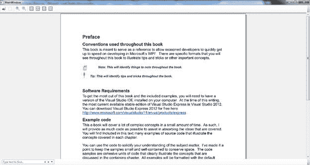
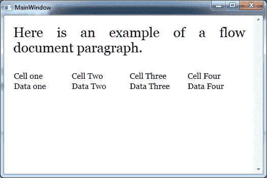
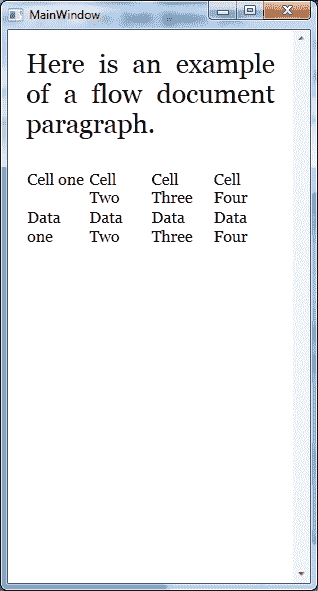

WPF 依赖属性支持一个叫做属性值继承的概念。属性值继承是一种机制，通过这种机制，父元素的属性将向下传播到子元素的相同属性。例如，您可以设置窗口对象的**字体大小**，所有文本控件将共享相同的字体大小，除非在子控件上明确设置了该大小。

除了一些关键区别之外，路由事件与典型的 Windows 窗体事件非常相似。事件路由提供了一种机制，使事件起源于一个元素，并将事件沿树向上传播到为该事件列出的其他元素。这很像依赖属性中的属性值继承。

很多时候，你会发现自己有很多内容要在窗口中显示。WPF 提供了在屏幕上格式化内容的课程。这是通过 WPF 文件完成的。文档允许您显示大量内容，而不用担心包含内容的窗口的大小。WPF 文档类型分为固定文档和流动文档。

固定文档通常是指用于打印的文档。微软已经包括了一种在 WPF 使用的固定文档。这些固定文档被称为 XPS 文档(XML 纸张规范)。XPS 文件结构实际上是一个压缩文件，包含文档每个元素(图像、字体和文本内容)的文件。WPF 编程模型为处理固定文档提供了许多有趣的选项。您可以使用 WPF 编程技术加载、打印、编写甚至注释文档。

|  | 提示:您可以通过将扩展替换为来重命名 XPS 文档。然后在您喜欢的 zip 压缩工具中查看压缩文件的内容。 |

要在 WPF 应用程序中显示固定的 XPS 文档，请使用**文档查看器**对象。该对象将创建用于搜索和放大文档的用户界面元素。您必须添加对 **ReachFramework** 组件的引用，才能访问**系统。windows . Xps . packaging . XPsdocument**对象。以下示例显示了如何加载 XPS 文件，以便在 WPF 应用程序中查看。

MainWindow.xaml 文件

```cs
    <Window x:Class="XPSDocumentViewer.MainWindow"

            xmlns:x="http://schemas.microsoft.com/winfx/2006/xaml"
            Title="MainWindow" Height="350" Width="525">
        <Grid>
            <DocumentViewer x:Name="xpsDocViewer">

            </DocumentViewer>
        </Grid>
    </Window>

```

MainWindow.xaml.cs 文件

```cs
    using System;
    using System.Collections.Generic;
    using System.Linq;
    using System.Text;
    using System.Windows;
    using System.Windows.Controls;
    using System.Windows.Data;
    using System.Windows.Documents;
    using System.Windows.Input;
    using System.Windows.Media;
    using System.Windows.Media.Imaging;
    using System.Windows.Navigation;
    using System.Windows.Shapes;
    using System.Windows.Xps.Packaging;
    using System.IO;

    namespace XPSDocumentViewer
    {
        /// <summary>
        /// Interaction logic for MainWindow.xaml.
        /// </summary>
        public partial class MainWindow : Window
        {
            XpsDocument mydoc = new XpsDocument("lettertest.xps", FileAccess.Read);

            public MainWindow()
            {
                InitializeComponent();
                xpsDocViewer.Document = mydoc.GetFixedDocumentSequence();
                mydoc.Close();
            }
        }
    }

```

下图是该应用程序的屏幕截图:



图 16:渲染的固定文档

另一种类型的 WPF 文件被称为流程文件。WPF 流文档是通过在一个容器中组合不同的流元素来创建的。 **FlowElements** 的独特之处在于它们不继承 **UIElement** 和 **FrameworkElement** 类。相反，它们代表了从 **ContentElement** 和 **FrameworkContentElement** 派生的完全独立的类分支。

与其他 **UIElements** 相比，内容元素类按比例缩小。它们有处理许多相同基本功能的事件，如鼠标和键盘事件以及拖放操作。内容元素和非内容元素的主要区别在于内容元素不处理自己的呈现。它们依赖于放置它们的容器来呈现它们。这允许容器延迟呈现以执行一些最后的优化，例如段落布局和单词断字。

可以调整流文档的大小，它们的容器将处理渲染，以确保**流元素**根据容器的大小和位置按照您的期望进行渲染。

以下是用于布局流文档的流内容元素列表:

| 

*   piece
*   stage
*   table
*   List item
*   Table line
*   internal links and collaboration between enterprises in coastal areas and those in the hinterland
*   step
*   Inline container
*   picture

 | 

*   tabulation/listing
*   zone
*   Table cell
*   Block container
*   Table row group
*   run
*   Line interruption
*   Fixed block
*   flotage

 |

流文档容器之一是**流文档滚动查看器**。顾名思义，这个容器允许您滚动内容。流程文档可以像 HTML 文档一样进行布局。甚至还有用于显示表格数据的表相关类。下面是一个基于表格的流程文档的示例。

MainWindow.xaml 文件

```cs
    <Window x:Class="FlowDocument.MainWindow"

            xmlns:x="http://schemas.microsoft.com/winfx/2006/xaml"
            Title="MainWindow" Height="350" Width="525">
        <FlowDocumentScrollViewer>
            <FlowDocument>
                <Paragraph FontSize="20pt">Here is an example of a flow document paragraph.</Paragraph>
                <Table>
                    <TableRowGroup>
                        <TableRow>
                            <TableCell>
                                <Paragraph>
                                    Cell one
                                </Paragraph>   
                            </TableCell>
                            <TableCell>
                                <Paragraph>
                                    Cell Two
                                </Paragraph>
                            </TableCell>
                            <TableCell>
                                <Paragraph>
                                    Cell Three
                                </Paragraph>
                            </TableCell>
                            <TableCell>
                                <Paragraph>
                                    Cell Four
                                </Paragraph>
                            </TableCell>
                        </TableRow>
                        <TableRow>
                            <TableCell>
                                <Paragraph>
                                    Data one
                                </Paragraph>
                            </TableCell>
                            <TableCell>
                                <Paragraph>
                                    Data Two
                                </Paragraph>
                            </TableCell>
                            <TableCell>
                                <Paragraph>
                                    Data Three
                                </Paragraph>
                            </TableCell>
                            <TableCell>
                                <Paragraph>
                                    Data Four
                                </Paragraph>
                            </TableCell>
                        </TableRow>
                    </TableRowGroup>
                </Table>
            </FlowDocument>
        </FlowDocumentScrollViewer>
    </Window>        

```

下面的截图显示了应用程序的输出；它们表示窗口大小改变后的相同输出。



图 17:呈现的流程文档



图 18:调整大小的渲染流文档