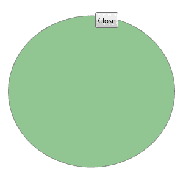
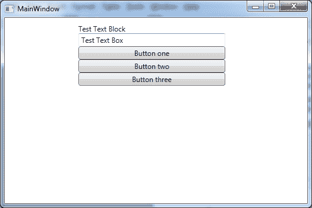
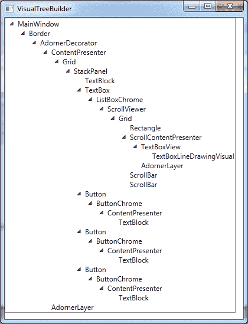
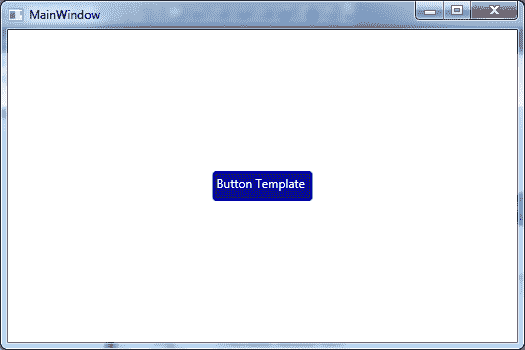
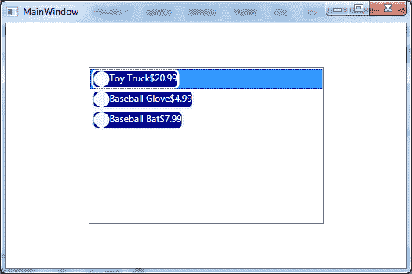

# 八、WPF 控件样式和模板

开发外观独特的 WPF 窗口的一个很好的技巧是将你的 **WindowStyle** 属性设置为 **none** ，然后给窗口添加一点不透明度。然后，您可以选择一种形状和颜色来创建一个非常传统的窗口。以下只是定制 WPF 车窗的众多不同可能性中的一个示例:



图 19:无框窗口

UniqueWindow.xaml 文件

```cs
    <Window x:Class="ExceptionValidation.UniqueWindow"

            xmlns:x="http://schemas.microsoft.com/winfx/2006/xaml"
            Title="UniqueWindow" Height="300" Width="300"
            WindowStyle="None" AllowsTransparency="True" Background="Transparent"
            MouseLeftButtonDown="Window_MouseLeftButtonDown">
        <Grid>
            <Ellipse Fill="ForestGreen" Opacity="0.5"  Height="249"  Name="ellipse1" Stroke="Black" Width="274">

            </Ellipse>
            <Button Content="Close" Click="button1_Click" Height="26" HorizontalAlignment="Left" Margin="156,20,0,0" Name="button1" VerticalAlignment="Top" Width="38" />
        </Grid>   
    </Window>

```

UniqueWindow.xaml.cs 文件

```cs
    using System;
    using System.Collections.Generic;
    using System.Linq;
    using System.Text;
    using System.Windows;
    using System.Windows.Controls;
    using System.Windows.Data;
    using System.Windows.Documents;
    using System.Windows.Input;
    using System.Windows.Media;
    using System.Windows.Media.Imaging;
    using System.Windows.Shapes;

    namespace ExceptionValidation
    {
        /// <summary>
        /// Interaction logic for UniqueWindow.xaml.
        /// </summary>
        public partial class UniqueWindow : Window
        {
            public UniqueWindow()
            {
                InitializeComponent();
            }

            private void Window_MouseLeftButtonDown(object sender, MouseButtonEventArgs e)
            {
                DragMove();
            }

            private void button1_Click(object sender, RoutedEventArgs e)
            {
                this.Close();
            }
        }
    }

```

为了完全重新设计控件的外观，您需要理解并修改组成控件的所有元素。当您设计一个窗口时，您创建一个父子元素关系的层次结构来定义您的用户界面。这被称为逻辑树。

WPF 控件，如**按钮**或**堆栈面板**是由一组元素组成的，就像你的窗口是由定义其外观的元素构成的一样。不同的是，作为开发人员，您看不到构成 WPF 控件的控件层次结构。这是有问题的，因为以后当您决定重新设计控件时，您通常需要了解控件最初是如何构造的。组成控件的元素的层次结构称为可视化树。

通过一点递归和一些 C#代码，我们可以创建一个显示整个窗口的可视化树的应用程序。

VisualTreeBuilder.xaml

```cs
    <Window x:Class="VisualTreeExplorer.VisualTreeBuilder"

            xmlns:x="http://schemas.microsoft.com/winfx/2006/xaml"
            Title="VisualTreeBuilder" Height="300" Width="300">
        <Grid>
            <TreeView  HorizontalAlignment="Left" Name="treeElements" VerticalAlignment="Top"  />
        </Grid>
    </Window>

```

VisualTreeBuilder.xaml.cs

```cs
    using System;
    using System.Collections.Generic;
    using System.Linq;
    using System.Text;
    using System.Windows;
    using System.Windows.Controls;
    using System.Windows.Data;
    using System.Windows.Documents;
    using System.Windows.Input;
    using System.Windows.Media;
    using System.Windows.Media.Imaging;
    using System.Windows.Shapes;

    namespace VisualTreeExplorer
    {
        /// <summary>
        /// Interaction logic for VisualTreeBuilder.xaml.
        /// </summary>
        public partial class VisualTreeBuilder : Window
        {
            public VisualTreeBuilder()
            {
                InitializeComponent();
            }

            public void BuildVisualTree(DependencyObject element)
            {
                treeElements.Items.Clear();

                TraverseElement(element, null);
            }

            private void TraverseElement(DependencyObject currentElement, TreeViewItem parentItem)
            {
                var item = new TreeViewItem();
                item.Header = currentElement.GetType().Name;
                item.IsExpanded = true;

                if (parentItem == null)
                {
                    treeElements.Items.Add(item);
                }
                else
                {
                    parentItem.Items.Add(item);
                }

                for (int i = 0; i < VisualTreeHelper.GetChildrenCount(currentElement); i++)
                {
                    // Process each contained element recursively.
                    TraverseElement(VisualTreeHelper.GetChild(currentElement, i), item);
                }
            }
        }
    }

```

MainWindow.xaml 文件

```cs
    <Window x:Class="VisualTreeExplorer.MainWindow"

            xmlns:x="http://schemas.microsoft.com/winfx/2006/xaml"
            Title="MainWindow" Height="350" Width="525" Loaded="Window_Loaded">
        <Grid>
            <StackPanel Height="271" HorizontalAlignment="Left" Margin="124,10,0,0" Name="stackPanel1" VerticalAlignment="Top" Width="247" >
                <TextBlock Text="Test Text Block" />
                <TextBox Text="Test Text Box" />
                <Button Content="Button one" />
                <Button Content="Button two" />
                <Button Content="Button three" />

            </StackPanel>
        </Grid>
    </Window>

```

MainWindow.xaml.cs 文件

```cs
    using System;
    using System.Collections.Generic;
    using System.Linq;
    using System.Text;
    using System.Windows;
    using System.Windows.Controls;
    using System.Windows.Data;
    using System.Windows.Documents;
    using System.Windows.Input;
    using System.Windows.Media;
    using System.Windows.Media.Imaging;
    using System.Windows.Navigation;
    using System.Windows.Shapes;

    namespace VisualTreeExplorer
    {
        /// <summary>
        /// Interaction logic for MainWindow.xaml.
        /// </summary>
        public partial class MainWindow : Window
        {
            public MainWindow()
            {
                InitializeComponent();
            }

            private void Window_Loaded(object sender, RoutedEventArgs e)
            {
                var visualTreeBuilder = new VisualTreeBuilder();
                visualTreeBuilder.BuildVisualTree(this);
                visualTreeBuilder.Show();
            }
        }
    }

```



图 20:原始窗口

如您所见，我们的**主窗口**由各种元素组成，仅用于显示目的。接下来，我们创建一个窗口，使用**可视化树帮助器**类来构建一个视图，该视图表示窗口元素层次的可视化树。这段代码对于重新设计 WPF 应用程序非常有用。



图 21:显示视觉元素树的窗口

每个 WPF 控件都有一个“无外观”设计。这意味着控件的外观可以从默认外观完全改变。控件的行为被烘焙到表示控件的类中，外观由所谓的控件模板定义。

控件模板定义控件的视觉方面。例如，按钮控件实际上是许多较小的 XAML 元素的组合，这些元素共同定义了按钮的外观。

模板在许多方面不同于样式。使用样式，您可以设置控件的属性来更改外观。模板允许您更改控件的外观和行为。它们允许你完全重组特定控件的组成。

为了给**按钮**控件创建自定义控件模板，我们将从在**窗口**资源集合中定义我们的**控件模板**开始。您通常希望在应用程序级资源中创建模板，以便可以在整个应用程序中重用该模板。您可以将**控制模板**的**目标类型**属性设置为**按钮**类型定义。我们将绘制一个边框和背景，并将按钮的内容放在里面。我们将使用**边框**控件作为边框。所有内容控件都需要一个 **ContentPresenter** 作为控件内容的容器。

当另一个属性值更改时，在样式和模板中使用触发器来更改控件的属性。为了给你的按钮增加一些视觉效果，我们需要对 **IsMouseOver** 和**ispresed**触发器进行响应。我们将在**按钮上显示和隐藏一个矩形。IsKeyboardFocused** 属性触发，显示按钮何时有焦点。

MainWindow.xaml 文件

```cs
    <Window x:Class="ButtonControlTemplate.MainWindow"

            xmlns:x="http://schemas.microsoft.com/winfx/2006/xaml"
            Title="MainWindow" Height="350" Width="525">
        <Window.Resources>
            <ControlTemplate x:Key="CustomButtonTemplate" TargetType="{x:Type Button}">
                <Border Name="Border" BorderBrush="Blue" BorderThickness="3" CornerRadius="2"
                        Background="BlueViolet" TextBlock.Foreground="White">
                    <Grid>
                        <Rectangle Name="FocusCue" Visibility="Hidden" Stroke="Black"
                                   StrokeThickness="1" StrokeDashArray="1 2"
                                   SnapsToDevicePixels="True" ></Rectangle>
                        <ContentPresenter RecognizesAccessKey="True" Margin="{TemplateBinding Padding}"></ContentPresenter>
                    </Grid>
                </Border>
                <ControlTemplate.Triggers>
                    <Trigger Property="IsMouseOver" Value="True">
                        <Setter TargetName="Border" Property="Background" Value="DarkBlue" />
                    </Trigger>
                    <Trigger Property="IsPressed" Value="True">
                        <Setter TargetName="Border" Property="Background" Value="Purple" />
                        <Setter TargetName="Border" Property="BorderBrush" Value="DarkKhaki" />
                    </Trigger>
                    <Trigger Property="IsKeyboardFocused" Value="True">
                        <Setter TargetName="FocusCue" Property="Visibility" Value="Visible" />
                    </Trigger>
                </ControlTemplate.Triggers>
            </ControlTemplate>
        </Window.Resources>
        <Grid>
            <Button Width="100" Height="30" Margin="10" Template="{StaticResource CustomButtonTemplate}">Button Template in action</Button>
        </Grid>
    </Window>

```



图 22:带有关联触发器的按钮

当数据绑定到列表控件时，您必须指定一个属性， **DisplayMemberPath** 。如果您可以定义几个控件，每个控件都有自己的绑定显示，这样您就可以为绑定集合中的每个项创建一个灵活的新列表项，这不是很好吗？您可以使用数据模板来实现这一点。数据模板可以应用于两种不同类型的控件:内容控件和列表控件。

内容控件通过**内容模板**属性使用数据模板。**项目控制**列表通过**项目模板**属性控制支持的数据模板。

MainWindow.xaml 文件

```cs
    <Window x:Class="BindObservableCollectionToListbox.MainWindow"

            xmlns:x="http://schemas.microsoft.com/winfx/2006/xaml"
            Title="MainWindow" Height="350" Width="525">
        <Grid>
            <ListBox Name="lstProducts" Width="300" Height="200">
                <ListBox.ItemTemplate>
                    <DataTemplate>
                        <Border BorderThickness="3" CornerRadius="6" BorderBrush="AliceBlue" Background="DarkBlue">
                            <Grid>
                                <Grid.ColumnDefinitions>
                                    <ColumnDefinition />
                                    <ColumnDefinition />
                                    <ColumnDefinition />
                                </Grid.ColumnDefinitions>
                                <Grid.RowDefinitions>
                                    <RowDefinition />
                                </Grid.RowDefinitions>
                                <Ellipse Grid.Column="0" Grid.Row="0" Width="20" Height="20" Fill="Azure" />
                                <TextBlock Grid.Column="1" Grid.Row="0" x:Name="txtProductName" Text="{Binding ProductName}" Foreground="White" />
                                <TextBlock Grid.Column="2" Grid.Row="0" x:Name="txtProductPrice" Text="{Binding ProductPrice}" Foreground="White" />
                            </Grid>
                        </Border>
                    </DataTemplate>
                </ListBox.ItemTemplate>
            </ListBox>
        </Grid>
    </Window>

```

MainWindow.xaml.cs 文件

```cs
    using System;
    using System.Collections.Generic;
    using System.Linq;
    using System.Text;
    using System.Threading.Tasks;
    using System.Windows;
    using System.Windows.Controls;
    using System.Windows.Data;
    using System.Windows.Documents;
    using System.Windows.Input;
    using System.Windows.Media;
    using System.Windows.Media.Imaging;
    using System.Windows.Navigation;
    using System.Windows.Shapes;

    namespace BindObservableCollectionToListbox
    {
        /// <summary>
        /// Interaction logic for MainWindow.xaml.
        /// </summary>
        public partial class MainWindow : Window
        {
            public ProductViewModel ViewModel { get; set; }

            public MainWindow()
            {
                InitializeComponent();

                ViewModel = new ProductViewModel();

                lstProducts.DataContext = ViewModel;
                lstProducts.ItemsSource = ViewModel;

            }
        }
    }

```

产品. cs

```cs
    using System;
    using System.Collections.Generic;
    using System.ComponentModel;
    using System.Linq;
    using System.Text;
    using System.Threading.Tasks;

    namespace BindObservableCollectionToListbox
    {
        public class Product : INotifyPropertyChanged
        {
            private string _productName;
            private string _productPrice;

            public string ProductName
            {
                get
                {
                    return _productName;
                }
                set
                {
                    _productName = value;
                    OnPropertyChanged("ProductName");
                }
            }

            public string ProductPrice
            {
                get
                {
                    return _productPrice;
                }
                set
                {
                    _productPrice = value;
                    OnPropertyChanged("ProductPrice");
                }
            }

            public override string ToString()
            {
                return ProductName;
            }

            public event PropertyChangedEventHandler PropertyChanged;

            private void OnPropertyChanged(string propertyName)
            {
                var handler = PropertyChanged;

                if (handler != null)
                {
                    handler(this, new PropertyChangedEventArgs(propertyName));
                }
            }
        }
    }

```

产品检视模型. cs

```cs
    using System;
    using System.Collections.Generic;
    using System.Collections.ObjectModel;
    using System.Linq;
    using System.Text;
    using System.Threading.Tasks;

    namespace BindObservableCollectionToListbox
    {
        public class ProductViewModel : ObservableCollection<Product>
        {
            public ProductViewModel()
            {
                this.Add(new Product { ProductName = "Toy Truck", ProductPrice = "$20.99" });
                this.Add(new Product { ProductName = "Baseball Glove", ProductPrice = "$4.99" });
                this.Add(new Product { ProductName = "Baseball Bat", ProductPrice = "$7.99" });
            }
        }
    }

```



图 23:带有数据模板的内容控件