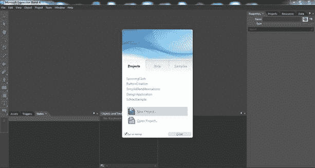
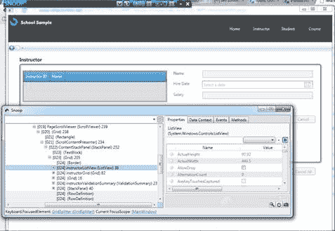

# 九、WPF 工具和框架

随着您对 WPF 和 XAML 的了解越来越多，您的用户界面设计将变得更加复杂。微软已经创建了一个专门面向 WPF 用户界面设计的工具。该工具被称为表达式混合，它允许设计师创建面向 WPF XAML 用户界面的极其复杂和惊人的视觉效果。该应用程序与 Visual Studio 并行工作，因此设计人员可以进行设计，开发人员可以进行编码。虽然我们不会详细介绍 Expression Blend，但您可以在[http://www.microsoft.com/en-us/download/details.aspx?下载试用版 id=10156](http://www.microsoft.com/en-us/download/details.aspx?id=10156) 。

图 24:微软表达式混合

Snoop 是一个应用程序，允许您作为开发人员附加到任何 WPF 应用程序，以查看和修改可视化树的元素及其属性。当您更改 Snooped 应用程序用户界面的属性时，您实际上可以看到更改在应用程序中生效。您可以查看和更改任何内容，从可视属性到数据绑定属性和绑定值。这是任何 WPF 开发者的必备工具。

图 25:窥探

随着您在 WPF 的经验增加，您将开始寻找 MVVM 框架，以尽可能最有效的方式促进模式的应用。在 WPF 应用中使用的一个比较著名的框架是 Prism 框架。棱镜框架是微软软件模式和实践套件的一部分。它提供的类允许您创建松散耦合的模块，这些模块在主外壳中动态加载和显示。外壳分为多个区域，您可以用模块中的用户控件视图动态填充这些区域。你可以在这里读到更多关于棱镜的内容:http://www.microsoft.com/en-us/download/details.aspx?id=28950 。

随着 Windows 8 和 WinRT 的发布，开发人员现在有了另一种使用 XAML 作为 UI 标记语言的技术。WPF·XAML 和温特·XAML 之间有着重要的区别。这是因为 WPF 是建立在。NET CLR 和 WinRT 支持。NET 框架，并且是用本机代码编写的。然而，如果你决定开发 Windows 8 或 WinRT 应用程序，你的 WPF 技能将派上用场。这里有一篇 MSDN 文章的链接，标题是“将 Silverlight 或 WPF·XAML/代码移植到 Windows Store 应用程序(Windows)”:[http://msdn . Microsoft . com/en-us/library/Windows/apps/xaml/br 229571 . aspx](http://msdn.microsoft.com/en-us/library/windows/apps/xaml/br229571.aspx)。