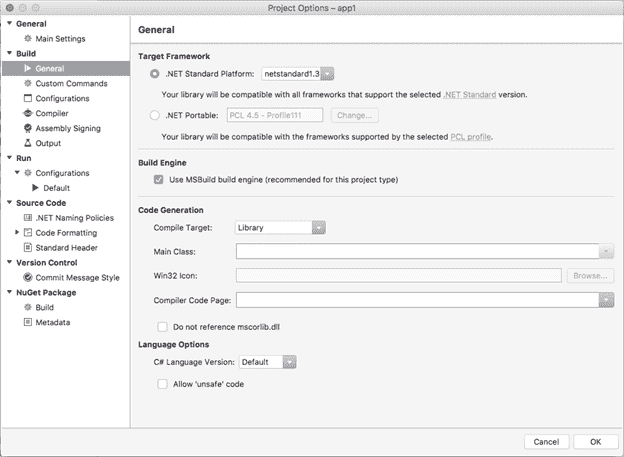

Xamarin。表单允许您从一个 C#代码库中构建运行在安卓和 iOS(如果在 Windows 上工作，还可以运行 Windows 10)上的应用程序。这是可能的，因为在它的核心，Xamarin。表单允许平台间共享用户界面的所有代码和非特定平台的所有代码。平台之间共享代码有不同的方式，各有利弊。本章解释了 Xamarin 中可用的代码共享策略。表单，突出它们的特征，以便您更容易决定哪种策略更适合您的解决方案。

在第 1 章中，我解释了如何创建 Xamarin。适用于苹果电脑的 Visual Studio 表单解决方案。它由三个项目组成:两个平台项目(安卓和 iOS)，以及一个允许平台间共享代码的项目。通过这种方法，开发人员可以共享用户界面的所有代码以及未耦合到每个平台的 API 的所有代码，从而最大限度地提高代码重用，并简化从单个 C#代码库中创建三个不同的本机应用程序的过程。在那个解释中，我简要介绍了可移植类库(PCL)，作为一个允许共享代码的项目类型。然而，Xamarin。表单允许以三种不同的方式在平台之间共享代码:可移植类库、共享项目和。NET 标准库。本章包含对这三种代码共享策略的全面讨论，提供了关于 PCL 项目类型的更多信息。值得一提的是，在撰写本文时，Visual Studio for Mac 包括基于 PCLs 和共享项目的 Xamarin 项目模板，而您需要一些手动但简单的步骤。NET 标准。在关于。NET 标准，您将学习如何轻松地将 PCL 转换为. NET 标准库。

顾名思义，可移植类库是可以在多个平台上使用的库。更具体地说，只有当它们针对所有这些平台上可用的 API 子集时，它们才能在多个平台上使用。PCL 已经存在了很多年，它们当然不是 Xamarin 所独有的。事实上，它们可以用于许多其他开发场景。例如，一个 PCL 可以用来在不同的项目类型之间共享一个模型-视图-视图模型架构。PCL 最重要的特征如下:

*   他们产生一个编译好的，可重用的。dll 程序集。
*   它们可以引用其他库并具有依赖性，例如 NuGet 包。
*   它们可以包含用户界面定义的 XAML 文件和 C#文件。
*   他们不能公开利用特定平台的特定 API 的代码；否则，它们将不再便携。
*   当您需要实现诸如 MVVM、工厂、带有依赖注入的控制反转(IoC)和服务定位器等架构模式时，它们是更好的选择。
*   关于 Xamarin。表单，它们可以使用服务定位器模式来实现抽象，并通过平台项目调用平台特定的 API(这将在第 8 章中讨论)。
*   它们更容易进行单元测试。

例如，如果您有 Windows 开发背景，您可以很容易地理解用于在 WPF 和 UWP 项目之间共享代码的 PCL 如何永远不会包含访问设备位置传感器的代码，因为这在 WPF 不受支持，并且需要 WPF 无法访问的 Windows 10 APIs。相反，一个 PCL 可以通过多个平台上的`HttpClient`类访问互联网资源，因为这是普遍可用的。通常，您会手动创建一个 PCL 项目，然后向解决方案中的其他项目添加必要的引用。就 Xamarin 而言。表单，而是在创建新项目时决定代码共享策略(参见图 4)，然后 Visual Studio for Mac 将自动生成一个 PCL 项目，该项目由解决方案中的平台项目引用，并且依赖于 Xamarin。表单 NuGet 包。

|  | 注意:在本电子书的所有示例中，我将使用 PCL 作为代码共享策略，原因如下:它使其他库的使用和管理变得更容易，对于需要更复杂体系结构的现实世界项目来说，它是更好的选择，并且更容易转换为. NET Standard 库。 |

共享项目以及 PCL 不是 Xamarin 特有的，并且已经存在多年。共享项目本质上是可以与其他项目共享的文件的松散分类。以下是共享项目最重要的特征列表，也强调了与 PCL 的区别:

*   它们不会产生编译过的、可重用的。dll 程序集。
*   它们不能引用其他库，并且具有依赖关系，如 NuGet 包。
*   它们可以包含用户界面定义的 XAML 文件和 C#文件。
*   它们可以包含特定于平台的代码，可以使用条件编译和预处理器指令。

为了选择一个共享项目作为代码共享策略，在**新建项目**对话框(见图 4)中，在**共享代码**组中选择**使用** **共享库**。当解决方案在解决方案面板中准备就绪时，您将看到类似于图 13 的共享项目。

图 13:Xamarin 中的共享项目。表单解决方案

这里需要注意的一点是，平台项目(安卓和 iOS)有对共享项目的引用，但共享项目不能有引用或依赖。此外，共享项目的属性没有项目级属性；相反，您只能访问它们包含的单个文件的属性。毫不奇怪，解决方案面板中没有共享项目的“属性”或“引用”节点。

共享项目可以包含几乎无限多的不同文件和资源，包括用户界面的 XAML 文件和 C#代码文件。这是可能的，因为共享项目没有编译；在构建整个解决方案时，编译器会解析源文件和资源。共享项目的最大好处是，它们允许编写特定于平台的代码，而不需要像使用 PCLs 那样使用服务定位器之类的模式。这是使用预处理器指令来完成的，如`#if`、`#elif`、`#else`和条件编译符号，如代码清单 1 所示。

代码清单 1

```cs
  private string GetFolderPath()
  {
      string path = "";

      #if __ANDROID__
          path = Environment.GetFolderPath(Environment.SpecialFolder.MyDocuments);  
      #elif __IOS__
          path = Environment.GetFolderPath(Environment.SpecialFolder.MyDocuments);
      #endif
      return path;
  }

```

如您所见，您可以简单地使用预处理器指令检查应用程序运行的平台，然后编译器将解析适当的平台特定代码，而无需处理其他模式的复杂性。每个平台都由项目属性的构建选项中定义的条件编译符号表示。表 1 总结了可用的符号和它们所代表的平台。

表 Xamarin 中的条件编译符号。形式

| `Symbol` | 描述 |
| --- | --- |
| `__ANDROID__` | 代表安卓平台 |
| `__IOS__` | 代表 iOS 平台 |
| `__TVOS__` | 代表苹果电视操作系统平台 |
| `__WATCHOS__` | 代表苹果手表操作系统平台 |
| `NETCORE_FX` | 代表。NET 核心平台 |

使用条件编译符号和预处理器指令的平台特定代码的一个有趣的例子是 [SQLite.cs](https://github.com/praeclarum/sqlite-net/blob/master/src/SQLite.cs) 文件，它针对 C#中流行的 SQLite 数据库实现数据访问。基于共享项目和前述方法的完整示例解决方案可从官方 Xamarin 文档中获得，并被称为 [Tasky](https://github.com/xamarin/mobile-samples/tree/master/Tasky) 。它展示了如何创建一个简单的待办事项移动应用程序。可以选择用代码清单 1 中的方法编写特定于平台的代码当然很有吸引力，但是您应该更喜欢 PCLs(和。NET 标准库)，至少在以下情况下:

*   您需要访问许多特定于平台的资源，并且您的代码可能变得非常难以维护。
*   您需要实现基于一个或多个模式的架构。在这种情况下，共享项目不仅不是最好的选择，而且拥有多个可移植库也很常见，这也使得团队更容易处理解决方案的不同部分。
*   您希望高效地对代码进行单元测试。

前面提到的几点，以及我在关于可移植库的部分中所做的考虑，应该会进一步阐明为什么你会在这本电子书中找到基于 PCLs 而不是共享项目的例子。

[。NET 标准](https://docs.microsoft.com/en-us/dotnet/standard/net-standard)为所有的。NET 开发平台，如。. NET 框架。NET Core 和 Mono 必须实现。这允许统一。NET 平台并避免未来的碎片化。通过创建一个. NET 标准库，您将确保您的代码可以在任何。NET 平台，不需要选择任何目标。这也解决了可移植库的一个常见问题，因为每个可移植库可以针对一组不同的平台，这意味着库和项目之间潜在的不兼容性。微软有一篇关于 T3 的有趣的[博文。NET 标准及其目标和实现，这将澄清对该规范的任何疑问。](https://blogs.msdn.microsoft.com/dotnet/2016/09/26/introducing-net-standard/)

在撰写本文时，版本为。NET 标准是可用的，它为。. NET 框架。NET Core 和 Mono。该文档将帮助您选择的版本。NET 标准，基于应用程序要运行的平台的最低版本。Xamarin。表单一直支持。NET 标准 2.0 从 2.4.0 版本开始，但目前，Visual Studio for Mac 不包括。NET 标准作为一种代码共享策略。形成解决方案。有理由预期，这种代码共享策略将作为一种可能的选择被纳入未来。

您现在可以做的是将一个可移植类库项目转换成一个. NET 标准库。为此，您需要遵循以下步骤:

1.  在解决方案面板中，右键单击 PCL 项目名称，并选择**选项**。
2.  出现**项目选项**对话框时，点击**构建**节点下的**常规**。
3.  在**目标框架**组中(见图 14)，选择**。NET 标准平台**，然后选择你想要的目标版本。请注意，您目前可以从 1.0 到 1.5 版本中进行选择，我推荐的选择是 1.3 版本。你可以点击**。NET 标准**超链接，获取所有支持版本中框架兼容性的综合指南。
4.  准备好之后点击**确定**。



图 14:将 PCL 更改为. NET 标准库

此时，请重新构建您的解决方案。现在您有了一个. NET 标准库，它可以包含几乎肯定会在所有实现该规范的平台上运行的代码。

|  | 注:即使。NET 标准在创建 Xamarin 时还没有作为代码共享策略。表单解决方案，毫无疑问，这将是近期首选的代码共享策略。为此，我建议您看一下[文档](https://docs.microsoft.com/en-us/dotnet/standard/net-standard)，花点时间探索一下 API 规范。 |

本章介绍了 Xamarin 可用的代码共享策略。窗体可以用来共享用户界面文件和独立于平台的代码，如可移植类库、共享项目和。NET 标准库。PCLs 产生可重用的程序集，允许实现更好的体系结构，并且不能包含特定于平台的代码。共享项目可以包含带有预处理器指令和条件编译符号的特定于平台的代码，但是它们不会产生可重用的程序集，并且如果它们访问许多本机资源，代码维护会更加困难。

。NET 标准库代表了跨平台代码共享的未来，基于一组正式的 API 规范，它们确保您的代码将在支持所选版本的所有平台上运行。NET 标准。假设可移植类库是首选，在接下来的章节中，您将开始编写代码和构建跨平台用户界面。