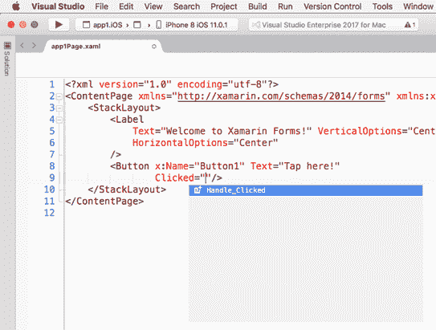
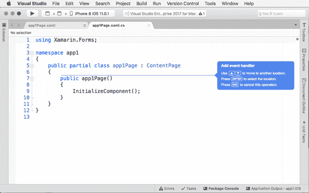
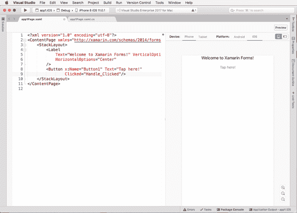

Xamarin。表单的核心是一个库，允许您通过共享代码从单个 C#代码库中创建本机用户界面。本章提供了在 Xamarin 中构建用户界面的基础。形成解决方案。然后，在接下来的三章中，您将更详细地了解布局、控件、页面和导航。

Xamarin 最大的好处。表单是指您可以在选择共享代码的项目中定义应用程序的整个用户界面，该项目可以是(目前)PCL 或共享项目。构建解决方案时获得的 iOS 和安卓原生应用将在每个平台上以适当的原生布局和控件呈现用户界面。这是可能的，因为 Xamarin。窗体将本机控件映射到 C#类中，然后 c#类负责呈现适当的视觉元素，具体取决于应用程序运行的平台。这些类实际上表示可视元素，如页面、布局和控件。

因为 PCL 或共享项目只能包含肯定会在所有平台上运行的代码，所以 Xamarin。表单仅映射所有平台共有的视觉元素。例如，iOS 和安卓都提供文本框和标签，所以 Xamarin。表单可以提供分别代表文本框和标签的`Entry`和`Label`控件。但是，每个平台呈现和管理的视觉元素彼此不同，具有不同的属性和行为。这意味着 Xamarin 中的控件。表单只公开每个平台共有的属性和事件，例如字体大小和文本颜色。

在第 8 章中，您将学习如何直接使用本机控件，但是现在，让我们关注 Xamarin 如何使用。表单允许创建带有现成可视元素的用户界面。iOS 和 Android 中的用户界面有一个由页面组成的层次结构，这些页面包含包含控件的布局。布局可以被认为是控件的容器，允许以不同的方式动态地排列用户界面。基于这个范式，Xamarin。窗体提供了许多可以在每个平台上呈现的页面类型、布局和控件。当您创建 Xamarin 时。表单解决方案，无论您选择 PCL 还是共享项目，您选择用于共享代码的项目都将包含一个根页面，您可以用可视元素填充该页面。然后，您可以通过添加其他页面和视觉元素来设计更复杂的用户界面。为了实现这一点，您可以同时使用 C#和可扩展应用程序标记语言(XAML)。让我们进一步讨论这两种方式。

在 Xamarin。表单，您可以用 C#代码创建应用程序的用户界面。例如，代码清单 2 演示了如何创建一个页面，该页面的布局将控件排列在包含标签和按钮的堆栈中。目前，不要关注元素名称及其属性(它们将在下一章中解释)。相反，关注代码引入的视觉元素的层次结构。

代码清单 2

```cs
  var newPage = new ContentPage();
  newPage.Title = "New page";

  var newLayout = new StackLayout();
  newLayout.Orientation = StackOrientation.Vertical;
  newLayout.Padding = new Thickness(10);

  var newLabel = new Label();
  newLabel.Text = "Welcome to Xamarin.Forms!";

  var newButton = new Button();
  newButton.Text = "Tap here";
  newButton.Margin = new Thickness(0, 10, 0, 0);

  newLayout.Children.Add(newLabel);
  newLayout.Children.Add(newButton);

  newPage.Content = newLayout;

```

这里有完整的智能感知支持。然而，正如您所能想象的，完全用 C#创建复杂的用户界面可能具有挑战性，至少有以下原因:

*   用 C#代码表示由大量元素组成的可视化层次结构是极其困难的。
*   您必须以允许您区分用户界面定义和其他命令式代码的方式编写代码。
*   因此，您的 C#变得更加复杂和难以维护。

在 Xamarin 的早期。表单，定义用户界面只能用 C#代码来完成。幸运的是，您现在有了一种更通用的方法来设计 XAML 的用户界面，您将在下一节中了解到这一点。显然，仍然有可能需要在 C#中创建可视元素的情况；例如，如果您需要在运行时添加新控件，尽管这是我建议您用 C#编写可视元素的唯一场景。

XAML 是*可扩展应用标记语言*的首字母缩写。顾名思义，XAML 是一种标记语言，您可以使用它以声明的方式编写用户界面定义。XAML 在 Xamarin 并不新鲜。表单，自从十多年前第一次用 Windows Presentation Foundation 引入 Windows 桌面开发以来，它一直在 Silverlight、Windows Phone 和通用 Windows 平台等平台上可用。

XAML 源于 XML，除其他外，它还提供了以下好处:

*   XAML 使以分层方式表示元素结构变得容易，其中页面、布局和控件用 XML 元素表示，属性用 XML 属性表示。
*   它在用户界面定义和 C#逻辑之间提供了清晰的分离。
*   作为一种与逻辑分离的声明性语言，它允许专业设计人员在不干扰命令性代码的情况下处理用户界面。

你用 XAML 定义用户界面的方式是跨平台统一的，这意味着你设计一次用户界面，它将在 iOS、安卓上运行，当然，如果你用 VS 2017 在 Windows 上工作，它将在 Windows 10 上运行。

|  | 注:XAML 在 Xamarin。Forms 遵循微软的 XAML 2009 规范，但它的词汇在其他平台上与 XAML 不同，如 WPF 或 UWP。如果您对这些平台有经验，您会注意到视觉元素及其属性的命名方式有许多不同。微软正致力于统一 XAML 词汇，你将在 XAML 标准的提示部分了解到这一点。另外，请记住，XAML 对对象名称及其属性和成员区分大小写。 |

例如，当您创建 Xamarin 时。表单解决方案，您可以在名为 **MainPage.xaml** 的 PCL 项目中找到一个文件，其标记在代码清单 3 中表示。

代码清单 3

```cs
  <?xml version="1.0" encoding="utf-8" ?>
  <ContentPage 
               xmlns:x="http://schemas.microsoft.com/winfx/2009/xaml"
               xmlns:local="clr-namespace:App1"
               x:Class="App1.MainPage">

        <Label Text="Welcome to Xamarin Forms!" 
             VerticalOptions="Center" 
             HorizontalOptions="Center" />

  </ContentPage>

```

Xamarin 中的 XAML 文件。表单通常包含页面或自定义视图。根元素是一个`ContentPage`对象，它代表它的 C#类对应物，并呈现为一个单独的页面。在 XAML，页面的`Content`属性是隐式的，这意味着您不需要编写`ContentPage.Content`元素。编译器假定您放在`ContentPage`标签之间的可视元素被分配给`ContentPage.Content`属性。

另一方面，`Label`元素代表 C#中的`Label`类。该类的属性被赋予了 XML 属性，如`Text`、`VerticalOptions`和`HorizontalOptions`。

您可能已经对用户界面结构的更好的组织和可视化表示有了直接的认识。如果查看根元素，可以看到许多属性的定义以`xmlns`开头。这些被称为 XML 名称空间，非常重要，因为它们可以声明在特定名称空间或 XML 模式中定义的可视元素。例如，`xmlns`指向在特定的 XML 模式中定义的根 XAML 命名空间，并允许向用户界面定义中添加 Xamarin 定义的所有可视元素。表格；`xmlns:x`指向一个公开内置类型的 XML 模式；而`xmlns:local`指向应用的程序集，使得使用项目中定义的对象成为可能。

每个页面或布局只能包含一个视觉元素。在自动生成的**页面中，除非将其他可视元素组织到布局中，否则不能将它们添加到页面中。例如，如果您想在`Label`下面添加一个按钮，您需要在一个容器(如`StackLayout`)中包含`Label`和`Button`，如代码清单 4 所示。**

|  | 提示:智能感知将通过在您键入时显示元素名称和属性来帮助您更快地添加可视元素。然后，只需按 Tab 键或双击即可快速插入元素。 |

代码清单 4

```cs
<?xml version="1.0" encoding="utf-8" ?>
```

```cs
<ContentPage 
```

```cs
             xmlns:x="http://schemas.microsoft.com/winfx/2009/xaml"
```

```cs
             xmlns:local="clr-namespace:App1"
```

```cs
             x:Class="App1.MainPage">
```

```cs
    <StackLayout Orientation="Vertical" Padding="10">
```

```cs
        <Label Text="Welcome to Xamarin Forms!" 
```

```cs
       VerticalOptions="Center" 
```

```cs
       HorizontalOptions="Center" />
```

```cs
        <Button x:Name="Button1" Text="Tap here!" 
```

```cs
            Margin="0,10,0,0"/>
```

```cs
    </StackLayout>
```

```cs
</ContentPage>
```

如果布局中没有包含这两个控件，Visual Studio 将引发错误。您可以将其他布局嵌套在父布局中，并创建视觉元素的复杂层次结构。请注意`Button`的`x:Name`分配。一般来说，使用`x:Name`你可以给任何可视元素分配一个标识符，这样你就可以在 C#代码中与它交互，例如，如果你需要检索一个属性值。

如果你以前从未见过 XAML，你可能会想，在这一点上，你如何用 C#与视觉元素进行交互。在解决方案资源管理器中，如果您展开**主页面. xaml** 文件，您将看到一个名为**主页面. xaml.cs** 的嵌套文件。这就是所谓的代码隐藏文件，它包含当前页面的所有命令代码。在这种情况下，代码隐藏文件的最简单形式，代码包含继承自`ContentPage`的`MainPage`类的定义，以及调用基类的`InitializeComponent`方法并初始化页面的页面构造函数。您将经常从解决方案面板访问代码隐藏文件，但是 Visual Studio for Mac 允许另一种与非常常见的需求相关的简单方法:响应用户界面引发的事件。

事件是用户和应用程序以及 Xamarin 中的控件之间交互的基础。窗体引发事件，这在任何平台上都是正常的。事件在 C#代码隐藏文件中处理。Visual Studio for Mac 使通过智能感知创建事件处理程序变得简单。例如，假设您想在用户点击前面代码中定义的按钮时执行一个操作。`Button`控件公开了一个名为`Clicked`的事件，您可以按如下方式分配事件处理程序的名称:

`<Button x:Name="Button1" Text="Tap here!" Margin="0,10,0,0"`

`Clicked="Button1_Clicked"` `/>`

然而，当您键入`Clicked=` `"`时，Visual Studio 提供了一个快捷方式，允许基于事件的名称在 C#中生成事件处理程序，如图 15 所示。



图 15:生成事件处理程序

如果按下**选项卡**，Visual Studio 将插入新事件处理程序的名称，并在代码隐藏中生成 C#事件处理程序。

|  | 提示:建议您指定对控件有意义的事件处理程序名称，例如`Button1_Clicked`，而不是更一般的名称，如`Handle_Clicked`。 |

它还会自动打开代码隐藏文件，为您提供一个选项来决定新事件处理程序的位置，如图 16 所示。



图 16:决定事件处理程序的位置

您可以按箭头将事件处理程序移动到不同的位置，按 **Esc** 取消，按**回车**在蓝线所在的位置插入事件处理程序。事件处理程序如下所示:

`void Handle_Clicked(object sender, System.EventArgs e)`

`{`

`throw new NotImplementedException();`

`}`

此时，您将能够编写执行您想要执行的操作的代码。一般来说，事件处理程序的签名需要两个参数:一个是表示引发事件的控件的类型`object`，一个是包含事件信息的类型`EventArgs`的对象。在许多情况下，事件处理程序使用`EventArgs`的派生版本，但这些将在适当的时候突出显示。可以想象，Xamarin。表单公开了在所有支持的平台上普遍可用的事件。

如果您查看代码清单 3，您会看到`StackLayout`的`Orientation`属性是`StackOrientation`类型，`Padding`属性是`Thickness`类型，分配给`Button`的`Margin`属性也是`Thickness`类型。然而，正如您在代码清单 4 中看到的，在 XAML，相同的属性被赋予了以字符串形式传递的值。Xamarin。表单(以及所有其他基于 XAML 的平台)实现了所谓的*类型转换器*，它自动将字符串转换为许多已知类型的适当值。在这里总结所有可用的类型转换器和已知的目标类型在这一点上既不可能也没有必要；您只需要记住，在大多数情况下，您作为属性值分配的字符串会代表您自动转换为适当的类型。

Xamarin。窗体没有一个设计器，可以让您像在 Visual Studio 2017 上使用 WPF、windows 窗体和 UWP 等平台一样，使用鼠标、工具箱和交互式窗口直观地绘制用户界面。这意味着你需要手动写你所有的 XAML。然而，Visual Studio for Mac 提供了一个由 Xamarin 表示的不错的解决方案。表单预览器。当您编辑 XAML 标记时，此工具会自动打开，并在您键入时实时显示用户界面的预览。图 17 显示了 Xamarin。表单预览器正在运行。您也可以使用 XAML 编辑器窗口右上角的**预览**按钮禁用或重新启用预览器。



图 Xamarin。表单预览器

|  | 提示:请记住在打开 Xamarin 之前重建您的解决方案。第一次使用表单预览器。 |

在右下角，预览器提供缩放控制。在顶部，您可以选择设备因素(手机或平板电脑)、用于渲染预览的平台(安卓或 iOS)以及方向(垂直或水平)。如果您的 XAML 中有任何错误，或者由于任何原因，预览器无法呈现预览，它将显示详细的错误消息。在接下来的章节中，我将经常使用预览器来演示用户界面的外观，而不是运行模拟器。

### XAML 标准提示

如果你有在 WPF 和 UWP 开发 Windows 的经验，你可能已经习惯了 XAML。在 Xamarin。表单，XAML 遵循微软 XAML 2009 规范，但它的词汇不同于其他基于 XAML 的平台。例如，文本框在 WPF 和 UWP 由`TextBox`控件表示，但在 Xamarin 中。表格你有一个`Entry`。同样，WPF 和 UWP 的`Button`控制暴露了一个名为`Click`的事件，在 Xamarin.Forms 中改为`Clicked`。最近，微软宣布了 [XAML 标准](https://www.google.it/url?sa=t&rct=j&q=&esrc=s&source=web&cd=1&cad=rja&uact=8&ved=0ahUKEwjlqIbd5IXVAhVDbhQKHU-ACtAQFggmMAA&url=https%3A%2F%2Fgithub.com%2FMicrosoft%2Fxaml-standard&usg=AFQjCNFgeMIN5skZ4TSTRXmNiu3-eARarQ)，一个跨平台的 XAML 方言的统一。XAML 标准仍处于起步阶段，因此尚未上市。不过，你可以关注 GitHub 上的进展，你可以阅读一篇介绍性的[博文](https://blogs.windows.com/buildingapps/2017/05/19/introducing-xaml-standard-net-standard-2-0/#zFYJudAG8xDFLj8f.97)，更详细地解释 XAML 标准的目标。

跨平台共享用户界面是 Xamarin 的一个特性。Forms 的主要目标，这一章提供了一个基于视觉元素层次的如何定义 XAML 用户界面的概要。您已经看到了如何添加可视元素以及如何分配它们的属性；您已经看到了类型转换器如何允许在 XAML 传递字符串值，以及编译器如何将它们转换为适当的类型；你第一次看到了 Xamarin。表单预览器，在您编辑 XAML 时获得用户界面的实时集成表示。在此概述了如何在 Xamarin 中定义用户界面之后。表单，是时候更详细地讨论重要的 UI 概念了，我们将从用布局组织用户界面开始。