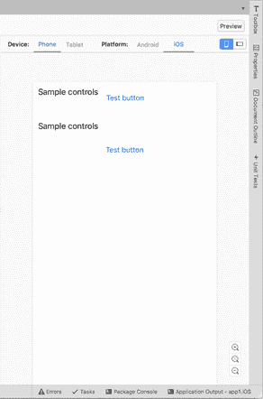
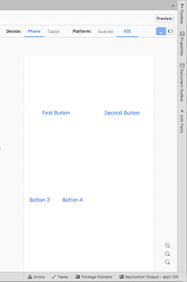
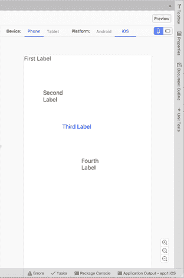
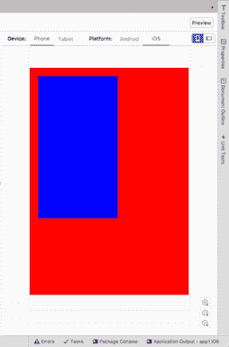
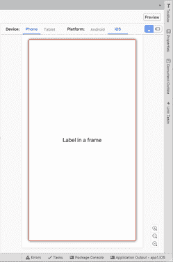
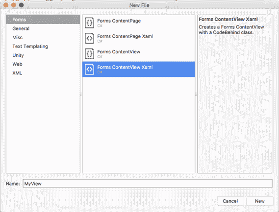

手机、平板电脑和笔记本电脑等移动设备具有不同的屏幕尺寸和外形。它们还支持横向和纵向。因此，移动应用程序中的用户界面必须动态适应系统、屏幕和设备，以便可视元素可以根据外形和设备方向自动调整大小或重新排列。在 Xamarin。表单，这是通过布局来完成的，这是本章的主题。

Xamarin 的目标之一。表单提供了创建动态界面的能力，这些界面可以根据用户的偏好或设备和屏幕大小进行重新排列。因此，除了在非常有限的情况下，使用 Xamarin 构建的移动应用程序中的控件在用户界面上不应该有固定的大小或位置。为了使这成为可能，Xamarin。表单控件排列在特殊的容器中，称为*布局*。布局是允许在用户界面和 Xamarin 中排列视觉元素的类。表单提供了许多这样的功能。

在本章中，您将了解可用的布局以及如何使用它们来排列控件。您必须记住的最重要的事情是 Xamarin 中的控件。表单具有层次结构；因此，您可以嵌套多个面板来创建复杂的用户体验。表 2 总结了可用的布局。然后，在接下来的部分中，您将更详细地了解它们。

表 Xamarin 中的布局。形式

| `Layout` | 描述 |
| --- | --- |
| `StackLayout` | 允许您水平或垂直放置视觉元素 |
| `Grid` | 允许您在行和列中组织可视元素 |
| `AbsoluteLayout` | 放置在指定的固定位置的布局 |
| `RelativeLayout` | 其位置取决于相对约束的布局 |
| `ScrollView` | 允许您滚动其中包含的视觉元素 |
| `Frame` | 绘制边框并在它包含的视觉元素周围添加空间 |
| `ContentView` | 一种特殊的布局，可以包含可视元素的层次结构，并可用于在 XAML 创建自定义控件 |

请记住，只有一个根布局被分配给页面的`Content`属性，然后该布局可以包含嵌套的视觉元素和布局。

一般来说，布局和控件都可以通过将`HorizontalOptions`和`VerticalOptions`属性分配给`LayoutOptions`结构中的一个属性值来对齐，如表 3 所示。提供对齐选项非常常见。例如，如果您在一个页面中只有根布局，您将希望使用`StartAndExpand`分配`VerticalOptions`，以便该布局获得页面中的所有可用空间(当您在本章和下一章中尝试布局和视图时，请记住这一点)。

表 Xamarin 中的对齐选项。形式

| 对齐 | 描述 |
| --- | --- |
| `Center` | 将视觉元素居中对齐 |
| `CenterAndExpand` | 将可视元素居中对齐，并扩展其边界以填充可用空间 |
| `Start` | 将视觉元素左对齐 |
| `StartAndExpand` | 将可视元素左对齐，并扩展其边界以填充可用空间 |
| `End` | 将视觉元素右对齐 |
| `EndAndExpand` | 将可视元素右对齐，并扩展其边界以填充可用空间 |

您还可以通过三个属性控制视觉元素之间的空间:`Padding`、`Spacing`和`Margin`，如表 4 所示。

表 Xamarin 中的间距选项。形式

| 间隔 | 描述 |
| --- | --- |
| `Margin` | 表示当前视觉元素与其相邻元素之间的距离，四边都是固定值，左边、上边、右边和下边是逗号分隔值。它是类型`Thickness`，XAML 已经为它内置了类型转换器。 |
| `Padding` | 表示视觉元素与其子元素之间的距离。可以为所有四边设置一个固定值，也可以为左边、上边、右边和下边设置逗号分隔值。它是类型`Thickness`，XAML 已经为它内置了类型转换器。 |
| `Spacing` | 仅在`StackLayout`容器中可用，它允许您设置每个子元素之间的空间量，默认值为 6.0。 |

我建议您花一些时间尝试对齐和间距选项是如何工作的，以便了解如何在用户界面中获得合适的结果。

`StackLayout`容器允许将控件放置在彼此附近，如在可水平和垂直排列的堆栈中。与其他容器一样，`StackLayout`可以包含嵌套面板。下面的代码显示了如何水平和垂直排列控件。代码清单 5 显示了一个带有根`StackLayout`和两个嵌套布局的示例。

代码清单 5

```cs
<?xml version="1.0" encoding="utf-8" ?>
```

```cs
<ContentPage 
```

```cs
             xmlns:x="http://schemas.microsoft.com/winfx/2009/xaml"
```

```cs
             xmlns:local="clr-namespace:App1"
```

```cs
             x:Class="App1.MainPage">
```

```cs
    <StackLayout Orientation="Vertical">
```

```cs
        <StackLayout Orientation="Horizontal" Margin="5">
```

```cs
            <Label Text="Sample controls" Margin="5"/>
```

```cs
            <Button Text="Test button" Margin="5"/>
```

```cs
        </StackLayout>
```

```cs
        <StackLayout Orientation="Vertical" Margin="5">
```

```cs
            <Label Text="Sample controls" Margin="5"/>
```

```cs
            <Button Text="Test button" Margin="5"/>
```

```cs
        </StackLayout>
```

```cs
    </StackLayout>
```

```cs
</ContentPage>
```

代码清单 5 中 XAML 的结果如图 18 所示。



图 18:用堆栈布局排列视觉元素

`Orientation`属性可以设置为`Horizontal`或`Vertical`，这决定了最终的布局。如果未指定，则默认为`Vertical`。XAML 代码的一个主要好处是元素名称和属性是不言自明的，这在`StackLayout`的属性中也是如此。请记住`StackLayout`内的控件会根据方向自动调整大小。如果不喜欢这种行为，需要在每个控件上指定`WidthRequest`和`HeightRequest`属性，分别表示宽度和高度。`Spacing`是一个属性，可以用来调整子元素之间的空间量；这优于使用`Margin`属性调整单个控件上的空间。

`Grid`是最容易理解的布局之一，可能也是最通用的。它允许您创建带有行和列的表。通过这种方式，您可以定义单元格，并且每个单元格都可以包含一个控件或存储嵌套控件的另一个布局。`Grid`是通用的，因为你可以把它分成行或列，或者两者都有。以下代码定义了一个分为两行两列的`Grid`:

`<Grid>`

`<Grid.RowDefinitions>`

`<RowDefinition />`

`<RowDefinition />`

`</Grid.RowDefinitions>`

`<Grid.ColumnDefinitions>`

`<ColumnDefinition />`

`<ColumnDefinition />`

`</Grid.ColumnDefinitions>`

`</Grid>`

`RowDefinitions`是`RowDefinition`物体的集合，`ColumnDefinitions`和`ColumnDefinition`也是如此。每个项目分别代表`Grid`内的一行或一列。您也可以指定一个`Width`或一个`Height`属性来限定行和列的尺寸；如果没有指定任何内容，则行和列的尺寸都是可用的最大尺寸。调整父容器大小时，行和列会自动重新排列。

上面的代码创建了一个包含四个单元格的表。要在`Grid`中放置控件，可以通过控件上的`Grid.Row`和`Grid.Column`属性(称为[附加属性](https://developer.xamarin.com/guides/xamarin-forms/xaml/attached-properties/)来指定行和列的位置。附加属性允许从当前可视元素分配父容器的属性。两者的索引都是从零开始的，这意味着 0 代表左边的第一列和顶部的第一行。您可以在单元格或单行或单列中放置嵌套布局。代码清单 6 中的代码展示了如何将网格嵌套到带有子控件的根网格中。

|  | 提示:`Grid.Row="0"`和`Grid.Column="0"`可以省略。 |

代码清单 6

```cs
  <?xml
  version="1.0" encoding="utf-8" ?>
  <ContentPage 
               xmlns:x="http://schemas.microsoft.com/winfx/2009/xaml"
               x:Class="Layouts.GridSample">
      <ContentPage.Content>
          <Grid>
              <Grid.RowDefinitions>
                  <RowDefinition />
                  <RowDefinition />
              </Grid.RowDefinitions>
              <Grid.ColumnDefinitions>
                  <ColumnDefinition />
                  <ColumnDefinition />
              </Grid.ColumnDefinitions>
              <Button Text="First
  Button" />
              <Button Grid.Column="1" Text="Second Button"/>

              <Grid Grid.Row="1">
                  <Grid.RowDefinitions>
                      <RowDefinition />
                      <RowDefinition />
                  </Grid.RowDefinitions>
                  <Grid.ColumnDefinitions>
                      <ColumnDefinition />
                      <ColumnDefinition />
                  </Grid.ColumnDefinitions>
                  <Button Text="Button
  3" />
                  <Button Text="Button
  4" Grid.Column="1" />
              </Grid>
          </Grid>
      </ContentPage.Content>
  </ContentPage>
```

图 19 显示了这段代码的结果。



图 19:用网格排列视觉元素

`Grid`布局非常百搭，在性能方面也是一个不错的选择(如果可能的话)。

您可以精细控制行和列的大小、空间和比例。`RowDefinition`和`ColumnDefinition`对象的`Height`和`Width`属性可以用来自`GridUnitType`枚举的值进行设置，如下所示:

*   `Auto`:自动调整大小以适应行或列中的内容
*   `Star`:根据剩余空间的比例调整列和行的大小
*   `Absolute`:用特定的固定高度和宽度值调整列和行的大小

XAML 有`GridUnitType`值的类型转换器，所以您只需不传递`Auto`的值，传递一个`*`给`Star`，传递一个固定数值给`Absolute`，例如:

```cs
<Grid.ColumnDefinitions>
```

```cs
   <ColumnDefinition />
```

```cs
   <ColumnDefinition Width="*"/>
```

```cs
   <ColumnDefinition Width="20"/>
```

```cs
</Grid.ColumnDefinitions>
```

在某些情况下，元素可能会占据多行或多列。在这些情况下，您可以为`Grid.RowSpan`和`Grid.ColumnSpan`附加属性分配视觉元素应该占据的行数和列数。

`AbsoluteLayout`容器允许您指定子元素在屏幕上的确切显示位置，以及它们的大小和边界。根据此过程中使用的`AbsoluteLayoutFlags`枚举，有几种不同的方法来设置子元素的边界。`AbsoluteLayoutFlags`枚举包含以下值:

*   `All`:所有维度都是成比例的
*   `HeightProportional`:高度与布局成正比
*   `None`:没有解读
*   `PositionProportional`:组合`XProportional`和`YProportional`
*   `SizeProportional`:组合`WidthProportional`和`HeightProportional`
*   `WidthProportional`:宽度与布局成正比
*   `XProportional` : X 属性与布局成正比
*   `YProportional` : Y 属性与布局成正比

一旦您创建了您的子元素，您将需要分配`AbsoluteLayout.LayoutFlags`附加属性来将它们设置在容器内的绝对位置。您还需要分配`AbsoluteLayout.LayoutBounds`附加属性，以给出元素的边界。从 Xamarin 开始。Forms 是 Xamarin 和设备特定实现之间的抽象层，位置值可以独立于设备像素。这就是前面提到的布局标志发挥作用的地方。代码清单 7 为子控件提供了一个基于比例维度和绝对位置的例子。

代码清单 7

```cs
  <?xml version="1.0" encoding="utf-8" ?>
  <ContentPage 
               xmlns:x="http://schemas.microsoft.com/winfx/2009/xaml"
               xmlns:local="clr-namespace:App1"
               x:Class="App1.MainPage">

      <AbsoluteLayout>
          <Label Text="First Label" 

  AbsoluteLayout.LayoutBounds="0, 0, 0.25, 0.25"
                 AbsoluteLayout.LayoutFlags="All" TextColor="Red"/>
          <Label Text="Second Label" 

  AbsoluteLayout.LayoutBounds="0.20, 0.20, 0.25, 0.25"
                 AbsoluteLayout.LayoutFlags="All" TextColor="Black"/>
          <Label Text="Third Label" 

  AbsoluteLayout.LayoutBounds="0.40, 0.40, 0.25, 0.25"
                 AbsoluteLayout.LayoutFlags="All" TextColor="Blue"/>
          <Label Text="Fourth Label" 

  AbsoluteLayout.LayoutBounds="0.60, 0.60, 0.25, 0.25"
                 AbsoluteLayout.LayoutFlags="All" TextColor="Green"/>
      </AbsoluteLayout>
  </ContentPage>

```

图 20 显示了`AbsoluteLayout`示例的结果。



图 20:绝对定位和绝对布局

`RelativeLayout`容器提供了一种方法来指定子元素相对于彼此或相对于父控件的位置。相对位置通过一系列`Constraint`对象来解析，这些对象定义了每个特定子元素相对于另一个子元素的相对位置。在 XAML，`Constraint`对象通过`ConstraintExpression`标记扩展表示，该扩展用于将子视图的位置或大小指定为常数，或者相对于父视图或其他命名视图。标记扩展在 XAML 非常常见，您将在第 7 章中看到许多关于数据绑定的内容，但是详细讨论它们超出了本文的范围。官方文档有一个非常详细的[页面](https://developer.xamarin.com/guides/xamarin-forms/xaml/xaml-basics/xaml_markup_extensions/)关于它们的语法和实现，我鼓励你阅读。

在`RelativeLayout`类中，有名为`XConstraint`和`YConstraint`的属性。在下一个示例中，您将看到如何通过附加属性从另一个 XAML 元素中为这些属性赋值。代码清单 8 展示了这一点，其中您遇到了`BoxView`，这是一个允许您绘制彩色框的视觉元素。在这种情况下，它有助于让您立即了解布局是如何组织的。

代码清单 8

```cs
  <?xml version="1.0" encoding="utf-8" ?>
  <ContentPage 
               xmlns:x="http://schemas.microsoft.com/winfx/2009/xaml"
               xmlns:local="clr-namespace:App1"
               x:Class="App1.MainPage">

      <RelativeLayout>
          <BoxView Color="Red" x:Name="redBox"
          RelativeLayout.YConstraint="{ConstraintExpression Type=RelativeToParent,
              Property=Height,Factor=.15,Constant=0}"
          RelativeLayout.WidthConstraint="{ConstraintExpression
              Type=RelativeToParent,Property=Width,Factor=1,Constant=0}"
          RelativeLayout.HeightConstraint="{ConstraintExpression
              Type=RelativeToParent,Property=Height,Factor=.8,Constant=0}" />
          <BoxView Color="Blue"
          RelativeLayout.YConstraint="{ConstraintExpression Type=RelativeToView,
              ElementName=redBox,Property=Y,Factor=1,Constant=20}"
          RelativeLayout.XConstraint="{ConstraintExpression Type=RelativeToView,
              ElementName=redBox,Property=X,Factor=1,Constant=20}"
          RelativeLayout.WidthConstraint="{ConstraintExpression
              Type=RelativeToParent,Property=Width,Factor=.5,Constant=0}"
          RelativeLayout.HeightConstraint="{ConstraintExpression
              Type=RelativeToParent,Property=Height,Factor=.5,Constant=0}" />
      </RelativeLayout>
  </ContentPage>

```

代码清单 8 的结果如图 21 所示。



图 21:用 RelativeLayout 排列视觉元素

|  | 提示:`RelativeLayout`容器渲染性能差，文档建议尽可能避免这种布局，或者至少每页避免多个`RelativeLayout`。 |

特殊的布局`ScrollView`允许您呈现无法容纳在一个屏幕上的内容，因此应该滚动。它的用法很简单:

`<ScrollView x:Name="Scroll1">`

`<StackLayout>`

`<Label Text="My favorite color:" x:Name="Label1"/>`

`<BoxView BackgroundColor="Green" HeightRequest="600" />`

`</StackLayout>`

`</ScrollView>`

你基本上是在`ScrollView`里面添加了一个布局或者视觉元素，在运行的时候，如果内容的面积大于屏幕大小，内容就会是可滚动的。此外，您可以指定`Orientation`属性(值为`Horizontal`或`Vertical`，将`ScrollView`设置为仅水平滚动或仅垂直滚动。布局在示例用法中有名称的原因是，您可以通过编程方式与`ScrollView`交互，调用其`ScrollToAsync`方法根据两个不同的选项移动其位置。请考虑以下几行:

`Scroll1.ScrollToAsync(0, 100, true);`

`Scroll1.ScrollToAsync(Label1, ScrollToPosition.Start, true);`

`moves the specified control at the top of the view and sets the current position at the control’s position. Possible values for the` 滚动视图 `moves the specified control at the top of the view and sets the current position at the control’s position. Possible values for the` 滚动位置 `enumeration are:`

*   `Center`:将元素滚动到视图可见部分的中心
*   `End`:将元素滚动到视图可见部分的末尾
*   `MakeVisible`:使元素在视图中可见
*   `Start`:将元素滚动到视图可见部分的开始。

`layouts, and you should never include the` 滚动视图 `layouts, and you should never include the` 列表视图 `and` web 视图 `controls inside a` 滚动视图 `because they both already implement scrolling.`

`The` 框 `is a very special layout in Xamarin.Forms because it provides an option to draw a colored border around the visual element it contains, and an option to add extra space between the` 框`’s bounds and the visual element. Code Listing 9 provides an example.`

代码清单 9

```cs
  <?xml version="1.0" encoding="utf-8" ?>
  <ContentPage 
               xmlns:x="http://schemas.microsoft.com/winfx/2009/xaml"
               xmlns:local="clr-namespace:App1"
               x:Class="App1.MainPage">

      <Frame OutlineColor="Red" CornerRadius="3" HasShadow="True" Margin="20">
          <Label Text="Label in a frame"
                 HorizontalOptions="Center"
                 VerticalOptions="Center"/>
      </Frame>
  </ContentPage>

```

`The` 外色 `property is assigned with the color for the border, the` 角膜半径 `property is assigned with a value that allows you to draw circular corners, and the` HasShadow `property allows you to display a shadow. Figure 22 provides an example.`



图 22:绘制框架

`The` 框架 `will be resized proportionally based on the parent container’s size.`

特殊的容器`ContentView`允许将多个视图聚合到一个视图中，对于创建可重用的自定义控件非常有用。因为`ContentView`代表一个独立的视觉元素，所以 Visual Studio 可以更容易地用特定的项目模板创建这个容器的实例。在解决方案面板中，可以右键单击 PCL 名称，然后选择**添加** > **新建文件**。在**新建文件**对话框中，选择**表单**节点，然后选择**表单内容视图 Xaml** 项，如图 23 所示。



图 23:添加内容视图

当新文件被添加到项目中时，XAML 编辑器显示由`ContentView`根元素和一个`Label`组成的基本内容。您可以添加多个视觉元素，如代码清单 10 所示，然后您可以像使用单个控件或布局一样使用`ContentView`。

代码清单 10

```cs
  <?xml version="1.0" encoding="UTF-8"?>
  <ContentView  
               xmlns:x="http://schemas.microsoft.com/winfx/2009/xaml"
               x:Class="App1.View1">
    <ContentView.Content>
        <StackLayout>
            <Label Text="Enter your email address:" />
            <Entry x:Name="EmailEntry" />
        </StackLayout>
    </ContentView.Content>
  </ContentView>

```

值得一提的是，`ContentView`内部的可视化元素可以引发和管理事件，支持数据绑定，这使得`ContentView`非常通用，非常适合构建可重用的视图。

`Mobile apps require dynamic user interfaces that can automatically adapt to the screen size of different device form factors. In Xamarin.Forms, creating dynamic user interfaces is possible through a number of so-called layouts. The` 堆栈布局 `allows you to arrange controls near one another both horizontally and vertically; the` 网格 `allows you to arrange controls within rows and columns; the` 绝对布局 `allows you to give controls an absolute position; the` 相对布局 `allows you to arrange controls based on the size and position of other controls or containers; the` 滚动视图 `layout allows you to scroll the content of visual elements that do not fit in a single page; the` 框架 `layout allows you to draw a border around a visual element; and the` 内容视图 `allows you to create reusable views.`

`Now that you have a basic knowledge of layouts, it’s time to discuss common controls in Xamarin.Forms that allow you to build the functionalities of the user interface, arranged within the layouts you learned in this chapter.`