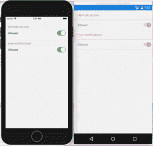
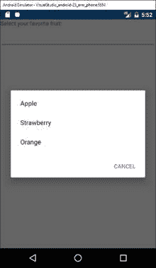
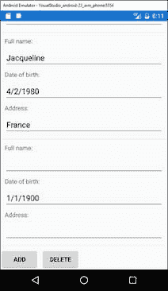

XAML 是一种非常强大的声明性语言，它通过两个特定的场景展示了它的全部力量:使用资源和数据绑定。如果您有 WPF、Silverlight 和通用 Windows 平台等平台的 Windows 开发背景，您将熟悉本章中描述的概念。如果这是你的第一次，你会立即意识到 XAML 是如何在这两种情况下简化困难的事情的。

一般来说，在基于 XAML 的平台中，资源是可重用的信息，您可以将其应用于用户界面中的视觉元素。典型的 XAML 资源是样式、控制模板、对象引用和数据模板。Xamarin。表单支持样式和数据模板，因此这些将在本章中讨论。

每个`Page`对象和布局都会公开一个名为`Resources`的属性，这是一个 XAML 资源的集合，您可以用一个或多个类型为`ResourceDictionary`的对象来填充它。一个`ResourceDictionary`是 XAML 资源的容器，例如样式、数据模板和对象引用。例如，您可以将`ResourceDictionary`添加到页面，如下所示:

`<ContentPage.Resources>`

`<ResourceDictionary>`

`<!-- Add resources here -->`

`</ResourceDictionary>`

`</ContentPage.Resources>`

资源是有范围的。这意味着您添加到页面级别的资源可用于整个页面，而您添加到布局级别的资源仅可用于当前布局，如以下代码片段所示:

`<StackLayout.Resources>`

`<ResourceDictionary>`

`<!-- Resources are available only to this layout, not outside -->`

`</ResourceDictionary>`

`</StackLayout.Resources>`

有时，您可能希望整个应用程序都可以使用资源。在这种情况下，您可以利用 **App.xaml** 文件。这个文件的默认代码如代码清单 14 所示。

代码清单 14

```
  <?xml version="1.0" encoding="utf-8" ?>
  <Application 
               xmlns:x="http://schemas.microsoft.com/winfx/2009/xaml"
               x:Class="App1.App">
        <Application.Resources>

            <!-- Application resource dictionary -->

      <ResourceDictionary>

          </ResourceDictionary>
        </Application.Resources>
  </Application>

```

可以看到，这个文件的自动生成的代码已经包含了一个`Application.Resources`节点，并且嵌套了`ResourceDictionary`。您放在此资源字典中的资源对应用程序中的任何页面、布局和视图都是可见的。现在，您已经知道了资源的声明位置和范围，是时候看看资源是如何工作的了，从样式开始。其他资源，如数据模板，将在本章后面讨论。

在设计用户界面时，在某些情况下，您可能有多个相同类型的视图，对于每个视图，您可能需要为相同的属性分配相同的值。例如，您可能有两个宽度和高度相同的按钮，或者两个或多个宽度、高度和字体设置相同的标签。在这种情况下，您可以利用样式，而不是多次分配相同的属性。样式允许您将一组属性分配给同一类型的视图。样式必须在`ResourceDictionary`中定义，并且它们必须指定它们预期的类型和标识符。以下代码演示了如何为`Label`视图定义样式:

`<ResourceDictionary>`

`<Style x:Key="labelStyle" TargetType="Label">`

`<Setter Property="TextColor" Value="Green" />`

`<Setter Property="FontSize" Value="Large" />`

`</Style>`

`</ResourceDictionary>`

您可以使用`x:Key`表达式(与`x:Name`属性相反)指定一个标识符，并使用`TargetType`指定目标类型，为目标视图传递类型名称。属性值被赋予`Setter`元素，其`Property`属性代表目标属性名称，`Value`代表属性值。然后将样式指定给`Label`视图，如下所示:

`<Label Text="Enter some text:" Style="{StaticResource labelStyle}"/>`

因此，通过在视图上分配`Style`属性来应用样式，该属性具有将`StaticResource`标记扩展和样式标识符包含在花括号中的表达式。然后，您可以在该类型的每个视图上分配`Style`属性，而不是每次都手动分配相同的属性。通过样式，XAML 支持`StaticResource`和`DynamicResource`标记扩展。在第一种情况下，如果样式发生变化，目标视图将不会使用刷新的样式进行更新。在第二种情况下，视图将被更新以反映样式的变化。

#### 风格传承

样式支持继承；因此，您可以创建从另一种样式派生的样式。例如，您可以定义一个以抽象`View`类型为目标的样式，如下所示:

`<Style x:Key="viewStyle" TargetType="View">`

`<Setter Property="HorizontalOptions" Value="Center" />`

`<Setter Property="VerticalOptions" Value="Center" />`

`</Style>`

这种样式可以应用于任何视图，无论具体类型如何。然后，您可以使用`BasedOn`属性创建一个更特殊的样式，如下所示:

`<Style x:Key="labelStyle" TargetType="Label"`

`BasedOn="{StaticResource viewStyle}">`

`<Setter Property="TextColor" Value="Green" />`

`</Style>`

第二种样式以`Label`视图为目标，但也继承了父样式的属性设置。简而言之，`labelStyle`将在目标`Label`视图上分配`HorizontalOptions`、`VerticalOptions`和`TextColor`属性。

#### 隐式样式

视图的`Style`属性允许分配在资源中定义的样式。这允许您选择性地仅将样式指定给给定类型的特定视图。但是，如果您希望相同的样式应用于用户界面中相同类型的所有视图，手动为每个视图分配`Style`属性可能会很烦人。在这种情况下，可以利用所谓的*隐式造型*。此功能允许您自动将样式指定给使用`TargetType`属性指定的类型的所有视图，而无需设置`Style`属性。要做到这一点，您只需避免使用`x:Key`分配标识符，如下例所示:

`<Style TargetType="Label">`

`<Setter Property="HorizontalOptions" Value="Center" />`

`<Setter Property="VerticalOptions" Value="Center" />`

`<Setter Property="TextColor" Value="Green" />`

`</Style>`

没有标识符的样式将自动应用于用户界面中的所有`Label`视图(根据包含的资源字典的范围)，并且您不需要在`Label`定义上分配`Style`属性。

[数据绑定](https://developer.xamarin.com/guides/xamarin-forms/xaml/xaml-basics/data_binding_basics/)是一种内置机制，允许可视化元素与数据进行通信，这样当数据发生变化时，用户界面会自动更新，反之亦然。数据绑定在所有最重要的开发平台中都可用。表单也不例外。事实上，它的数据绑定引擎依赖于 XAML 的力量，它的工作方式在所有基于 XAML 的平台上都是相似的。Xamarin。窗体支持将对象绑定到视觉元素，将集合绑定到视觉元素，以及将视觉元素绑定到其他视觉元素。本章描述了前两种情况。因为数据绑定是一个非常复杂的话题，所以最好从一个例子开始。假设您想要将以下`Person`类的实例绑定到用户界面，以便在对象和视图之间建立通信流:

`public class Person`

`{`

`public string FullName { get; set; }`

`public DateTime DateOfBirth { get; set; }`

`public string Address { get; set; }`

`}`

在用户界面中，您将希望允许用户分别通过一个`Entry`、一个`DatePicker`和另一个`Entry`输入他们的全名、出生日期和地址。在 XAML，这可以通过代码清单 15 所示的代码来实现。

代码清单 15

```
  <?xml version="1.0" encoding="utf-8" ?>
  <ContentPage 
               xmlns:x="http://schemas.microsoft.com/winfx/2009/xaml"
               xmlns:local="clr-namespace:App1"
               Title="Main page"
               x:Class="App1.MainPage">

      <StackLayout Orientation="Vertical" Padding="20">
          <Label Text="Name:" />
          <Entry Text="{Binding FullName}"/>

          <Label Text="Date of birth:"/>
          <DatePicker Date="{Binding DateOfBirth, Mode=TwoWay}"/>

          <Label Text="Address:"/>
          <Entry Text="{Binding Address}"/>
      </StackLayout>
  </ContentPage>

```

如您所见，`Entry`视图的`Text`属性和`DatePicker`的`Date`属性都有一个标记表达式作为它们的值。这样的表达式由`Binding`文字后跟您想要从数据对象绑定的属性组成。其实这个语法的扩展形式可以是`{Binding Path=PropertyName}`，但是`Path`可以省略。数据绑定可以有四种类型:

*   `TwoWay`:视图可以读写数据
*   `OneWay`:视图只能读取数据
*   `OneWayToSource`:视图只能写数据
*   `Default` : Xamarin。表单根据视图自动解析适当的模式(请参见下面的解释)

`TwoWay`和`OneWay`是最常用的模式，大多数情况下不需要明确指定模式，因为 Xamarin。窗体根据视图自动解析适当的模式。例如，`Entry`控件中的绑定是`TwoWay`，因为这种视图可以用来读写数据，而`Label`控件中的绑定是`OneWay`，因为这种视图只能读取数据。但是，使用`DatePicker`，您需要显式设置绑定模式，因此您可以使用以下语法:

`<DatePicker Date="{Binding DateOfBirth, Mode=TwoWay}"/>`

绑定到对象属性的视图属性称为*可绑定属性*(如果您来自 WPF 或 UWP 世界，则称为依赖属性)。

|  | 提示:可绑定属性非常强大，但是在体系结构上有点复杂。在本章中，我将解释如何使用它们，但是关于它们的实现以及如何在自定义对象中使用它们的更多细节，您可以参考[官方文档](https://developer.xamarin.com/guides/xamarin-forms/xaml/bindable-properties/)。 |

可绑定属性将自动更新被绑定对象的属性值，并且如果对象被更新，将在用户界面中自动刷新其值。然而，只有当数据绑定对象实现`INotifyPropertyChanged`接口时，这种自动刷新才是可能的，该接口允许对象发送更改通知。因此，您必须扩展`Person`类定义，如代码清单 16 所示。

代码清单 16

```
  using System;
  using System.ComponentModel;
  using System.Runtime.CompilerServices;

  namespace App1
  {
      public class Person : INotifyPropertyChanged
      {
          private string fullName;
          public string FullName
          {
              get
              {
                  return fullName;
              }
              set
              {
                  fullName = value;
                  OnPropertyChanged();
              }
          }

          private DateTime dateOfBirth;

          public DateTime DateOfBirth
          {
              get
              {
                  return dateOfBirth;
              }
              set
              {
                  dateOfBirth = value;
                  OnPropertyChanged();
              }
          }
          private string address;
          public string Address
          {
              get
              {
                  return address;
              }
              set
              {
                  address = value;
                  OnPropertyChanged();
              }
          }

          public event PropertyChangedEventHandler PropertyChanged;

          private void OnPropertyChanged([CallerMemberName] string propertyName 

  = null)
          {
              PropertyChanged?.Invoke(this, 
                  new PropertyChangedEventArgs(propertyName));
          }
      }
  }

```

通过实现`INotifyPropertyChanged`，属性设置者可以通过`PropertyChanged`事件发出更改通知。绑定视图将被告知任何更改，并将刷新其内容。

|  | 提示:使用`CallerMemberName`属性，编译器自动解析调用者成员的名称。这避免了在每个 setter 中传递属性名的需要，并有助于保持代码更加干净。 |

下一步是将`Person`类的一个实例绑定到用户界面。这可以通过以下几行代码来完成，这些代码通常放在页面的构造函数或其`OnAppearing`事件处理程序中:

`Person person = new Person();`

`this.BindingContext = person;`

页面和布局显示类型为`object`的`BindingContext`属性，表示页面或布局的数据源，与 WPF 或 UWP 的`DataContext`相同。数据绑定到对象属性的子视图将在`BindingContext`属性值中搜索对象的实例，并绑定到该实例的属性。在这种情况下，`Entry`和`DatePicker`将在`BindingContext`中搜索一个对象实例，并将绑定到该实例的属性。请记住，XAML 区分大小写，因此绑定到`FullName`不同于绑定到`Fullname`。如果您尝试绑定到不存在或具有不同名称的属性，运行库将引发异常。如果您现在尝试运行应用程序，不仅数据绑定会工作，而且如果数据源发生变化，用户界面也会自动更新。您可以将视图绑定到单个对象实例，就像在前面的示例中一样，就像绑定到数据库表中的一行一样。

虽然使用单个对象实例是常见的情况，但另一种非常常见的情况是使用在用户界面中显示为列表的集合。Xamarin。表单支持通过`ObservableCollection<T>`类对集合进行数据绑定。该集合的工作方式与`List<T>`完全相同，但当项目被添加到集合中或从集合中移除时，它也会发出更改通知。集合非常有用，例如，当您想要表示数据库表中的行时。

假设您有以下`Person`对象集合:

`Person person2 = new Person { FullName = "James" };`

`Person person3 = new Person { FullName = "Jacqueline" };`

`var people = new ObservableCollection<Person>() { person1, person2,`

`person3 };`

`this.BindingContext = people;`

代码将集合分配给根容器的`BindingContext`属性，但是此时，您需要一个能够显示该集合内容的可视元素。这就是`ListView`控件的作用。`ListView`可以从其容器的`BindingContext`或者通过分配其`ItemsSource`属性来接收数据源，并且任何实现`IEnumerable`接口的对象都可以与`ListView`一起使用。如果`ListView`的数据源与页面中其他视图的数据源不同，通常会直接分配`ItemsSource`。

`ListView`要解决的问题是它不知道如何在列表中呈现对象。例如，考虑包含`Person`类实例的人员集合。每个实例都暴露了`FullName`、`DateOfBirth`和`Address`属性，但是`ListView`不知道如何呈现这些属性，所以你的工作就是向它解释如何呈现。这是通过所谓的*数据模板*实现的。数据模板是绑定到对象属性的一组视图。它指导`ListView`如何呈现项目。Xamarin 中的数据模板。形式依赖于细胞的概念。单元格可以以特定的方式显示信息，如表 8 所示。

表 Xamarin 中的单元格。形式

| 单元格类型 | 描述 |
| --- | --- |
| `TextCell` | 显示两个标签，一个带有描述，另一个带有数据绑定文本值。 |
| `EntryCell` | 显示带有描述的标签和带有数据绑定文本值的`Entry`。它还允许显示占位符。 |
| `ImageCell` | 显示带有描述的标签和带有数据绑定图像的`Image`控件。 |
| `SwitchCell` | 显示带有描述的标签和绑定到`bool`值的`Switch`控件。 |
| `ViewCell` | 允许创建自定义数据模板。 |

|  | 提示:单元格内的标签也是可绑定的属性。 |

例如，如果您只需要显示和编辑`FullName`属性，您可以编写以下数据模板:

`<Grid>`

`<ListView x:Name="PeopleList" ItemsSource="{Binding}">`

`<ListView.ItemTemplate>`

`<DataTemplate>`

`<EntryCell Label="Full name:" Text="{Binding FullName}"/>`

`</DataTemplate>`

`</ListView.ItemTemplate>`

`</ListView>`

`</Grid>`

|  | 提示:`DataTemplate`定义始终在`ListView.ItemTemplate`元素中定义。 |

一般来说，如果数据源被分配给`BindingContext`属性，`ItemsSource`必须设置为`{Binding}`值，这意味着您的数据源与父数据源相同。有了这个代码，`ListView`将显示绑定集合中的所有项目，每个项目显示两个单元格。但是每个`Person`也暴露了一个`DateTime`类型的属性，没有一个细胞适合。在这种情况下，您可以使用`ViewCell`创建一个自定义单元格，如代码清单 17 所示。

代码清单 17

```
  <?xml version="1.0" encoding="utf-8" ?>
  <ContentPage 
               xmlns:x="http://schemas.microsoft.com/winfx/2009/xaml"
               xmlns:local="clr-namespace:App1"
               Title="Main page" Padding="20"
               x:Class="App1.MainPage">

      <StackLayout>
          <ListView x:Name="PeopleList" ItemsSource="{Binding}"
                    HasUnevenRows="True">
```

`<` `ListView.ItemTemplate` `>`

`<` `DataTemplate` `>`

`<` `ViewCell` `>`

`<` `ViewCell.View` `>`

`<` `StackLayout` `Margin` `="10">`

`<` `Label` `Text` `="Full name:"/>`

`<` `Entry` `Text` `="{` `Binding` `FullName` `}"/>`

`<` `Label` `Text` `="Date of birth:"/>`

`<` `DatePicker` `Date` `="{` `Binding` `DateOfBirth` `,`

`Mode` `=TwoWay}"/>`

`<` `Label` `Text` `="Address:"/>`

`<` `Entry` `Text` `="{` `Binding` `Address` `}"/>`

`</` `StackLayout` `>`

`</` `ViewCell.View` `>`

`</` `ViewCell` `>`

`</` `DataTemplate` `>`

`</` `ListView.ItemTemplate` `>`

`</` `ListView` `>`

`</` `StackLayout` `>`

`</` `ContentPage` `>`

如您所见，`ViewCell`允许您创建自定义和复杂的数据模板，包含在`ViewCell.View`属性中，因此您可以显示您需要的任何类型的信息。注意`HasUnevenRows`属性:如果`True`在安卓系统上，这会根据单元格的内容动态调整单元格的高度。在 iOS 上，此属性必须设置为`False`，并且您必须通过设置`RowHeight`属性来提供固定的行高。在第 8 章中，您将学习如何利用`OnPlatform`对象基于平台做出用户界面决策。

|  | 提示:`ListView`是一个非常强大和通用的视图，它还有很多东西，比如交互性、分组和排序以及自定义。我强烈建议您阅读`ListView`上的[官方文档](https://developer.xamarin.com/guides/xamarin-forms/user-interface/listview)，以及这篇[文章](https://developer.xamarin.com/guides/xamarin-forms/user-interface/listview/performance/)，该文章描述了如何提高性能，这对安卓极其有用。 |

图 38 显示了本节描述的代码的结果。请注意`ListView`包含内置的滚动功能，绝不能包含在`ScrollView`中。

图 38:数据绑定列表视图

数据模板可以放在页面或应用程序资源中，这样就可以重用。然后用`StaticResource`表达式分配`ListView`定义中的`ItemTemplate`属性，如代码清单 18 所示。

代码清单 18

```
  <?xml version="1.0" encoding="utf-8" ?>
  <ContentPage 
               xmlns:x="http://schemas.microsoft.com/winfx/2009/xaml"
               xmlns:local="clr-namespace:App1"
               Title="Main page"
               x:Class="App1.MainPage">

      <ContentPage.Resources>
          <ResourceDictionary>
              <DataTemplate x:Key="MyTemplate">
                  <ViewCell>
                      <ViewCell.View>
                          <StackLayout Margin="10" Orientation="Vertical"
                                           Padding="10">
                              <Label Text="Full name:"/>
                              <Entry Text="{Binding FullName}"/>
                              <Label Text="Date of birth:"/>
                              <DatePicker Date="{Binding DateOfBirth,Mode=TwoWay}"/>
                              <Label Text="Address:"/>
                              <Entry Text="{Binding Address}"/>
                          </StackLayout>
                      </ViewCell.View>
                  </ViewCell>
              </DataTemplate>
          </ResourceDictionary>
      </ContentPage.Resources>

      <ListView x:Name="PeopleList" VerticalOptions="FillAndExpand"
                HasUnevenRows="True" ItemTemplate="{StaticResource MyTemplate}"/>
  </ContentPage>

```

#### 使用表格视图

当需要呈现设置列表、表格中的数据或者不同行的数据时，可以考虑 [**`TableView`**](https://developer.xamarin.com/guides/xamarin-forms/user-interface/tableview/) 控件。`TableView`基于部分，可以通过前面描述的相同单元格显示内容。有了这个视图，你需要为它的`Intent`属性指定一个值，它基本上代表了你需要显示的信息类型。可能的值有`Settings`(设置列表)、`Data`(显示数据条目)、`Form`(当表格视图像表格一样工作时)和`Menu`(显示选择菜单)。代码清单 19 提供了一个例子。

代码清单 19

```
  <?xml version="1.0" encoding="utf-8" ?>
  <ContentPage 
               xmlns:x="http://schemas.microsoft.com/winfx/2009/xaml"
               xmlns:local="clr-namespace:App1"
               Title="Main page"
               x:Class="App1.MainPage">

      <ContentPage.Content>
          <TableView Intent="Settings">
              <TableRoot>
                  <TableSection Title="Network section">
                      <SwitchCell Text="Allowed" On="True"/>
                  </TableSection>
                  <TableSection Title="Push notifications">
                      <SwitchCell Text="Allowed" On="True"/>
                  </TableSection>
              </TableRoot>
          </TableView>
      </ContentPage.Content>
  </ContentPage>

```

您可以将`TableView`分成多个`TableSection`，每个包含一个单元格来显示所需类型的信息，当然，您可以使用一个`ViewCell`来创建一个自定义的、更复杂的模板。图 39 显示了基于前面列表的`TableView`示例。



图 39:一个正在运行的表格视图

显然，您可以将单元格属性绑定到对象，而不是像前面的示例那样显式设置它们的值。

#### 使用选择器视图显示和选择值

在移动应用程序中，通常为用户提供从值列表中选择项目的选项，这可以通过`Picker`视图来完成。Xamarin。表单 2.3.4 在`Picker`中引入了数据绑定支持。您现在可以轻松地将`List<T>`或`ObservableCollection<T>`绑定到其`ItemsSource`属性，并通过其`SelectedItem`属性检索所选项目。例如，假设您有以下`Fruit`类:

`public class Fruit`

`{`

`public string Name { get; set; }`

`public string Color { get; set; }`

`}`

现在，在用户界面中，假设您想让用户从代码清单 20 所示的 XAML 列表中选择一种水果。

代码清单 20

```
  <?xml version="1.0" encoding="utf-8" ?>
  <ContentPage 
               xmlns:x="http://schemas.microsoft.com/winfx/2009/xaml"
               xmlns:local="clr-namespace:App2"
               x:Class="App2.MainPage">

      <ContentPage.Content>

          <StackLayout VerticalOptions="FillAndExpand">
              <Label Text="Select your favorite fruit:"/>
              <Picker x:Name="FruitPicker" ItemDisplayBinding="{Binding Name}"
                      SelectedIndexChanged="FruitPicker_SelectedIndexChanged"/>
          </StackLayout>
      </ContentPage.Content>
  </ContentPage>

```

如您所见，`Picker`暴露了`SelectedIndexChanged`事件，当用户选择一个项目时会引发该事件。使用`ItemDisplayBinding`，您可以指定需要显示绑定对象的哪个属性:在本例中，是水果名称。相反，`ItemsSource`属性可以在 XAML 或代码隐藏中分配。在这种情况下，可以用 C#分配一个集合，如代码清单 21 所示。

代码清单 21

```
  public partial class MainPage : ContentPage
  {
      public MainPage()
      {
          InitializeComponent();

          var apple = new Fruit { Name = "Apple", Color = "Green" };
          var strawberry = new Fruit { Name = "Strawberry", Color = "Red" };
          var orange = new Fruit { Name = "Orange", Color = "Orange" };

          var fruitList = new ObservableCollection<Fruit>() 

  { apple, strawberry, orange };
          this.FruitPicker.ItemsSource = fruitList;
      }

      private async void FruitPicker_SelectedIndexChanged(object sender, 

  EventArgs e)
      {
          var currentFruit = this.FruitPicker.SelectedItem as Fruit;
          if (currentFruit != null)
              await DisplayAlert("Selection", 
              $"You selected {currentFruit.Name}", "OK");
      }
  }

```

与`ListView`中同名的属性一样，`ItemsSource`属于`object`类型，可以绑定到任何实现`IEnumerable`接口的对象。请注意，您可以如何检索处理`SelectedIndexChanged`事件的选定项目，并将`Picker.SelectedItem`属性转换为您期望的类型。在这种情况下，使用`as`运算符是方便的，如果转换失败，该运算符将返回 null，而不是异常。图 40 显示了用户如何从选择器中选择一个项目。



图 40:用选择器选择项目

实际上，数据绑定支持只是通过 Xamarin 添加到`Picker`中的。表格 2.3.4。在以前的版本中，您只能通过`Add`方法手动填充其`Items`属性，然后处理索引。这才是`SelectedIndexChanged`事件存在的真正原因，但用新的方法还是有用的。将列表绑定到`Picker`是非常常见的，但是您仍然可以手动填充列表并处理索引。

#### 绑定图像

在数据绑定场景中显示图像是非常常见的。表格让它变得简单。您只需将`Image.Source`属性绑定到类型为`ImageSource`的对象，或者绑定到可以由`string`和`Uri`表示的网址。例如，假设您有一个类，它的属性存储图像的 URL，如下所示:

`public class Picture`

`{`

`public Uri PictureUrl { get; set; }`

`}`

当您有这个类的实例时，您可以分配`PictureUrl`属性:

`var picture1 = new Picture();`

`picture1.PictureUrl = new Uri(` `"http://mystorage.com/myimage.jpg` `");`

假设您的 XAML 代码中有一个`Image`视图，并且为一个类的实例分配了一个`BindingContext`，那么数据绑定的工作原理如下:

`<Image Source=` `"{Binding PictureUrl}` `"/>`

`XAML has a type converter for the` 形象。资料来源 `property, so it automatically resolves strings and` Uri `instances into the appropriate type.`

#### 值转换器的提示

上一节关于图像绑定的最后一句强调了类型转换器的存在，该转换器将特定类型解析为适合`Image.Source`属性的类型。这实际上发生在许多其他视图和类型中。例如，如果您将一个整数值绑定到一个`Entry`视图的`Text`属性，这样的一个整数会被一个 XAML 类型转换器转换成一个字符串。但是，在某些情况下，您可能希望绑定 XAML 类型转换器无法自动转换为视图所需类型的对象。例如，您可能想要将`Color`值绑定到`Label`的`Text`属性，这是不可能的。在这些情况下，您可以创建*值转换器*。值转换器是实现`IValueConverter`接口并且必须实现和公开`Convert`和`ConvertBack`方法的类。`Convert`将原始类型翻译成视图可以接收的类型，而`ConvertBack`则相反。

代码清单 22 显示了一个值转换器的例子，它将包含 HTML 标记的字符串转换成可以绑定到`WebView`控件的对象。`ConvertBack`没有实现，因为这个值转换器应该在只读场景中使用，所以不需要往返转换。

代码清单 22

```
  using System;
  using System.Collections.Generic;
  using System.Globalization;
  using System.Linq;
  using System.Text;
  using System.Threading.Tasks;
  using Xamarin.Forms;

  namespace App1
  {
      public class HtmlConverter : IValueConverter
      {
          public object Convert(object value, Type
  targetType, 
                 object parameter, CultureInfo
  culture)
          {
              try
              {
                  var source = new HtmlWebViewSource();
                  string originalValue = (string)value;

  source.Html = originalValue;
                  return source;
              }
              catch (Exception)
              {
                  return value;
              }
          }

          public object ConvertBack(object value, Type
  targetType, 
                        object parameter, CultureInfo
  culture)
          {
              throw new NotImplementedException();
          }
      }
  }

```

这两种方法总是接收要转换为对象实例的数据，然后您需要将对象转换为专用类型进行操作。在这种情况下，`Convert`创建一个`HtmlWebViewSource`对象，将接收到的`object`转换为`string`，并用包含 HTML 标记的字符串填充`Html`属性。然后，值转换器必须在您希望使用它的 XAML 文件的资源中声明(或者在 **App.xaml** 中)。代码清单 23 提供了一个例子，也展示了如何使用值转换器。

```
  <?xml version="1.0" encoding="utf-8" ?>
  <ContentPage 
               xmlns:x="http://schemas.microsoft.com/winfx/2009/xaml"
               xmlns:local="clr-namespace:App1"
               Title="Main page"
               x:Class="App1.MainPage">

      <ContentPage.Resources>
          <local:HtmlConverter x:Key="HtmlConverter"/>
      </ContentPage.Resources>

      <!-- Assumes you have a data-bound .NET object that exposes 
      a property called HtmlContent -->
      <WebView Source="{Binding HtmlContent, 
       Converter={StaticResource HtmlConverter}}"/>
  </ContentPage>

```

您可以像声明任何其他资源一样声明转换器。然后，您的绑定还将包含`Converter`表达式，该表达式使用您与其他资源一起使用的典型语法指向值转换器。

模型-视图-视图模型(MVVM)是一种在基于 XAML 的平台中使用的架构模式，它允许数据(模型)、逻辑(视图模型)和用户界面(视图)之间的清晰分离。使用 MVVM，页面只包含与用户界面相关的代码，并且强烈依赖数据绑定，大部分工作都是在视图模型中完成的。如果你从未见过 MVVM，它可能会相当复杂，所以我会尽量简化解释，但你应该参考 Xamarin 的 [MVVM 文档](https://developer.xamarin.com/guides/xamarin-forms/xaml/xaml-basics/data_bindings_to_mvvm/)。

让我们从一个简单的例子和一个新的 Xamarin 开始。基于 PCL 代码共享策略形成解决方案。假设你想处理一个`Person`对象的列表。这是你的模型，可以重用之前的`Person`类。在项目中添加一个名为**模型**的新文件夹，并在该文件夹中添加一个新的 **Person.cs** 类文件，粘贴`Person`类的代码。接下来，在项目中添加一个名为 **ViewModel** 的新文件夹，并添加一个名为 **PersonViewModel.cs** 的新类文件。在为它编写代码之前，让我们总结一些重要的注意事项:

*   视图模型包含业务逻辑，充当模型和视图之间的桥梁，并公开视图可以绑定的属性。
*   在这些属性中，肯定会有一个`Person`对象的集合。
*   在视图模型中，您可以加载数据、过滤数据、执行保存操作和查询数据。

加载、过滤、保存和查询数据是视图模型可以对数据执行的操作的例子。在经典的开发方法中，您将在`Button`视图上处理`Clicked`事件，并编写执行动作的代码。然而，在 MVVM，视图应该只包含与用户界面相关的代码，而不是对数据执行操作的代码。所以，在 MVVM，视图模型暴露了所谓的*命令*。命令是类型为`ICommand`的属性，可以是绑定到视图(如`Button`、`SearchBar`、`ListView`和`TapGestureRecognizer`对象)的数据。在用户界面中，您可以将视图绑定到视图模型中的命令。这样，操作在视图模型中执行，而不是在视图后面的代码中执行。

代码清单 24 显示了`PersonViewModel`类的定义。

```
  using MvvmSample.Model;
  using System;
  using System.Collections.ObjectModel;
  using System.Windows.Input;
  using Xamarin.Forms;

  namespace MvvmSample.ViewModel
  {
      public class PersonViewModel
      {
          public ObservableCollection<Person> People { get; set; }
          public Person SelectedPerson { get; set; }

          public ICommand AddPerson { get; set; }
          public ICommand DeletePerson { get; set; }

          public PersonViewModel()
          {
              this.People = new ObservableCollection<Person>();

              // sample data
              Person person1 = 
                  new Person { FullName = "Alessandro",
                      Address ="Italy",
                      DateOfBirth =new DateTime(1977,5,10) };
              Person person2 = 
                  new Person { FullName = "James",
                      Address ="United States",
                      DateOfBirth =new DateTime(1960,2,1) };
              Person person3 = 
                  new Person { FullName = "Jacqueline",
                      Address ="France",
                      DateOfBirth =new DateTime(1980,4,2) };

              this.People.Add(person1);
              this.People.Add(person2);
              this.People.Add(person3);

              this.AddPerson = 
                  new Command(() => this.People.Add(new Person()));

              this.DeletePerson = 
                  new Command<Person>((person) => this.People.Remove(person));
          }
      }
  }

```

`People`和`SelectedPerson`属性分别展示了一组`Person`对象和一个单独的`Person`，后者将绑定到一个`ListView`的`SelectedItem`属性，您很快就会看到。请注意`ICommand`类型的属性是如何与`Command`类的实例分配的，您可以通过执行所需操作的 lambda 表达式将`Action`委托传递给该类。`Command`提供了`ICommand`接口的现成实现，其构造函数也可以接收一个参数，在这种情况下必须使用其泛型重载(参见`DeletePerson`赋值)。在这种情况下，`Command`处理类型为`Person`的对象，并对接收到的对象执行动作。命令和其他属性数据绑定到用户界面中的视图。

|  | 注意:这里我演示了命令的最基本用法。然而，命令也公开了一个`CanExecute`布尔方法来决定一个动作是否可以被执行。此外，您可以创建实现`ICommand`的自定义命令，并且必须显式实现`Execute`和`CanExecute`方法，其中`Execute`被调用来运行操作。更多详情，请查看[官方文档](https://developer.xamarin.com/api/type/System.Windows.Input.ICommand/)。 |

现在是时候为用户界面编写 XAML 代码了。代码清单 25 显示了如何为此使用一个`ListView`，以及如何将两个`Button`视图绑定到命令。

```
  <?xml version="1.0" encoding="utf-8" ?>
  <ContentPage 
               xmlns:x="http://schemas.microsoft.com/winfx/2009/xaml"
               xmlns:local="clr-namespace:MvvmSample"
               x:Class="MvvmSample.MainPage" Padding="20">

      <StackLayout>
          <ListView x:Name="PeopleList" 
                    ItemsSource="{Binding People}"
                    HasUnevenRows="True" 
                    SelectedItem="{Binding SelectedPerson}">
              <ListView.ItemTemplate>
                  <DataTemplate>
                      <ViewCell>
                          <ViewCell.View>
                              <StackLayout Margin="10">
                                  <Label Text="Full name:"/>
                                  <Entry Text="{Binding FullName}"/>
                                  <Label Text="Date of birth:"/>
                                  <DatePicker Date="{Binding DateOfBirth, 
                                              Mode=TwoWay}"/>
                                  <Label Text="Address:"/>
                                  <Entry Text="{Binding Address}"/>
                              </StackLayout>
                          </ViewCell.View>
                      </ViewCell>
                  </DataTemplate>
              </ListView.ItemTemplate>
          </ListView>
          <StackLayout Orientation="Horizontal">
              <Button Text="Add" Command="{Binding AddPerson}"/>
              <Button Text="Delete" Command="{Binding DeletePerson}" 
                      CommandParameter="{Binding Source={x:Reference PeopleList}, 
                      Path=SelectedItem}"/>
          </StackLayout>
      </StackLayout>
  </ContentPage>

```

|  | 提示:记得将`HasUnevenRows`设置为`False`，并为 iOS 上的`ListView`提供一个`RowHeight`。 |

`ListView`非常类似于将数据绑定引入集合时所示的示例。但是，请注意:

*   `ListView.ItemsSource`属性绑定到视图模型中的`People`集合。
*   `ListView.SelectedItem`属性绑定到视图模型中的`SelectedPerson`属性。
*   第一个`Button`绑定到视图模型中的`AddPerson`命令。
*   第二个`Button`绑定到`DeletePerson`命令，它用一个特殊的绑定表达式传递`ListView`中选中的`Person`对象:`Source`代表数据源，这里是`ListView`，用`x:Reference`指代；`Path`指向源代码中的属性，该属性公开了要作为参数传递给命令的对象(简称为命令参数)。

最后一步是创建视图模型的实例，并将其分配给页面的`BindingContext`，这可以在页面代码隐藏中完成，如代码清单 26 所示。

代码清单 26

```
  using MvvmSample.ViewModel;
  using Xamarin.Forms;

  namespace MvvmSample
  {
      public partial class MainPage : ContentPage
      {
          // Not using a field here because properties
          // are optimized for data binding.
          private PersonViewModel ViewModel { get; set; }

          public MainPage()
          {
              InitializeComponent();

              this.ViewModel = new PersonViewModel();
              this.BindingContext = this.ViewModel;
          }
      }
  }

```

如果您现在运行应用程序(见图 46)，您将看到`Person`对象的列表，您将能够使用这两个按钮，真正的好处是整个逻辑都在视图模型中。使用这种方法，如果更改属性或命令中的逻辑，就不需要更改页面代码。在图 41 中，您可以看到通过命令绑定添加了一个新的`Person`对象。



图 41:显示人员列表并添加一个新的 MVVM 人员

MVVM 非常强大，但现实世界的实现可能非常复杂。例如，如果您想要导航到另一个页面，并且您有命令，视图模型应该包含与用户界面(启动页面)相关的不符合 MVVM 原则的代码。显然，这个问题是有解决方案的，需要对模式有进一步的了解，所以我建议大家看看网上的书籍和文章，进一步研究。我的建议是不要重新发明轮子:许多强大和受欢迎的 MVVM 图书馆已经存在，你可能想从以下选择一个:

*   [棱镜](https://github.com/PrismLibrary/Prism)
*   [MVVM 之光工具包](http://www.mvvmlight.net/)
*   [FreshMvvm](http://www.michaelridland.com/xamarin/freshmvvm-mvvm-framework-designed-xamarin-forms/)
*   [MvvmCross](https://www.mvvmcross.com/)

我个人曾与 FreshMvvm 合作过，但前面提到的所有替代方案都足够强大，可以为您节省大量时间。

XAML 在 Xamarin 中扮演着重要角色。表单并允许定义可重用资源和数据绑定场景。资源是可重用的样式、数据模板和对您在 XAML 声明的对象的引用。特别是，样式允许您为同一类型的所有视图设置相同的属性，并且它们可以通过继承来扩展其他样式。XAML 还包括一个强大的数据绑定引擎，允许您在双向通信流中将对象快速绑定到可视元素。

在本章中，您已经看到了如何将单个对象和集合分别绑定到单个视觉元素和`ListView`。您已经看到了如何定义数据模板，以便`ListView`能够了解项目必须如何呈现，并且您已经了解了值转换器，当您想要绑定不同于视图支持的类型的对象时，值转换器是一种特殊的对象。

在本章的第二部分，您浏览了模型-视图-视图模型模式的介绍，重点是将逻辑从用户界面中分离出来，并理解新的对象和概念，如命令。到目前为止，您只使用了 Xamarin 的对象和视图。表单提供开箱即用的功能，但通常情况下，您需要实现需要本机 API 的更高级的功能。这是你将在下一章学到的。