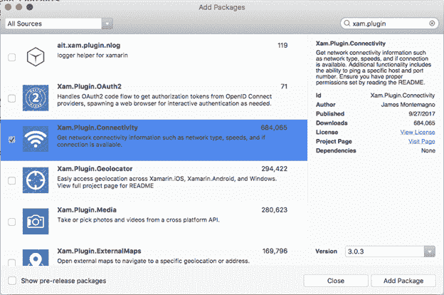

# 八、访问平台特定的 API

到目前为止，你已经看到了 Xamarin。Forms 提供了每个受支持平台上可用的功能，浏览了页面、布局和控件，这些控件展示了肯定会在安卓和 iOS 上运行的属性和功能。虽然这简化了跨平台开发，但不足以构建真实世界的移动应用程序。事实上，通常情况下，移动应用需要访问传感器、文件系统、摄像头和网络；发送推送通知；以及更多。每个操作系统都使用不能跨平台共享的本机 API 来管理这些功能，因此，Xamarin 也是如此。表单无法映射到跨平台对象。

但是，如果 Xamarin.Forms没有提供访问本机 API 的方法，它不会很有用。很幸运，Xamarin.Forms提供了多种方法来访问特定于平台的 API，您可以使用这些 API 来访问每个平台的几乎所有内容。因此，您可以使用 Xamarin.Forms 做什么没有限制。为了访问平台特性，您需要在每个平台项目中编写 C#代码。这就是本章解释的内容，以及从共享代码库中访问 iOS 和 Android APIs 的所有选项。

`Xamarin.Forms`命名空间公开了一个名为`Device`的重要类。这个类允许你检测你的应用运行的平台，以及设备习惯(平板电脑，电话，桌面)。当您需要根据平台调整用户界面时，这个类特别有用。下面的代码演示了如何利用`Device.RuntimePlatform`属性来检测正在运行的平台，并根据其值做出与用户界面相关的决定:

`// Label1 is a Label view in the UI`

`switch(Device.RuntimePlatform)`

`{`

`case Device.iOS:`

`Label1.FontSize = Device.GetNamedSize(NamedSize.Large, Label1);`

`break;`

`case Device.Android:`

`Label1.FontSize = Device.GetNamedSize(NamedSize.Medium, Label1);`

`break;`

`case Device.WinPhone:`

`Label1.FontSize = Device.GetNamedSize(NamedSize.Medium, Label1);`

`break;`

`case Device.Windows:`

`Label1.FontSize = Device.GetNamedSize(NamedSize.Large, Label1);`

`break;`

`}`

`RuntimePlatform`属于`string`类型，可以很容易地与称为`iOS`、`Android`、`WinPhone`和`Windows`的特定常数进行比较，这些常数以不言而喻的名称表示受支持的平台。显然，后两个常量只能在 Windows 设备上与 Visual Studio 2017 配合使用。`GetNamedSize`方法自动解析`Default`、`Micro`、`Small`、`Medium`和`Large`平台字体大小，并返回相应的`double`，避免了为每个平台提供不同的数值。`Device.Idiom`属性允许您确定应用程序运行的当前设备是手机、平板电脑还是台式电脑，并从`TargetIdiom`枚举中返回一个值:

`switch(Device.Idiom)`

`{`

`case TargetIdiom.Desktop:`

`// Desktop PCs`

`break;`

`case TargetIdiom.Phone:`

`// Phones`

`break;`

`case TargetIdiom.Tablet:`

`// Tablets`

`break;`

`case TargetIdiom.Unsupported:`

`// Unsupported devices`

`break;`

`}`

您还可以根据 XAML 的平台和习惯用法来决定如何调整 UI 元素。代码清单 27 展示了如何基于平台调整页面的`Padding`属性。

代码清单 27

```cs
  <?xml version="1.0" encoding="utf-8" ?>
  <ContentPage 
               xmlns:x="http://schemas.microsoft.com/winfx/2009/xaml"
               xmlns:views="clr-namespace:App1.Views"
               x:Class="App1.Views.MainPage">
      <ContentPage.Padding>
          <OnPlatform x:TypeArguments="Thickness"
                  iOS="0, 20, 0, 0"
                  Android="0, 10, 0, 0"
                  WinPhone="0, 10, 0, 0" />
      </ContentPage.Padding>
  </ContentPage>

```

`With the` on platform `tag, you can specify a different property value based on the` iOS`,` Android、 `and` WinPhone `platforms (the latter is only supported on Windows). The property value depends on the` x:TypeArguments `attribute, which represents the .NET type for the property,` things `in this particular case. Similarly, you can work with` OnIdiom `and the` target 成语 `enumeration in XAML.`

|  | 提示:在 iOS 中，最好从顶部开始设置 20 的页面填充，就像前面的代码片段一样。如果不这样做，您的页面将与系统栏重叠。 |

大多数时候，移动应用需要提供与设备硬件、传感器、系统应用和文件系统的交互。从共享代码访问这些特性是不可能的，因为它们的 API 在每个平台上都有唯一的实现。然而，Xamarin。Forms 为这个问题提供了一个简单的解决方案，它依赖于服务定位器模式:在共享项目中，您编写一个定义所需功能的接口，然后在每个平台项目中，您编写通过本机 API 实现该接口的类。最后，您使用`DependencyService`类及其`Get`方法，基于您的应用程序运行的平台来检索正确的实现。

例如，假设您的应用程序需要使用 SQLite 本地数据库。假设您已经在解决方案中安装了 [SQLite-Net-Pcl](https://www.nuget.org/packages/sqlite-net-pcl) NuGet 包，在 Pcl 项目中，您可以编写以下名为`IDatabaseConnection`的示例接口，该接口定义了必须返回数据库路径的方法的签名:

`public interface IDatabaseConnection`

`{`

`SQLite.SQLiteConnection DbConnection();`

`}`

|  | 提示:在 Xamarin 中使用本地 SQLite 数据库的完整演练。表格可在本电子书的作者 MSDN 杂志上获得。 |

此时，在每个平台项目中，您需要提供这个接口的实现，因为文件名、路径名以及更一般的文件系统是特定于平台的。给 iOS 和安卓项目添加一个名为 **DatabaseConnection.cs** 的新类文件。代码清单 28 提供了 iOS 实现，代码清单 29 提供了 Android 实现。

代码清单 28

```cs
  using System;
  using SQLite;
  using System.IO;
  using App1.iOS;

  [assembly: Xamarin.Forms.Dependency(typeof(DatabaseConnection))]
  namespace App1.iOS
  {
      public class DatabaseConnection : IDatabaseConnection
      {
          public SQLiteConnection DbConnection()
          {
              string dbName = "MyDatabase.db3";
              string personalFolder =
                System.Environment.
                GetFolderPath(Environment.SpecialFolder.Personal);
              string libraryFolder =
                Path.Combine(personalFolder, "..", "Library");
              string path = Path.Combine(libraryFolder, dbName);
              return new SQLiteConnection(path);
          }
      }
  }

```

代码清单 29

```cs
  using Xamarin.Forms;
  using App1.Droid;
  using SQLite;
  using System.IO;

  [assembly: Dependency(typeof(DatabaseConnection))]
  namespace App1.Droid
  {
      public class DatabaseConnection: IDatabaseConnection
      {
          public SQLiteConnection DbConnection()
          {
              string dbName = "MyDatabase.db3";
              string path = Path.Combine(System.Environment.
                GetFolderPath(System.Environment.
                SpecialFolder.Personal), dbName);
              return new SQLiteConnection(path);
          }
      }
  }

```

每个特定于平台的实现的共同点是用在程序集级别分配的`Dependency`属性装饰命名空间，该属性在运行时唯一标识`IDatabaseConnection`接口的实现。在`DbConnection`方法主体中，您可以看到每个平台如何利用自己的 API 来处理文件名。在 PCL 项目中，您可以简单地解决`IDatabaseConnection`接口的正确实现，如下所示:

`// Get the connection to the database`

`SQLiteConnection`

`database = DependencyService.Get<IDatabaseConnection>().DbConnection();`

`DependencyService.Get`泛型方法接收接口作为类型参数，并根据当前平台解析该接口的实现。使用这种方法，您不需要担心确定当前平台和调用相应的本机实现，因为依赖服务为您完成了工作。这种方法适用于您需要调用的所有本机 API，并且提供了访问 Xamarin.Forms 中特定于平台的特性的最强大的选项

当访问本机 API 时，大多数时候您的实际需求是访问跨平台存在的特性，但是使用的 API 彼此完全不同。比如 iOS 和安卓设备都有摄像头，都有返回当前位置的 GPS 传感器，等等。对于需要使用跨平台功能的场景，可以利用[插件](https://developer.xamarin.com/guides/xamarin-forms/platform-features/plugins/)。这些库由提供跨平台可用功能的本机 API 的抽象实现组成。它们还避免了在大量情况下使用依赖服务和编写平台特定代码的需要。插件是免费和开源的，并且可以作为 NuGet 包获得。可用插件的更新列表可在 [GitHub](https://github.com/xamarin/XamarinComponents) 上获得。

其中，一些流行的插件是连接插件(它使处理网络连接变得容易)、媒体插件(它使从 PCL 项目中捕获图片和视频变得简单)和地理定位器插件(它提供了访问地理位置的抽象)。

例如，假设您想在应用程序访问互联网之前检测网络连接是否可用。您可以使用 NuGet 包管理器下载并安装如图 42 所示的连接插件。对于每个插件，都有一个指向 GitHub 文档页面的链接，我当然建议您在使用任何插件时访问该页面。



图 42:安装插件

确保将插件安装到解决方案中的所有项目中。我不会在这里进入插件的架构；我只解释如何使用它们。如果你对他们的架构感兴趣，可以阅读 Xamarin 团队的这篇[博文](https://blog.xamarin.com/creating-reusable-plugins-for-xamarin-forms/)。

一般来说，插件的根命名空间公开了一个单例类，该类公开了所请求的特性。例如，根`Plugin.Connectivity`命名空间公开了`CrossConnectivity`类，其`Current`属性表示您可以在共享代码中使用的单例实例，如下所示(并且不需要使用平台项目):

`if(CrossConnectivity.Current.IsConnected)`

`{`

`// Connection is available`

`}`

`CrossConnectivity.Current.ConnectivityChanged +=`

`((sender, e)=>`

`{`

`// Connection status changed`

`});`

此类公开了`IsConnected`属性和`ConnectivityChanged`事件，前者在网络连接可用时返回`true`，后者在连接改变时引发。该类还公开了`IsRemoteReachable`方法和`Bandwidths`属性，前者可用于检查远程站点是否可访问，后者返回可用带宽的集合(iOS 不支持)。按照惯例，插件公开的每个单例类的名称都以`Cross`开头。

正如您在前面的代码片段中所看到的，您在 PCL 中使用了一个跨平台的抽象，它不需要复杂的、特定于平台的实现来手动调用本机 API。插件可以节省大量的时间，但是，当然，它们只能为那些通常可用的特性提供跨平台的界面。例如，连接插件公开了 iOS、Android 和 Windows 通用的网络功能，但不是不能通过跨平台抽象公开的本机功能，而是需要直接使用本机 API。但是，我强烈建议您在需要访问 Xamarin 中没有的本地特性时，检查插件是否存在。开箱即用的表格。事实上，在大多数情况下，您将需要通用特性，插件将帮助您节省时间，并使您的代码更易于维护。

|  | 提示:插件的另一个例子将在下一章讨论应用生命周期时提供。 |

在前几节中，您已经了解了如何通过直接用 C#代码或通过插件访问本机安卓和 iOS 功能来与它们进行交互。在本节中，您将看到如何在 Xamarin 中使用本机视图。表单，这在您需要扩展 Xamarin 提供的视图时非常有用。窗体，或者当您希望使用本地视图时。表单不会包装成开箱即用的共享对象。

Xamarin.Forms允许您将本机视图直接添加到 XAML 标记中。这个特性是自 2.3.3 版本以来最近增加的，它使得使用本地视觉元素变得非常容易。要理解在 XAML 如何使用本地视图，请考虑代码清单 30。

代码清单 30

```cs
  <?xml version="1.0" encoding="utf-8" ?>
  <ContentPage 
               xmlns:x="http://schemas.microsoft.com/winfx/2009/xaml"
               xmlns:ios="clr-namespace:UIKit;

  assembly=Xamarin.iOS;targetPlatform=iOS"
               xmlns:androidWidget="clr-namespace:Android.Widget;

  assembly=Mono.Android;targetPlatform=Android"
               xmlns:formsandroid="clr-namespace:Xamarin.Forms;

  assembly=Xamarin.Forms.Platform.Android;

  targetPlatform=Android"
               x:Class="App1.MainPage" Title="Native views">
      <ContentPage.Content>
          <StackLayout>
              <ios:UILabel Text="Native Text" View.HorizontalOptions="Start"/>
              <androidWidget:TextView Text="Native Text" 
                     x:Arguments="{x:Static formsandroid:Forms.Context}" />
          </StackLayout>
      </ContentPage.Content>
  </ContentPage>

```

在根页面的 XAML，您首先需要添加指向本机平台命名空间的 XML 命名空间。`formsandroid`命名空间是安卓小部件获取当前 UI 上下文所必需的。请记住，您可以为名称空间标识符选择不同的名称。使用原生视图非常简单，因为您只需要为您想要定位的每个平台声明特定的视图。

在代码清单 30 中，XAML 标记在 iOS 上包括一个`UILabel`原生标签，在 Android 上包括一个`TextView`原生标签。对于安卓视图，您必须提供当前的 Xamarin.Forms用户界面上下文，这是通过将静态(`x:Static` ) `Forms.Context`属性绑定到视图的特殊语法来完成的。您可以像平常一样在 C#代码中与视图交互，例如与事件处理程序交互，但是非常好的消息是，您还可以直接在 XAML 中为每个视图分配本机属性。

简而言之，渲染器是 Xamarin 的类。用于访问和呈现本机视图以及绑定 Xamarin 的窗体。表单的视图和布局在第 4 章和第 5 章中讨论过。例如，第 4 章中讨论的`Label`视图映射到 Xamarin 的`LabelRenderer`类。表单用于分别在 iOS 和 Android 上呈现原生的`UILabel`和`TextView`视图。Xamarin.Forms的视图完全依赖于呈现器来展示它们的外观和行为。

好消息是，您可以用所谓的*自定义渲染器*覆盖默认渲染器，您可以使用它来扩展或覆盖 Xamarin 中的功能。形成视图。因此，自定义渲染器是从映射本机视图的渲染器继承的类，是您可以更改布局、重写成员和更改视图行为的地方。

一个例子将有助于更多地理解自定义渲染器。假设您希望`Entry`视图在用户点击文本框时自动选择其内容。Xamarin.Forms不支持这种情况，因此您可以创建一个在平台级别工作的自定义渲染器。在 PCL 项目中，添加一个名为`AutoSelectEntry`的新类，如下所示:

`using Xamarin.Forms;`

`namespace App1`

`{`

`public class AutoSelectEntry: Entry`

`{`

`}`

`}`

创建继承自`Entry`的类的原因是，否则，您将很快创建的自定义渲染器将应用于用户界面中的所有`Entry`视图。通过创建派生视图，您可以决定将自定义渲染器仅应用于此视图。如果您希望将自定义渲染器应用于该类型用户界面中的所有视图，则可以跳过此步骤。下一步是创建一个继承自内置渲染器(本例中为`EntryRenderer`)的类，并在每个平台项目中提供一个实现。

|  | 注意:在接下来的代码示例中，您将发现许多本机对象和成员。我只会强调那些对你的理解是绝对必要的。所有其他的描述可以在 Xamarin.iOS 和 Xamarin 中找到。安卓文档。 |

代码清单 31 显示了如何在 iOS 中实现自定义渲染器，代码清单 32 显示了安卓版本。

代码清单 31

```cs
  [assembly: ExportRenderer(typeof(AutoSelectEntry), 
             typeof(AutoSelectEntryRenderer))]
  namespace App1.iOS
  {
      public class AutoSelectEntryRenderer: EntryRenderer
      {
          protected override void OnElementChanged(ElementChangedEventArgs<Entry> e)
          {
              base.OnElementChanged(e);
              var nativeTextField = Control;
              nativeTextField.EditingDidBegin += (object sender, EventArgs eIos) =>
              {
                  nativeTextField.PerformSelector(new ObjCRuntime

  .Selector("selectAll"),
                  null, 0.0f);
              };
          }
      }
  }

```

代码清单 32

```cs
using Xamarin.Forms;
```

```cs
using Xamarin.Forms.Platform.Android;
```

```cs
using NativeAccess;
```

```cs
using NativeAccess.Droid;
```

```cs
[assembly: ExportRenderer(typeof(AutoSelectEntry), 
```

```cs
 typeof(AutoSelectEntryRenderer))]
```

```cs
namespace App1.Droid
```

```cs
{
```

```cs
    public class AutoSelectEntryRenderer: EntryRenderer
```

```cs
    {
```

```cs
        protected override void OnElementChanged(ElementChangedEventArgs<Entry> e)
```

```cs
        {
```

```cs
            base.OnElementChanged(e);
```

```cs
            if (e.OldElement == null)
```

```cs
            {
```

```cs
                var nativeEditText = (global::Android.Widget.EditText)Control;
```

```cs
                nativeEditText.SetSelectAllOnFocus(true);
```

```cs
            }
```

```cs
        }
```

```cs
    }
```

```cs
}
```

在每个平台实现中，您重写`OnElementChanged`方法，通过`Control`属性获取本机视图的实例，然后调用使用本机 API 选择所有文本框内容所需的代码。

有必要在告诉 Xamarin 的汇编级提到`ExportRenderer`属性。使用类型为`AutoSelectEntryRenderer`的对象而不是内置的`EntryRenderer`来渲染指定类型的视图(在本例中为`AutoSelectEntry`)的表单。一旦您准备好了自定义渲染器，您就可以像平常一样在 XAML 使用自定义视图，如代码清单 33 所示。

代码清单 33

```cs
  <?xml version="1.0" encoding="utf-8" ?>
  <ContentPage 
               xmlns:x="http://schemas.microsoft.com/winfx/2009/xaml"
               xmlns:local="clr-namespace:App1"
               Title="Main page"
               x:Class="App1.MainPage">

      <StackLayout Orientation="Vertical" Padding="20">
          <Label Text="Enter some text:"/>

          <local:AutoSelectEntry x:Name="MyEntry" Text="Enter text..." 
           HorizontalOptions="FillAndExpand"/>
      </StackLayout>
  </ContentPage>

```

|  | 提示:`local` XML 命名空间是默认声明的，所以添加视图更加简单。此外，智能感知将在该命名空间的可用对象列表中显示您的自定义视图。 |

如果您现在运行该代码，您将看到当点击文本框时`AutoSelectEntry`视图中的文本将被自动选择。自定义渲染器非常强大，因为它们允许您完全覆盖任何视图的外观和行为。然而，有时你只需要一些小的定制，这些定制可以通过效果来提供。

效果是 Xamarin 最近添加的。表单工具箱，可以被认为是简化的自定义呈现器，仅限于在不更改视图行为的情况下更改一些布局属性。一个效果由两个类组成:一个类继承自`PlatformEffect`并且必须在所有平台项目中实现，另一个类继承自`RoutingEffect`并且驻留在 PCL(或共享)项目中，其职责是解析定制效果的平台特定实现。

你处理`OnAttached`和`OnDetached`事件，为你的效果提供逻辑。因为它们的结构类似于自定义渲染器的结构，所以我不会在这里更详细地介绍效果，但是重要的是您要知道它们的存在。您可以查看官方的[文档](https://developer.xamarin.com/guides/xamarin-forms/application-fundamentals/effects/)，该文档解释了如何使用内置效果和创建自定义效果。

移动应用程序通常需要使用只能通过本机 API 访问的功能。Xamarin。通过多种可能的选项，Forms 提供了对 iOS 和 Android 上整套本机 API 的访问。使用`Device`类，您可以从共享代码中获取当前系统的信息。使用`DependencyService`类及其`Get`方法，您可以在您的 PCL 中解析平台特定代码的跨平台抽象。

有了插件，您就可以对最常见的场景进行现成的跨平台抽象，例如(但不限于)访问相机、网络信息、设置或电池状态。在原生视觉元素方面，你可以在你的 XAML 直接嵌入 iOS 和 Android 原生视图。您还可以编写自定义渲染器或效果来更改视图的外观。实际上，每个平台也用自己的 API 管理应用生命周期。幸运的是，Xamarin.Forms具有跨平台的抽象，这使得它更简单，如下一章所述。