在你开始用 Xamarin 编写移动应用程序之前。表单，您首先需要了解当前移动应用程序开发的状态，以及 Xamarin 如何融入其中。此外，您需要设置您的开发环境，以便能够构建、测试、调试应用程序并将其部署到安卓、iOS 和 Windows 设备上。本章介绍 Xamarin 作为一套工具和服务，Xamarin。表单作为您将使用的平台，然后呈现您在现实世界中开发所需的工具和硬件。

Xamarin 是微软在 2016 年收购的一家公司的名称，同时也是一组开发工具和服务的名称，开发人员可以使用这些工具和服务在 C#中为 iOS、Android 和 Windows 构建本机应用程序。Xamarin 的主要目标是让。NET 开发人员为 Android、iOS 和 Windows 构建原生应用程序，重用他们现有的技能。这个目标背后的原因很简单:为 Android 构建应用需要你懂 Java 和 Android Studio 或 Eclipse 为 iOS 构建应用需要了解 Objective-C 或 Swift 和 Xcode 为 Windows 构建应用程序需要您了解 C#和 Visual Studio。作为一个现存的。NET 开发人员，无论你是有经验的还是初学者，了解所有可能的平台、语言和开发环境都是极其困难的，而且成本也是极高的。

Xamarin 允许您基于的跨平台开源移植，用 C#构建本机应用程序。NET 框架称为 [Mono](http://www.mono-project.com/) 。从开发的角度来看，Xamarin 提供了多种风格:Xamarin.iOS 和 Xamarin。Mac，包装原生苹果 API 的库，你可以用 C#和 Visual Studio 为 iOS 和 macOS 构建应用；Xamarin。安卓，一个包装原生 Java 和谷歌 API 的库，你可以用 C#和 Visual Studio 为安卓构建应用；和 Xamarin。Forms 是一个开源库，允许您跨平台共享代码，并从单个 C#代码库中构建运行在 Android、iOS 和 Windows 上的应用程序。Xamarin 最大的好处。Forms 是您只需编写一次代码，它就可以在所有支持的平台上运行，无需额外的成本。正如你将从这本电子书中了解到的，Xamarin。表单由一个层组成，该层将所有支持的平台共有的对象包装成 C#对象。访问本机的、特定于平台的对象和 API 有几种方式，所有这些都将在接下来的章节中讨论，但是这需要一些额外的工作。此外，Xamarin 与 Windows 上的 Visual Studio IDE 集成，也是 Visual Studio for Mac 的一部分，因此您不仅可以创建跨平台解决方案，还可以在不同的系统上编写代码。

Xamarin 产品还包括 [Xamarin 大学](https://university.xamarin.com/)，这是一项付费服务，允许您在线参加现场课程和观看教学视频，帮助您准备获得 Xamarin 认证移动开发人员徽章。它还包括用于测试自动化的 [Xamarin 测试云](https://www.xamarin.com/test-cloud)服务，这是一个完整的云解决方案，用于从构建自动化到持续集成、测试、分析等应用程序管理生命周期(请注意，不支持互联网浏览器)，现在是 [Visual Studio 移动中心](https://mobile.azure.com)的一部分。这本电子书聚焦于 Xamarin。窗体和目标是 Windows 10 上的 Visual Studio 2017，但所有技术概念也适用于用于 Mac 的 Visual Studio。然而，如果你更喜欢在苹果电脑上工作，我建议你阅读我的电子书 *[Xamarin。macOS 的表单简洁](https://www.syncfusion.com/ebooks/xamarin_forms_for_mac_os_succinctly)* 。我还为 Syncfusion 录制了一个[视频系列](https://www.youtube.com/playlist?list=PLDzXQPWT8wED1eXjcfjGndwGVzBF8U7uO)，概述了 Xamarin 提供的内容，以及 Xamarin.iOS、Xamarin。安卓和 Xamarin.Forms。

开箱即用，Xamarin。表单允许从一个 C#代码库中为安卓、iOS 和通用视窗平台创建应用程序。最近，支持的平台范围已经扩大到包括 Tizen(三星为专有设备开发的操作系统)。此外，微软正在进行 macOS、WPF 和 GTK#的支持预览。可以想象，这在跨平台开发市场上打开了不可思议的机会，因为您可以同时瞄准移动和桌面系统。在这本电子书中，我将针对最流行的操作系统(安卓、iOS 和 Windows 10)，因为对其他平台的支持还没有发布(除了蒂森)。你可以在你的 Xamarin 中阅读关于瞄准 [macOS](https://docs.microsoft.com/en-us/xamarin/xamarin-forms/platform/mac) 、[蒂森](https://docs.microsoft.com/en-us/xamarin/xamarin-forms/platform/tizen)、 [WPF](https://docs.microsoft.com/en-us/xamarin/xamarin-forms/platform/wpf) 和 [GTK#](https://docs.microsoft.com/en-us/xamarin/xamarin-forms/platform/gtk) 的官方文档。表单项目，假设您的共享代码不会改变。

为了用 Xamarin 构建原生移动应用。窗体，需要 Windows 10 作为操作系统，需要 Microsoft Visual Studio 2017 作为开发环境。可以免费下载安装 [Visual Studio 2017 社区](https://www.visualstudio.com/downloads/)版，获取 Xamarin 开发所需的所有工具。我将讨论 Xamarin 的最新稳定版本。表单，3.1 版，所以请确保您安装了 15.8 版或更高版本的 Visual Studio 2017。

当您开始安装时，您需要选择**移动开发。NET** 工作负载(见图 1)。

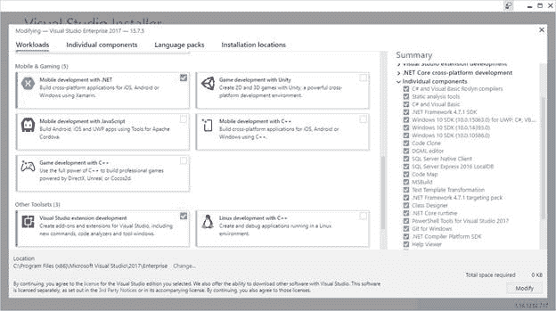

图 1:安装 Xamarin 开发工具

当您选择此工作负载时，Visual Studio Installer 将下载并安装为 Android、iOS 和 Windows 构建应用程序所需的所有工具。iOS 需要额外的配置，这将在下一节中介绍。另外，对于 Windows 10 开发，您需要额外的工具和 SDK，也可以通过选择**通用 Windows 平台开发**工作负载来获得。如果选择**单个组件**选项卡，您将可以选择检查是否选择了安卓和视窗模拟器，或者手动进行选择(见图 2)。

图 2:选择仿真器

不管你是使用 Visual Studio 2017，还是 Visual Studio for Mac，或者两者都用，我建议你安装谷歌模拟器，它在两个系统上的外观和行为都是一样的。

|  | 注意:随着 Visual Studio 2017 版本的发布，微软已经发布了一个运行在 Hyper-V 上的谷歌安卓仿真器。这是一个非常重要的补充，因为许多开发人员过去都使用基于 Hyper-V 的 Visual Studio 安卓仿真器，该仿真器最近已经停产。新模拟器需要安装了 Windows HyperVisor 平台和 Visual Studio 2017 15.8 的 Windows 10 2018 年 4 月更新。由于仿真器的特殊系统要求，以及为了与 Mac(没有 Hyper-V)上的开发保持一致，这里不涉及仿真器，但您可以阅读[文档](https://docs.microsoft.com/en-us/xamarin/android/get-started/installation/android-emulator/hardware-acceleration?tabs=vswin#hyper-v-overview)了解更多详细信息。 |

对于 Windows 10 模拟器，我的建议是，如果你打算针对 Windows 10 的旧版本，就下载最旧的版本；否则，最近的总是一个好的选择(图 2 中的秋季创造者更新)。继续安装，等待安装完成。

苹果的政策规定，需要一台苹果电脑来构建应用程序。这是因为只允许 Xcode 开发环境和苹果 SDK 运行构建过程。为了进行本地调试和测试，Xamarin 提供了 [Xamarin Live Player](https://www.xamarin.com/live) 应用程序，您可以下载并安装在自己的安卓或 iOS 设备上，并与 Visual Studio 配对进行调试。关于这个应用程序的更多细节将很快提供。然而，它变得不足以进行严肃的发展。您仍然需要一台苹果电脑来进行代码签名、设置配置文件和向应用商店发布应用。您可以在网络中使用本地 Mac，这也允许您在物理设备或远程 Mac 上调试和测试应用程序。在这两种情况下，必须按照以下软件要求配置 macOS:

*   macOS“El Capitan”(10.11)或更高。
*   Xcode 和苹果 SDK，你可以从应用商店免费获得。
*   Xamarin.iOS 引擎。在 Mac 上正确配置 Xamarin 最简单的方法是为 Mac 安装[Visual Studio Community](https://www.visualstudio.com/vs/visual-studio-mac/)。

Visual Studio 将连接到 Mac 启动 Xcode 编译器和 SDKs 必须为后者启用远程连接。Xamarin 官方文档有一个[特定页面](https://developer.xamarin.com/guides/ios/getting_started/installation/windows/connecting-to-mac/)，可以帮助你配置一台 Mac。我建议您仔细阅读它，尤其是因为它解释了如何配置配置文件和证书，以及如何使用 Xcode 执行初步配置。文档实际上是关于 Xamarin.iOS 的，但是同样的步骤也适用于 Xamarin.Forms

|  | 提示:从 Xamarin 开始。在表单 3.0 中，Visual Studio 2017 引入了集成工具，从集成开发环境中简化了 Mac 配置，并且不需要直接在 Mac 上工作。本章后面的“ [Xamarin.iOS 项目](#_The_Xamarin.iOS_project)”一节将讨论这些改进。 |

假设您已经安装并配置了开发环境，下一步是打开 Visual Studio，查看如何创建 Xamarin。表单解决方案以及这些解决方案的组成。Xamarin 的项目模板。在**新项目**对话框窗口的**可视化 C#** 、**跨平台**节点提供表单(见图 3)。

图 Xamarin 的项目模板。形式

**跨平台应用(Xamarin)** 模板就是你用来构建移动应用的模板。类库(Xamarin。表单)模板允许您创建一个可在 Xamarin 中使用的可重用类库。表单项目，用户界面测试应用程序模板用于创建自动化的用户界面测试，但这两个模板不会在本电子书中讨论。

选择**跨平台应用**模板，并可选地指定不同于默认的项目名称(这目前不相关)。然后点击**确定**。此时，Visual Studio 将要求您在空白应用程序、主-详细信息和选项卡式模板之间进行选择(参见图 4)。主-细节模板基于页面和视觉元素生成一个基本的用户界面，这些将在后面讨论，并带有一些示例数据。选项卡式生成基于选项卡的基本用户界面，以在子页面之间导航。主-详细信息和选项卡式都不是一个好的起点(除非你已经有使用 Xamarin 的经验)，所以选择**空白应用程序**模板。

图 4:为新项目选择模板、UI 技术和代码共享策略

在**平台**组中，选择所有你想要瞄准的平台。默认是安卓、iOS 和 UWP。在**代码共享策略**组中，您可以在共享项目和之间进行选择。NET 标准。代码共享策略是 Xamarin 中一个非常重要的主题。表格，[第二章](02.html#_Chapter_2_Sharing)将提供详细说明。现在，选择**。NET 标准**选项，点击**确定**。

几秒钟后，Visual Studio 将要求您为新应用程序指定目标版本的 Windows 10。保持默认选择不变并继续。它还将显示一个欢迎对话框窗口，在第二个屏幕中，您可以选择指定苹果电脑的位置。现在跳过这一步，因为它将在下一节中讨论。在解决方案资源管理器中，您将看到解决方案由四个项目组成，如图 5 所示。

图 Xamarin 的结构。表单解决方案

第一个项目是. NET 标准库或共享项目，这取决于您在项目创建时的选择。这个项目包含所有可以跨平台共享的代码，它的实现将在下一章讨论。目前，您需要知道的是，这个项目是您将编写应用程序的所有用户界面以及所有不需要与本机 API 交互的代码的地方。

第二个项目，后缀是**安卓**，是一个 Xamarin。安卓原生项目。它引用了共享代码和 Xamarin。表单，并实现应用程序在安卓设备上运行所需的基础设施。

第三个项目，后缀是 **iOS** ，是一个 Xamarin.iOS 原生项目。这个还引用了共享代码和 Xamarin。表单，并实现应用程序在 iPhone 和 iPad 上运行所需的基础架构。

第四个也是最后一个项目是原生的通用 Windows 项目(UWP)，它引用了共享代码，并实现了应用程序在 Windows 10 设备上运行的基础架构，适用于桌面和移动设备。我现在将提供每个平台项目的更多细节，以便您对它们的属性有一个基本的了解。这非常重要，因为每次创建新的 Xamarin 时，您都需要微调项目属性。形成解决方案。

从技术上讲，Xamarin。Forms 是一个. NET 库，它通过名为`Xamarin.Forms`的根命名空间公开了本电子书中讨论的所有对象。它最近是[开源的](https://github.com/xamarin/Xamarin.Forms)，并作为 [NuGet 包](https://www.nuget.org/packages/Xamarin.Forms/2.3.5.256-pre6)发布，当您创建新的解决方案时，Visual Studio 会自动将其安装到所有项目中。然后，Visual Studio 中的“获取包管理器”会通知您可用的更新。因为创建 Xamarin。即使您的电脑处于脱机状态，也必须允许表单解决方案，Visual Studio 会在本地缓存中安装 NuGet 包的版本，该版本通常不是最新版本。因此，建议您升级 Xamarin。表单和其他 Xamarin 包升级到最新版本，显然，您只能升级到稳定版本。尽管 alpha 和 beta 中间版本经常可用，但它们的唯一预期用途是试验仍在开发中的新功能。在撰写本文时，版本 3.1.0.697729 是最新的稳定版本，需要它来成功完成后面章节中提供的所有练习和代码示例。

Xamarin。安卓让你的 Xamarin 成为可能。在安卓设备上运行的表单解决方案。 **MainActivity.cs** 文件代表 Xamarin 生成的安卓应用的启动活动。在安卓系统中，一个活动可以被认为是一个有用户界面的单一屏幕，每个应用程序至少有一个。在这个文件中，Visual Studio 添加了您不应该更改的启动代码，尤其是 Xamarin 的初始化代码。您在最后两行代码中看到的表单。在这个项目中，您可以添加需要访问本机 API 和平台特定特性的

**Resources** 文件夹也非常重要，因为它包含子文件夹，您可以在其中为不同的屏幕分辨率添加图标和图像。这些文件夹的名称以**开头，可绘制**，每个文件夹代表一个特定的屏幕分辨率。Xamarin [文档](https://developer.xamarin.com/guides/android/application_fundamentals/resources_in_android/part_4_-_creating_resources_for_varying_screens/)详细解释了如何在安卓系统上为不同分辨率提供图标和图像。解决方案资源管理器中的**属性**元素允许您访问项目属性，就像您访问任何 C#解决方案一样。就 Xamarin 而言，在**应用程序**选项卡(见图 6)中，您可以指定 Visual Studio 应该用来构建应用程序包的 Android SDK 版本。

图 6:选择要编译的安卓软件开发工具包版本

Visual Studio 会自动选择可用的最高版本，并提供一个下拉列表，您可以在其中选择不同版本的 SDK。请注意，如果没有安装在开发机器上，Visual Studio 会用*符号标记一个 SDK 版本。可以使用安卓 SDK 管理器工具下载 SDK，也可以通过**工具** > **选项**>**Xamarin**>**安卓设置** > **启用自动安装安卓 SDK**。这里的 SDK 选择不影响你想要针对的安卓最低版本；相反，它与 Visual Studio 将使用的构建工具的版本有关。我的建议是保持默认选择不变。

|  | 提示:您可以使用安卓软件开发工具包管理器管理已安装的软件开发工具包版本，该工具可以从窗口程序菜单和 Visual Studio 中启动，方法是选择工具>安卓>安卓软件开发工具包管理器。 |

**安卓清单**标签更重要。在这里，您可以指定应用程序的元数据，例如名称、版本号、图标以及用户必须授予应用程序的权限。图 7 显示了一个例子。

图 7:安卓清单

您在安卓清单选项卡中提供的信息对于发布到谷歌游戏也很重要。例如，包名在 Google Play 商店中唯一标识您的应用包，按照惯例，它的形式如下:com *.companyname.appname* ，这是不言而喻的(com。是常规前缀)。版本名称是您的应用程序版本，而版本号是代表更新的一位数字符串。例如，您可能有版本名 1.0 和版本号 1，版本名 1.1 和版本号 2，版本名 1.2 和版本号 3，等等。

**安装位置**选项允许您指定您的应用程序应该只安装在内部存储器中，还是允许存储卡，但是请记住，从安卓 6.0 开始，应用程序不能再安装到可移动存储设备上。在**最低安卓版本**下拉列表中，你可以选择你想要瞄准的最低安卓版本。

务必特别注意**所需权限**列表。在这里，您必须指定您的应用程序必须被授予的所有权限，以便访问资源，如互联网、相机、其他硬件设备、传感器等。请记住，从 Android 6.0 开始，操作系统在访问需要您在清单中标记的权限之一的资源之前会要求用户确认，如果应用程序试图访问敏感资源，但清单中没有选择相关权限，它将失败。

在**安卓选项**选项卡中，您将能够管理调试和构建选项。但是，我不会在这里介绍所有可用的选项。不过值得强调的是**使用快速部署**选项，默认情况下是启用的。启用后，将应用程序部署到物理或模拟设备只会替换已更改的文件。这通常会导致应用程序无法正常工作或根本无法启动，因此我建议您禁用此选项。其他选项卡与其他选项卡相同。NET 项目。

### xamarin . IOs 项目

类似于 Xamarin。安卓项目，Xamarin.iOS 项目让你的 Xamarin 成为可能。形成在 iPhone 和 iPad 上运行的解决方案。假设您有一台配置好的苹果电脑，Visual Studio 需要知道它在网络中的地址。Visual Studio 通常会在创建新的 Xamarin 后询问此问题。形成解决方案或打开现有的解决方案，但您可以通过选择**工具**>**iOS**>**Xamarin Mac 代理**来手动输入 Mac 地址。在 **Xamarin Mac 代理**对话框窗口中，Visual Studio 应该能够列出网络中任何检测到的 Mac 电脑。但是，强烈建议您通过提供 Mac 的 IP 地址而不是名称来重新添加 Mac。例如，图 8 显示了 Xamarin Mac 代理对话框窗口，显示了我的 Mac Mini 机器及其名称和 IP 地址，但是 Visual Studio 是基于 IP 而不是名称建立连接的。

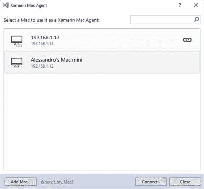

图 8:将 Visual Studio 连接到 Mac

如果没有检测到 Mac，点击**添加 Mac** ，先输入其 IP 地址。然后，当被请求时，输入您用来登录 Mac 的相同凭据。如果连接成功，Visual Studio 将在状态栏中显示成功消息。

对于 Xamarin.iOS 项目， **AppDelegate.cs** 文件包含 Xamarin。形成初始化代码，不应更改。您可以在这个项目中添加所有需要访问本机 API 和平台特定特性的代码，您将在第 8 章中了解到这一点。在 **Info.plist** 文件中(见图 9)，通过每个选项卡，您可以配置您的应用元数据、最低目标版本、支持的设备和方向、功能(如游戏中心和地图集成)、视觉资产(如启动图像和图标)以及其他高级功能。

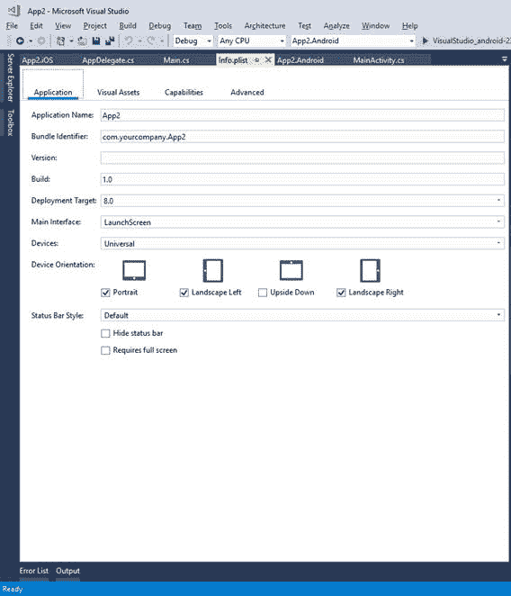

图 9:信息文件

**Info.plist** 文件代表 iOS 中的应用清单，因此，不仅仅与 Xamarin.iOS 相关，事实上，如果你有 Xcode 和原生 iOS 开发的经验，你已经知道这个文件了。与安卓不同，iOS 操作系统包含自动应用于大多数敏感资源的限制策略，尤其是那些涉及安全和隐私的资源。此外，iOS 8.x、9.x、10.x 和 11.x 在操作系统如何处理这些选项方面也有所不同。

[信息列表参考](https://developer.xamarin.com/guides/ios/deployment,_testing,_and_metrics/provisioning/infoplist-reference/)将帮助您了解如何正确配置任何异常。在项目属性中，最重要的无疑是 iOS 捆绑签名。您可以使用 iOS 捆绑包签名属性来指定 Apple 工具必须用来签名应用程序包的身份，并指定用于将开发团队与应用程序标识符相关联的配置文件。在准备发布应用程序时，配置签名身份和配置文件尤为重要。图 10 显示了 iOS 捆绑包签名属性(出于隐私原因，我的帐户的一些敏感信息已被编辑)。

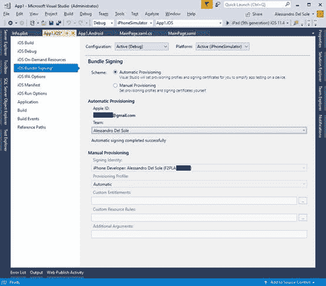

图 10:iOS 捆绑包签名选项

可以想象，Visual Studio 只有在连接到 Mac 时才能检测到可用的签名身份和配置文件，因为这些信息是通过 Xcode 生成的。有关配置 Xamarin.iOS 项目的更多详细信息，请参见[文档](https://developer.xamarin.com/guides/ios/getting_started/installation/windows/introduction_to_xamarin_ios_for_visual_studio/)。

#### 自动 iOS 设置

不管你用的是原生的 Xamarin.iOS 还是 Xamarin。表单，为 iOS 创建应用程序需要一些非常复杂和令人沮丧的初步步骤。事实上，除了注册苹果的开发者计划(这是使您的苹果开发者帐户能够向应用商店签名和发布应用所必需的)之外，您还需要调配您的 iOS 设备。iOS 配置将使您能够在物理设备上部署和测试您的应用程序。

iOS 配置通常通过 Mac 上的 Xcode 完成，要求您:

*   创建开发团队:这包括指定开发团队中的苹果开发人员帐户列表，并使他们能够签署和发布应用程序。
*   设置预配配置文件:预配配置文件捆绑到编译的应用程序包中，包含三种类型的信息:唯一的应用程序标识符(应用程序标识)、在物理设备上测试应用程序所需的一个或多个开发证书，以及枚举允许运行应用程序的设备的唯一设备标识符(UDI)列表。
*   创建签名证书:所有应用程序都必须经过签名才能在 iOS 设备上运行，即使是为了开发，因此需要签名证书。每个开发人员帐户都可以获得不同类型的证书(例如开发和发布)，具体取决于订阅级别。

尽管[文档](https://bit.ly/2NhzO0O)很好地解释了如何开始 iOS 配置，但现实是复杂性是开发人员想要为 iOS 构建应用程序的最大障碍。幸运的是，Visual Studio 2017 的最新版本包括对 iOS 自动资源调配的支持。您只需提供您的苹果开发人员帐户，Visual Studio 2017 将通过与 Mac 机器的连接代表您设置所有必要的工件。

为此，您必须首先通过选择**工具** > **选项**>**Xamarin**>**苹果账户**将您的苹果 ID 与 Visual Studio 相关联。在**选项**对话框中，您可以通过点击**添加**来关联一个或多个 Apple IDs，之后 Visual Studio 2017 会显示关联团队的列表以及每个团队的用户角色(见图 11)。

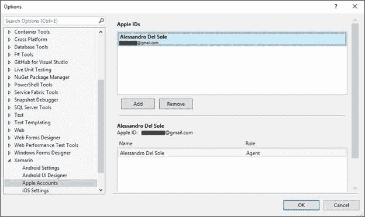

图 11:将开发团队与 Visual Studio 相关联

点击**确定**后，可以进入 Xamarin.iOS 项目属性的 iOS 捆绑包签名选项卡，选择**自动配置**选项(见图 10)。您只需从**团队**下拉菜单中选择您希望用于开发的团队，Visual Studio 将生成在物理设备(必须连接到苹果电脑)上测试应用程序所需的必要配置文件和签名证书。

#### 远程 Xamarin.iOS 更新

在用 Xamarin 构建 iOS 应用程序时，您必须记住的一件重要事情是，必须在 PC 和 Mac 上安装相同版本的 SDK。过去，您必须在两个系统上手动更新 Xamarin.iOS SDK。在最新版本的 Visual Studio 2017 中，一项新的集成功能将帮助您远程更新 Xamarin.iOS 版本，而无需访问物理的远程 Mac。连接到 Mac 时，如果 Visual Studio 2017 检测到版本不匹配，它将显示一条警告消息，并提供一个安装按钮，该按钮将在远程 Mac 上启动更新过程。

图 12 显示了警告消息和安装按钮(如果不想进行更新过程，可以点击**取消**)。

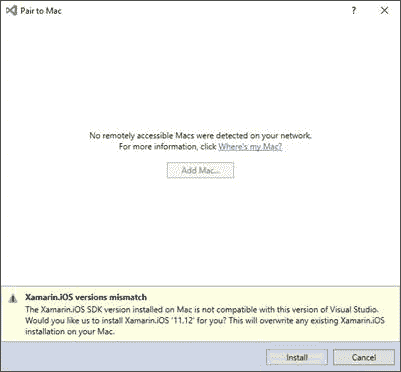

图 12:xamarin . IOs 的远程更新

|  | 注意:此功能将更新 Xamarin.iOS 软件开发工具包，但不会更新其他组件。如果您可以访问物理 Mac 机器，或者您团队中的其他人可以，我的建议是通过 Visual Studio for Mac 进行更新，以便所有工具(包括 IDE)和 SDK 都将收到最新的更新。 |

Xamarin 中的通用视窗平台项目。表单解决方案只不过是一个普通的 UWP 项目，引用了共享代码和 Xamarin。表单包。

在 **App.xaml.cs** 文件中，可以看到不可更改的初始化代码。相反，您需要配置的是应用程序清单，您可以通过双击解决方案资源管理器中的 **Package.appxmanifest** 文件来编辑该清单。

Visual Studio 有一个很好的 UWP 清单编辑器，您将至少配置应用元数据(参见图 13)、图标和徽标等视觉资产以及功能(参见图 14)。其中包括在测试和分发应用程序之前需要指定的权限，在访问需要权限的资源之前，Windows 10 会要求用户确认。

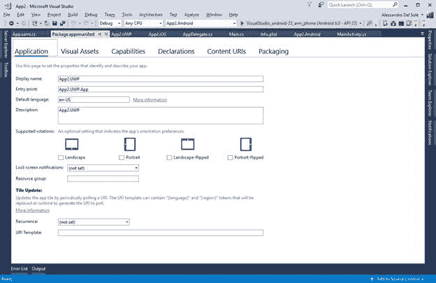

图 13:在 UWP 项目中编辑元数据

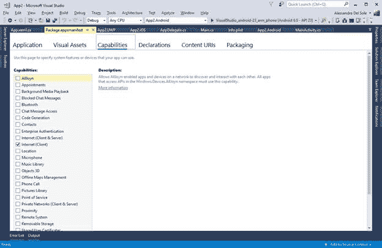

图 14:指定 UWP 项目中的功能

官方文档解释了如何配置其他选项。但是，请记住，您需要付费订阅 Windows Store，才能填写准备发布时提供的打包设置。

开始使用 Xamarin 构建应用程序。用于调试和测试的表单很容易。您只需在解决方案资源管理器中选择一个平台项目作为启动项目，然后选择目标设备并按 **F5** 。在第一次调试之前，不要忘记重建您的解决方案。当您启动应用程序进行调试时，Visual Studio 将构建您的解决方案，并将应用程序包部署到选定的物理设备或仿真器。构建过程的结果是。安卓的 apk 文件。iOS 的 ipa 文件，以及一个。适用于 Windows 10 的 appx 文件。

当应用程序在物理设备或仿真器上启动时，Visual Studio 会附加一个调试器实例，您将能够使用 IDE 所有众所周知的强大调试工具，包括(但不限于)断点、数据提示、工具窗口、观察窗口等。选择目标平台和配置的最简单方法是使用标准工具栏，如图 15 所示(请注意，仿真器列表可能会因您在安装时的选择或自定义仿真器映像而异)。

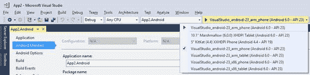

图 15:选择调试的目标平台和设备

**调试**配置是开发过程中合适的选择。当准备在 iOS 和安卓系统上发布时，您将选择**特别版**，或者为 Windows 10 发布**版本**。目标架构通常是**安卓和 Windows 的任意 CPU**，而在 iOS 模拟器中调试 iOS 应用的是**iPhone 模拟器**，在物理 iPhone 或 iPad 上调试应用的是 **iPhone** (记住，物理苹果设备必须通过 Xcode 关联到你的 Mac，并连接到 Mac，而不是 PC)。您还可以快速选择启动项目并指定目标设备。例如，在图 13 中，您可以看到安卓仿真器配置的列表。

|  | 注:在本电子书中，我将提供数字，显示所有支持的平台在行动时，它是相关的。在其他情况下，我将只展示一个正在运行的平台，这意味着在所有平台上都期望有相同的行为。 |

图 16 显示了之前创建的空白应用程序，该应用程序在各自的模拟器中的所有三个平台上运行。注意 Visual Studio 是如何在后台显示**输出**窗口的，您可以在其中接收来自调试器的消息；您将能够类似地使用所有其他调试工具。

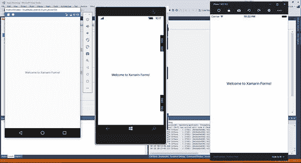

图 16:用 Xamarin 构建的应用程序。在所有平台上运行的表单

|  | 注意:虽然 Visual Studio 2017 允许您在多个平台上运行一个应用程序的多个实例，但图 16 是在安卓版本运行的情况下捕获的，其中分别添加了 Windows 模拟器和 iOS 模拟器截图。 |

可以想象，为了搭建 iOS 应用，Visual Studio 连接了 Mac，推出了苹果 SDK。在图 16 中，您看到了一个 iOS 模拟器的例子，值得进一步考虑。

与安卓和视窗不同，模拟器在你的视窗开发机上本地运行，而 iOS 模拟器在你的苹果电脑上运行。但是如果有 Visual Studio 2017 Enterprise，也可以下载安装 Windows 的[远程 iOS 模拟器](https://developer.xamarin.com/guides/cross-platform/windows/ios-simulator/)。安装后，模拟器将在您的 Windows 机器上运行，而不是在 Mac 上运行。Windows 上的 iOS 模拟器默认不启用，需要打开**工具** > **选项**>**Xamarin**>**iOS 设置**，选择**远程模拟器到 Windows** 选项。图 14 中提供了一个 iOS 模拟器的例子，但是您将在接下来的章节中看到其他例子。如果你有 Visual Studio 2017 社区版或专业版，那么你需要在 Mac 上使用模拟器。

Visual Studio 可以轻松地将应用程序包部署到物理 Windows 和 Android 设备上。对于 Android，首先需要启用开发者模式，通过以下步骤完成:

1.  打开**设置**应用
2.  点击**关于**项
3.  在出现的列表中，找到操作系统内部版本号，并轻按该项目七次

此时，您只需将设备插入电脑的 USB 端口，Visual Studio 就会立即识别它。它将在可用设备列表中可见，如图 15 所示。对于 Windows，您首先需要启用您的机器和设备进行开发，官方[文档](https://docs.microsoft.com/en-us/windows/uwp/get-started/enable-your-device-for-development)对此提供了指导。然后，您就可以将设备插入电脑的 USB 端口，Visual Studio 会将它们识别为可用的目标设备。对于苹果移动设备，您需要将您的 iPhone 或 iPad 连接到您的 Mac 电脑，确保您通过 Xcode 使它们可被发现。然后，当您从 Visual Studio 开始调试时，您的应用程序将通过 Mac 部署到 iPhone 或 iPad 上。

微软已经为安卓和 iOS 发布了 [Xamarin Live Player](https://www.xamarin.com/live) 应用。这款应用的目标是使在与您的开发机器连接到同一网络的物理设备上调试和测试安卓和 iOS 应用变得更加简单，并避免在 iOS 上编译和调试应用时需要使用苹果电脑。基本上，您需要使用条形码将 Xamarin Live Player 应用程序与 Visual Studio 配对，然后 Visual Studio 将能够通过网络将您的应用程序包部署到物理设备上。因为在使用这个应用的时候有一些重要的[限制](https://developer.xamarin.com/guides/cross-platform/live/limitations/)(例如，你仍然需要一台 Mac 来数字签名和分发 iOS 应用，并且只支持有限数量的 NuGet 包)，所以本章就不讨论了。请记住，如果你还没有苹果电脑，这是一个不错的选择。

Xamarin 工具箱最近增加了三个惊人的工具: [Xamarin 工作簿](https://developer.xamarin.com/guides/cross-platform/workbooks/)、 [Xamarin 检查器](https://developer.xamarin.com/guides/cross-platform/inspector/)和 [Xamarin 探查器](https://www.xamarin.com/profiler)。第一个工具允许您探索许多。NET 和 Mono 开发平台，带有交互示例。Xamarin 检查器允许您很好地检查 Xamarin 应用程序的视觉树，并实时更改用户界面(参见[文档](https://developer.xamarin.com/guides/cross-platform/inspector/))。

Xamarin Profiler 是一个程序中的一整套分析工具，您可以使用它来分析您的移动应用程序，并分析性能、内存使用、CPU 消耗等。在 Visual Studio 中，您可以选择**工具** > **Xamarin Profiler** ，并启动您的应用程序的任何平台版本进行分析，而不是按 F5。将应用程序部署到选定设备后，在启动前，探查器会询问您希望对应用程序执行哪种分析。图 17 显示了一个基于选择所有可用仪器工具的示例。

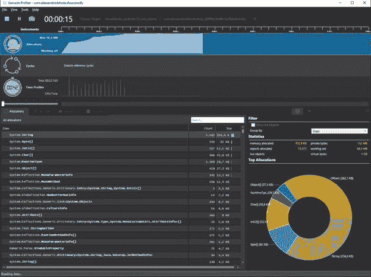

图 17:使用 Xamarin Profiler 分析应用程序性能

您还可以拍摄并比较不同时刻的内存快照，看看内存分配是否会导致潜在的问题。这是一个优秀的性能分析工具，[文档](https://developer.xamarin.com/guides/cross-platform/profiler/)将提供您提高应用性能所需的所有细节。

本章介绍了 Xamarin。表单平台及其目标，描述所需的开发工具并提供 Xamarin 的概述。表单解决方案，传递平台项目及其最重要的设置。您还看到了如何使用模拟器启动应用程序进行调试，以及如何利用新的 Xamarin Live Player 应用程序，该应用程序允许您在没有 Mac 的情况下调试 iOS 应用程序(这仍然是严肃开发所必需的)。现在您已经对 Xamarin 有了一个概述。表单和开发工具，下一步是理解它的核心:跨平台共享代码。