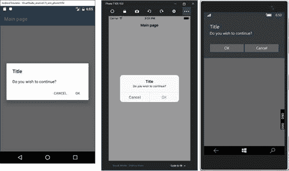

Xamarin。表单附带了一组丰富的通用控件，您可以使用这些控件轻松构建跨平台用户界面，而不需要平台特定功能的复杂性。可以想象，这些通用控件的好处是，它们运行在安卓、iOS 和 Windows 上的代码库是相同的。在本章中，您将了解常见控件、它们的属性和它们的事件。其他控件将在第 7 章中介绍，尤其是以显示数据列表为目的的控件。

|  | 注意:为了遵循本章中的示例，创建一个新的 Xamarin。基于。NET 标准代码共享策略。这个名字由你决定。每次讨论新控件时，只需清除 XAML 文件中根 ContentPage 对象的内容，并删除特定于单个控件的任何 C#代码，或将 ContentPage 类型的新文件添加到项目中。 |

在 Xamarin。表单，一个*视图*是任何移动应用程序的构建模块。简而言之，一个视图就是一个控件，它代表了安卓系统中的一个小部件，iOS 系统中的一个视图，以及 Windows 系统中的一个控件。视图来自`Xamarin.Forms.View`类。实际上，从技术角度来看，布局本身就是视图，并且源自`Layout`，这是层次结构中的一个中间对象，它源自`View`，并且包含一个`Children`属性，允许您向布局本身添加多个视觉元素。

从术语的角度来看，视图的概念也很重要。事实上，在 Xamarin。表单及其文档中，你会发现*视图*这个词比*控件*更常见。从现在开始，我将交替使用视图和控件，但是请记住，文档和教程经常引用视图。

视图共享许多属性，这些属性对于您提前了解非常重要。这些总结在表 5 中。

表 5:视图的公共属性

| 财产 | 描述 |
| --- | --- |
| `HorizontalOptions` | 与[表 3](04.html#Table3) 相同。 |
| `VerticalOptions` | 与[表 3](04.html#Table3) 相同。 |
| `HeightRequest` | 类型为`double`，获取或设置视图的高度。 |
| `WidthRequest` | 类型为`double`，获取或设置视图的宽度。 |
| `IsVisible` | 类型为`bool`，确定控件在用户界面上是否可见。 |
| `IsEnabled` | 类型为`bool`，允许启用或禁用控件，使其在用户界面上可见。 |
| `GestureRecognizers` | 在不直接支持触摸的控件上启用触摸手势的`GestureRecognizer`对象的集合。这些将在本章后面讨论。 |

|  | 提示:控件还会显示[表 4](04.html#Table4) 中描述的边距属性。 |

如果您希望更改视图的宽度或高度，请记住您需要`WidthRequest`和`HeightRequest`属性，而不是只读并返回当前高度和宽度的`Height`和`Width`。

本节提供了 Xamarin 的高级概述。窗体的公共控件及其最常用的属性。记得将关于用户界面的[官方文档](https://developer.xamarin.com/guides/xamarin-forms/user-interface/)添加到书签中，以获得更详细的参考。

### 输入

`Button`控件当然是每个用户界面中最常用的控件之一。您之前已经看到了几个`Button`的例子，但这里有一个快速的总结。这个控件公开了表 6 中总结的属性，您可以这样声明它:

`<Button x:Name="Button1" Text="Tap here" TextColor="Orange" BorderColor="Red"`

`BorderWidth="2" BorderRadius="2" Clicked="Button1_Clicked"/>`

表 6:按钮属性

| 财产 | 描述 |
| --- | --- |
| `Text` | 按钮中的文本。 |
| `TextColor` | 按钮中文本的颜色。 |
| `BorderColor` | 在按钮周围绘制彩色边框。 |
| `BorderWidth` | 按钮周围边框的宽度。 |
| `BorderRadius` | 按钮周围边缘的半径。 |
| `Image` | 要设置在文本附近的可选图像。 |

注意如何用`x:Name`指定一个名称，这样就可以在 C#中与按钮交互，这就是用处理程序设置`Clicked`事件时的情况。该控件还公开了一个`Font`属性，其行为将在下一节的文本中讨论。

以文本形式显示文本并请求用户输入在每个移动应用程序中都非常常见。Xamarin。表单提供`Label`控件显示只读文本，`Entry`和`Editor`控件接收文本。`Label`控件有一些有用的属性，如下图 XAML 所示:

`<Label Text="Displaying some text" LineBreakMode="WordWrap"`

`TextColor="Blue" XAlign="Center" YAlign="Center"/>`

`LineBreakMode`允许您[截断或包装](https://developer.xamarin.com/guides/xamarin-forms/user-interface/text/label/#Truncation_and_Wrapping)一个长字符串，并且可以从`LineBreakMode`枚举中分配一个值。例如，`WordWrap`根据可用空间将一个长字符串分成多行。如果未指定，则默认为`NoWrap`。`XAlign`和`YAlign`指定文本的水平和垂直对齐方式。`Entry`控件允许您输入单行文本，并声明如下:

`<Entry x:Name="Entry1" Placeholder="Enter some text..."`

`TextColor="Green" Keyboard="Chat" Completed="Entry1_Completed"/>`

`Placeholder`属性允许您在条目中显示特定的文本，直到用户键入一些内容。这有助于解释文本框的用途。当用户点击`Entry`时，屏幕键盘显示。键盘的外观可以通过`Keyboard`属性控制，该属性允许您根据`Entry`的用途显示最合适的按键。支持的值有`Chat`、`Email`、`Numeric`、`Telephone`和`Number`。如果未分配`Keyboard`，则假定为`Default`。此外，`Entry`公开了`MaxLength`属性，允许您设置用户可以输入的文本的最大长度。该控件还公开了两个事件:`Completed`，当用户点击回车键完成文本时触发；以及`TextChanged`，每次按键时触发。

您以通常的方式提供事件处理程序，如下所示:

`private void Entry1_Completed(object sender, EventArgs e)`

`{`

`// Entry1.Text contains the full text`

`}`

`Entry`还提供了`IsPassword`属性来屏蔽`Entry`的内容，当用户必须输入密码时可以使用该属性。另一个非常有用的属性是`ReturnType`，它的值是类型`ReturnType`，它允许您指定要在键盘的回车键中显示的文本。可能的值有`Done`、`Go`、`Next`、`Search`、`Send`和`Default`(为每个平台设置默认文本)。`Label`和`Entry`控件的组合如图 32 所示。

图 32:标签和输入控件

`Editor`控件在行为、事件和属性方面与`Entry`非常相似，但它允许输入多行文本。例如，如果您将编辑器放置在布局中，您可以使用`Fill`设置其`HorizontalOptions`和`VerticalOptions`属性，这样它将占用父级中的所有可用空间。`Entry`和`Editor`视图都公开了`IsSpellChedkedEnabled`属性，顾名思义，该属性可以对输入的文本进行拼写检查。

#### 格式化字符串和可绑定范围

`Label`控件公开了`FormattedText`属性，该属性可用于实现更复杂的字符串格式。该属性的类型是`FormattedString`，一个填充有`Span`对象集合的对象，每个对象代表格式化字符串的一部分。下面的代码片段提供了一个例子:

`<Label`

`HorizontalOptions="Center"`

`VerticalOptions="CenterAndExpand">`

`<Label.FormattedText>`

`<FormattedString>`

`<FormattedString.Spans>`

``

``

``

`</FormattedString.Spans>`

`</FormattedString>`

`</Label.FormattedText>`

`</Label>`

通过设置`Label`控件已经暴露的大部分属性，例如`Text`、`Font`、`FontFamily`、`FontSize`、`FontAttributes`、`ForegroundColor`和`BackgroundColor`，基本上可以使用`Span`对象来格式化特定的段落或句子。

|  | 注:Xamarin。Forms 3.1 还介绍了所谓的可绑定跨度，在您掌握了数据绑定的基本知识后，将在[第 7 章](07.html#_Bindable_spans)中进行解释。 |

显示一些文本(包括`Button`)或等待用户通过键盘输入的控件也会暴露一些与字体相关的属性，如`FontFamily`、`FontAttributes`和`FontSize`。`FontFamily`指定要使用的字体名称。`FontAttributes`显示文本为`Italic`或`Bold`，如果未指定，则假定为`None`。通过`FontSize`，可以根据`NamedSize`枚举中的`Micro`、`Small`、`Medium`和`Large`值，用数值或所谓的*命名大小*来指定字体大小。使用此枚举，Xamarin。表单为当前平台选择合适的大小。例如，允许以下两个选项来设置字体大小:

`<` `Label Text="Some text" FontSize="72"/>`

`<Label Text="Some text" FontSize="Large"/>`

除非您是为单一平台编写应用程序，否则我建议您避免使用数值，而是使用命名的大小。

移动应用的另一个常见要求是处理日期和时间:Xamarin。表单为此提供了`DatePicker`和`TimePicker`视图。在每个平台上，这些都用相应的日期和时间选择器呈现。`DatePicker`显示分别代表所选/当前日期、最小日期和最大日期的`Date`、`MinimumDate`和`MaximumDate`属性，均为`DateTime`类型。它公开了一个名为`DateSelected`的事件，当用户选择日期时会引发该事件。您可以处理这个来检索`Date`属性的值。该视图可以声明如下:

`<DatePicker x:Name="DatePicker1" MinimumDate="07/17/2017"`

`MaximumDate="12/31/2017"`

`DateSelected="DatePicker1_DateSelected"/>`

然后在代码隐藏中，您可以像这样检索所选日期:

`private void DatePicker1_DateSelected(object sender, DateChangedEventArgs e)`

`{`

`DateTime selectedDate = e.NewDate;`

`}`

`DateChangedEventArgs`对象将所选日期存储在`NewDate`属性中，将前一个日期存储在`OldDate`属性中。图 33 显示了三个平台上的`DatePicker`。

图 33:正在运行的日期选择器

`TimePicker`公开了一个名为`Time`的属性，类型为`TimeSpan`，但是它没有公开具体的时间选择事件，所以需要使用`PropertyChanged`事件。就 XAML 而言，你这样宣布一个`TimePicker`:

`<TimePicker x:Name="TimePicker1"`

`PropertyChanged="TimePicker1_PropertyChanged"/>`

然后，在代码隐藏中，您需要检测`Time`属性的变化，如下所示:

`private void TimePicker1_PropertyChanged(object sender,`

`System.ComponentModel.PropertyChangedEventArgs e)`

`{`

`if(e.PropertyName == TimePicker.TimeProperty.PropertyName)`

`{`

`TimeSpan selectedTime = TimePicker1.Time;`

`}`

`}`

`TimeProperty`是一个依赖属性，这个概念将在[第 7 章](07.html#_Chapter_7_Resources)中讨论。图 34 显示了`TimePicker`的动作。

图 34:正在运行的时间选择器

|  | 提示:您还可以在 C#代码隐藏中为挑选器分配日期或时间，例如，在声明它们的页面的构造函数中。 |

`WebView`控件允许显示 HTML 内容，包括网页和静态 HTML 标记。此控件分别显示导航开始和完成时引发的`Navigating`和`Navigated`事件。真正的力量在于其“T4”类型的“T3”属性，它可以被赋予各种内容，例如 URIs 或包含 HTML 标记的字符串。例如，以下 XAML 打开指定的网站:

`<WebView x:Name="WebView1" Source="https://www.xamarin.com"/>`

下面的示例显示了如何用字符串分配`Source`属性:

`WebView1.Source = "
<h1>Header</h1>
";`

对于动态尺寸，更好的选择是将`WebView`包含在`Grid`布局中。如果使用`StackLayout`，需要明确提供高度和宽度。当您在互联网上浏览内容时，您需要启用安卓清单中的互联网权限和 UWP 清单中的互联网(客户端)权限。图 35 显示了`WebView`如何出现。

图 35:用网络视图显示 HTML 内容

如果您显示的网页允许您浏览其他页面，您可以利用内置的`GoBack`和`GoForward`方法，以及`CanGoBack`和`CanGoForward`布尔属性，以编程方式控制网页之间的导航。

|  | 提示:如果你需要实现到 URL 的导航，可能值得考虑所谓的[深度链接](https://blog.xamarin.com/deep-link-content-with-xamarin-forms-url-navigation/)特性，从 Xamarin 开始可用。表格 2.3.1。 |

#### iOS 中的应用传输安全

从 iOS 9 开始，苹果在访问网络资源(包括网站)时引入了一些限制，默认情况下只允许通过 HTTPS 协议导航。这项功能被称为应用程序传输安全(ATS)。ATS 可以在 iOS 项目属性中进行控制，它允许引入一些例外，因为尽管有限制，您可能仍需要浏览 HTTP 内容。关于 ATS 和例外情况的更多详细信息，请参见[文档](https://developer.xamarin.com/guides/ios/application_fundamentals/ats/)；但是，请记住，如果`WebView`在 iOS 上没有显示任何内容，原因可能是 ATS。

Xamarin。窗体提供了许多基于选择值的用户输入控件。第一个是`Switch`，它提供了一个切换值，用于选择值，如真或假、开或关、启用或禁用。它暴露`true`时打开开关的`IsToggled`属性和用户改变开关位置时引发的`Toggled`事件。该控件没有内置标签，因此您需要将其与`Label`结合使用，如下所示:

`<StackLayout Orientation="Horizontal">`

`<Label Text="Enable data plan"/>`

`<Switch x:Name="Switch1" IsToggled="True"` 

`Margin="5,0,0,0"/>`

`</StackLayout>`

`Toggled`事件将新值存储在您使用的`ToggledEventArgs`对象中，如下所示:

`private void Switch1_Toggled(object sender, ToggledEventArgs e)`

`{`

`bool isToggled = e.Value;`

`}`

您也可以在选择器打开时更改其颜色，将您选择的颜色分配给`OnColor`属性。在 Xamarin 之前。在 Forms 3.1 中，您必须创建一个自定义渲染器来实现这一点，因此这是一个非常有用的补充。`Slider`允许输入线性值。它暴露了`Value`、`Minimum`和`Maximum`属性，都是`double`类型，代表当前值、最小值和最大值。和`Switch`一样，它没有内置标签，所以你可以和`Label`一起使用，如下所示:

`<StackLayout Orientation="Horizontal">`

`<Label Text="Select your age: "/>`

`<Slider x:Name="Slider1" Maximum="85" Minimum="13" Value="30"`

`ValueChanged="Slider1_ValueChanged"/>`

`</StackLayout>`

|  | 提示:令人惊讶的是，如果在最大值之前写最小值，将会出现运行时错误。因此，对于滑块和步进器来说，顺序都很重要。 |

当用户移动`Slider`上的选择器时，会引发`ValueChanged`事件，新值会被发送到您在事件处理程序中获得的`ValueChangedEventArgs`对象的`NewValue`属性。最后一个控件是`Stepper`，它允许以指定的增量提供离散值。它还允许指定最小值和最大值。您可以使用类型`double`的`Value`、`Increment`、`Minimum`和`Maximum`属性，如下所示:

`<StackLayout Orientation="Horizontal">`

`<Label Text="Select your age: "/>`

`<Stepper x:Name="Stepper1" Increment="1" Maximum="85" Minimum="13"`

`Value="30" ValueChanged="Stepper1_ValueChanged"/>`

`<Label x:Name="StepperValue"/>`

`</StackLayout>`

请注意，`Stepper`和`Slider`都只提供了一种递增和递减值的方式，因此您有责任显示当前值，例如，您可以通过`ValueChanged`事件来处理一个`Label`。下面的代码演示了如何使用`Stepper`实现这一点:

`private void Stepper1_ValueChanged(object sender, ValueChangedEventArgs e)`

`{`

`StepperValue.Text = e.NewValue.ToString();`

`}`

图 36 显示了所有上述视图的概要。

图 36:开关、滑块和步进器控制的概要视图

Xamarin 最美的景色之一。表单中，`SearchBar`显示一个带有搜索图标的本地搜索框，用户可以点击。这一观点暴露了`SearchButtonPressed`事件。您可以处理此事件来检索用户在框中键入的文本，然后执行您的搜索逻辑；例如，对内存中的集合执行 LINQ 查询，或者从本地数据库的表中过滤数据。它还公开了每次击键时引发的`TextChanged`事件和`Placeholder`属性，该属性允许您指定一个占位符文本，就像`Entry`控件的同名属性一样。您声明如下:

`<SearchBar x:Name="SearchBar1" Placeholder="Enter your search key..."`

`SearchButtonPressed="SearchBar1_SearchButtonPressed"/>`

图 37 显示了一个例子。

图 37:搜索栏视图

在第 7 章中，您将学习如何通过`ListView`控件显示项目列表。`SearchBar`可以是一个很好的伙伴，因为您可以使用它来根据用户输入的搜索关键字过滤项目列表。

在某些情况下，您的应用程序可能需要执行潜在的长时间运行的操作，例如从互联网下载内容或从本地数据库加载数据。在这种情况下，最佳做法是通知用户操作正在进行中。这可以通过两个视图完成，即`ActivityIndicator`或`ProgressBar`。后者公开了一个名为`Progress`的房产，属于`double`类型。这种控制不经常使用，因为它意味着您能够计算完成操作所需的时间或数据量。

|  | 提示:如果你还想用一个 ProgressBar，值得一提的是 Xamarin。Forms 3.0 引入了“颜色”类型的“进度颜色”属性，允许您更改进度指示器的颜色。 |

`ActivityIndicator`显示一个简单的动画指示器，在操作运行时显示，不需要计算其进度。通过将其`IsRunning`属性设置为`true`来启用；您可能还想使其仅在运行时可见，通过将`IsVisible`分配给`true`来完成。您通常在 XAML 声明如下:

`<ActivityIndicator x:Name="ActivityIndicator1" />`

然后，在代码隐藏中，您可以按如下方式控制它:

`// Starting the operation...`

`ActivityIndicator1.IsVisible = true;`

`ActivityIndicator1.IsRunning = true;`

`// Executing the operation...`

`// Operation completed`

`ActivityIndicator1.IsRunning = false;`

`ActivityIndicator1.IsVisible = false;`

作为个人建议，我建议您始终同时设置`IsVisible`和`IsRunning`。这将帮助您跨平台保持一致的行为。图 38 显示了一个基于 Android 的例子。

图 38:活动指示器显示操作正在进行

|  | 提示:页面对象(如 ContentPage)公开一个名为 IsBusy 的属性，该属性在赋值为 true 时启用活动指示器。根据您的情况，您也可以考虑这个选项。 |

在移动应用程序中使用图像至关重要，因为它们既丰富了用户界面的外观和感觉，又使应用程序能够支持多媒体内容。Xamarin。表单提供了一个`Image`控件，您可以使用它来显示来自互联网、本地文件和嵌入式资源的图像。显示图像非常简单，而理解如何加载和调整图像大小则更为复杂，尤其是如果您以前没有使用 XAML 和动态用户界面的经验。您声明`Image`如下:

`<Image Source="https://www.xamarin.com/conteimg/pages/branding/assets/xamarin-logo.png" Aspect="AspectFit"/>`

如您所见，您为`Source`属性分配了图像路径，该路径可以是一个 URL 或本地文件或资源的名称。`Source`可以在 XAML 分配，也可以在代码隐藏中分配。当需要在运行时分配属性时，可以在 C#代码中分配该属性。这个属性的类型是`ImageSource`，而 XAML 有一个类型转换器，在 C#中你需要根据图片来源使用特定的方法:`FromFile`需要一个可以在每个平台上解析的文件路径，`FromUri`需要一个`System.Uri`对象，`FromResource`允许你在嵌入式应用资源中指定一个图片。

|  | 注意:每个平台都有自己处理本地图像和嵌入式资源的方式，这需要进一步说明。因为这超出了本电子书的范围，所以我强烈建议您阅读[官方文档](https://developer.xamarin.com/guides/xamarin-forms/user-interfaimg/)，其中也解释了如何在 iOS、Android 和 Windows 上管理不同用途的图像。 |

`Aspect`属性决定如何在显示图像的范围内调整图像的大小和拉伸图像。它需要来自`Aspect`枚举的值:

*   `Fill`:拉伸图像，完全准确地填充显示区域。这可能会导致图像失真。
*   `AspectFill`:剪辑图像，使其填充显示区域，同时保留外观。
*   `AspectFit`:对图像进行信箱处理(如果需要)，使整个图像适合显示区域，顶部、底部或侧面添加空白，具体取决于图像是宽还是高。

您也可以设置`WidthRequest`和`HeightRequest`属性来调整`Image`控件的大小。图 39 显示了一个例子。

图 39:用图像视图显示图像

支持的图像格式有。jpg，。巴布亚新几内亚。gif，。bmp，和. tif .处理图像还涉及图标和闪屏，这些完全依赖于平台，因此需要您阅读官方[文档](https://developer.xamarin.com/guides/xamarin-forms/user-interfaimg/)。此外，对于增强的 2D 图形，您可能想考虑看看 [SkiaSharp 库](https://developer.xamarin.com/guides/cross-platform/drawing/)，这是一个与 Xamarin 配合使用的便携式库。形式，并由谷歌的 Skia 库提供动力。

像`Image`和`Label`这样的视图本身并不支持触摸手势，但是有时您可能希望允许用户点击图片或文本来执行操作，例如导航到页面或网站。`Xamarin.Forms.Gestures`命名空间有一些类，允许您利用[手势识别器](https://developer.xamarin.com/guides/xamarin-forms/application-fundamentals/gestures/)为不包含它的视图添加触摸支持。视图展示了一个名为`GestureRecognizers`的集合，类型为`IList<GestureRecognizer>`。支持的手势识别器有:

*   `TapGestureRecognizer`:允许识别敲击。
*   `PinchGestureRecognizers`:允许识别缩放手势。
*   `PanGestureRecognizers`:允许用平移手势拖动对象。

例如，下面的 XAML 演示了如何将`TapGestureRecognizer`添加到`Image`控件中:

`<Image Source="https://www.xamarin.com/conteimg/pages/branding/assets/xamarin-logo.png" Aspect="AspectFit">`

`<Image.GestureRecognizers>`

`<TapGestureRecognizer x:Name="ImageTap"`

`NumberOfTapsRequired="1" Tapped="ImageTap_Tapped"/>`

`</Image.GestureRecognizers>`

`</Image>`

您可以为`NumberOfTapsRequired`属性(不言自明)和`Tapped`事件分配一个处理程序，当用户点击图像时将调用该处理程序。它看起来像这样:

`private void ImageTap_Tapped(object sender, EventArgs e)`

`{`

`// Do your stuff here...`

`}`

手势识别器为您提供了极大的灵活性，并允许您通过在需要时添加触摸支持来改善移动应用程序中的用户体验。

所有平台都可以显示带有信息性消息的弹出警报，或者通过常见选项(如“确定”或“取消”)接收用户输入。Xamarin 中的页面。表单提供了一个叫做`DisplayAlert`的异步方法，非常容易使用。例如，假设您想在用户点击按钮时显示一条消息。下面的代码演示了如何实现这一点:

`private async void Button1_Clicked(object sender, EventArgs e)`

`{`

`await DisplayAlert("Title", "This is an informational pop-up", "OK");`

`}`

作为一个异步方法，你用`await`操作符调用`DisplayAlert`，将包含的方法标记为`async`。第一个参数是弹出标题，第二个参数是文本消息，第三个参数是您希望在出现的唯一按钮中显示的文本。实际上，`DisplayAlert`有一个过载，可以等待用户输入并返回`true`或`false`，这取决于用户是选择了确定选项还是取消选项:

`bool result =`

`await DisplayAlert("Title", "Do you wish to continue?", "OK", "Cancel` `");`

您可以自由地为“确定”和“取消”选项编写任何您喜欢的文本，智能感知可以帮助您理解这些选项在参数列表中的顺序。如果用户选择确定，`DisplayAlert`返回`true`。图 40 显示了一个警报示例。

图 40:显示警报

|  | 注意:可视化状态管理器是由 Xamarin 引入的。表单 3.0，但是已经存在于 WPF 和 UWP，所以如果您使用这些技术，您可能已经熟悉它了。 |

使用可视化状态管理器，您可以基于视图的状态对用户界面进行更改，例如`Normal`、`Focused`和`Disabled`，所有这些都使用声明性代码。例如，您可以使用可视状态管理器根据视图的状态来更改视图的颜色。下面的代码片段演示了如何根据状态更改`Entry`视图的背景颜色:

`<Entry>
<VisualStateManager.VisualStateGroups>
<VisualStateGroup x:Name="CommonStates">`

`<VisualState x:Name="Normal">`

`<VisualState.Setters>`

`<Setter Property="BackgroundColor" Value="White" />`

`</VisualState.Setters>`

`</VisualState>`

`<VisualState x:Name="Focused">`

`<VisualState.Setters>`

`<Setter Property="BackgroundColor"`

`Value="LightGray" />`

`</VisualState.Setters>`

`</VisualState>`

`<VisualState x:Name="Disabled">`

`<VisualState.Setters>`

`<Setter Property="BackgroundColor" Value="Gray" />`

`</VisualState.Setters>`

`</VisualState>`

`</VisualStateGroup>`

`</VisualStateManager.VisualStateGroups>`

`</Entry>`

有了这个标记代码，`Entry`状态改变时会自动改变背景颜色。在这种情况下，您需要将`Entry`的`IsEnabled`属性设置为`False`，以禁用视图并触发`Disabled`状态。状态必须分组到名为`VisualStateGroup`的对象中。每个状态都由`VisualState`对象表示，您可以像添加样式一样添加`Setter`规范，从而提供要更改的属性的名称及其值。当然，您可以指定多个属性设置器。Xamarin。表单定义了一组称为公共状态的状态，如`Normal`、`Focused`、`Disabled`(参见前面代码中带有`CommonState`名称的`VisualStateGroup`)；这些状态对于每个视图都是相同的。其他状态可能仅适用于特定视图，不适用于其他视图。可视化状态管理器提供了一种优雅而干净的方式来控制用户界面行为，所有这些都在您的 XAML 代码中。

本章介绍了 Xamarin 中视图和常用视图的概念。表单，移动应用程序中任何用户界面的构建模块。您已经看到了如何使用`Button`、`Entry`、`Editor`和`SearchBar`控件获取用户输入；您已经看到了如何使用`Label`显示信息，以及如何将其与其他输入视图(如`Slider`、`Stepper`和`Switch`)结合使用。您已经看到了`DatePicker`和`TimePicker`视图如何允许您处理日期和时间。您已经看到了如何使用`Image`视图显示图像；您已经使用了`WebView`来显示 HTML 内容；并且你已经看到了如何用`ActivityIndicator`和`ProgressBar`通知用户长时间运行操作的进度。您已经看到了如何将手势支持添加到不开箱即用的视图中，如何显示提示以供参考，以及如何允许用户选择。最后，您已经看到了可视化状态管理器如何允许基于视图状态更改用户界面行为，所有这些都使用声明性代码。

现在，您已经拥有了用布局和视图构建高质量用户界面所需的一切，并且已经看到了如何在单个页面中使用所有这些构建块。然而，大多数移动应用程序是由多个页面组成的。下一章将解释 Xamarin 中所有可用的页面类型。表单和导航基础设施。