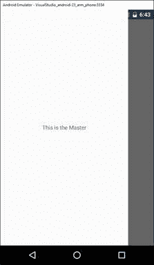
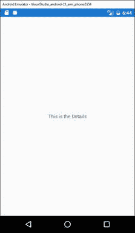
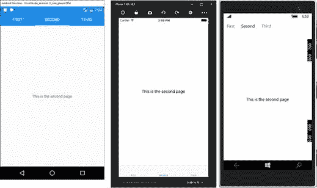
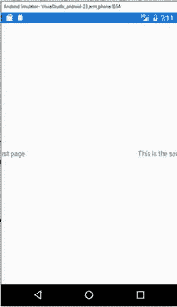
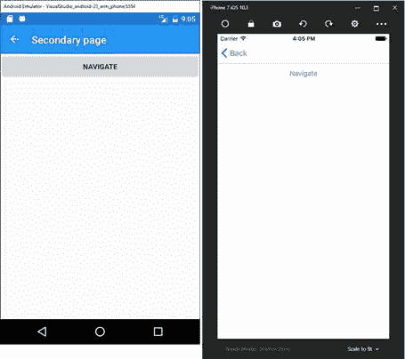

# 六、页面和导航

在前面的章节中，我们讨论了布局和视图的基础，它们是移动应用程序中用户界面的基本构件。然而，我演示了如何在单个页面中使用布局和视图，而现实世界的移动应用程序是由多个页面组成的。安卓、iOS 和 Windows 提供了许多不同的页面，允许您以多种方式显示内容，并根据您需要呈现的内容提供最佳的用户体验。Xamarin.Forms提供了统一的页面模型，您可以从跨平台工作的单个共享 C#代码库中使用这些模型。它还提供了一个易于使用的导航框架，这是您用来在页面之间移动的基础设施。页面和导航是使用 Xamarin.Forms 构建漂亮的本地应用程序所需了解的用户界面框架的最后一部分

|  | 注意:为了遵循本章中的示例，创建一个新的 Xamarin。基于。NET 标准代码共享策略。这个名字由你决定。每次讨论新页面时，只需清理 MainPage.xaml 和 MainPage.xaml.cs 文件的内容(构造函数除外)并编写新代码。 |

Xamarin.Forms提供了许多页面对象，您可以使用它们来设置应用程序的用户界面。页面是视觉层次结构中的根元素，每个页面只允许添加一个视觉元素，通常是根布局，其他布局和视觉元素嵌套在根中。从技术角度来看，Xamarin 中的所有页面对象。表单源自抽象的`Page`类，该类提供了每个页面的基本基础设施，包括常见的属性，如`Content`。这绝对是您为根可视元素分配的最重要的属性。表 7 描述了 Xamarin.Forms 中的可用页面

表 Xamarin 中的页面。形式

| 页面类型 | 描述 |
| --- | --- |
| `ContentPage` | 显示单个视图对象。 |
| `TabbedPage` | 便于使用选项卡在子页面之间导航。 |
| `CarouselPage` | 便于在子页面中使用滑动手势。 |
| `MasterDetailPage` | 管理两个单独的窗格，其中包括一个弹出控件。 |
| `NavigationPage` | 提供在页面间导航的基础结构。 |

接下来的部分将更详细地描述可用的页面。请记住，Visual Studio 为不同的页面类型提供了项目模板，因此您可以右键单击。NET 标准项目，在解决方案资源管理器中，选择**添加新项**，在**添加新项**对话框中，您将看到表 7 中描述的每页模板。

`ContentPage`对象是最简单的页面，允许显示单个视觉元素。你之前已经看过一些`ContentPage`的例子，但是值得一提的是它的`Title`属性。当`ContentPage`用于内置导航的页面时，例如`TabbedPage`和`CarouselPage`，该属性特别有用，因为它有助于识别活动页面。`ContentPage`的核心是`Content`属性，您可以为其分配想要显示的视觉元素。视觉元素可以是单个控件，也可以是布局；后者允许您创建复杂的视觉层次结构和真实世界的用户界面。在 XAML，`Content`属性的标签可以省略，这也是常见的做法(也请注意`Title`):

`<?xml version="1.0" encoding="utf-8" ?>`

`<ContentPage`

`xmlns:x="http://schemas.microsoft.com/winfx/2009/xaml"`

`xmlns:local="clr-namespace:App1"`

`Title="Main page"`

`x:Class="App1.MainPage">`

`<Label Text="A content page"/>`

`</ContentPage>`

`ContentPage`可以单独使用，也可以作为下一节讨论的其他页面的内容。

### 拆分内容

`MasterDetailPage`是一个非常重要的页面，因为它允许您将内容分为两个单独的类别:一般和详细。`MasterDetailPage`提供的用户界面在安卓和 iOS 应用中非常常见。它在左侧(主部分)提供了一个弹出按钮，您可以滑动以显示和隐藏它，在右侧提供了第二个区域，显示更详细的内容(细节部分)。例如，这种页面的一个非常常见的场景是在主页面中显示主题或设置的列表，在细节页面中显示所选主题或设置的内容。主零件和细节零件都由`ContentPage`对象表示。`MasterDetailPage`的典型声明类似于代码清单 12。

代码清单 12

```cs
  <?xml version="1.0" encoding="utf-8" ?>
  <MasterDetailPage 
               xmlns:x="http://schemas.microsoft.com/winfx/2009/xaml"
               xmlns:local="clr-namespace:App1"
               Title="Main page"
               x:Class="App1.MainPage">

      <MasterDetailPage.Master>
          <ContentPage>
              <Label Text="This is the Master" HorizontalOptions="Center"
                     VerticalOptions="Center"/>
          </ContentPage>
      </MasterDetailPage.Master>
      <MasterDetailPage.Detail>
          <ContentPage>
              <Label Text="This is the Details" HorizontalOptions="Center"
                     VerticalOptions="Center"/>
          </ContentPage>
      </MasterDetailPage.Detail>
  </MasterDetailPage>

```

如您所见，您可以使用适当的`ContentPage`对象填充`Master`和`Detail`属性。在现实应用中，你可能会在`Master`中有一个主题列表，然后当用户点击`Master`内容中的一个时，你可能会在`Detail`中显示某个主题的详细信息。

|  | 注意:每次您将根页面从 ContentPage 更改为另一种页面时，例如 MasterDetailPage，您还需要更改代码隐藏中的继承。例如，如果您打开 C# MainPage.xaml.cs 文件，您会看到 MainPage 继承自 ContentPage，但是在 xaml，您用 MasterDetailPage 替换了这个对象。因此，您还需要让 MainPage 从 MasterDetailPage 继承。如果您忘记了这一点，编译器将报告一个错误。本说明也适用于下一节讨论的页面。 |

图 41 和 42 分别显示了主要部分和细节部分。您可以简单地从左侧滑动以启用主弹出按钮，然后向后滑动以隐藏它。您也可以通过将`IsPresented`属性指定为`true`(可见)或`false`(隐藏)，以编程方式控制弹出按钮。这在应用程序处于横向模式时非常有用，因为默认情况下弹出按钮会自动打开。

|  |  |
| 图 41:主详细信息页面:弹出按钮主人的 | 图 42:主细节页面:细节 |

有时，您可能需要按主题或活动类型对多个页面进行分类。当你有少量内容时，你可以利用`TabbedPage`，它可以将多个`ContentPage`对象分组到标签中，以便于导航。`TabbedPage`可以如代码清单 13 所示进行声明。

代码清单 13

```cs
  <?xml version="1.0" encoding="utf-8" ?>
  <TabbedPage 
               xmlns:x="http://schemas.microsoft.com/winfx/2009/xaml"
               xmlns:local="clr-namespace:App1"
               Title="Main page"
               x:Class="App1.MainPage">

      <TabbedPage.Children>
          <ContentPage Title="First">
              <Label Text="This is the first page" HorizontalOptions="Center"
                     VerticalOptions="Center"/>
          </ContentPage>
          <ContentPage Title="Second">
             <Label Text="This is the second page" HorizontalOptions="Center"
                     VerticalOptions="Center"/>
          </ContentPage>
          <ContentPage Title="Third">
              <Label Text="This is the third page" HorizontalOptions="Center"
                     VerticalOptions="Center"/>
          </ContentPage>
      </TabbedPage.Children>
  </TabbedPage>

```

如您所见，您可以用多个`ContentPage`对象填充`Children`集合。给每个`ContentPage`提供一个`Title`是最重要的，因为标题的文本显示在每个标签中，如图 43 所示。



图 43:用标签页显示分组内容

当然，`TabbedPage`可以很好地处理少量的子页面，通常在 3 到 4 页之间。

`CarouselPage`与`TabbedPage`类似，但没有标签，可以使用滑动手势在子页面之间切换。例如，`CarouselPage`可以完美地展示一个图片画廊。代码清单 14 显示了如何声明一个`CarouselPage`。

代码清单 14

```cs
  <?xml version="1.0" encoding="utf-8" ?>
  <CarouselPage 
               xmlns:x="http://schemas.microsoft.com/winfx/2009/xaml"
               xmlns:local="clr-namespace:App1"
               Title="Main page"
               x:Class="App1.MainPage">

      <CarouselPage.Children>
          <ContentPage Title="First">
              <Label Text="This is the first page" HorizontalOptions="Center"
                     VerticalOptions="Center"/>
          </ContentPage>
          <ContentPage Title="Second">
             <Label Text="This is the second page" HorizontalOptions="Center"
                     VerticalOptions="Center"/>
          </ContentPage>
          <ContentPage Title="Third">
              <Label Text="This is the third page" HorizontalOptions="Center"
                     VerticalOptions="Center"/>
          </ContentPage>
      </CarouselPage.Children>
  </CarouselPage>

```

图 44 显示了`CarouselPage`是如何出现的。



图 44:用旋转木马页面滑动内容

|  | 注意:本着简洁系列的精神，本节解释了页面导航最重要的概念和主题。但是，在处理 Xamarin.Forms 中的导航时，您必须了解每个平台特有的提示和注意事项。要了解更多信息，请参见[官方文档](https://developer.xamarin.com/guides/xamarin-forms/application-fundamentals/navigation/)。 |

大多数移动应用程序通过多个页面提供内容。在 Xamarin.Forms中，页面之间的导航非常简单，因为内置了导航框架。首先，在 Xamarin。您可以通过`NavigationPage`对象利用导航功能。这种页面必须实例化，将导航堆栈中第一个页面的实例传递给它的构造函数。这通常是在 **App.xaml.cs** 文件中完成的，您可以用以下代码替换`MainPage`属性的赋值:

`public App()`

`{`

`InitializeComponent();`

`MainPage = new NavigationPage(new MainPage());`

`}`

将根页面包装成`NavigationPage`不仅会启用导航堆栈，还会启用安卓、iOS 和 Windows 桌面上的导航栏(但不在依赖硬件后退按钮的 Windows 10 Mobile 上)，其文本将是当前页面对象的`Title`属性的值，由`CurrentPage`只读属性表示。现在假设您向添加了另一个类型为`ContentPage`的页面。NET 标准项目，称为 **SecondaryPage.xaml** 。这个页面的内容在这一点上并不重要；只需用一些文字设置其`Title`属性。如果要从第一页导航到第二页，使用如下`PushAsync`方法:

`await Navigation.PushAsync(new SecondaryPage());`

由每个`Page`对象公开的`Navigation`属性表示应用程序级别的导航堆栈，并提供在后进先出(LIFO)方法中的页面间导航的方法。`PushAsync`导航到指定的页面实例；从当前页面调用的`PopAsync`从堆栈中移除当前页面并返回到上一页。类似地，`PushModalAsync`和`PopModalAsync`允许你在页面之间有模式地导航。下面几行代码演示了这一点:

`// removes SecondaryPage from the stack and goes back to the previous page`

`await Navigation.PopAsync();`

`// displays the specified page as a modal page`

`await Navigation.PushModalAsync(new SecondaryPage());`

`await Navigation.PopModalAsync();`

图 45 显示了当导航到另一个页面时，导航栏在安卓和 iOS 上是如何显示的。



图 45:导航页面对象提供的导航栏

用户只需点击导航栏上的“后退”按钮即可返回上一页。但是，当您实现模式导航时，您不能利用导航栏提供的内置导航机制，因此您有责任实现允许返回上一页的代码。如果您必须能够截取每个平台上“后退”按钮的点击，模态导航可能会很有用。事实上，安卓和视窗设备都有一个内置的硬件后退按钮，你可以用事件来管理，但 iOS 没有。在 iOS 中，您只有导航栏提供的“后退”按钮，但这不能被任何事件访问。因此，在这种情况下，模态导航可能是拦截用户动作的好选择。

在页面之间交换数据的需求并不少见。您可以更改或重载`Page`的构造函数，并要求所需类型的参数。然后，当您调用`PushAsync`并传递新页面的实例时，您将能够为新页面的构造函数提供必要的参数。

默认情况下，导航包括一个动画，使从一个页面到另一个页面的过渡更好。但是，您可以通过简单地将`false`作为`PushAsync`和`PushModalAsync`的参数来禁用动画。

每个`Page`对象分别公开了在渲染页面之前和从堆栈中移除页面之前引发的`OnAppearing`和`OnDisappearing`事件。他们的代码如下所示:

`protected override void OnAppearing()`

`{`

`// Replace with your code…`

`base.OnAppearing();`

`}`

`protected override void OnDisappearing()`

`{`

`// Replace with your code…`

`base.OnDisappearing();`

`}`

实际上，这些事件并不严格与导航相关，因为它们对任何页面都可用，包括单个页面。然而，导航变得非常重要，尤其是当您需要在页面生命周期的特定时刻执行一些代码时。为了更好地理解流程，可以考虑页面构造函数:这是在第一次创建页面时调用的。然后，就在页面呈现在屏幕上之前，引发`OnAppearing`。当应用程序导航到另一个页面时，会调用`OnDisappearing`，但这不会破坏当前页面实例(这非常有意义)。当应用程序从第二页导航回第一页时，这不会被再次创建，因为它仍然在导航堆栈中，所以它的构造函数不会被调用，而`OnAppearing`会。因此，在`OnAppearing`方法体中，可以编写每次显示页面时都会执行的代码，而在构造函数中，可以编写只执行一次的代码。

安卓设备和 Windows 手机都内置了硬件“后退”按钮，用户可以使用它来代替导航栏中的“后退”按钮。您可以通过处理`OnBackButtonPressed`事件来检测用户是否按下了硬件后退按钮，如下所示:

`protected override bool OnBackButtonPressed()`

`{`

`return base.OnBackButtonPressed(); // replace with your logic here`

`}`

只需将您的逻辑放在方法体中。默认行为是暂停应用程序，因此您可能希望用`PopAsync`覆盖它以返回到上一页。此事件不会拦截按下导航栏中的后退按钮，这意味着它对 iOS 设备没有影响。

本章介绍了 Xamarin 中可用的页面。表单，解释如何使用`ContentPage`对象显示单视图内容，使用`TabbedPage`将内容分组到选项卡中，使用`CarouselPage`滑动内容，以及使用`MasterDetail`页面对象将内容分组到两个类别中。

在本章的第二部分，您将看到`NavigationPage`对象如何提供一个内置的导航框架，该框架不仅显示一个导航栏，还允许以编程方式在页面之间导航。最后，您看了页面生命周期是如何工作的，包括页面创建和页面呈现之间的区别。在下一章中，您将了解 Xamarin 中两个重要且强大的特性。表单:资源和数据绑定。