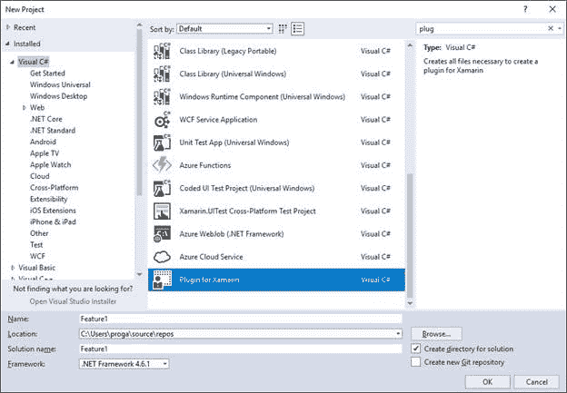

Xamarin。Forms 是一个功能齐全的开发平台，因此本电子书无法涵盖所有可能的场景。在这个附录中，你会发现一个资源列表，你可能会考虑进一步的研究。

SQLite 是一个无服务器、开源的本地数据库引擎，您可以在 Xamarin 中使用它。形成移动应用程序来存储结构化数据。SQLite 包含在 iOS 和 Android 中，可以轻松安装在 Windows 10 设备中。由于存储本地数据的需求非常普遍，[文档](https://developer.xamarin.com/guides/xamarin-forms/application-fundamentals/databases/)提供了如何在移动应用中使用 SQLite 的详细信息。此外，这本书的作者已经发布了一个简单的介绍与 Xamarin SQLite。《MSDN 杂志》的一篇名为《[在 Xamarin 使用本地数据库》的文章中提到了表单。使用 SQLite](https://msdn.microsoft.com/magazine/mt736454) 的表单。”

移动应用的另一个常见要求是消耗互联网上的资源，或者更一般地说，通过网络。这包括内部和云中的推送通知、网络服务、WCF 服务和 RESTful 服务。一般来说，您通过`HttpClient`类及其异步方法消耗网络上的资源。但是，微软也提供了用于将数据存储到 Azure 和实现离线数据同步的库。所有这些场景和示例都在名为[数据&云服务](https://developer.xamarin.com/guides/xamarin-forms/cloud-services/)的文档页面中进行了描述，该文档还提供了关于通过微软认知服务将人工智能添加到您的移动应用程序的文档。

在大多数情况下，您会希望将您的原生移动应用发布到谷歌游戏、苹果应用商店和视窗商店。实际上，发布过程与 Xamarin 无关。形式，但涉及到平台项目。Xamarin 官方文档提供了发布[安卓](https://developer.xamarin.com/guides/android/deployment,_testing,_and_metrics/publishing_an_application/)和 [iOS](https://developer.xamarin.com/guides/ios/deployment,_testing,_and_metrics/app_distribution/) 应用的指南，而发布 Windows 10 应用可以参考通用 Windows 平台[文档](https://developer.microsoft.com/en-us/store/publish-apps)。

随着平台越来越受欢迎，在网上查找示例代码变得越来越容易。一个很好的起点是 GitHub 上的[官方存储库](https://github.com/xamarin/xamarin-forms-samples)，它包含了许多针对几个开发场景的示例应用程序。我还发布了一个开源的[初学者工具包](https://github.com/AlessandroDelSole/XamarinFormsStarterKit)，它演示了如何从互联网上获取数据，将数据存储在本地 SQLite 数据库中，实现数据绑定和导航等等。

如果您对构建插件感兴趣，您可以利用一个名为 Xamarin 模板插件的扩展。这个扩展可以通过您已经知道的扩展和更新工具下载，并添加了一个新的项目模板，名为 Xamarin 的 Plugin，在新项目对话框窗口的 Visual C#节点下可用(见图 52)。

图 52:创建一个新插件

该项目包含插件的基本基础设施，例如定义插件将公开的对象的 C#接口，以及安卓、iOS 和 UWP 的特定平台实现。在 [Xamarin 大学网站](https://university.xamarin.com/guestlectures/using-developing-plugins-for-xamarin)上的一个免费的、有趣的讲座解释了如何使用和开发 Xamarin 的插件。